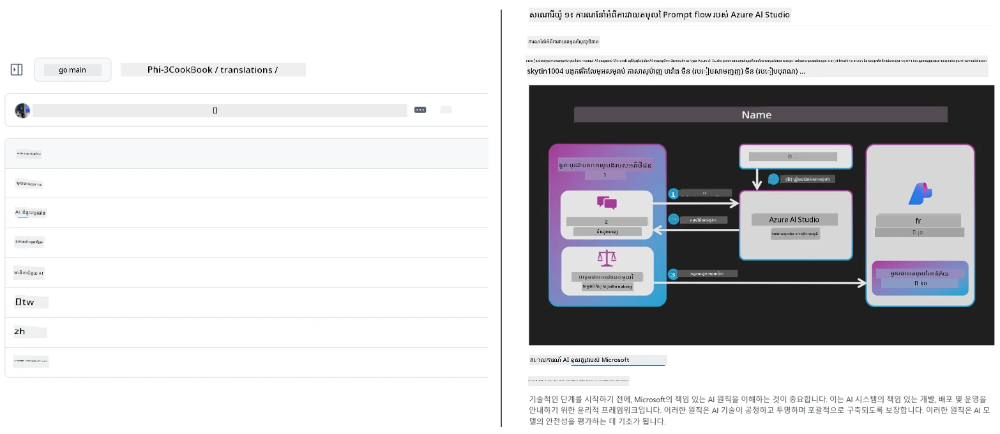
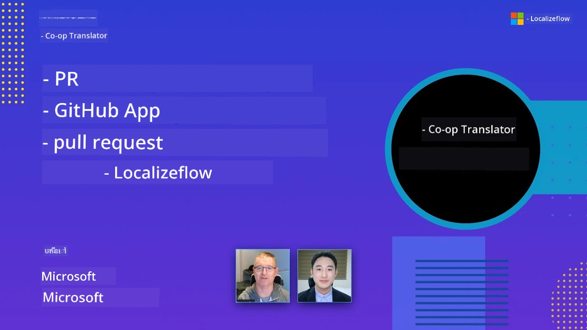

# Co-op Translator

_ងាយស្រួលស្វ័យប្រវត្តិ និងថែរក្សាការប្រែសម្រួលសម្រាប់មាតិកា GitHub ការអប់រំរបស់អ្នកនៅក្នុងភាសាផ្សេងៗគ្នា ខណៈដែលគម្រោងរបស់អ្នកកំពុងអភិវឌ្ឍ។_


[](https://pypi.org/project/co-op-translator/)
[](https://github.com/azure/co-op-translator/blob/main/LICENSE)
[](https://pepy.tech/project/co-op-translator)
[](https://pepy.tech/project/co-op-translator)
[](https://github.com/azure/co-op-translator/pkgs/container/co-op-translator)
[](https://github.com/psf/black)

[](https://GitHub.com/azure/co-op-translator/graphs/contributors/)
[](https://GitHub.com/azure/co-op-translator/issues/)
[](https://GitHub.com/azure/co-op-translator/pulls/)
[](http://makeapullrequest.com)

### 🌐 គាំទ្រភាសាជាច្រើន

#### គាំទ្រដោយ [Co-op Translator](https://github.com/Azure/Co-op-Translator)

<!-- CO-OP TRANSLATOR LANGUAGES TABLE START -->
[Arabic](../ar/README.md) | [Bengali](../bn/README.md) | [Bulgarian](../bg/README.md) | [Burmese (Myanmar)](../my/README.md) | [Chinese (Simplified)](../zh-CN/README.md) | [Chinese (Traditional, Hong Kong)](../zh-HK/README.md) | [Chinese (Traditional, Macau)](../zh-MO/README.md) | [Chinese (Traditional, Taiwan)](../zh-TW/README.md) | [Croatian](../hr/README.md) | [Czech](../cs/README.md) | [Danish](../da/README.md) | [Dutch](../nl/README.md) | [Estonian](../et/README.md) | [Finnish](../fi/README.md) | [French](../fr/README.md) | [German](../de/README.md) | [Greek](../el/README.md) | [Hebrew](../he/README.md) | [Hindi](../hi/README.md) | [Hungarian](../hu/README.md) | [Indonesian](../id/README.md) | [Italian](../it/README.md) | [Japanese](../ja/README.md) | [Kannada](../kn/README.md) | [Khmer](./README.md) | [Korean](../ko/README.md) | [Lithuanian](../lt/README.md) | [Malay](../ms/README.md) | [Malayalam](../ml/README.md) | [Marathi](../mr/README.md) | [Nepali](../ne/README.md) | [Nigerian Pidgin](../pcm/README.md) | [Norwegian](../no/README.md) | [Persian (Farsi)](../fa/README.md) | [Polish](../pl/README.md) | [Portuguese (Brazil)](../pt-BR/README.md) | [Portuguese (Portugal)](../pt-PT/README.md) | [Punjabi (Gurmukhi)](../pa/README.md) | [Romanian](../ro/README.md) | [Russian](../ru/README.md) | [Serbian (Cyrillic)](../sr/README.md) | [Slovak](../sk/README.md) | [Slovenian](../sl/README.md) | [Spanish](../es/README.md) | [Swahili](../sw/README.md) | [Swedish](../sv/README.md) | [Tagalog (Filipino)](../tl/README.md) | [Tamil](../ta/README.md) | [Telugu](../te/README.md) | [Thai](../th/README.md) | [Turkish](../tr/README.md) | [Ukrainian](../uk/README.md) | [Urdu](../ur/README.md) | [Vietnamese](../vi/README.md)

> **ចង់ Clone ក្នុងស្រុកមែនទេ?**
>
> រក្សាទុកនេះមានការប្រែសម្រួលភាសាជាង ៥០ ភាសា ដែលធ្វើឲ្យទំហំទាញយកបង្កើនយ៉ាងខ្លាំង។ ដើម្បី clone ដោយគ្មានការប្រែសម្រួល សូមប្រើ sparse checkout៖
>
> **Bash / macOS / Linux:**
> ```bash
> git clone --filter=blob:none --sparse https://github.com/Azure/co-op-translator.git
> cd co-op-translator
> git sparse-checkout set --no-cone '/*' '!translations' '!translated_images'
> ```
>
> **CMD (Windows):**
> ```cmd
> git clone --filter=blob:none --sparse https://github.com/Azure/co-op-translator.git
> cd co-op-translator
> git sparse-checkout set --no-cone "/*" "!translations" "!translated_images"
> ```
>
> វាបង្ហាញអ្នកគ្រប់យ៉ាងដែលអ្នកត្រូវការដើម្បីបញ្ចប់វគ្គជាមួយការទាញយកលឿនជាងមុន។
<!-- CO-OP TRANSLATOR LANGUAGES TABLE END -->

[](https://GitHub.com/azure/co-op-translator/watchers/)
[](https://GitHub.com/azure/co-op-translator/network/)
[](https://GitHub.com/azure/co-op-translator/stargazers/)

[](https://discord.gg/nTYy5BXMWG)

[](https://codespaces.new/azure/co-op-translator)

## សង្ខេប

**Co-op Translator** ជួយអ្នកក្នុងការបម្លែងមាតិកា GitHub សម្រាប់ការអប់រំរបស់អ្នកទៅជាភាសាជាច្រើនដោយគ្មានកលិបិកម្ម។
ពេលដែលអ្នកធ្វើបច្ចុប្បន្នភាពឯកសារ Markdown រូបភាព ឬសៀវភៅកំណត់ត្រា ការប្រែសម្រួលត្រូវបានរក្សាទុកជាស្វ័យប្រវត្តិ ដើម្បីធានាថាមាតិការបស់អ្នកត្រឹមត្រូវ និងទាន់សម័យ សម្រាប់អ្នករៀនជាទូទាំងលោក។

ឧទាហរណ៍ពីរបៀបដែលមាតិកាប្រែសម្រួលត្រូវបានរៀបចំ៖



## របៀបគ្រប់គ្រងស្ថានភាពការប្រែសម្រួល

Co-op Translator គ្រប់គ្រងមាតិកាប្រែសម្រួលជារូបមន្តផលិតកម្មកម្មវិធីដែលមានកំណត់កំណែ,  
មិនមែនឯកសារស្ថិតស្ថេរនោះទេ។

ឧបករណ៍នេះតាមដានស្ថានភាពនៃ Markdown ដែលបានបកប្រែ រូបភាព និងសៀវភៅកំណត់ត្រា  
ដោយប្រើ ​**metadata ដែលដាក់ស្តារក្នុងភាសា**។

រចនាប័ទ្មនេះអនុញ្ញាតឲ្យ Co-op Translator:

- រកឃើញការប្រែសម្រួលចាស់ទាន់មិនទាន់បានយុត្តិធម៌
- ប្រើក្រុមម៉ារូ Markdown រូបភាព និងសៀវភៅកំណត់ត្រា ដោយឬត្រូវគ្នា
- ធ្វើការលាស់ខ្សែដោយសុវត្ថិភាពលើគម្រោងធំៗ ដែលមានភាសាច្រើន និងរហ័ស

ដោយគំរូការប្រែសម្រួលជារូបមន្តផលិតកម្មដែលគ្រប់គ្រងបាន,  
ដំណើរការប្រែសម្រួលត្រូវបានសម្រួលជាស្របទៅនឹង  
ការគ្រប់គ្រងការពឹងផ្អែក និងគ្រប់គ្រងផលិតកម្មកម្មវិធីទំនើប។

→ [របៀបគ្រប់គ្រងស្ថានភាពការប្រែសម្រួល](https://techcommunity.microsoft.com/blog/azuredevcommunityblog/rethinking-documentation-translation-treating-translations-as-versioned-software/4491755)


## ចាប់ផ្តើមយ៉ាងលឿន

```bash
# បង្កើត និងដំណើរការបរិយាកាសវិរុស (ណែនាំ)
python -m venv .venv
# វីនដូ
.venv\Scripts\activate
# ម៉ាកអូអេស/លីនុច
source .venv/bin/activate
# ដំឡើងកញ្ចប់
pip install co-op-translator
# ប្រែ
translate -l "ko ja fr" -md
```

Docker:

```bash
# ទាញរូបភាពសាធារណៈពី GHCR
docker pull ghcr.io/azure/co-op-translator:latest
# រត់ជាមួយថតបច្ចុប្បន្នបានភ្ជាប់និងផ្គត់ផ្គង់ .env (Bash/Zsh)
docker run --rm -it --env-file .env -v "${PWD}:/work" ghcr.io/azure/co-op-translator:latest -l "ko ja fr" -md
```

## ការតំឡើងតិចតួច

1. បញ្ជាក់ថាអ្នកមានកំណែ Python ដែលគាំទ្រ (បច្ចុប្បន្ន 3.10-3.12)។ ក្នុង poetry (pyproject.toml) វាត្រូវបានគ្រប់គ្រងដោយស្វ័យប្រវាត់។
2. បង្កើតឯកសារ `.env` ដោយប្រើគំរូ៖ [.env.template](../../.env.template)
3. កំណត់អ្នកផ្គត់ផ្គង់ LLM មួយ (Azure OpenAI ឬ OpenAI)
4. (ជាជម្រើស) សម្រាប់ការប្រែរូបភាព (`-img`), កំណត់ Azure AI Vision
5. (ជាជម្រើស) អ្នកអាចកំណត់កំណត់បណ្ដាញសញ្ញាហ្គោលច្រើនដោយចម្លងអថេរជាមួយនឹងជើងតំណរ​ដូចជា `_1`, `_2`, ល។ អថេរទាំងអស់ក្នុងកំណត់ត្រូវមានជើងតំណរ​ដូចគ្នា។
6. (ផ្តល់អនុសាសន៍) សម្អាតការប្រែសម្រួលចាស់ៗដើម្បីជៀសវៀងការប៉ះទង្គិច (ឧ. `translations/`)
7. (ផ្តល់អនុសាសន៍) បន្ថែមផ្នែកការប្រែសម្រួលទៅក្នុង README របស់អ្នកដោយប្រើ [README languages template](./getting_started/README_languages_template.md)
8. មើល៖ [ដាក់តំឡើង Azure AI](./getting_started/set-up-azure-ai.md)

## ការប្រើប្រាស់

បកប្រែមុខងារទាំងអស់ដែលគាំទ្រ៖

```bash
translate -l "ko ja"
```

គ្រាន់តែ Markdown៖

```bash
translate -l "de" -md
```

Markdown + រូបភាព៖

```bash
translate -l "pt" -md -img
```

គ្រាន់តែលេខកូដសៀវភៅកំណត់ត្រា៖

```bash
translate -l "zh" -nb
```

បន្ថែមការបញ្ជា: [Command reference](./getting_started/command-reference.md)

## លក្ខណៈពិសេស

- ការប្រែសម្រួលដោយស្វ័យប្រវត្តិសម្រាប់ Markdown, សៀវភៅកំណត់ត្រា, និងរូបភាព
- រក្សាការប្រែសម្រួលឲ្យស្របតាមការផ្លាស់ប្តូរទិន្នន័យប្រភព
- ធ្វើការនៅក្នុងស្រុក (CLI) ឬនៅក្នុង CI (GitHub Actions)
- ប្រើ Azure OpenAI ឬ OpenAI; ជាជម្រើស Azure AI Vision សម្រាប់រូបភាព
- រក្សាទ្រង់ទ្រាយ និងរចនាសម្ព័ន្ធ Markdown

## ឯកសារយោង

- [មគ្គុទ្ទមដ្ឋានបញ្ជាការដោយវេន](./getting_started/command-line-guide/command-line-guide.md)
- [មគ្គុទ្ទមដ្ឋាន GitHub Actions (Repositories សាធារណៈ & គន្លឹះស្តង់ដារ)](./getting_started/github-actions-guide/github-actions-guide-public.md)
- [មគ្គុទ្ទមដ្ឋាន GitHub Actions (Repositories អង្គការមាន Microsoft & ការតំឡើងកម្រិតអង្គការ)](./getting_started/github-actions-guide/github-actions-guide-org.md)
- [README languages template](./getting_started/README_languages_template.md)
- [ភាសាដែលគាំទ្រ](./getting_started/supported-languages.md)
- [រួមចំណែក](./CONTRIBUTING.md)
- [ដំណោះស្រាយបញ្ហា](./getting_started/troubleshooting.md)

### មគ្គុទ្ទមដ្ឋាន Microsoft ផ្ទាល់
> [!NOTE]
> សម្រាប់អ្នកថែទាំ repositories “For Beginners” របស់ Microsoft តែប៉ុណ្ណោះ។

- [ធ្វើបច្ចុប្បន្នភាពបញ្ជី “វគ្គផ្សេងៗ” (សម្រាប់ repositories MS Beginners ប៉ុណ្ណោះ)](./getting_started/update-other-courses.md)

## គាំទ្រយើង និងលើកកម្ពស់ការរៀនពិភពលោក

ចូលរួមជាមួយយើងក្នុងការបំលែងរបៀបដែលមាតិកាអប់រំត្រូវបានចែករំលែកជាសកល! ផ្ដល់ [Co-op Translator](https://github.com/azure/co-op-translator) តារា ⭐ លើ GitHub និងគាំទ្រមូលដ្ឋានផ្នែករបស់យើងក្នុងការបំបែកឧបសគ្គភាសាក្នុងការរៀន និងបច្ចេកវិទ្យា។ ការចាប់អារម្មណ៍ និងការរួមចំណែករបស់អ្នកមានឥទ្ធិពលសំខាន់ណាស់! ការរួមចំណែកកូដ និងការផ្តល់យោបល់លក្ខណៈពិសេស គឺតែងតែស្វាគមន៍។

### ស្វែងរកមាតិកាជំនាញ Microsoft ក្នុងភាសារបស់អ្នក

- [LangChain4j-for-Beginners](https://github.com/microsoft/LangChain4j-for-Beginners)
- [AZD for Beginners](https://github.com/microsoft/AZD-for-beginners)
- [Edge AI for Beginners](https://github.com/microsoft/edgeai-for-beginners)
- [Model Context Protocol (MCP) For Beginners](https://github.com/microsoft/mcp-for-beginners)
- [AI Agents for Beginners](https://github.com/microsoft/ai-agents-for-beginners)
- [Generative AI for Beginners using .NET](https://github.com/microsoft/Generative-AI-for-beginners-dotnet)
- [Generative AI for Beginners](https://github.com/microsoft/generative-ai-for-beginners)
- [Generative AI for Beginners using Java](https://github.com/microsoft/generative-ai-for-beginners-java)
- [ML for Beginners](https://aka.ms/ml-beginners)
- [Data Science for Beginners](https://aka.ms/datascience-beginners)
- [AI for Beginners](https://aka.ms/ai-beginners)
- [Cybersecurity for Beginners](https://github.com/microsoft/Security-101)
- [Web Dev for Beginners](https://aka.ms/webdev-beginners)
- [IoT for Beginners](https://aka.ms/iot-beginners)
- [PhiCookBook](https://github.com/microsoft/PhiCookBook)

## វីដេអូបង្ហាញ

👉 ចុចលើរូបភាពខាងក្រោមដើម្បីមើលនៅ YouTube។

- **Open at Microsoft**៖ ដំណើរការណែនាំខ្លីរយៈពេល ១៨ នាទី និងមគ្គុទ្ទមដ្ឋានលឿនពីរបៀបប្រើ Co-op Translator។

  [](https://www.youtube.com/watch?v=jX_swfH_KNU)

## រួមចំណែក

គម្រោងនេះស្វាគមន៍ការរួមចំណែក និងយោបល់។ ចាប់អារម្មណ៍ក្នុងការរួមចំណែកទៅ Azure Co-op Translator? សូមមើល [CONTRIBUTING.md](./CONTRIBUTING.md) របស់យើងសម្រាប់លក្ខណៈផ្លូវការពីរបៀបដែលអ្នកអាចជួយធ្វើឲ្យ Co-op Translator งាយស្រួលប្រើបន្ថែម។

## អ្នករួមចំណែក
[](https://github.com/Azure/co-op-translator/graphs/contributors)

## នីតិវិធីអាកប្បកិរិយា

គម្រោងនេះបានអនុម័តនីតិវិធីអាកប្បកិរិយាកូដបើកចំហររបស់ [Microsoft Open Source Code of Conduct](https://opensource.microsoft.com/codeofconduct/)។
សម្រាប់ព័ត៌មានលំអិត សូមមើល [Code of Conduct FAQ](https://opensource.microsoft.com/codeofconduct/faq/) ឬ
ទាក់ទង [opencode@microsoft.com](mailto:opencode@microsoft.com) ប្រសិនបើមានសំណួរឬមតិយោបល់បន្ថែម។

## បញ្ហា AI ដែលមានការទទួលខុសត្រូវ

Microsoft ប្តេជ្ញាជួយអតិថិជនរបស់យើងប្រើផលិតផល AI របស់យើងយ៉ាងទទួលខុសត្រូវ ចែករំលែកការសិក្សារបស់យើង ហើយសាងសង់ភាពទំនាក់ទំនងផ្អែកលើការជឿជាក់ទាំងនេះតាមរយៈឧបករណ៍ដូចជា Transparency Notes និង Impact Assessments។ សំភារៈជាច្រើនអាចស្វែងរកបាននៅ [https://aka.ms/RAI](https://aka.ms/RAI)។
វិធីសាស្ត្ររបស់ Microsoft ចំពោះ AI ដែលទទួលខុសត្រូវ ស្ថិតលើគោលការណ៍ AI របស់យើងដែលមានភាពយុត្តិធម៌ ភាពជឿនលឿន និងសុវត្ថិភាព ការពារ​គោលលក្ខណៈឯកជន និងសុវត្ថិភាព ភាពរួមបញ្ចូល ភាពច្បាស់លាស់ និងការទទួលខុសត្រូវ។

ម៉ូដែលភាសាធម្មជាតិ អ​ជា​រូបភាព និងសំឡេង ដែលឧទាហរណ៍ក្នុងគំរូនេះ អាចមានអាកប្បកិរិយាដែលមិនយុត្តិធម៌ មិនជឿនលឿន ឬអាចធ្វើឲ្យមានការខកចិត្ត ដែលអាចបណ្ដាលឲ្យមាននូវមុខងាររបៀបខុសៗគ្នា។ សូមពិនិត្យមើល [កំណត់ត្រាផ្ទាល់ខ្លួន Transparency note របស់ Azure OpenAI service](https://learn.microsoft.com/legal/cognitive-services/openai/transparency-note?tabs=text) ដើម្បីទទួលបានព័ត៌មានអំពីហានិភ័យ និងកំណត់ស្រេចពីមុខងារ។

វិធីសាស្ត្រដែលបានណែនាំក្នុងការបង្ការ ហានិភ័យទាំងនេះ គឺបញ្ចូលប្រព័ន្ធសុវត្ថិភាពក្នុងស្ថាបត្យកម្មរបស់អ្នក ដែលអាចរកឃើញ និងទប់ស្កាត់អាកប្បកិរិយាដែលមានគ្រោះថ្នាក់។ [Azure AI Content Safety](https://learn.microsoft.com/azure/ai-services/content-safety/overview) ផ្តល់ស្រទាប់ការពារឯករាជ្យ ដែលអាចរកឃើញមាតិកាដ៏គ្រោះថ្នាក់ដែលបង្កើតដោយអ្នកប្រើ និង AI ក្នុងកម្មវិធី និងសេវាកម្ម។ Azure AI Content Safety រួមមាន API សម្រាប់អត្ថបទ និងរូបភាព ដែលអាចប្រើសម្រាប់រកមាតិកាដែលមានគ្រោះថ្នាក់។ យើងក៏មាន Content Safety Studio របាយការណ៍អន្តរកម្ម ដែលអនុញ្ញាតឲ្យអ្នកមើល ស្រាវជ្រាវ និងសាកល្បងកូដគំរូសម្រាប់រកមាតិកាគ្រោះថ្នាក់ក្នុងរបៀបផ្សេងៗគ្នា។ មេរៀន [quickstart documentation](https://learn.microsoft.com/azure/ai-services/content-safety/quickstart-text?tabs=visual-studio%2Clinux&pivots=programming-language-rest) ខាងក្រោម នាំអ្នកឲ្យដឹងពីរបៀបធ្វើការស្នើសុំទៅសេវាកម្ម។

ទិដ្ឋភាពមួយទៀតដែលត្រូវយកចិត្តទុកដាក់ គឺអំពើសមត្ថភាពសរុបនៃកម្មវិធី។ ជាមួយកម្មវិធីមួយដែលមានបច្ចេកវិទ្យាអ៊ុំម៉ូឌែល និងម៉ូឌែលច្រើនយ៉ាង មានន័យថាប្រព័ន្ធត្រូវបំពេញតម្រូវការដូចដែលអ្នក និងអ្នកប្រើប្រាស់របស់អ្នករំពឹងទុក រួមមានការមិនបង្កើតមាតិកាគ្រោះថ្នាក់។ វាមានសារៈសំខាន់ក្នុងការវាយតម្លៃសមត្ថភាពសរុបរបស់កម្មវិធីរបស់អ្នកដោយប្រើ [generation quality and risk and safety metrics](https://learn.microsoft.com/azure/ai-studio/concepts/evaluation-metrics-built-in)។

អ្នកអាចវាយតម្លៃកម្មវិធី AI របស់អ្នកនៅបរិដ្ឋានអភិវឌ្ឍន៍ ដោយប្រើ [prompt flow SDK](https://microsoft.github.io/promptflow/index.html)។ ជាប្រមាណ អ្នកអាចប្រើ test dataset ឬ target មួយ ដើម្បីវាយតម្លៃចំនួនការបង្កើត AI របស់អ្នកជាមួយ evaluators តាំងពីសំណុំស្ដង់ដា ឬ evaluator ផ្ទាល់ខ្លួនតាមចំណូលចិត្ត។ ដើម្បីចាប់ផ្តើមប្រើ prompt flow sdk សម្រាប់វាយតម្លៃប្រព័ន្ធរបស់អ្នក អ្នកអាចអាន [quickstart guide](https://learn.microsoft.com/azure/ai-studio/how-to/develop/flow-evaluate-sdk)។ បន្ទាប់ពីវាយតម្លៃ ហើយ អ្នកអាច [visualize the results in Azure AI Studio](https://learn.microsoft.com/azure/ai-studio/how-to/evaluate-flow-results)។

## សញ្ញាផ្លូវពាណិជ្ជកម្ម

គម្រោងនេះអាចមានសញ្ញាផ្លូវពាណិជ្ជកម្ម ឬរូបសញ្ញាផ្លូវពាណិជ្ជកម្ម សម្រាប់គម្រោង ផលិតផល ឬសេវាកម្ម។ ការប្រើប្រាស់សញ្ញាផ្លូវពាណិជ្ជកម្ម ឬរូបសញ្ញារបស់ Microsoft ត្រូវបានគ្រប់គ្រងនៅក្នុងនីតិវិធីដែលត្រូវ [Microsoft's Trademark & Brand Guidelines](https://www.microsoft.com/en-us/legal/intellectualproperty/trademarks/usage/general)។
ការប្រើប្រាស់សញ្ញាផ្លូវពាណិជ្ជកម្ម ឬរូបសញ្ញារបស់ Microsoft នៅក្នុងច្បាប់កែប្រែគម្រោងនេះ ត្រូវមិនបង្កការភាន់ច្រឡំ ឬបង្ហាញថាMicrosoft គាំទ្រ។

ការប្រើប្រាស់សញ្ញាផ្លូវពាណិជ្ជកម្ម ឬរូបសញ្ញាផ្លូវពាណិជ្ជកម្មរបស់ភាគីទីបី ជាប់ខ្ទង់តាមគោលការណ៍របស់ភាគីទីបីនោះ។

## រកជំនួយ

ប្រសិនបើអ្នកមានការលំបាក ឬមានសំណួរអំពីការបង្កើតកម្មវិធី AI សូមចូលរួម៖

[](https://discord.gg/nTYy5BXMWG)

ប្រសិនបើអ្នកមានមតិយោបល់ផលិតផល ឬមានកំហុសនៅពេលបង្កើត សូមចុះទៅ៖

[](https://aka.ms/foundry/forum)

---

<!-- CO-OP TRANSLATOR DISCLAIMER START -->
**ការពេចន៍បោះបង់**៖  
ឯកសារនេះត្រូវបានបកប្រែដោយប្រើសេវាកម្មបកប្រែ AI [Co-op Translator](https://github.com/Azure/co-op-translator)។ បើខណៈពេលយើងព្យាយាមរក្សាការពិតត្រឹមត្រូវ សូមយល់ដឹងថាបកប្រែដោយស្វ័យប្រវត្តិក្នុងខ្លះអាចមានកំហុស ឬភាពមិនត្រឹមត្រូវ។ ឯកសារដើមក្នុងភាសាមាតុភាគគួរត្រូវបានចាត់ទុកជាមុនហើយជាធនថវិការដែលត្រូវពឹងផ្អែក។ សម្រាប់ព័ត៌មានសំខាន់ៗ ការបកប្រែដោយអ្នកជំនាញមនុស្សគួរត្រូវបានណែនាំ។ យើងមិនទទួលខុសត្រូវចំពោះការយល់អំពីខុស ឬការបកប្រែខុសពីការប្រើប្រាស់បកប្រែនេះឡើយ។
<!-- CO-OP TRANSLATOR DISCLAIMER END -->