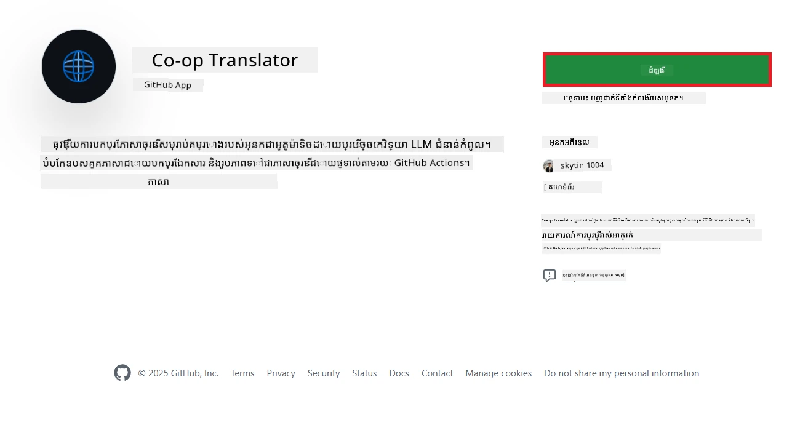
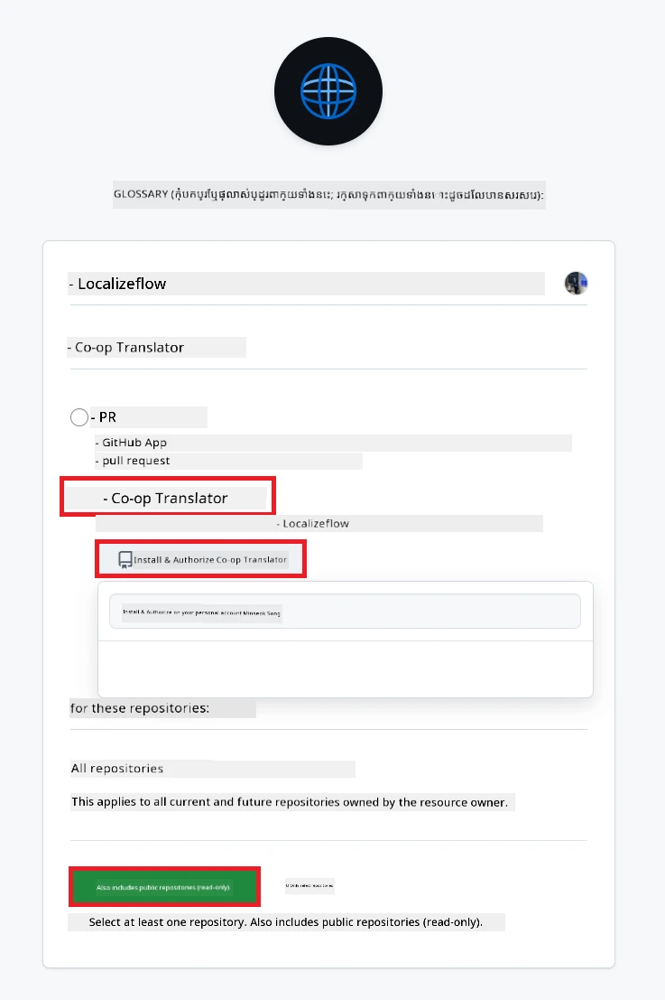
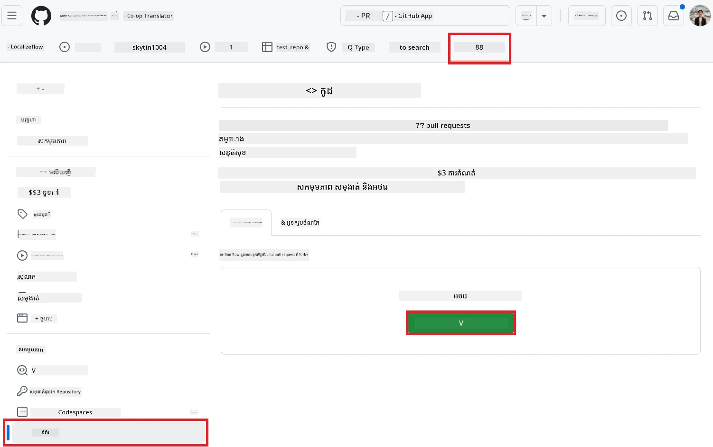
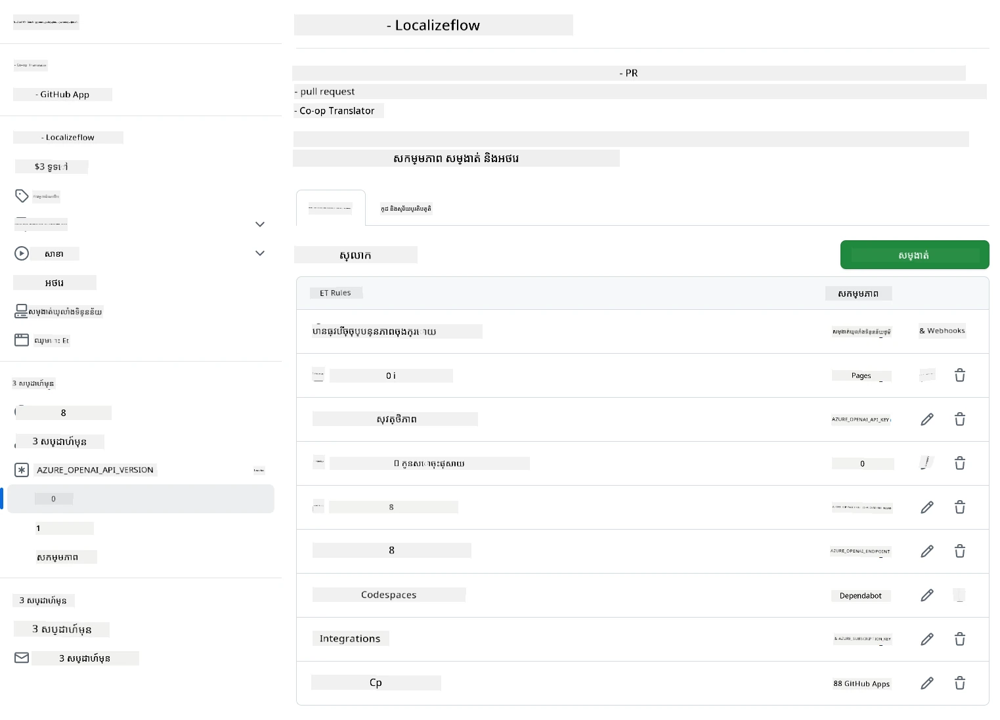

# ការប្រើប្រាស់ Co-op Translator GitHub Action (មគ្គុទេសក៍សម្រាប់អង្គការ)

**គោលដៅអ្នកប្រើ:** មគ្គុទេសក៍នេះមានសម្រាប់ **អ្នកប្រើ Microsoft ខាងក្នុង** ឬ **ក្រុមដែលមានសិទ្ធិចូលប្រើបទបញ្ជាដែលត្រូវការ សម្រាប់ GitHub App Co-op Translator ដែលបានបង្កើតរួចមកហើយ** ឬ អាចបង្កើត GitHub App ផ្ទាល់ខ្លួនរបស់ខ្លួនបាន។

ធ្វើឱ្យការប្រែសម្រួលឯកសារទូទៅក្នុងឃ្លាំងឯកសាររបស់អ្នកដោយស្វ័យប្រវត្តិដោយប្រើ Co-op Translator GitHub Action។ មគ្គុទេសក៍នេះនឹងដឹកនាំអ្នកកំណត់តម្រង់សកម្មភាព ដើម្បីបង្កើត pull requests ដោយស្វ័យប្រវត្តិជាមួយនឹងការប្រែសម្រួលដែលបានធ្វើបច្ចុប្បន្នភាព នៅពេលដែលឯកសារ Markdown ឬរូបភាពគំរូប្រភពរបស់អ្នកមានការផ្លាស់ប្តូរ។

> [!IMPORTANT]
> 
> **ការជ្រើសរើសមគ្គុទេសក៍ត្រឹមត្រូវ៖**  
> មគ្គុទេសក៍នេះពិពណ៌នាអំពីការកំណត់គន្លងប្រើ **GitHub App ID និង Private Key**។ ជាទូទៅ អ្នកត្រូវការសម្ភារៈវិធីសាស្ត្រសម្រាប់ "មគ្គុទេសក៍សម្រាប់អង្គការ" ប្រសិនបើ៖ **សិទ្ធិ `GITHUB_TOKEN` ត្រូវបានដាក់កំណត់ច្បាប់៖** ការកំណត់អង្គការរបស់អ្នក ឬកំណត់ឃ្លាំងឯកសាររក្សា កំណត់សិទ្ធិដំណើរការ `GITHUB_TOKEN` ទូទៅ។ ជាពិសេស ប្រសិនបើ `GITHUB_TOKEN` មិនត្រូវបានអនុញ្ញាតសិទ្ធិ `write` (ដូចជា `contents: write` ឬ `pull-requests: write`) ពិសេស វើកហ្វ្លូក្នុង [មគ្គុទេសក៍កំណត់សាធារណៈ](./github-actions-guide-public.md) នឹងបរាជ័យដោយសារមិនគ្រប់គ្រាន់សិទ្ធិ។ ការប្រើ GitHub App ដាច់ដោយឡែកដែលមានសិទ្ធិបានផ្ដល់តាមរយៈការអនុញ្ញាតជាក់លាក់ អាចជួយរំដោះកំណត់នេះបាន។  
>  
> **បើបញ្ហាខាងលើមិនសម្របសម្រួលសម្រាប់អ្នក៖**  
>  
> ប្រសិនបើ `GITHUB_TOKEN` ទូទៅមានសិទ្ធិគ្រប់គ្រាន់ក្នុងឃ្លាំងឯកសាររបស់អ្នក (ឧ. អ្នកមិនត្រូវបម្រាមដោយការកំណត់អង្គការទេ) សូមប្រើ **[មគ្គុទេសក៍កំណត់សាធារណៈប្រើ GITHUB_TOKEN](./github-actions-guide-public.md)**។ មគ្គុទេសក៍សាធារណៈមិនតម្រូវអោយបាន ឬគ្រប់គ្រង App IDs ឬ Private Keys ហើយផ្អែកលើ`GITHUB_TOKEN` ទូទៅ និង សិទ្ធិឃ្លាំងឯកសារ។

## តម្រូវការមុន

មុនពេលកំណត់ GitHub Action សូមប្រាកដថាអ្នកមានសញ្ញាអ្នកប្រើសេវាកម្ម AI ដែលចាំបាច់រួចរាល់។

**១. តម្រូវការ៖ សញ្ញារបស់ម៉ូឌែលភាសា AI**  
អ្នកត្រូវការសញ្ញារបស់ម៉ូឌែលភាសាដែលគាំទ្រយ៉ាងហោចណាស់មួយ៖

- **Azure OpenAI**៖ ត្រូវការច្រកផ្លូវ Endpoint, សោ API Key, ឈ្មោះម៉ូឌែល / Deployment, និងជំនាន់ API ។  
- **OpenAI**៖ ត្រូវការសោ API Key, (ជាជម្រើស: Org ID, Base URL, Model ID) ។  
- មើល [Supported Models and Services](../../../../README.md) សម្រាប់ព័ត៌មានលម្អិត។  
- មគ្គុទេសក៍កំណត់៖ [Set up Azure OpenAI](../set-up-resources/set-up-azure-openai.md)។

**២. ជម្រើស៖ សញ្ញារបស់ Computer Vision (សម្រាប់ការប្រែរូបភាព)**

- ត្រូវការតែបើអ្នកចាំបាច់ប្រើប្រាស់ការប្រែអត្ថបទនៅក្នុងរូបភាព។  
- **Azure Computer Vision**៖ ត្រូវការច្រកផ្លូវ និងសោ Subscription Key។  
- ប្រសិនបើមិនមាន នោះសកម្មភាពនឹងប្រើ [របៀប Markdown בלבד](../markdown-only-mode.md) ជាថ្នមួយ។  
- មគ្គុទេសក៍កំណត់៖ [Set up Azure Computer Vision](../set-up-resources/set-up-azure-computer-vision.md)។

## ការកំណត់និងរចនា

អនុវត្តន៍ជំហាន់ទាំងនេះដើម្បីកំណត់ Co-op Translator GitHub Action នៅក្នុងឃ្លាំងឯកសាររបស់អ្នក៖

### ជំហាន ១៖ ដំឡើងនិងកំណត់ GitHub App Authentication

វើកហ្វ្លូកំណត់ប្រើGitHub App authentication ដើម្បីធ្វើការផ្សារភ្ជាប់ជាមួយឃ្លាំងឯកសាររបស់អ្នកយ៉ាងមានសុវត្ថិភាព (ឧ. បង្កើត pull requests) ជំនួសអ្នក។ ជ្រើសយកមួយជម្រើស៖

#### **ជម្រើស ក៖ ដំឡើង GitHub App Co-op Translator ដែលបានបង្កើតរួចសម្រាប់ប្រើ Microsoft ខាងក្នុង**

1. ចូលទំព័រ [Co-op Translator GitHub App](https://github.com/apps/co-op-translator)។

1. ជ្រើស **Install** ហើយជ្រើសគណនីឬអង្គការដែលមានឃ្លាំងឯកសារគោលដៅរបស់អ្នក។

    

1. ជ្រើស **Only select repositories** ហើយជ្រើសឃ្លាំងឯកសារគោលដៅរបស់អ្នក (ឧ. `PhiCookBook`)។ ចុច **Install**។ អ្នកអាចត្រូវបានស្នើឱ្យផ្ដល់ការផ្ទៀងផ្ទាត់។

    

1. **ទទួលបានសញ្ញាប័ណ្ណ App (ដំណើរការផ្ទៃក្នុងត្រូវការ):** ដើម្បីអនុញ្ញាតឱ្យវើកហ្វ្លូកំណត់ Authenticate ជា app ត្រូវការព័ត៌មានពីរប្រភេទពីក្រុម Co-op Translator:  
  - **App ID:** លេខកូដអាទិភាពសម្រាប់ GitHub App Co-op Translator ជា `1164076`។  
  - **Private Key:** អ្នកត្រូវទទួលបាន **សារពេញលេញ** របស់ក្រុមហ៊ុន ".pem" គឺឯកសារសោឯកជន ពីអ្នកទំនាក់ទំនងថែរក្សា។ **រក្សាទុកសោនេះដូចជាពាក្យសម្ងាត់ និងរក្សាទុកវាឱ្យមានសុវត្ថិភាព។**

1. បន្តទៅជំហាន់ ២។

#### **ជម្រើស ខ៖ ប្រើ GitHub App ផ្ទាល់ខ្លួនរបស់អ្នក**

- ប្រសិនបើចង់ អ្នកអាចបង្កើតនិងកំណត់ GitHub App ផ្ទាល់ខ្លួនដែលមានសិទ្ធិអាន និងសរសេរព្រមទាំង Contents និង Pull requests។ អ្នកនឹងត្រូវការគ្រាប់ App ID និង Private Key ដែលបានបង្កើត។

### ជំហាន ២៖ កំណត់ Repository Secrets

អ្នកត្រូវបន្ថែមសញ្ញា GitHub App និងសញ្ញាសេវាកម្ម AI ជា secrets ដែលបានស៊ើបអង្កេត (encrypted secrets) នៅក្នុងការកំណត់ឃ្លាំងឯកសារ។

1. ចូលទៅឃ្លាំង GitHub គោលដៅរបស់អ្នក (ឧ. `PhiCookBook`)។

1. ចូលទៅ **Settings** > **Secrets and variables** > **Actions**។

1. នៅក្រោម **Repository secrets** ចុច **New repository secret** សម្រាប់គ្រប់ secret ដែលរាយបញ្ជាក់ទាំងក្រោម។

   

**Secret ត្រូវការ (សម្រាប់ការផ្ទៀងផ្ទាត់ GitHub App):**

| ឈ្មោះ Secret        | ពណ៌នា                                   | ប្រភពតម្លៃ                                  |
| :------------------- | :-------------------------------------- | :------------------------------------------ |
| `GH_APP_ID`          | លេខកូដ App របស់ GitHub App (ពីជំហាន់ ១) | កំណត់ GitHub App                          |
| `GH_APP_PRIVATE_KEY` | **សារពេញលេញ** នៃឯកសារ `.pem` ដែលបានទាញយក | ឯកសារ `.pem` (ពីជំហាន់ ១)              |

**Secret សេវាកម្ម AI (បន្ថែមគ្រប់គ្រាន់បើអនុវត្តតាមតម្រូវការមុន):**

| ឈ្មោះ Secret                    | ពណ៌នា                                    | ប្រភពតម្លៃ                          |
| :------------------------------- | :--------------------------------------- | :--------------------------------- |
| `AZURE_AI_SERVICE_API_KEY`        | សោសម្រាប់សេវាកម្ម Azure AI (Computer Vision) | Azure AI Foundry                   |
| `AZURE_AI_SERVICE_ENDPOINT`       | ច្រកផ្លូវសម្រាប់សេវាកម្ម Azure AI (Computer Vision) | Azure AI Foundry                   |
| `AZURE_OPENAI_API_KEY`            | សោសម្រាប់សេវា Azure OpenAI               | Azure AI Foundry                   |
| `AZURE_OPENAI_ENDPOINT`           | ច្រកផ្លូវសម្រាប់សេវា Azure OpenAI          | Azure AI Foundry                   |
| `AZURE_OPENAI_MODEL_NAME`         | ឈ្មោះម៉ូឌែល Azure OpenAI របស់អ្នក       | Azure AI Foundry                   |
| `AZURE_OPENAI_CHAT_DEPLOYMENT_NAME` | ឈ្មោះ Deployment Azure OpenAI របស់អ្នក   | Azure AI Foundry                   |
| `AZURE_OPENAI_API_VERSION`        | ជំនាន់ API សម្រាប់ Azure OpenAI            | Azure AI Foundry                   |
| `OPENAI_API_KEY`                  | សោ API សម្រាប់ OpenAI                     | OpenAI Platform                   |
| `OPENAI_ORG_ID`                   | លេខសម្គាល់អង្គការ OpenAI                  | OpenAI Platform                   |
| `OPENAI_CHAT_MODEL_ID`            | ម៉ូឌែល OpenAI ជាក់លាក់                    | OpenAI Platform                   |
| `OPENAI_BASE_URL`                 | អាសយដ្ឋានមូលដ្ឋាន API OpenAI ផ្ទាល់ខ្លួន | OpenAI Platform                   |



### ជំហាន ៣៖ បង្កើតឯកសារវើកហ្វ្លូ

ចុងក្រោយ បង្កើតឯកសារ YAML ដែលកំណត់វើកហ្វ្លូស្វ័យប្រវត្តិ។

1. នៅថតឫសដីក្នុងឃ្លាំងឯកសាររបស់អ្នក បង្កើតថត `.github/workflows/` ប្រសិនបើមិនមាន។

1. នៅក្នុង `.github/workflows/` បង្កើតឯកសារដែលមានឈ្មោះ `co-op-translator.yml`។

1. បិទបញ្ចូលមាតិកាខាងក្រោម ចូលទៅក្នុង co-op-translator.yml។

```
name: Co-op Translator

on:
  push:
    branches:
      - main

jobs:
  co-op-translator:
    runs-on: ubuntu-latest

    permissions:
      contents: write
      pull-requests: write

    steps:
      - name: Checkout repository
        uses: actions/checkout@v4
        with:
          fetch-depth: 0

      - name: Set up Python
        uses: actions/setup-python@v4
        with:
          python-version: '3.10'

      - name: Install Co-op Translator
        run: |
          python -m pip install --upgrade pip
          pip install co-op-translator

      - name: Run Co-op Translator
        env:
          PYTHONIOENCODING: utf-8
          # Azure AI Service Credentials
          AZURE_AI_SERVICE_API_KEY: ${{ secrets.AZURE_AI_SERVICE_API_KEY }}
          AZURE_AI_SERVICE_ENDPOINT: ${{ secrets.AZURE_AI_SERVICE_ENDPOINT }}

          # Azure OpenAI Credentials
          AZURE_OPENAI_API_KEY: ${{ secrets.AZURE_OPENAI_API_KEY }}
          AZURE_OPENAI_ENDPOINT: ${{ secrets.AZURE_OPENAI_ENDPOINT }}
          AZURE_OPENAI_MODEL_NAME: ${{ secrets.AZURE_OPENAI_MODEL_NAME }}
          AZURE_OPENAI_CHAT_DEPLOYMENT_NAME: ${{ secrets.AZURE_OPENAI_CHAT_DEPLOYMENT_NAME }}
          AZURE_OPENAI_API_VERSION: ${{ secrets.AZURE_OPENAI_API_VERSION }}

          # OpenAI Credentials
          OPENAI_API_KEY: ${{ secrets.OPENAI_API_KEY }}
          OPENAI_ORG_ID: ${{ secrets.OPENAI_ORG_ID }}
          OPENAI_CHAT_MODEL_ID: ${{ secrets.OPENAI_CHAT_MODEL_ID }}
          OPENAI_BASE_URL: ${{ secrets.OPENAI_BASE_URL }}
        run: |
          # =====================================================================
          # IMPORTANT: Set your target languages here (REQUIRED CONFIGURATION)
          # =====================================================================
          # Example: Translate to Spanish, French, German. Add -y to auto-confirm.
          translate -l "es fr de" -y  # <--- MODIFY THIS LINE with your desired languages

      - name: Authenticate GitHub App
        id: generate_token
        uses: tibdex/github-app-token@v1
        with:
          app_id: ${{ secrets.GH_APP_ID }}
          private_key: ${{ secrets.GH_APP_PRIVATE_KEY }}

      - name: Create Pull Request with translations
        uses: peter-evans/create-pull-request@v5
        with:
          token: ${{ steps.generate_token.outputs.token }}
          commit-message: "🌐 Update translations via Co-op Translator"
          title: "🌐 Update translations via Co-op Translator"
          body: |
            This PR updates translations for recent changes to the main branch.

            ### 📋 Changes included
            - Translated contents are available in the `translations/` directory
            - Translated images are available in the `translated_images/` directory

            ---
            🌐 Automatically generated by the [Co-op Translator](https://github.com/Azure/co-op-translator) GitHub Action.
          branch: update-translations
          base: main
          labels: translation, automated-pr
          delete-branch: true
          add-paths: |
            translations/
            translated_images/

```

4.  **ប្តូរតម្រូវវើកហ្វ្លូ៖**
  - **[!IMPORTANT] គោលដៅភាសា៖** នៅជំហាន់ `Run Co-op Translator` អ្នក **ត្រូវពិនិត្យ លើកហើយកែប្រែបញ្ជីកូដភាសា** នៅក្នុងពាក្យបញ្ជា `translate -l "..." -y` ដើម្បីឲ្យសមនឹងតម្រូវការគម្រោងរបស់អ្នក។ បញ្ជីឧទាហរណ៍ (`ar de es...`) ត្រូវបានជំនួស ឬកែតម្រូវ។  
  - **រំលឹកព្រឹត្តិការណ៍ (`on:`):** បច្ចុប្បន្នវើកហ្វ្លូដំណើរការនៅពេល push ទៅ `main` រៀងរាល់ដង។ សម្រាប់ឃ្លាំងឯកសារធំ អាចពិចារណាបន្ថែម `paths:` (មើលគំរូតំណាងផលក្នុង YAML) ដើម្បីរត់វើកហ្វ្លូតែលាថតឯកសារដែលពាក់ព័ន្ធច្បាស់ (ឧ. ឯកសារបទបញ្ជាដើម) ជៀសវាងការចំណាយម៉ោងលើ runner។  
  - **ព័ត៌មាន PR៖** អ្នកអាចកែប្រែ `commit-message`, `title`, `body`, ឈ្មោះ `branch`, និង `labels` នៅជំហាន `Create Pull Request` ប្រសិនបើត្រូវការ។

## ការគ្រប់គ្រងនិងកំណត់ឡើងវិញសញ្ញាប័ណ្ណ

- **សុវត្ថិភាពៈ** តែងតែរក្សាទុកសញ្ញាផ្ទាល់ខ្លួន (API keys, private keys) ជា GitHub Actions secrets មិនគួរបង្ហាញពួកវាក្នុងឯកសារវើកហ្វ្លូ ឬកូដឃ្លាំងឯកសារ។  
- **[!IMPORTANT] ការកំណត់ឡើងវិញ Key (អ្នកប្រើ Microsoft ខាងក្នុង):** សូមចំណាំថាសោ Azure OpenAI ដែលប្រើនៅ Microsoft អាចមានគោលនយោបាយកំណត់ឡើងវិញតាមគេហទំព័រ (ដូចជាប្រាំខែម្ដង)។ សូមធ្វើការអាប់ដេតសញ្ញា GitHub (`AZURE_OPENAI_...` នេះ) **មុនពេលវាផុតកំណត់** ដើម្បីជៀសវាងការបរាជ័យវើកហ្វ្លូ។

## ការរត់វើកហ្វ្លូ

> [!WARNING]  
> **ពេលរត់របស់ GitHub-hosted Runner:**  
> GitHub-hosted runners ដូចជា `ubuntu-latest` មាន **កំណត់ពេលបំរើស្មើ 6 ម៉ោង**។  
> សម្រាប់ឃ្លាំងឯកសារធំនៅពេលដំណើរការប្រែសម្រួលលើស 6 ម៉ោង វើកហ្វ្លូ នឹងត្រូវបញ្ឈប់ដោយស្វ័យប្រវត្តិ។  
> ដើម្បីទប់ស្កាត់សំណុំការនេះ សូមពិចារណា៖  
> - ប្រើ **self-hosted runner** (គ្មានកំណត់ពេល)  
> - កាត់បន្ថយចំនួនភាសាគោលដៅក្នុងមួយដំណើរ

ពេលឯកសារ `co-op-translator.yml` ត្រូវបានបញ្ចូលចូលទៅក្នុងសាខា main របស់អ្នក (ឬសាខាមួយដែលបានកំណត់ក្នុង `on:`) វើកហ្វ្លូ នឹងរត់ដោយស្វ័យប្រវត្តិពេលផ្លាស់ប្តូរត្រូវបានផ្ញើទៅសាខានោះ (ហើយផ្គូរផ្គងជាមួយជម្រើស `paths` ប្រសិនបើមាន)។

ប្រសិនបើការប្រែបម្រែបានបង្កើត ឬធ្វើបច្ចុប្បន្នភាព សកម្មភាពនឹងបង្កើត Pull Request ដោយស្វ័យប្រវត្តិ ដែលមានការផ្លាស់ប្តូរ រួចរួចជ្រាបដោយអ្នកសម្រាប់ពិនិត្យ និងបង្ហាប់រួម។

---

<!-- CO-OP TRANSLATOR DISCLAIMER START -->
**ការជ្រាបជ្រាវ**៖  
ឯកសារនេះត្រូវបានបកប្រែដោយប្រើសេវាកម្មបកប្រែ AI [Co-op Translator](https://github.com/Azure/co-op-translator)។ ទោះយើងខឹចំពោះភាពត្រឹមត្រូវ ក៏សូមអោយជម្រាបថា ការបកប្រែដោយស្វ័យប្រវត្តិអាចមានកំហុស ឬភាពមិនត្រឹមត្រូវ។ ឯកសារដើមក្នុងភាសាដើមគួរត្រូវបានយកជាលទ្ធផលផ្លូវការ។ សម្រាប់ព័ត៌មានសំខាន់ៗ សូមផ្ដល់ជូនការបកប្រែដោយអ្នកជំនាញមនុស្ស។ យើងមិនទទួលខុសត្រូវចំពោះការយល់ច្រឡំ ឬការបកប្រែខុសពីការប្រើប្រាស់ការបកប្រែនេះឡើយ។
<!-- CO-OP TRANSLATOR DISCLAIMER END -->