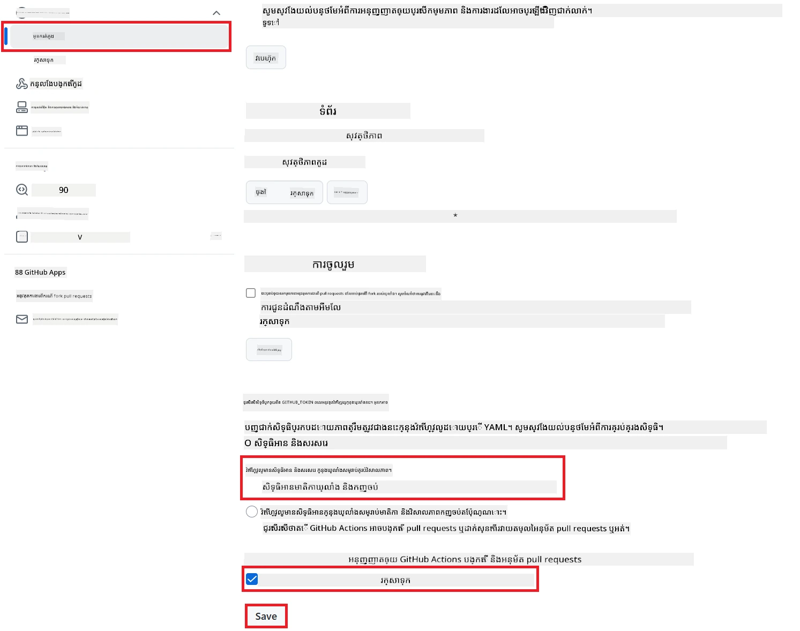

# ការប្រើប្រាស់ Co-op Translator GitHub Action (ការតម្លើងសាធារណៈ)

**អ្នកទស្សនាគោលដៅ:** មាគ៌ានេះសម្រាប់អ្នកប្រើប្រាស់នៅក្នុងឃ្លាំងទិន្នន័យសាធារណៈ ឬឯកជនភាគច្រើន ដែលការអនុញ្ញាតលើ GitHub Actions ទម្រង់ស្តង់ដារត្រូវគ្នា។ វាប្រើប្រាស់ `GITHUB_TOKEN` ដែលមានមូលដ្ឋានរួចហើយ។

ស្វ័យប្រវត្តិការ​ប្រែសម្រួលឯកសាររបស់ឃ្លាំងអ្នកយ៉ាងងាយស្រួល ដោយប្រើប្រាស់ Co-op Translator GitHub Action ។ មាគ៌ានេះនឹងដឹកនាំអ្នកក្នុងការតម្លើងប្រតិបត្តិការ ដើម្បីបង្កើត pull requests យ៉ាងស្វ័យប្រវត្តិជាមួយការប្រែសម្រួលត្រូវបានធ្វើបច្ចុប្បន្នភាព នៅពេលឯកសារ Markdown ឬរូបភាពប្រភពរបស់អ្នកផ្លាស់ប្តូរ។

> [!IMPORTANT]
>
> **ការជ្រើសរើសមាគ៌ាដែលត្រឹមត្រូវ៖**
>
> មាគ៌ានេះពន្យល់ពី **ការតម្លើងសាមញ្ញប្រើ `GITHUB_TOKEN` ស្តង់ដារ**។ វាជាវិធីណែនាំសម្រាប់អ្នកភាគច្រើន ដោយមិនទាមទារឲ្យគ្រប់គ្រងចំនុចឯកជន GitHub App ដែលមានភាពរលូន។
>

## សម្ភារៈមុន

មុនសិនកំណត់ GitHub Action សូមប្រាកដថាអ្នកមានការផ្តល់សិទ្ធិ AI ដែលត្រូវការជាស្រេច។

**1. តម្រូវការ៖ វត្ថុបញ្ជាក់ម៉ូដែលភាសា AI**  
អ្នកត្រូវការវត្ថុបញ្ជាក់សម្រាប់ម៉ូដែលភាសាដែលគាំទ្រយ៉ាងហោចណាស់មួយ:

- **Azure OpenAI**៖ តម្រូវឲ្យមាន Endpoint, API Key, ឈ្មោះម៉ូដែល/ការដាក់ពង្រីក, នឹងជំនាន់ API។  
- **OpenAI**៖ តម្រូវឲ្យមាន API Key, (ជាជម្រើស៖ Org ID, Base URL, Model ID)។  
- សូមមើល [Supported Models and Services](../../../../README.md) សម្រាប់ព័ត៌មានលម្អិត។

**2. ជម្រើស៖ វត្ថុបញ្ជាក់ AI Vision (សម្រាប់ការប្រែរូបភាព)**

- ត្រូវការគ្រាន់តែប្រសិនបើអ្នកត្រូវប្រែអត្ថបទនៃរូបភាព។  
- **Azure AI Vision**៖ តម្រូវឲ្យមាន Endpoint និង Subscription Key។  
- ប្រសិនបើមិនផ្តល់ទេ, ប្រតិបត្តិការនេះនឹងបង្កើត [ម៉ូដ Markdown តែប៉ុណ្ណោះ](../markdown-only-mode.md)។

## ការតម្លើង និង ការកំណត់តម្លៃ

អនុវត្តតាមជំហានខាងក្រោម ដើម្បីកំណត់ Co-op Translator GitHub Action ក្នុងឃ្លាំងរបស់អ្នក ដោយប្រើ `GITHUB_TOKEN` ស្តង់ដារ។

### ជំហាន 1: យល់ដឹងពីការផ្ទៀងផ្ទាត់អត្តសញ្ញាណ (ប្រើ `GITHUB_TOKEN`)

 workflow នេះប្រើ `GITHUB_TOKEN` ដែលត្រូវបានផ្តល់ដោយ GitHub Actions។ token នេះផ្តល់សិទ្ធិអនុញ្ញាតដល់ workflow ដើម្បីធ្វើប្រតិបត្តិការជាមួយឃ្លាំងរបស់អ្នក ជាប់ទៅនឹងការកំណត់ដែលបានកំណត់នៅ **ជំហាន 3**។

### ជំហាន 2: កំណត់ Repository Secrets

អ្នកត្រូវតែបន្ថែម **វត្ថុបញ្ជាក់សម្រាប់សេវា AI** ក្នុងជាគម្រោងធ្វើ cipher នៅក្នុងការកំណត់ឃ្លាំងរបស់អ្នក។

1. ចូលទៅកាន់ឃ្លាំង GitHub គោលដៅរបស់អ្នក។  
2. ទៅកាន់ **Settings** > **Secrets and variables** > **Actions**។  
3. នៅក្រោម **Repository secrets**, ចុច **New repository secret** សម្រាប់វត្ថុបញ្ជាក់ទាំងអស់ដែលត្រូវការដូចបានរៀបរាប់នៅក្រោម។

     *(ចំណាំរូបភាព៖ បង្ហាញទីតាំងបន្ថែម secrets)*

**វត្ថុបញ្ជាក់សេវា AI ត្រូវការជា Secret (បន្ថែមទាំងអស់ដែលត្រូវតាមសម្ភារៈមុន):**

| ឈ្មោះ Secret                     | បញ្ជាក់                              | ប្រភពតម្លៃ                     |
| :-------------------------------- | :------------------------------------ | :----------------------------- |
| `AZURE_AI_SERVICE_API_KEY`          | Key សម្រាប់ Azure AI Service (Computer Vision) | Azure AI Foundry របស់អ្នក       |
| `AZURE_AI_SERVICE_ENDPOINT`         | Endpoint សម្រាប់ Azure AI Service (Computer Vision) | Azure AI Foundry របស់អ្នក       |
| `AZURE_OPENAI_API_KEY`              | Key សម្រាប់សេវា Azure OpenAI           | Azure AI Foundry របស់អ្នក       |
| `AZURE_OPENAI_ENDPOINT`             | Endpoint សម្រាប់សេវា Azure OpenAI       | Azure AI Foundry របស់អ្នក       |
| `AZURE_OPENAI_MODEL_NAME`           | ឈ្មោះម៉ូដែល Azure OpenAI របស់អ្នក       | Azure AI Foundry របស់អ្នក       |
| `AZURE_OPENAI_CHAT_DEPLOYMENT_NAME` | ឈ្មោះសេវាកម្ម Deployment Azure OpenAI របស់អ្នក | Azure AI Foundry របស់អ្នក       |
| `AZURE_OPENAI_API_VERSION`          | ជំនាន់ API សម្រាប់ Azure OpenAI        | Azure AI Foundry របស់អ្នក       |
| `OPENAI_API_KEY`                    | API Key សម្រាប់ OpenAI                  | ឈ្មោះផ្លាត២ម OpenAI របស់អ្នក    |
| `OPENAI_ORG_ID`                     | ID អង្គភាព OpenAI (ជាជម្រើស)           | ផ្លាត៨ម OpenAI របស់អ្នក        |
| `OPENAI_CHAT_MODEL_ID`              | ID ម៉ូដែល OpenAI បញ្ជាក់ (ជាជម្រើស)      | ផ្លាត៨ម OpenAI របស់អ្នក        |
| `OPENAI_BASE_URL`                   | Base URL API OpenAI ផ្ទាល់ខ្លួន (ជាជម្រើស)  | ផ្លាត៨ម OpenAI របស់អ្នក        |

### ជំហាន 3: កំណត់សិទ្ធិ Workflow

GitHub Action ត្រូវការសិទ្ធិដែលផ្តល់តាមរយៈ `GITHUB_TOKEN` ដើម្បីចេញបានកូដ និងបង្កើត pull requests។

1. នៅក្នុងឃ្លាំងរបស់អ្នក, ចូលទៅកាន់ **Settings** > **Actions** > **General**។  
2. ទាញចុះទៅផ្នែក **Workflow permissions** ។  
3. ជ្រើស **Read and write permissions**។ នេះផ្តល់សិទ្ធិ `contents: write` និង `pull-requests: write` ដល់ `GITHUB_TOKEN` សម្រាប់ workflow នេះ។  
4. បញ្ចាក់ប្រអប់សម្រាប់ **Allow GitHub Actions to create and approve pull requests** ដែលត្រូវបានជ្រើស។  
5. ជ្រើស **Save**។



### ជំហាន 4: បង្កើតឯកសារ Workflow

ចុងក្រោយ បង្កើតឯកសារ YAML ដែលបញ្ជាក់ workflow ស្វ័យប្រវត្តិដោយប្រើ `GITHUB_TOKEN`។

1. នៅឫសធ្វើនៃឃ្លាំងរបស់អ្នក បង្កើតថត `.github/workflows/` ប្រសិនបើមិនមាន។  
2. នៅក្នុង `.github/workflows/` បង្កើតឯកសារ ឈ្មោះ `co-op-translator.yml`។  
3. បិទបញ្ចូលមតិខាងក្រោមទៅក្នុង `co-op-translator.yml` ។

```yaml
name: Co-op Translator

on:
  push:
    branches:
      - main

jobs:
  co-op-translator:
    runs-on: ubuntu-latest

    permissions:
      contents: write
      pull-requests: write

    steps:
      - name: Checkout repository
        uses: actions/checkout@v4
        with:
          fetch-depth: 0

      - name: Set up Python
        uses: actions/setup-python@v4
        with:
          python-version: '3.10'

      - name: Install Co-op Translator
        run: |
          python -m pip install --upgrade pip
          pip install co-op-translator

      - name: Run Co-op Translator
        env:
          PYTHONIOENCODING: utf-8
          # === AI Service Credentials ===
          AZURE_AI_SERVICE_API_KEY: ${{ secrets.AZURE_AI_SERVICE_API_KEY }}
          AZURE_AI_SERVICE_ENDPOINT: ${{ secrets.AZURE_AI_SERVICE_ENDPOINT }}
          AZURE_OPENAI_API_KEY: ${{ secrets.AZURE_OPENAI_API_KEY }}
          AZURE_OPENAI_ENDPOINT: ${{ secrets.AZURE_OPENAI_ENDPOINT }}
          AZURE_OPENAI_MODEL_NAME: ${{ secrets.AZURE_OPENAI_MODEL_NAME }}
          AZURE_OPENAI_CHAT_DEPLOYMENT_NAME: ${{ secrets.AZURE_OPENAI_CHAT_DEPLOYMENT_NAME }}
          AZURE_OPENAI_API_VERSION: ${{ secrets.AZURE_OPENAI_API_VERSION }}
          OPENAI_API_KEY: ${{ secrets.OPENAI_API_KEY }}
          OPENAI_ORG_ID: ${{ secrets.OPENAI_ORG_ID }}
          OPENAI_CHAT_MODEL_ID: ${{ secrets.OPENAI_CHAT_MODEL_ID }}
          OPENAI_BASE_URL: ${{ secrets.OPENAI_BASE_URL }}
        run: |
          # =====================================================================
          # IMPORTANT: Set your target languages here (REQUIRED CONFIGURATION)
          # =====================================================================
          # Example: Translate to Spanish, French, German. Add -y to auto-confirm.
          translate -l "es fr de" -y  # <--- MODIFY THIS LINE with your desired languages

      - name: Create Pull Request with translations
        uses: peter-evans/create-pull-request@v5
        with:
          token: ${{ secrets.GITHUB_TOKEN }}
          commit-message: "🌐 Update translations via Co-op Translator"
          title: "🌐 Update translations via Co-op Translator"
          body: |
            This PR updates translations for recent changes to the main branch.

            ### 📋 Changes included
            - Translated contents are available in the `translations/` directory
            - Translated images are available in the `translated_images/` directory

            ---
            🌐 Automatically generated by the [Co-op Translator](https://github.com/Azure/co-op-translator) GitHub Action.
          branch: update-translations
          base: main
          labels: translation, automated-pr
          delete-branch: true
          add-paths: |
            translations/
            translated_images/
```
4.  **ប្ដូរតាមតម្រូវការនៃ Workflow:**  
  - **[!IMPORTANT] ភាសាគោលដៅ៖** ក្នុងជំហាន `Run Co-op Translator`, អ្នក **ត្រូវពិនិត្យ និងកែប្រែបញ្ជីកូដភាសា** ក្នុងពាក្យបញ្ជា `translate -l "..." -y` ដើម្បីឲ្យសម្របសម្រួលនឹងតម្រូវការកម្មវិធីរបស់អ្នក។ បញ្ជីឧទាហរណ៍ (`ar de es...`) ត្រូវបានប្ដូរឬតំរូវទៅ។  
  - **Trigger (`on:`):** Trigger ផលបច្ចុប្បន្នរត់នៅពេលចុះបញ្ចូលដល់ `main`។ សម្រាប់ឃ្លាំងធំៗ អាចបន្ថែម គ្រឿងបត់ `paths:` (មើលខ្នាតឧទាហរណ៍ក្នុង YAML) ដើម្បីរត់ workflow តែម្តងតែពេលឯកសារពាក់ព័ន្ធ(ឧ. ឯកសារសេចក្ដីអធិប្បាយប្រភព)ផ្លាស់ប្តូរ ដែលជួយសន្សំម៉ោង Runner។  
  - **ព័ត៌មាន PR:** អ្នកអាចកែប្រែ `commit-message`, `title`, `body`, ឈ្មោះសាខា និង `labels` នៅក្នុងជំហាន `Create Pull Request` ប្រសិនបើចាំបាច់។

## រត់ Workflow

> [!WARNING]  
> **កំណត់ពេលវេលារបស់ Runner ដែលផ្តល់ដោយ GitHub:**  
> Runner ដែលផ្តល់ដោយ GitHub ដូចជា `ubuntu-latest` មានកំណត់ពេលវេលារើបដំណើរការប្រមាណជា 6 ម៉ោង។  
> សម្រាប់ឃ្លាំងឯកសារធំ ប្រសិនបើដំណើរការប្រែសម្រួលលើស 6 ម៉ោង workflow នឹងត្រូវបានបញ្ឈប់ដោយស្វ័យប្រវត្តិ។  
> ដើម្បីជៀសវាង, សូមពិចារណា:  
> - ប្រើ **runner ផ្ទាល់ខ្លួន** (គ្មានកំណត់ពេល)  
> - កាត់បន្ថយចំនួនភាសាគោលដៅក្នុងមួយដំណើរការ

ពេលឯកសារ `co-op-translator.yml` ត្រូវបានបញ្ចូលចូលទៅក្នុងសាខា `main` របស់អ្នក (ឬសាខាមួយដែលបានកំណត់ក្នុង `on:`) workflow នឹងរត់ដោយស្វ័យប្រវត្តិគ្រប់ពេលដែលមានការផ្លាស់ប្តូរស្រូវទៅសាខានោះ (និងផ្គូផ្គងនឹងតម្រូវ `paths`, ប្រសិនបើបានកំណត់)។

---

<!-- CO-OP TRANSLATOR DISCLAIMER START -->
**ការបដិសេធ**៖  
ឯកសារនេះត្រូវបានបញ្ចេញបកប្រែជាមួយសេវាកម្មបកប្រែ AI [Co-op Translator](https://github.com/Azure/co-op-translator)។ ចំពោះយើងខ្ញុំមានការខិតខំរកសុចរិតភាព ប៉ុន្តែសូមយល់ដឹងថាការបកប្រែដោយស្វ័យប្រវត្តិអាចមានកំហុសឬភាពមិនត្រឹមត្រូវខ្លះ។ ឯកសារដើមក្នុងភាសាម្ចាស់ដើមគួរត្រូវបានគេចាត់ទុកជាធនធានដែលមានស្រេចតែម្ដង។ សម្រាប់ព័ត៌មានសំខាន់ៗ សូមប្រើការបកប្រែដោយអ្នកជំនាញមនុស្សកាន់តែអនុវត្តបានល្អ។ យើងខ្ញុំមិនទទួលខុសត្រូវចំពោះការយល់ច្រឡំ ឬការបកស្រាយខុសចេញពីការប្រើប្រាស់ការបកប្រែនេះឡើយ។
<!-- CO-OP TRANSLATOR DISCLAIMER END -->