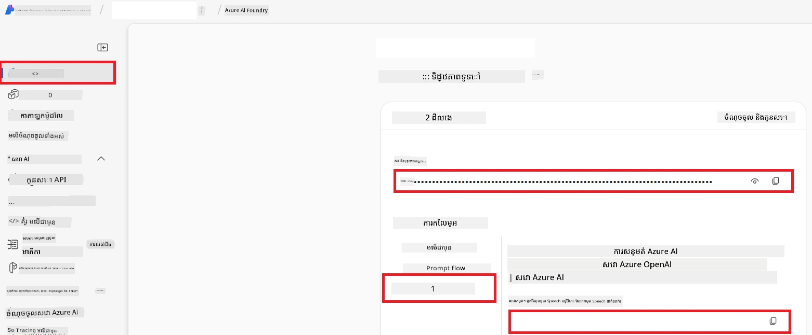

# ការតំឡើង Azure AI សម្រាប់ Co-op Translator (Azure OpneAI & Azure AI Vision)

មគ្គុទេសក៍នេះនាំអ្នកឆ្លៀតបន្ទាត់តំឡើង Azure OpenAI សម្រាប់បកប្រែភាសា និង Azure Computer Vision សម្រាប់វិភាគមាតិការូបភាព (ដែលអាចត្រូវបានប្រើសម្រាប់ការបកប្រែក្នុងរូបភាព) ជាផ្នែកក្នុង Azure AI Foundry។

**លក្ខខណ្ឌដាច់ខាត:**
- គណនី Azure ដែលមានការជាវសកម្ម។
- សិទ្ធិគ្រប់គ្រាន់ក្នុងការបង្កើតធនធាន និងការចេញផ្សាយក្នុងការជាវ Azure របស់អ្នក។

## បង្កើតគម្រោង Azure AI

អ្នកនឹងចាប់ផ្តើមដោយបង្កើតគម្រោង Azure AI ដែលដំណើរការជាទីតាំងមួយសម្រាប់គ្រប់គ្រងធនធាន AI របស់អ្នក។

1. ចូលទៅកាន់ [https://ai.azure.com](https://ai.azure.com) ហើយចុះឈ្មោះជាមួយគណនី Azure របស់អ្នក។

1. ជ្រើសរើស **+Create** ដើម្បីបង្កើតគម្រោងថ្មី។

1. ជម្រះការងារទាំងក្រោម៖
   - បញ្ចូល **Project name** (ឧ. `CoopTranslator-Project`)។
   - ជ្រើសរើស **AI hub** (ឧ. `CoopTranslator-Hub`) (បង្កើតថ្មីប្រសិនបើត្រូវការ)។

1. ចុច "**Review and Create**" ដើម្បីរៀបចំគម្រោងរបស់អ្នក។ អ្នកនឹងត្រូវបានយកទៅកាន់ទំព័រពិពណ៌នាគម្រោងរបស់អ្នក។

## តំឡើង Azure OpenAI សម្រាប់ការបកប្រែភាសា

នៅក្នុងគម្រោងរបស់អ្នក អ្នកនឹងចេញផ្សាយម៉ូដែល Azure OpenAI មួយដើម្បីធ្វើការបម្រើជាក្រោយផ្នែកសម្រាប់ការបកប្រែអត្ថបទ។

### ចូលរួមគម្រោងរបស់អ្នក

ប្រសិនបើមិនទាន់មាន ក្រឡេកបើកគម្រោងថ្មីដែលបានបង្កើត (ឧ. `CoopTranslator-Project`) នៅក្នុង Azure AI Foundry។

### ចេញផ្សាយម៉ូដែល OpenAI

1. ពីម៉ឺនុយខាងឆ្វេងរបស់គម្រោង អ្នកជ្រើសរើស "My assets" រួចជ្រើស "**Models + endpoints**"។

1. ជ្រើសរើស **+ Deploy model**។

1. ជ្រើសរើស **Deploy Base Model**។

1. អ្នកនឹងបានបង្ហាញបញ្ជីម៉ូដែលដែលមាន។ សូមតម្រុយឬស្វែងរកម៉ូដែល GPT មួយដែលសមរម្យ។ យើងណែនាំ `gpt-4o`។

1. ជ្រើសរើសម៉ូដែលដែលអ្នកចង់បាន ហើយចុច **Confirm**។

1. ជ្រើសរើស **Deploy**។

### ការកំណត់រចនាសម្ព័ន្ធ Azure OpenAI

បន្ទាប់ពីបានចេញផ្សាយ អ្នកអាចជ្រើសរើសការចេញផ្សាយពីទំព័រ "**Models + endpoints**" ដើម្បីរក **REST endpoint URL**, **សោ**, **ឈ្មោះការចេញផ្សាយ**, **ឈ្មោះម៉ូដែល** និង **កំណែ API**។ វានឹងត្រូវការសម្រាប់បញ្ចូលម៉ូដែលបកប្រែក្នុងកម្មវិធីរបស់អ្នក។

> [!NOTE]
> អ្នកអាចជ្រើសរើសកំណែ API ពីទំព័រ [API version deprecation](https://learn.microsoft.com/azure/ai-services/openai/api-version-deprecation) ដោយផ្អែកលើតម្រូវការ។ សូមចំណាំថា **កំណែ API** ខុសពី **កំណែម៉ូដែល** ដែលបង្ហាញនៅលើទំព័រ **Models + endpoints** ក្នុង Azure AI Foundry។

## តំឡើង Azure Computer Vision សម្រាប់ការបកប្រែក្នុងរូបភាព

ដើម្បីអនុញ្ញាតឲ្យបកប្រែអត្ថបទនៅក្នុងរូបភាព អ្នកត្រូវការស្វែងរកកូនសោ API និង Endpoint របស់ Azure AI Service។

1. ចូលទៅកាន់គម្រោង Azure AI របស់អ្នក (ឧ. `CoopTranslator-Project`)។ ប្រាកដថាអ្នកនៅក្នុងទំព័រពិពណ៌នាគម្រោង។

### ការកំណត់រចនាសម្ព័ន្ធ Azure AI Service

ស្វែងរកកូនសោ API និង Endpoint ពី Azure AI Service។

1. ចូលទៅកាន់គម្រោង Azure AI របស់អ្នក (ឧ. `CoopTranslator-Project`)។ ប្រាកដថាអ្នកនៅក្នុងទំព័រពិពណ៌នាគម្រោង។

1. ស្វែងរក **API Key** និង **Endpoint** ពីផ្ទាំង Azure AI Service។

    

ការតភ្ជាប់នេះធ្វើឲ្យសមត្ថភាពនៃធនធាន Azure AI Services ដែលត្រូវបានភ្ជាប់ (រួមទាំងវិភាគរូបភាព) អាចប្រើបានសម្រាប់គម្រោង AI Foundry របស់អ្នក។ អ្នកអាចប្រើការតភ្ជាប់នេះក្នុងកំណត់ហេតុនៅក្នុងសៀវភៅកំណត់របស់អ្នកឬកម្មវិធី ដើម្បីដកអត្ថបទពីរូបភាព ដែលបន្ទាប់មកអាចផ្ញើទៅម៉ូដែល Azure OpenAI ដើម្បីបកប្រែបាន។

## ការរួមបញ្ចូលគ្នានៃលិខិតបញ្ជាក់របស់អ្នក

បច្ចុប្បន្ន អ្នកគួរតែបានប្រមូលបានរួចសម្រាប់ដូចខាងក្រោម៖

**សម្រាប់ Azure OpenAI (ការបកប្រែអត្ថបទ):**
- Azure OpenAI Endpoint
- គ្រាប់សោ Azure OpenAI API
- ឈ្មោះម៉ូដែល Azure OpenAI (ឧ. `gpt-4o`)
- ឈ្មោះចេញផ្សាយ Azure OpenAI (ឧ. `cooptranslator-gpt4o`)
- កំណែ Azure OpenAI API

**សម្រាប់ Azure AI Services (ការដកអត្ថបទក្នុងរូបភាពតាមរយៈ Vision):**
- Azure AI Service Endpoint
- គ្រាប់សោ Azure AI Service API

### ឧទាហរណ៍៖ ការកំណត់ Environment Variable (ទិដ្ឋភាពមុន)

បន្ទាប់ពីនេះ នៅពេលវេលាដែលអ្នកកំពុងបង្កើតកម្មវិធី អ្នកប្រហែលជានឹងកំណត់វាដោយប្រើលិខិតបញ្ជាក់ដែលបានប្រមូលនេះ។ ឧទាហរណ៍ អ្នកអាចកំណត់វាជា environment variables ដូច្នេះ៖

```bash
# មានសិទ្ធិប្រើប្រាស់សេវាកម្ម Azure AI (ត្រូវការសម្រាប់បកប្រែរូបភាព)
AZURE_AI_SERVICE_API_KEY="your_azure_ai_service_api_key" # ឧទាហរណ៍, 21xasd...
AZURE_AI_SERVICE_ENDPOINT="https://your_azure_ai_service_endpoint.cognitiveservices.azure.com/"

# ចំណាត់ថ្នាក់បណ្ដោះអាសន្នជាជម្រើស: កែសម្រួលអថេរដដែលជាមួយនឹងបន្សំ _1/_2 (មានលេខសន្ទស្សន៍ដូចគ្នាសម្រាប់អថេរទាំងអស់នៅក្នុងសំណុំ)
AZURE_AI_SERVICE_API_KEY_1="your_azure_ai_service_api_key_1"
AZURE_AI_SERVICE_ENDPOINT_1="https://your_azure_ai_service_endpoint_1.cognitiveservices.azure.com/"

# មានសិទ្ធិប្រើប្រាស់ Azure OpenAI (ត្រូវការសម្រាប់បកប្រែអត្ថបទ)
AZURE_OPENAI_API_KEY="your_azure_openai_api_key" # ឧទាហរណ៍, 21xasd...
AZURE_OPENAI_ENDPOINT="https://your_azure_openai_endpoint.openai.azure.com/"
AZURE_OPENAI_MODEL_NAME="your_model_name" # ឧទាហរណ៍, gpt-4o
AZURE_OPENAI_CHAT_DEPLOYMENT_NAME="your_deployment_name" # ឧទាហរណ៍, cooptranslator-gpt4o
AZURE_OPENAI_API_VERSION="your_api_version" # ឧទាហរណ៍, 2024-12-01-preview

# ចំណាត់ថ្នាក់បណ្ដោះអាសន្នជាជម្រើស: ចម្លងសំណុំ AZURE_OPENAI_* ទាំងមូលជាមួយបន្សំ _1/_2 (មានលេខសន្ទស្សន៍ដូចគ្នាសម្រាប់អថេរទាំងអស់)
```

---

### អត្ថបទបន្ថែមសម្រាប់អាន

- [របៀបបង្កើតគម្រោងនៅក្នុង Azure AI Foundry](https://learn.microsoft.com/azure/ai-foundry/how-to/create-projects?tabs=ai-studio)
- [របៀបបង្កើតធនធាន Azure AI](https://learn.microsoft.com/azure/ai-foundry/how-to/create-azure-ai-resource?tabs=portal)
- [របៀបចេញផ្សាយម៉ូដែល OpenAI នៅក្នុង Azure AI Foundry](https://learn.microsoft.com/en-us/azure/ai-foundry/how-to/deploy-models-openai)

---

<!-- CO-OP TRANSLATOR DISCLAIMER START -->
**ការបដិសេធ**:  
ឯកសារនេះត្រូវបានបកប្រែដោយប្រើសេវាកម្មបកប្រែ AI [Co-op Translator](https://github.com/Azure/co-op-translator)។ ខណៈពេលយើងខិតខំសំរាប់ភាពត្រឹមត្រូវ សូមយល់ថាការបកប្រែដោយស្វ័យប្រវត្តិអាចមានកំហុស ឬការមិនត្រឹមត្រូវ។ ឯកសារដើមក្នុងភាសាដែលវាត្រូវបានបង្កើតគួរត្រូវបានគិតថាជាផ្នែកដែលមានអំណាចលើសម្រាប់ព័ត៌មាន។ សំរាប់ព័ត៌មានដែលមានសារៈសំខាន់ អ្នកណែនាំការបកប្រែដោយមនុស្សជំនាញ។ យើងមិនទទួលខុសត្រូវសម្រាប់ការយល់ច្រឡំ ឬការបកប្រែខុស ណាមួយ ដែលកើតមានពីការប្រើប្រាស់ការបកប្រែនេះឡើយ។
<!-- CO-OP TRANSLATOR DISCLAIMER END -->