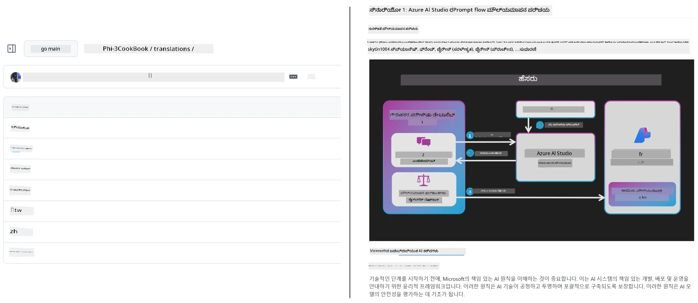
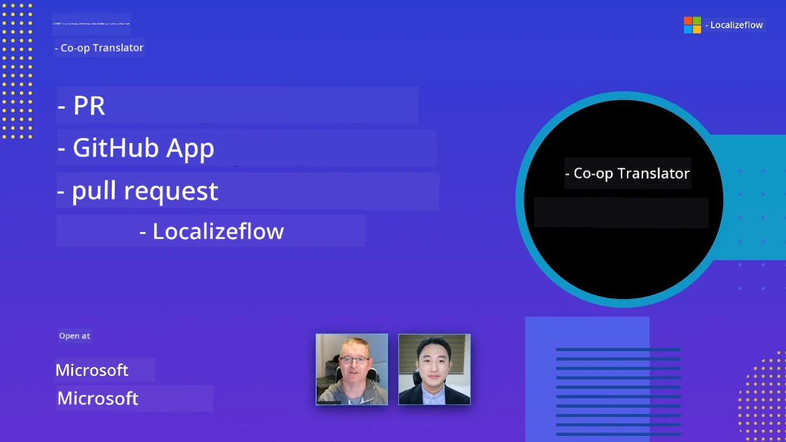

# Co-op Translator

_ನಿಮ್ಮ ಶಿಕ್ಷಣ GitHub ವಿಷಯದ ಅನುವಾದಗಳನ್ನು ಬಹುಭಾಷೆಗಳಲ್ಲಿ ಸುಲಭವಾಗಿ ಸ್ವಯಂಚಾಲಿತಗೊಳಿಸಿ ಮತ್ತು ನಿರ್ವಹಿಸಿ, ನಿಮ್ಮ ಪ್ರಾಜೆಕ್ಟ್ ಬೆಳೆಯುತ್ತಿರುವಂತೆ._


[](https://pypi.org/project/co-op-translator/)
[](https://github.com/azure/co-op-translator/blob/main/LICENSE)
[](https://pepy.tech/project/co-op-translator)
[](https://pepy.tech/project/co-op-translator)
[](https://github.com/azure/co-op-translator/pkgs/container/co-op-translator)
[](https://github.com/psf/black)

[](https://GitHub.com/azure/co-op-translator/graphs/contributors/)
[](https://GitHub.com/azure/co-op-translator/issues/)
[](https://GitHub.com/azure/co-op-translator/pulls/)
[](http://makeapullrequest.com)

### 🌐 ಬಹುಭಾಷಾ ಬೆಂಬಲ

#### [Co-op Translator](https://github.com/Azure/Co-op-Translator) ಯಿಂದ ಬೆಂಬಲಿಸಲಾಗುತ್ತದೆ

<!-- CO-OP TRANSLATOR LANGUAGES TABLE START -->
[Arabic](../ar/README.md) | [Bengali](../bn/README.md) | [Bulgarian](../bg/README.md) | [Burmese (Myanmar)](../my/README.md) | [Chinese (Simplified)](../zh-CN/README.md) | [Chinese (Traditional, Hong Kong)](../zh-HK/README.md) | [Chinese (Traditional, Macau)](../zh-MO/README.md) | [Chinese (Traditional, Taiwan)](../zh-TW/README.md) | [Croatian](../hr/README.md) | [Czech](../cs/README.md) | [Danish](../da/README.md) | [Dutch](../nl/README.md) | [Estonian](../et/README.md) | [Finnish](../fi/README.md) | [French](../fr/README.md) | [German](../de/README.md) | [Greek](../el/README.md) | [Hebrew](../he/README.md) | [Hindi](../hi/README.md) | [Hungarian](../hu/README.md) | [Indonesian](../id/README.md) | [Italian](../it/README.md) | [Japanese](../ja/README.md) | [Kannada](./README.md) | [Khmer](../km/README.md) | [Korean](../ko/README.md) | [Lithuanian](../lt/README.md) | [Malay](../ms/README.md) | [Malayalam](../ml/README.md) | [Marathi](../mr/README.md) | [Nepali](../ne/README.md) | [Nigerian Pidgin](../pcm/README.md) | [Norwegian](../no/README.md) | [Persian (Farsi)](../fa/README.md) | [Polish](../pl/README.md) | [Portuguese (Brazil)](../pt-BR/README.md) | [Portuguese (Portugal)](../pt-PT/README.md) | [Punjabi (Gurmukhi)](../pa/README.md) | [Romanian](../ro/README.md) | [Russian](../ru/README.md) | [Serbian (Cyrillic)](../sr/README.md) | [Slovak](../sk/README.md) | [Slovenian](../sl/README.md) | [Spanish](../es/README.md) | [Swahili](../sw/README.md) | [Swedish](../sv/README.md) | [Tagalog (Filipino)](../tl/README.md) | [Tamil](../ta/README.md) | [Telugu](../te/README.md) | [Thai](../th/README.md) | [Turkish](../tr/README.md) | [Ukrainian](../uk/README.md) | [Urdu](../ur/README.md) | [Vietnamese](../vi/README.md)

> **ಸ್ಥಳೀಯ ಪ್ರತ್ಯೇಕಣಕ್ಕಾಗಿ ಇಚ್ಛಿಸುವಿರಾ?**
>
> ಈ ಭಂಡಾರವು 50+ ಭಾಷಾ ಅನುವಾದಗಳನ್ನು ಒಳಗೊಂಡಿದ್ದು ಡೌನ್ಲೋಡ್ ಗಾತ್ರವನ್ನು ಬಹಳಷ್ಟು ಹೆಚ್ಚಿಸುತ್ತದೆ. ಅನುವಾದಗಳಿಲ್ಲದೆ ಕ್ಲೋನ್ ಮಾಡಲು, sparse checkout ಬಳಸಿ:
>
> **Bash / macOS / Linux:**  
> ```bash
> git clone --filter=blob:none --sparse https://github.com/Azure/co-op-translator.git
> cd co-op-translator
> git sparse-checkout set --no-cone '/*' '!translations' '!translated_images'
> ```
>
> **CMD (Windows):**  
> ```cmd
> git clone --filter=blob:none --sparse https://github.com/Azure/co-op-translator.git
> cd co-op-translator
> git sparse-checkout set --no-cone "/*" "!translations" "!translated_images"
> ```
>
> ಇದರಿಂದ ನೀವು ವೇಗವಾಗಿ ಕೋರ್ಸ್ ಪೂರ್ಣಗೊಳಿಸಲು ಅಗತ್ಯವಿರುವ ಎಲ್ಲವನ್ನೂ ಪಡೆಯುತ್ತೀರಿ.
<!-- CO-OP TRANSLATOR LANGUAGES TABLE END -->

[](https://GitHub.com/azure/co-op-translator/watchers/)
[](https://GitHub.com/azure/co-op-translator/network/)
[](https://GitHub.com/azure/co-op-translator/stargazers/)

[](https://discord.gg/nTYy5BXMWG)

[](https://codespaces.new/azure/co-op-translator)

## ಅವಲೋಕನ

**Co-op Translator** ನಿಮ್ಮ ಶಿಕ್ಷಣ GitHub ವಿಷಯವನ್ನು ಬಹುಭಾಷೆಗಳಲ್ಲಿ ಸುಲಭವಾಗಿ ಸ್ಥಳೀಯೀಕರಿಸಲು ಸಹಾಯ ಮಾಡುತ್ತದೆ.  
ನೀವು Markdown ಫೈಲ್‌ಗಳು, ಚಿತ್ರಗಳು, ಅಥವಾ ನೋಟ್‌ಬುಕ್‌ಗಳನ್ನು ನವೀಕರಿಸಿದಾಗ, ಅನುವಾದಗಳು ಸ್ವಯಂಚಾಲಿತವಾಗಿ ಸಮನ್ವಯಗೊಂಡಿದ್ದು, ನಿಮ್ಮ ವಿಷಯವು ವಿಶ್ವವ್ಯಾಪಿ ಕಲಿಯುವವರಿಗಾಗಿ ನಿಖರ ಮತ್ತು ಹೊಸದಾಗಿದೆ ಎಂದು ಖಚಿತಪಡಿಸುತ್ತದೆ.

ಅನುವಾದಿತ ವಿಷಯವನ್ನು ಹೇಗೆ ಸುಘಟಿತವಾಗಿ ಜಾರಿಗೊಳ್ಳುತ್ತದೆ ಎಂಬ ಒಂದು ಉದಾಹರಣೆ:



## ಅನುವಾದ ಸ್ಥಿತಿಯನ್ನು ಹೇಗೆ ನಿರ್ವಹಿಸಲಾಗುತ್ತದೆ

Co-op Translator ಅನುವಾದಿತ ವಿಷಯವನ್ನು **ಸಂസ്കರಣ ಹೊಂದಿರುವ ಸಾಫ್ಟ್‌ವೇರ್ ಆರ್ಗೇಟಿಫ್ಯಾಕ್ಟ್‌ಗಳಾಗಿ** ನಿರ್ವಹಿಸುತ್ತದೆ,  
ಸ್ಥಿರ ಫೈಲ್‌ಗಳಾಗಿ ಅಲ್ಲ.

ಈ ಸಾಧನವು ಅನುವಾದಿತ Markdown, ಚಿತ್ರಗಳು ಮತ್ತು ನೋಟ್‌ಬುಕ್‌ಗಳ ಸ್ಥಿತಿಯನ್ನು  
**ಭಾಷಾ-ವ್ಯಾಪ್ತಿಮಿದ ಮೆಟಾಡೇಟಾ** ಬಳಸಿ ಟ್ರ್ಯಾಕ್ ಮಾಡುತ್ತದೆ.

ಈ ವಿನ್ಯಾಸವು Co-op Translatorಗೆ ಅನುಮತಿಸುತ್ತದೆ:

- ಹಳೆಯ ಅನುವರ್ತನೆಗಳನ್ನು ವಿಶ್ವಾಸಾರ್ಹವಾಗಿ ಪತ್ತೆಮಾಡಲು  
- Markdown, ಚಿತ್ರಗಳು ಮತ್ತು ನೋಟ್‌ಬುಕ್‌ಗಳನ್ನು ಸಮ್ಮಿಲಿತವಾಗಿ ಜೋಡಿಸಲು  
- ದೊಡ್ಡ, ವೇಗವಾಗಿ ಚಲಿಸುವ, ಬಹುಭಾಷಾ ಸಂಗ್ರಹಣೆಗಳಲ್ಲಿ ಸುರಕ್ಷಿತವಾಗಿ ವಿಸ್ತರಿಸಲು

ಅನುವಾದಗಳನ್ನು ನಿರ್ವಹಿತ ಆರ್ಗೇಟಿಫ್ಯಾಕ್ಟ್‌ಗಳಾಗಿ ಮಾದರೀಕರಿಸುವ ಮೂಲಕ,  
ಅನುವಾದ ಕಾರ್ಯವಾಹಿಕೆಗಳು ನೈಜವಾಗಿ ಆಧುನಿಕ  
ಸಾಫ್ಟ್‌ವೇರ್ ನಿರ ಭರತನ ಮತ್ತು ಆರ್ಗೇಟಿಫ್ಯಾಕ್ಟ್ ನಿರ್ವಹಣೆಯ  
ಪದ್ಧತಿಗಳೊಂದಿಗೆ ಹೊಂದಿಕೆಯಾಗುತ್ತವೆ.

→ [ಅನುವಾದ ಸ್ಥಿತಿಯನ್ನು ಹೇಗೆ ನಿರ್ವಹಿಸಲಾಗುತ್ತದೆ](https://techcommunity.microsoft.com/blog/azuredevcommunityblog/rethinking-documentation-translation-treating-translations-as-versioned-software/4491755)


## ತ್ವರಿತ ಪ್ರಾರಂಭ

```bash
# ವರ್ಚುಯಲ್ ಪರಿಸರವನ್ನು ಸೃಷ್ಟಿಸಿ ಮತ್ತು ಸಕ್ರಿಯಗೊಳಿಸಿ (ಶಿಫಾರಸು ಮಾಡಲಾಗಿದೆ)
python -m venv .venv
# ವಿಂಡೋಸ್
.venv\Scripts\activate
# ಮ್ಯಾಕ್ಓಎಸ್/ಲಿನಕ್ಸ್ನಲ್ಲಿ
source .venv/bin/activate
# ಪ್ಯಾಕೇಜ್ ಅನ್ನು ಸ್ಥಾಪಿಸಿ
pip install co-op-translator
# ಅನುವಾದಿಸಿ
translate -l "ko ja fr" -md
```

Docker:

```bash
# GHCR ನಿಂದ ಸಾರ್ವಜನಿಕ ಚಿತ್ರವನ್ನು ಎಳೆದಿರಿ
docker pull ghcr.io/azure/co-op-translator:latest
# ನಡವಳಿಕೆಯಲ್ಲಿ ಪ್ರಸ್ತುತ ಫೋಲ್ಡರ್ ಅನ್ನು ಮಾಉಂಟ್ ಮಾಡಿಸಿ ಮತ್ತು .env ಅನ್ನು ಒದಗಿಸಿ (ಬ್ಯಾಶ್/ಝ್ಶ್)
docker run --rm -it --env-file .env -v "${PWD}:/work" ghcr.io/azure/co-op-translator:latest -l "ko ja fr" -md
```

## ಕನಿಷ್ಠ ಸ್ಥಾಪನೆ

1. ನೀವು ಬೆಂಬಲಿಸುವ Python ಆವೃತ್ತಿ (ಪ್ರಸ್ತುತ 3.10-3.12) ಹೊಂದಿದ್ದೀರಿ ಎಂದು ಖಚಿತಪಡಿಸಿಕೊಳ್ಳಿ. poetry (pyproject.toml) ನಲ್ಲಿ ಇದು ಸ್ವಯಂಚಾಲಿತವಾಗಿ ನಿರ್ವಹಿಸಲಾಗುತ್ತದೆ.  
2. ಟೆಂಪ್ಲೇಟ್ ಬಳಸಿಕೊಂಡು `.env` ಕಡತವನ್ನು ರಚಿಸಿ: [.env.template](../../.env.template)  
3. ಒಂದು LLM ಒದಗಿಸುವವರನ್ನು ಹೊಂದಿಸಿ (Azure OpenAI ಅಥವಾ OpenAI)  
4. (ಐಚ್ಛಿಕ) ಚಿತ್ರ ಅನುವಾದಕ್ಕಾಗಿ (`-img`), Azure AI Vision ಅನ್ನು ಹೊಂದಿಸಿ  
5. (ಐಚ್ಛಿಕ) ನೀವು ಬಹು ಕ್ರೆಡೆನ್ಷಿಯಲ್ ಸೆಟ್‌ಗಳನ್ನು ಘೋಷಿಸಿ, ಉದಾ. `_1`, `_2` ಎಂಬ ಸಫಿಕ್ಸು ಹೊಂದಿರುವ ಆವೃತ್ತಿಗಳನ್ನು ನಕಲಿಸಿ; ಎಲ್ಲವೇ ಇದೇ ಸುರಕ್ಷಿತ ಸೆಟ್‌ನಲ್ಲಿರಬೇಕು.  
6. (ಶಿಫಾರಸು) ಯಾವುದೇ ಹಿಂದಿನ ಅನುವಾದಗಳನ್ನು ಕ್ರಮವರ್ಧಕವಾಗಿಸಿಕೊಳ್ಳಿ (ಉದಾ. `translations/`)  
7. (ಶಿಫಾರಸು) ನಿಮ್ಮ README ನಲ್ಲಿ ಅನುವಾದ ವಿಭಾಗವನ್ನು ಸೇರಿಸಿ [README ಭಾಷೆಗಳ ಟೆಂಪ್ಲೇಟ್](./getting_started/README_languages_template.md) ಬಳಸಿ  
8. ನೋಡಿ: [Azure AI ಅನ್ನು ಹೊಂದಿಸಲು](./getting_started/set-up-azure-ai.md)

## ಉಪಯೋಗ

ಬೆಂಬಲಿತ ಎಲ್ಲಾ ಪ್ರಕಾರಗಳನ್ನು ಅನುವಾದಿಸಿ:

```bash
translate -l "ko ja"
```

ಮಾತ್ರ Markdown:

```bash
translate -l "de" -md
```

Markdown + ಚಿತ್ರಗಳು:

```bash
translate -l "pt" -md -img
```

ಮಾತ್ರ ನೋಟ್‌ಬುಕ್‌ಗಳು:

```bash
translate -l "zh" -nb
```

ಹೆಚ್ಚಿನ ಫ್ಲಾಗ್‌ಗಳು: [ಕಮಾಂಡ್ ರೆಫರೆನ್ಸ್](./getting_started/command-reference.md)

## ವೈಶಿಷ್ಟ್ಯಗಳು

- Markdown, ನೋಟ್‌ಬುಕ್ ಮತ್ತು ಚಿತ್ರಗಳಿಗಾಗಿ ಸ್ವಯಂಚಾಲಿತ ಅನುವಾದ  
- ಮೂಲ ಬದಲಾವಣೆಗಳೊಂದಿಗೆ ಅನುವಾದಗಳನ್ನು ಸಮನ್ವಯಗೊಳಿಸುತ್ತದೆ  
- ಸ್ಥಳೀಯವಾಗಿ (CLI) ಅಥವಾ CI (GitHub Actions) ನಲ್ಲಿ ಕಾರ್ಯನಿರ್ವಹಿಸುತ್ತದೆ  
- Azure OpenAI ಅಥವಾ OpenAI ಬಳಕೆ ಮಾಡುತ್ತದೆ; ಚಿತ್ರಗಳಿಗಾಗಿ ಐಚ್ಛಿಕವಾಗಿ Azure AI Vision  
- Markdown ರೂಪಕ ಮತ್ತು ರಚನೆಯನ್ನು ಸಂರಕ್ಷಿಸುತ್ತದೆ  

## ಡಾಕ್ಯುಮೆಂಟ್‌ಗಳು

- [ಕಮಾಂಡ್ ಲೈನ್ ಗೈಡ್](./getting_started/command-line-guide/command-line-guide.md)  
- [GitHub Actions ಗೈಡ್ (ಸಾರ್ವಜನಿಕ ಸಂಗ್ರಹಣೆಗಳು & ಸಾಮಾನ್ಯ ರಹಸ್ಯಗಳು)](./getting_started/github-actions-guide/github-actions-guide-public.md)  
- [GitHub Actions ಗೈಡ್ (Microsoft ಸಂಘಟನೆಯ ಸಂಗ್ರಹಣೆಗಳು & ಸಂಘಟನಾ-ಮಟ್ಟ ಸೆಟ್ಟಪ್)](./getting_started/github-actions-guide/github-actions-guide-org.md)  
- [README ಭಾಷೆಗಳ ಟೆಂಪ್ಲೇಟ್](./getting_started/README_languages_template.md)  
- [ಬೆಂಬಲಿತ ಭಾಷೆಗಳು](./getting_started/supported-languages.md)  
- [ಸೇರಿಸಲು](./CONTRIBUTING.md)  
- [ಸಮಸ್ಯೆಗಳು ಪರಿಹರಿಸುವುದು](./getting_started/troubleshooting.md)  

### Microsoft-ನಿರ್ದಿಷ್ಟ ಗೈಡ್  
> [!NOTE]  
> Microsoft “For Beginners” ಸಂಗ್ರಹಣೆಗಳ ನಿರ್ವಾಹಕರಿಗೆ ಮಾತ್ರ.

- [“ಮತ್ತೇನು ಕೋರ್ಸುಗಳು” ಪಟ್ಟಿಯನ್ನು ನವೀಕರಿಸುವುದು (MS Beginners ಸಂಗ್ರಹಣೆಗಳಿಗೆ ಮಾತ್ರ)](./getting_started/update-other-courses.md)

## ನಮ್ಮನ್ನು ಬೆಂಬಲಿಸಿ ಮತ್ತು ವಿಶ್ವಾದ್ಯಾಂತ ಶಿಕ್ಷಣವನ್ನು ಉತ್ತೇಜಿಸಿ

ಅಂತರಾಷ್ಟ್ರೀಯ ಮಟ್ಟದಲ್ಲಿ ಶಿಕ್ಷಣ ವಿಷಯವನ್ನು ಹಂಚುವಲ್ಲಿ ಹಳೆ ಪರಿಕಲ್ಪನೆಯನ್ನು ಕ್ರಾಂತಿಕಾರಿಯಾಗಿ ಬದಲಾಯಿಸುವ ಕಾರ್ಯದಲ್ಲಿ ನಮಗೆ ಸೇರಿ! [Co-op Translator](https://github.com/azure/co-op-translator) ಗೆ GitHub ನಲ್ಲಿ ⭐ ನೀಡಿ ಮತ್ತು ಭಾಷಾ ಅಡ್ಡಿಪಡಿತಗಳ ಅಡ್ಡಿ ಕಡಿತಗೊಳಿಸುವ ನಮ್ಮ ಗುರಿಗೆ ಬೆಂಬಲ ನೀಡಿ. ನಿಮ್ಮ ಆಸಕ್ತಿ ಮತ್ತು ಕೊಡುಗೆಗಳು ಮಹತ್ವಪೂರ್ಣ ಪರಿಣಾಮ ಬೀರುತ್ತವೆ! ಕೋಡ್ ಕೊಡುಗೆಗಳು ಮತ್ತು ವೈಶಿಷ್ಟ್ಯ ಸಲಹೆಗಳು ಸದಾ ಸ್ವಾಗತಾರ್ಹ.

### Microsoft ಶಿಕ್ಷಣ ವಿಷಯವನ್ನು ನಿಮ್ಮ ಭಾಷೆಯಲ್ಲಿ ಅನ್ವೇಷಿಸಿ

- [LangChain4j-for-Beginners](https://github.com/microsoft/LangChain4j-for-Beginners)  
- [AZD for Beginners](https://github.com/microsoft/AZD-for-beginners)  
- [Edge AI for Beginners](https://github.com/microsoft/edgeai-for-beginners)  
- [Model Context Protocol (MCP) For Beginners](https://github.com/microsoft/mcp-for-beginners)  
- [AI Agents for Beginners](https://github.com/microsoft/ai-agents-for-beginners)  
- [Generative AI for Beginners using .NET](https://github.com/microsoft/Generative-AI-for-beginners-dotnet)  
- [Generative AI for Beginners](https://github.com/microsoft/generative-ai-for-beginners)  
- [Generative AI for Beginners using Java](https://github.com/microsoft/generative-ai-for-beginners-java)  
- [ML for Beginners](https://aka.ms/ml-beginners)  
- [Data Science for Beginners](https://aka.ms/datascience-beginners)  
- [AI for Beginners](https://aka.ms/ai-beginners)  
- [Cybersecurity for Beginners](https://github.com/microsoft/Security-101)  
- [Web Dev for Beginners](https://aka.ms/webdev-beginners)  
- [IoT for Beginners](https://aka.ms/iot-beginners)  
- [PhiCookBook](https://github.com/microsoft/PhiCookBook)

## ವೀಡಿಯೊ ಪ್ರಸ್ತುತಗಳು

👉 ನೀವು YouTube ನಲ್ಲಿ ವೀಕ್ಷಿಸಲು ಕೆಳಗಿನ ಚಿತ್ರವನ್ನು ಕ್ಲಿಕ್ ಮಾಡಿ.

- **Microsoft ನಲ್ಲಿ ತೆರೆಯಿರಿ**: Co-op Translator ಅನ್ನು ಹೇಗೆ ಬಳಸುವುದು ಎಂಬ 18 ನಿಮಿಷಗಳ ಸಂಕ್ಷಿಪ್ತ ಪರಿಚಯ ಮತ್ತು ತ್ವರಿತ ಮಾರ್ಗದರ್ಶನ.

  [](https://www.youtube.com/watch?v=jX_swfH_KNU)

## ಕೊಡುಗೆ ನೀಡುವುದು

ಈ ಪ್ರಾಜೆಕ್ಟ್ ಕೊಡುಗೆ ಮತ್ತು ಸಲಹೆಗಳಿಗೆ ಸ್ವಾಗತ.  
Azure Co-op Translator ಗೆ ಕೊಡುಗೆ ನೀಡಲು ಆಸಕ್ತಿ ಇದ್ದರೆ, ದಯವಿಟ್ಟು ನಮ್ಮ [CONTRIBUTING.md](./CONTRIBUTING.md) ನೋಡಿ, Co-op Translator ಅನ್ನು ಇನ್ನಷ್ಟು ಸುಲಭವಾಗಿ ಮಾಡೋಣ.

## ಕೊಡುಗೆದಾರರು
[](https://github.com/Azure/co-op-translator/graphs/contributors)

## ವರ್ತನೆ ನೈತಿಕತೆ

ಈ ಯೋಜನೆ [Microsoft Open Source Code of Conduct](https://opensource.microsoft.com/codeofconduct/) ಅನ್ನು ಅಳವಡಿಸಿಕೊಂಡಿದೆ.
ಹೆಚ್ಚಿನ ಮಾಹಿತಿಗೆ [Code of Conduct FAQ](https://opensource.microsoft.com/codeofconduct/faq/) ನೋಡಿ ಅಥವಾ
ಯಾವುದೇ ಹೆಚ್ಚುವರಿ ಪ್ರಶ್ನೆಗಳಿಗೆ ಅಥವಾ ಟಿಪ್ಪಣಿಗಳಿಗಾಗಿ [opencode@microsoft.com](mailto:opencode@microsoft.com) ಅನ್ನು ಸಂಪರ್ಕಿಸಿ.

## ಜವಾಬ್ದಾರಿಯುತ AI

Microsoft ನಮ್ಮ ಗ್ರಾಹಕರು ನಮ್ಮ AI ಉತ್ಪನ್ನಗಳನ್ನು ಜವಾಬ್ದಾರಿಯಾಗಿ ಬಳಸಲು ಸಹಾಯ ಮಾಡಲು, ನಮ್ಮ ಕಲಿಕೆಗಳನ್ನು ಹಂಚಿಕೊಳ್ಳಲು ಮತ್ತು Transparency Notes ಮತ್ತು Impact Assessments ಮುಂತಾದ ಸಾಧನಗಳ ಮೂಲಕ ನಂಬಿಕೆಯನ್ನು ಅವಲಂಬಿಸಿರುವ ಸಹಭಾಗಿತ್ವಗಳನ್ನು ನಿರ್ಮಿಸಲು ಬದ್ಧವಾಗಿದೆ. ಈ ಸಂಪನ್ಮೂಲಗಳ ಬಹುತೇಕವು [https://aka.ms/RAI](https://aka.ms/RAI) ನಲ್ಲಿ ಲಭ್ಯವಿವೆ.
Responsible AIಗೆ Microsoft ನ ದೃಷ್ಟಿಕೋಣ ನಮ್ಮ AI ತತ್ವಗಳು — ನ್ಯಾಯತೆ, ನಂಬಿಕೆ ಮತ್ತು ಸುರಕ್ಷತೆ, ಗೌಪ್ಯತೆ ಮತ್ತು ಭದ್ರತೆ, ಎಲ್ಲರೊಂದಿಗೆ ಜೊತೆಗೆ, ಪಾರದರ್ಶಕತೆ ಮತ್ತು ಜವಾಬ್ದಾರಿತ್ವ — ಅವಲಂಬಿಸಿದೆ.

ಈ ಉದಾಹರಣೆಯಲ್ಲಿ ಬಳಸಲಾದಂತಹ ಮಹತ್ವದ ಸ್ವಾಭಾವಿಕ ಭಾಷೆ, ಚಿತ್ರ ಮತ್ತು ಭಾಷಣ ಮಾದರಿಗಳು ಅನ್ಯಾಯಕರ, ನಂಬಿಸಲು ಅಸಾಧ್ಯವಾದ ಅಥವಾ ಅಪಮಾನಕಾರಿ ವರ್ತನೆಗಳನ್ನು ತೋರಿಸಬಹುದು, ಇದರಿಂದ ಹಾನಿ ಉಂಟಾಗಬಹುದು. ಅಪಾಯಗಳು ಮತ್ತು ಮಿತಿಗಳನ್ನು ತಿಳಿದುಕೊಳ್ಳಲು ದಯವಿಟ್ಟು [Azure OpenAI service Transparency note](https://learn.microsoft.com/legal/cognitive-services/openai/transparency-note?tabs=text) ಅನ್ನು ನೋಡಿ.

ಈ ಅಪಾಯಗಳನ್ನು ನಿವಾರಣೆಗೆ ಶಿಫಾರಸು ಮಾಡಲಾದ ವಿಧಾನವು ನಿಮ್ಮ वास्तುಕಲೆಗಳಲ್ಲಿ ಹಾನಿಕಾರಕ ವರ್ತನೆಯನ್ನು ಪತ್ತೆಹಚ್ಚಿ ತಡೆಯುವ ಸುರಕ್ಷತಾ ವ್ಯವಸ್ಥೆಯನ್ನು ಅಳವಡಿಸುವುದು. [Azure AI Content Safety](https://learn.microsoft.com/azure/ai-services/content-safety/overview) ಸ್ವತಂತ್ರ ರಕ್ಷಣಾ ಪದರವನ್ನು ಒದಗಿಸುತ್ತದೆ, ಇದು ಅಪ್ಲಿಕೇಶನ್ ಮತ್ತು ಸೇವೆಗಳಲ್ಲಿ ಹಾನಿಕಾರಕ ಬಳಕೆದಾರನುಂಟುಮಾಡಿದ ಮತ್ತು AI ರಚಿಸಿರುವ ವಿಷಯವನ್ನು ತೋರಿಸುತ್ತದೆ. Azure AI Content Safety ರಲ್ಲಿ ಹಾನಿಕಾರಕ ವಿಷಯವನ್ನು ಪತ್ತೆಹಚ್ಚಲು ಪಠ್ಯ ಮತ್ತು ಚಿತ್ರ API ಗಳು ಒಳಗೊಂಡಿವೆ. ನಾವು ಹಾನಿಕಾರಕ ವಿಷಯವನ್ನು ವಿವಿಧ ಮಾದರಿಗಳಲ್ಲಿ ಪತ್ತೆಹಚ್ಚಲು ಮಾದರಿ ಕೋಡ್ ಅನ್ನು ನೋಡಲು, ಅನ್ವೇಷಿಸಲು, ಮತ್ತು ಪ್ರಯೋಗಿಸುವುದಕ್ಕೆ Content Safety Studio ಅಂದಿನ ಇಂಟರಾಕ್ಟಿವ್ ಉಪಕರಣವನ್ನು ಹೊಂದಿದ್ದೇವೆ. ಈ ಕೆಳಗಿನ [ತ್ವರಿತ ಪ್ರಾರಂಭ ದಾಖಲೆ](https://learn.microsoft.com/azure/ai-services/content-safety/quickstart-text?tabs=visual-studio%2Clinux&pivots=programming-language-rest) ಸೇವೆಗೆ ವಿನಂತಿಗಳನ್ನು ಮಾಡುವುದನ್ನು ಮಾರ್ಗದರ್ಶನ ಮಾಡುತ್ತದೆ.

ಇನ್ನೊಂದು ಪರಿಯನ್ನು ಗಮನದಲ್ಲಿ ಇಡುವುದು ಸಮಗ್ರ ಅಪ್ಲಿಕೇಶನ್ ನಿರ್ವಹಣೆ. ಬಹ_MODAL ಮತ್ತು ಬಹು ಮಾದರಿ ಅಪ್ಲಿಕೇಶನ್ ಗಳಲ್ಲಿ, ನಿರ್ವಹಣೆ ಎಂದರೆ ನೀವು ಮತ್ತು ನಿಮ್ಮ ಬಳಕೆದಾರರು ನಿರೀಕ್ಷಿಸುವಂತೆ ವ್ಯವಸ್ಥೆ ಕಾರ್ಯನಿರ್ವಹಿಸುವುದು, ಹಾನಿಕಾರಕ ಉತ್ಪನ್ನಗಳನ್ನು ರಚಿಸುವುದನ್ನು ಒಳಗೊಂಡಿಲ್ಲ. ನಿಮ್ಮ ಸಮಗ್ರ ಅಪ್ಲಿಕೇಶನ್ ಕಾರ್ಯನಿರ್ವಹಣೆಯನ್ನು [generation quality and risk and safety metrics](https://learn.microsoft.com/azure/ai-studio/concepts/evaluation-metrics-built-in) ಬಳಸಿ ಅంచಿಕೆ ಹಾಕುವುದು ಮಹತ್ವಪೂರ್ಣ.

ನೀವು ನಿಮ್ಮ AI ಅಪ್ಲಿಕೇಶನ್ ಅನ್ನು ನಿಮ್ಮ ಅಭಿವೃದ್ಧಿ ಪರಿಸರದಲ್ಲಿ [prompt flow SDK](https://microsoft.github.io/promptflow/index.html) ಬಳಸಿ ಮೌಲ್ಯಮಾಪನ ಮಾಡಬಹುದು. ಪರೀಕ್ಷಾ ಡೇಟಾಸೆಟ್ ಅಥವಾ ಗುರಿಯನ್ನು ನೀಡಿದಾಗ, ನಿಮ್ಮ ಜನರೇಟಿವ್ AI ಆವೃತ್ತಿಗಳನ್ನು ನಿರ್ಮಿತ-ಮೌಲ್ಯಮಾಪಕಗಳು ಅಥವಾ ನಿಮ್ಮ ಆಯ್ದ ಕಸ್ಟಮ್ ಮೌಲ್ಯಮಾಪಕಗಳ ಮೂಲಕ ಗಣಿತೀಯವಾಗಿ ಅಳೆಯಲಾಗುತ್ತದೆ. ನಿಮ್ಮ ವ್ಯವಸ್ಥೆಯನ್ನು ಮೌಲ್ಯಮಾಪನ ಮಾಡಲು prompt flow sdk ಯೊಂದಿಗೆ ಪ್ರಾರಂಭಿಸಲು, ನೀವು [quickstart guide](https://learn.microsoft.com/azure/ai-studio/how-to/develop/flow-evaluate-sdk) ಅನುಸರಿಸಬಹುದು. ಮೌಲ್ಯಮಾಪನ ಓಟ ನಡೆಸಿದ ನಂತರ, ನೀವು [Azure AI Studio ನಲ್ಲಿ ಫಲಿತಾಂಶಗಳನ್ನು ದೃಶ್ಯಮಾಡಬಹುದು](https://learn.microsoft.com/azure/ai-studio/how-to/evaluate-flow-results).

## ಟ್ರೇಡ್ಮಾರ್ಕ್ ಗಳು

ಈ ಯೋಜನೆಯಲ್ಲಿ ಯೋಜನೆಗಳು, ಉತ್ಪನ್ನಗಳು ಅಥವಾ ಸೇವೆಗಳಿಗೆ ಸಂಬಂಧಿಸಿದ ಟ್ರೇಡ್ಮಾರ್ಕ್ ಗಳು ಅಥವಾ ಲೋಗೋಗಳು ಇರಬಹುದು. Microsoft ಟ್ರೇಡ್ಮಾರ್ಕ್ ಅಥವಾ ಲೋಗೋಗಳ ಅಧಿಕೃತ ಬಳಕೆ
ಮತ್ತು ಅನುಸರಿಸಬೇಕಾದುದು [Microsoft's Trademark & Brand Guidelines](https://www.microsoft.com/en-us/legal/intellectualproperty/trademarks/usage/general) ನ ನಿಯಮಗಳಿಗೆ ಸಮ್ಮತವಾಗಿದೆ.
Microsoft ಟ್ರೇಡ್ಮಾರ್ಕ್ ಅಥವಾ ಲೋಗೋಗಳನ್ನು ಈ ಯೋಜನೆಯ ಸುಧಾರಿತ ಆವೃತ್ತಿಗಳಲ್ಲಿ ಉಪಯೋಗಿಸುವುದರಿಂದ ಗೊಂದಲ ಉಂಟಾಗಕೂಡದು ಅಥವಾ Microsoft ಕೈಗಾರಿಕಾ ಸಹಕಾರವನ್ನು ಸೂಚಿಸುವಂತಿರಬಾರದು.
ಮೂಂದುಪಾತ್ರದ ತೃತೀಯ ಪಕ್ಷ ಟ್ರೇಡ್ಮಾರ್ಕ್ ಅಥವಾ ಲೋಗೋಗಳ ಬಳಕೆ ಅವುಗಳ ತೃತೀಯ ಪಕ್ಷದ ನೀತಿಗಳಿಗೆ ಒಳಪಡುವುದು.

## ಸಹಾಯ ಪಡೆಯಿರಿ

ನೀವು ಅಡಚಣೆಗೆ ಅಡಗಿದ್ದೀರಾ ಅಥವಾ AI ಅಪ್‌ಗಳಿಗೆ ಸಂಬಂಧಿಸಿದ ಪ್ರಶ್ನೆಗಳಿದ್ದರೆ, ಸೇರಿ:

[](https://discord.gg/nTYy5BXMWG)

ನೀವು ಉತ್ಪನ್ನ ಪ್ರತಿಕ್ರಿಯೆಗಳು ಅಥವಾ ನಿರ್ಮಾಣದ ವೇಳೆ ದೋಷಗಳನ್ನು ಹೊಂದಿದರೆ ಭೇಟಿ ನೀಡಿ:

[](https://aka.ms/foundry/forum)

---

<!-- CO-OP TRANSLATOR DISCLAIMER START -->
**ತಪ್ಪು ಸೂಚನೆ**:  
ಈ ದಾಖಲೆ AI ಅನುವಾದ ಸೇವೆ [Co-op Translator](https://github.com/Azure/co-op-translator) ಬಳಸಿ ಅನುವಾದಿಸಲಾಗಿದೆ. ನಾವು ಸರಿಯಾಗಿರುವುದಕ್ಕಾಗಿ ಪ್ರಯತ್ನಿಸುತ್ತಿದ್ದರೂ, ಸ್ವಯಂಚಾಲಿತ ಅನುವಾದಗಳಲ್ಲಿ ದೋಷಗಳು ಅಥವಾ ಅಸತ್ಯತೆಗಳು ಇರಬಹುದು ಎಂಬುದನ್ನು ದಯವಿಟ್ಟು ಗಮನಿಸಿ. ಮೂಲ ದಾಖಲೆ ಅದರ ಸ್ವದೇಶಿ ಭಾಷೆಯಲ್ಲಿ ಪ್ರಧಾನ ಮೂಲ ಎಂದು ಪರಿಗಣಿಸಬೇಕು. ಗಂಭೀರ ಮಾಹಿತಿಗಾಗಿ ವೃತ್ತಿಪರ ಮಾನವ ಅನುವಾದವನ್ನು ಶಿಫಾರಸು ಮಾಡಲಾಗುತ್ತದೆ. ಈ ಅನುವಾದದ ಬಳಕೆಯಿಂದ ಉಂಟಾಗುವ ಯಾವುದೇ ತಪ್ಪು ಅರ್ಥಮಾಡಿಕೊಳ್ಳಿಕೆಗಳು ಅಥವಾ ದೋಷ ವಿವರಣೆಗಳಿಗೆ ನಾವು ಹೊಣೆಗಾರರಲ್ಲ.
<!-- CO-OP TRANSLATOR DISCLAIMER END -->