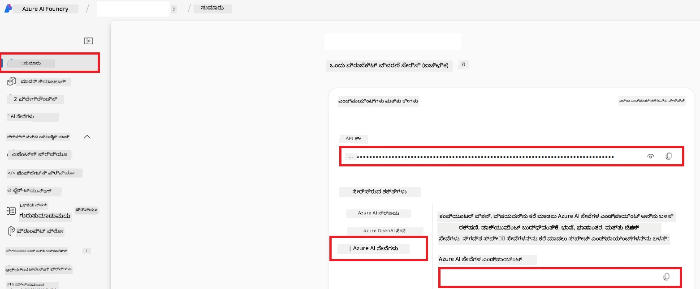

# Co-op Translator ಗಾಗಿ Azure AI ಸೆಟ್ ಅಪ್ ಮಾಡಿ (Azure OpneAI & Azure AI Vision)

ಈ ಮಾರ್ಗದರ್ಶನದಲ್ಲಿ ನಿಮ್ಮನ್ನು Azure AI Foundry ಒಳಗೆ ಭಾಷಾ ಅನುವಾದಕ್ಕಾಗಿ Azure OpenAI ಮತ್ತು ಚಿತ್ರ ಕಂಟೆಂಟ್ ವಿಶ್ಲೇಷಣೆಗೆ (ಯಾವುದನ್ನು ನಂತರ ಚಿತ್ರ ಆಧಾರಿತ ಅನುವಾದಕ್ಕಾಗಿ ಬಳಸಬಹುದು) Azure Computer Vision ಅನ್ನು ಸೆಟ್ ಅಪ್ ಮಾಡುವ ಪ್ರಕ್ರಿಯೆ ಮೂಲಕ ಭೇಟಿ ಮಾಡಿಸಲಾಗುತ್ತದೆ.

**ಆವಶ್ಯಕತೆಗಳು:**
- ಸಕ್ರಿಯ ಚಂದಾದಾರಿಕೆಯೊಂದಿಗೆ ಒಂದು Azure ಖಾತೆ.
- ನಿಮ್ಮ Azure ಚಂದಾದಾರಿಕೆಯಲ್ಲಿ ಸಂಪನ್ಮೂಲಗಳು ಮತ್ತು ನಿಯೋಜನಗಳು ರಚಿಸುವ ಆತ್ಮೀಯತೆಗಳು.

## Azure AI ಯೋಜನೆಯನ್ನು ರಚಿಸಿ

ನೀವು Azure AI ಸಂಪನ್ಮೂಲಗಳನ್ನು ನಿರ್ವಹಿಸಲು ಮಧ್ಯವರ್ತಿ ಸ್ಥಾನವಾಗಿದೆ ಎಂದು ಕಾರ್ಯನಿರ್ವಹಿಸುವ Azure AI ಯೋಜನೆಯನ್ನು ರಚಿಸುವುದರಿಂದ ಪ್ರಾರಂಭಿಸುತ್ತೀರಿ.

1. [https://ai.azure.com](https://ai.azure.com) ಗೆ ಭೇಟಿ ನೀಡಿ ಮತ್ತು ನಿಮ್ಮ Azure ಖಾತೆಯಿಂದ ಸೈನ್ ಇನ್ ಆಗಿ.

1. ಹೊಸ ಯೋಜನೆಯನ್ನು ರಚಿಸಲು **+Create** ಆಯ್ಕೆಮಾಡಿ.

1. ಕೆಳಗಿನ ಕಾರ್ಯಗಳನ್ನು ನೆರವೇರಿಸಿ:
   - **Project name** ನಮೂದಿಸಿ (ಉದಾಹರಣೆಗೆ, `CoopTranslator-Project`).
   - **AI hub** ಆಯ್ಕೆಮಾಡಿ (ಉದಾಹರಣೆಗೆ, `CoopTranslator-Hub`) (ಬೇಕಾದರೆ ಹೊಸದನ್ನು ರಚಿಸಿ).

1. ನಿಮ್ಮ ಯೋಜನೆಯನ್ನು ಸೆಟ್ ಅಪ್ ಮಾಡಲು "**Review and Create**" ಕ್ಲಿಕ್ ಮಾಡಿ. ಆಯಾ ಯೋಜನೆಯ ಅವಲೋಕನ ಪುಟಕ್ಕೆ ತೆಗೆದುಕೊಂಡು ಹೋಗಲಾಗುತ್ತದೆ.

## ಭಾಷಾ ಅನುವಾದಕ್ಕಾಗಿ Azure OpenAI ಸೆಟ್ ಮಾಡಿ

ನಿಮ್ಮ ಯೋಜನೆಯೊಳಗೆ, ಪಠ್ಯ ಅನುವಾದಕ್ಕಾಗಿ ಬ್ಯಾಕೆಂಡ್ ಆಗಿ ಸೇವೆ ನೀಡಲು Azure OpenAI ಮಾದರಿಗೆ ನಿಯೋಜನೆ ಮಾಡಲಾಗುತ್ತದೆ.

### ನಿಮ್ಮ ಯೋಜನಿಗೆ ಹೋಗಿ

ನೀವು ಈಗಾಗಲೇ ಅಲ್ಲಿಲಾ ಇದ್ದರೆ, ನಿಮ್ಮ ಹೊಸ ರಚಿಸಿದ ಯೋಜನೆ (ಉದಾ., `CoopTranslator-Project`) ಅನ್ನು Azure AI Foundry ಒಳಗೆ ತೆರೆಯಿರಿ.

### OpenAI ಮಾದರಿಯನ್ನು ನಿಯೋಜಿಸಿ

1. ನಿಮ್ಮ ಯೋಜನೆಯ ಎಡಹಸ್ತ ಮೆನುನಲ್ಲಿ, "My assets" ಅಡಿಯಲ್ಲಿ "**Models + endpoints**" ಆಯ್ಕೆಮಾಡಿ.

1. **+ Deploy model** ಆಯ್ಕೆಮಾಡಿ.

1. **Deploy Base Model** ಆಯ್ಕೆಮಾಡಿ.

1. ಲಭ್ಯವಿರುವ ಮಾದರಿಗಳ ಪಟ್ಟಿಯನ್ನು ಪ್ರದರ್ಶಿಸಲಾಗುತ್ತದೆ. ಸೂಕ್ತವಾದ GPT ಮಾದರಿಗಾಗಿ ಫಲ್ಟರ್ ಅಥವಾ ಹುಡುಕಿ. ನಾವು `gpt-4o` ಅನ್ನು ಶಿಫಾರಸು ಮಾಡುತ್ತೇವೆ.

1. ನಿರ್ದಿಷ್ಟ ಮಾದರಿಯನ್ನು ಆಯ್ಕೆಮಾಡಿ ಮತ್ತು **Confirm** ಕ್ಲಿಕ್ ಮಾಡಿ.

1. **Deploy** ಆಯ್ಕೆಮಾಡಿ.

### Azure OpenAI ಸಂರಚನೆ

ನಿಯೋಜಿತದ ನಂತರ, "**Models + endpoints**" ಪುಟದಿಂದ ನೀವು ನಿಯೋಜನೆಯನ್ನು ಆಯ್ಕೆಮಾಡಿ ಅದರ **REST endpoint URL**, **Key**, **Deployment name**, **Model name** ಮತ್ತು **API version** ಅನ್ನು ಕಂಡುಹಿಡಿಯಬಹುದು. ಈ ಮಾಹಿತಿಗಳು ನಿಮ್ಮ ಅಪ್ಲಿಕೇಶನ್‌ಗೆ ಅನುವಾದ ಮಾದರಿಯನ್ನು ಸಂಯೋಜಿಸಲು ಅಗತ್ಯ.

> [!NOTE]
> ನೀವು ನಿಮ್ಮ ಅಗತ್ಯಗಳಿಗೆ ಅನುಗುಣವಾಗಿ [API version deprecation](https://learn.microsoft.com/azure/ai-services/openai/api-version-deprecation) ಪುಟದಿಂದ API ಆವೃತ್ತಿಗಳನ್ನು ಆಯ್ಕೆಮಾಡಬಹುದು. ಗಮನಿಸಿ **API version** Azure AI Foundryಯಲ್ಲಿ "**Models + endpoints**" ಪುಟದಲ್ಲಿನ **Model version**ಗೆ ಭಿನ್ನವಾಗಿದೆ.

## ಚಿತ್ರ ಅನುವಾದಕ್ಕಾಗಿ Azure Computer Vision ಸೆಟ್ ಮಾಡಿ

ಚಿತ್ರಗಳಲ್ಲಿ ಪಠ್ಯವನ್ನು ಅನುವಾದಿಸಲು, ನೀವು Azure AI Service API ಕೀ ಮತ್ತು ಎಂಡ್ಪಾಯಿಂಟ್ ಅನ್ನು ಕಂಡುಹಿಡಿಯಬೇಕು.

1. ನಿಮ್ಮ Azure AI ಯೋಜನೆಗೆ ಭೇಟಿ ನೀಡಿ (ಉದಾ., `CoopTranslator-Project`). ನೀವು ಯೋಜನೆ ಅವಲೋಕನ ಪುಟದಲ್ಲಿದ್ದೀರಾ ಎಂದು ಖಚಿತಪಡಿಸಿಕೊಳ್ಳಿ.

### Azure AI Service ಸಂರಚನೆ

Azure AI Service ನಿಂದ API ಕೀ ಮತ್ತು ಎಂಡ್ಪಾಯಿಂಟ್ ಅನ್ನು ಕಂಡುಹಿಡಿಯಿರಿ.

1. ನಿಮ್ಮ Azure AI ಯೋಜನೆಗೆ ಭೇಟಿ ನೀಡಿ (ಉದಾ., `CoopTranslator-Project`). ನೀವು ಯೋಜನೆ ಅವಲೋಕನ ಪುಟದಲ್ಲಿದ್ದೀರಾ ಎಂದು ಖಚಿತಪಡಿಸಿಕೊಳ್ಳಿ.

1. Azure AI Service ಟ್ಯಾಬ್‌ನಿಂದ **API Key** ಮತ್ತು **Endpoint** ಅನ್ನು ಕಂಡುಹಿಡಿಯಿರಿ.

    

ಈ ಸಂಪರ್ಕವು ಲಿಂಕ್ ಮಾಡಲಾದ Azure AI Services ಸಂಪನ್ಮೂಲಗಳ ಸಾಮರ್ಥ್ಯಗಳನ್ನು (ಚಿತ್ರ ವಿಶ್ಲೇಷಣೆಯ ಸಹಿತ) ನಿಮ್ಮ AI Foundry ಯೋಜನೆಗೆ ಲಭ್ಯವಾಗಿಸಲು ಮಾಡುತ್ತದೆ. ನೀವು ನಂತರ ನಿಮ್ಮ ನೋಟುಬುಕ್‌ಗಳು ಅಥವಾ ಅಪ್ಲಿಕೇಶನ್‌ಗಳಲ್ಲಿ ಈ ಸಂಪರ್ಕವನ್ನು ಬಳಸಿಕೊಂಡು ಚಿತ್ರಗಳಿಂದ ಪಠ್ಯವನ್ನು ಪಡೆದುಕೊಳ್ಳಬಹುದು ಮತ್ತು ನಂತರ ಅದನ್ನು Azure OpenAI ಮಾದರಿಗೂ ಅನುವಾದಕ್ಕಾಗಿ ಕಳುಹಿಸಬಹುದು.

## ನಿಮ್ಮ ಪ್ರಮಾಣಪತ್ರಗಳನ್ನು ಸಮಗ್ರಗೊಳಿಸುವುದು

ಈಗಾಗಲೇ ನೀವು ಕೆಳಗಿನ ಮಾಹಿತಿಗಳನ್ನು ಸಂಗ್ರಹಿಸಿದ್ದಾರೆ ಎಂದು ನಿರೀಕ್ಷಿಸಲಾಗುತ್ತದೆ:

**Azure OpenAI (ಪಠ್ಯ ಅನುವಾದ)ಗಾಗಿ:**
- Azure OpenAI ಎಂಡ್ಪಾಯಿಂಟ್
- Azure OpenAI API ಕೀ
- Azure OpenAI ಮಾದರಿಯ ಹೆಸರು (ಉದಾ., `gpt-4o`)
- Azure OpenAI ನಿಯೋಜನೆ ಹೆಸರು (ಉದಾ., `cooptranslator-gpt4o`)
- Azure OpenAI API ಆವೃತ್ತಿ

**Azure AI ಸೇವೆಗಳು (VISION ಮೂಲಕ ಚಿತ್ರ ಪಠ್ಯ ನಿರ್ಗಮನ)ಗಾಗಿ:**
- Azure AI ಸೇವೆ ಎಂಡ್ಪಾಯಿಂಟ್
- Azure AI ಸೇವೆ API ಕೀ

### ಉದಾಹರಣೆ: ವಾತಾವರಣ ಪರಿಭಾಷಾ ಸಂರಚನೆ (ಪೂರ್ವ ವೀಕ್ಷಣೆ)

ನಂತರ, ನಿಮ್ಮ ಅಪ್ಲಿಕೇಶನ್ ನಿರ್ಮಿಸುವಾಗ, ನೀವು ಸಂಗ್ರಹಿಸಿದ ಈ ಪ್ರಮಾಣಪತ್ರಗಳೊಂದಿಗೆ ಅದನ್ನು ವಾತಾವರಣ ಪರಿವರ್ತಕಗಳಾಗಿ ಸಂರಚಿಸುವ ಸಾಧ್ಯತೆ ಇದೆ, ಉದಾಹರಣೆಗೆ:

```bash
# ಆಜ್ಯೂರ್ AI ಸೇವೆ ಕ್ರೆಡೆನ್ಶಿಯಲ್ಸ್ (ಚಿತ್ರ ಅನುವಾದಕ್ಕಾಗಿ ಅವಶ್ಯಕ)
AZURE_AI_SERVICE_API_KEY="your_azure_ai_service_api_key" # ಉದಾಹರಣೆಗೆ, 21xasd...
AZURE_AI_SERVICE_ENDPOINT="https://your_azure_ai_service_endpoint.cognitiveservices.azure.com/"

# ಐಚ್ಛಿಕ ವ್ಯತೀರಿಕ ಸೆಟ್‌ಗಳು: ಪರ್ಯಾಯ ವೆರಿಯಬಲ್‌ಗಳಿಗೆ _1/_2 ಉಪಸರ್ಗವುಳ್ಳ ನಕಲಿ (ಸಮಸ್ಯೆಲ್ಲಾ ವ್ಯರೀಯಬಲ್‌ಗಳಿಗೆ ಒಂದೇ ಸಂಕೇತ)
AZURE_AI_SERVICE_API_KEY_1="your_azure_ai_service_api_key_1"
AZURE_AI_SERVICE_ENDPOINT_1="https://your_azure_ai_service_endpoint_1.cognitiveservices.azure.com/"

# ಆಜ್ಯೂರ್ ಓಪನ್‌ಎಐ ಕ್ರೆಡೆನ್ಶಿಯಲ್ಸ್ (ಪಠ್ಯ ಅನುವಾದಕ್ಕಾಗಿ ಅವಶ್ಯಕ)
AZURE_OPENAI_API_KEY="your_azure_openai_api_key" # ಉದಾಹರಣೆಗೆ, 21xasd...
AZURE_OPENAI_ENDPOINT="https://your_azure_openai_endpoint.openai.azure.com/"
AZURE_OPENAI_MODEL_NAME="your_model_name" # ಉದಾಹರಣೆಗೆ, gpt-4o
AZURE_OPENAI_CHAT_DEPLOYMENT_NAME="your_deployment_name" # ಉದಾಹರಣೆಗೆ, cooptranslator-gpt4o
AZURE_OPENAI_API_VERSION="your_api_version" # ಉದಾಹರಣೆಗೆ, 2024-12-01-preview

# ಐಚ್ಛಿಕ ವ್ಯತೀರಿಕ ಸೆಟ್‌ಗಳು: ಸಂಪೂರ್ಣ AZURE_OPENAI_* ಸೆಟ್ ಅನ್ನು _1/_2 ಉಪಸರ್ಗದೊಂದಿಗೆ ನಕಲಿಸಿ (ಎಲ್ಲಾ ವ್ಯರೀಯಬಲ್‌ಗಳಿಗೆ ಒಂದೇ ಸಂಕೇತ)
```

---

### ಮುಂದಿನ ಓದು

- [Azure AI Foundryನಲ್ಲಿ ಯೋಜನೆ ರಚಿಸುವ ವಿಧಾನ](https://learn.microsoft.com/azure/ai-foundry/how-to/create-projects?tabs=ai-studio)
- [Azure AI ಸಂಪನ್ಮೂಲಗಳನ್ನು ರಚಿಸುವ ವಿಧಾನ](https://learn.microsoft.com/azure/ai-foundry/how-to/create-azure-ai-resource?tabs=portal)
- [Azure AI Foundryನಲ್ಲಿ OpenAI ಮಾದರಿಗಳನ್ನು ನಿಯೋಜಿಸುವ ವಿಧಾನ](https://learn.microsoft.com/en-us/azure/ai-foundry/how-to/deploy-models-openai)

---

<!-- CO-OP TRANSLATOR DISCLAIMER START -->
**ಬದುಕುಮಾಡುವಿಕೆ**:  
ಈ ದಾಖಲೆಯನ್ನು AI ಭಾಷಾಂತರ ಸೇವೆ [Co-op Translator](https://github.com/Azure/co-op-translator) ಬಳಸಿಕೊಂಡು ಭಾಷಾಂತರಿಸಲಾಗಿದೆ. ನಾವು ಸರಿಯಾಗಿ ಭಾಷಾಂತರಿಸಲು ಪ್ರಯತ್ನಿಸುವಾಗ, ಸ್ವಯಂಚಾಲಿತ ಭಾಷಾಂತರಗಳಲ್ಲಿ ದೋಷಗಳು ಅಥವಾ ತಪ್ಪುಗಳು ಇರಬಹುದು ಎಂದು ದಯವಿಟ್ಟು ಗಮನಿಸಿರಿ. ಮೂಲ ಭಾಷೆಯ ದಾಖಲೆ ಅಧಿಕೃತ ಮೂಲವಾಗಿರುತ್ತದೆ ಎಂದು ಪರಿಗಣಿಸಬೇಕು. ಪ್ರಮುಖ ಮಾಹಿತಿಗೆ, ವೃತ್ತಿಪರ ಮಾನವ ಭಾಷಾಂತರವನ್ನು ಶಿಫಾರಸು ಮಾಡಲಾಗಿದೆ. ಈ ಭಾಷಾಂತರ ಬಳಕೆಯಿಂದ ಉಂಟಾಗುವ误ಸಮಧಾನಗಳು ಅಥವಾ ತಪ್ಪು ಅರ್ಥಮಾಡಿಕೊಳ್ಳುವಿಕೆಗೆ ನಾವು ಜವಾಬ್ದಾರರಾಗುವುದಿಲ್ಲ.
<!-- CO-OP TRANSLATOR DISCLAIMER END -->