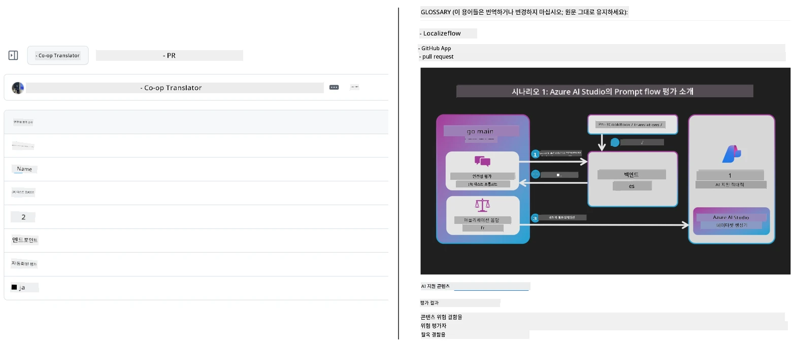
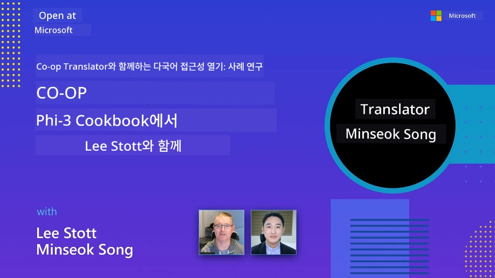

# Co-op Translator

_프로젝트가 발전함에 따라 교육용 GitHub 콘텐츠의 번역을 여러 언어로 쉽게 자동화하고 유지하세요._


[](https://pypi.org/project/co-op-translator/)
[](https://github.com/azure/co-op-translator/blob/main/LICENSE)
[](https://pepy.tech/project/co-op-translator)
[](https://pepy.tech/project/co-op-translator)
[](https://github.com/azure/co-op-translator/pkgs/container/co-op-translator)
[](https://github.com/psf/black)

[](https://GitHub.com/azure/co-op-translator/graphs/contributors/)
[](https://GitHub.com/azure/co-op-translator/issues/)
[](https://GitHub.com/azure/co-op-translator/pulls/)
[](http://makeapullrequest.com)

### 🌐 다국어 지원

#### [Co-op Translator](https://github.com/Azure/Co-op-Translator)의 지원 대상 언어

<!-- CO-OP TRANSLATOR LANGUAGES TABLE START -->
[아랍어](../ar/README.md) | [벵골어](../bn/README.md) | [불가리아어](../bg/README.md) | [버마어 (미얀마)](../my/README.md) | [중국어 (간체)](../zh-CN/README.md) | [중국어 (번체, 홍콩)](../zh-HK/README.md) | [중국어 (번체, 마카오)](../zh-MO/README.md) | [중국어 (번체, 대만)](../zh-TW/README.md) | [크로아티아어](../hr/README.md) | [체코어](../cs/README.md) | [덴마크어](../da/README.md) | [네덜란드어](../nl/README.md) | [에스토니아어](../et/README.md) | [핀란드어](../fi/README.md) | [프랑스어](../fr/README.md) | [독일어](../de/README.md) | [그리스어](../el/README.md) | [히브리어](../he/README.md) | [힌디어](../hi/README.md) | [헝가리어](../hu/README.md) | [인도네시아어](../id/README.md) | [이탈리아어](../it/README.md) | [일본어](../ja/README.md) | [칸나다어](../kn/README.md) | [크메르어](../km/README.md) | [한국어](./README.md) | [리투아니아어](../lt/README.md) | [말레이어](../ms/README.md) | [말라얄람어](../ml/README.md) | [마라티어](../mr/README.md) | [네팔어](../ne/README.md) | [나이지리아 피진](../pcm/README.md) | [노르웨이어](../no/README.md) | [페르시아어 (파르시)](../fa/README.md) | [폴란드어](../pl/README.md) | [포르투갈어 (브라질)](../pt-BR/README.md) | [포르투갈어 (포르투갈)](../pt-PT/README.md) | [펀자브어 (구르무키)](../pa/README.md) | [루마니아어](../ro/README.md) | [러시아어](../ru/README.md) | [세르비아어 (키릴릭)](../sr/README.md) | [슬로바키아어](../sk/README.md) | [슬로베니아어](../sl/README.md) | [스페인어](../es/README.md) | [스와힐리어](../sw/README.md) | [스웨덴어](../sv/README.md) | [타갈로그어 (필리핀어)](../tl/README.md) | [타밀어](../ta/README.md) | [텔루구어](../te/README.md) | [태국어](../th/README.md) | [터키어](../tr/README.md) | [우크라이나어](../uk/README.md) | [우르두어](../ur/README.md) | [베트남어](../vi/README.md)

> **로컬에서 클론하기 선호하시나요?**
>
> 이 저장소에는 50개 이상의 언어 번역본이 포함되어 있어 다운로드 크기가 크게 증가합니다. 번역 없이 클론하려면 sparse checkout을 사용하세요:
>
> **Bash / macOS / Linux:**
> ```bash
> git clone --filter=blob:none --sparse https://github.com/skytin1004/co-op-translator.git
> cd co-op-translator
> git sparse-checkout set --no-cone '/*' '!translations' '!translated_images'
> ```
>
> **CMD (Windows):**
> ```cmd
> git clone --filter=blob:none --sparse https://github.com/skytin1004/co-op-translator.git
> cd co-op-translator
> git sparse-checkout set --no-cone "/*" "!translations" "!translated_images"
> ```
>
> 이 방법으로 과정 완료에 필요한 모든 파일을 훨씬 빠른 다운로드 속도로 얻을 수 있습니다.
<!-- CO-OP TRANSLATOR LANGUAGES TABLE END -->

[](https://GitHub.com/azure/co-op-translator/watchers/)
[](https://GitHub.com/azure/co-op-translator/network/)
[](https://GitHub.com/azure/co-op-translator/stargazers/)

[](https://discord.gg/nTYy5BXMWG)

[](https://codespaces.new/azure/co-op-translator)

## 개요

<strong>Co-op Translator</strong>는 교육용 GitHub 콘텐츠를 여러 언어로 손쉽게 현지화할 수 있도록 도와줍니다.  
Markdown 파일, 이미지 또는 노트북을 업데이트하면 번역이 자동으로 동기화되어, 전 세계 학습자들에게 정확하고 최신의 콘텐츠를 제공합니다.

번역된 콘텐츠가 어떻게 구성되는지 예시:



## 번역 상태 관리 방식

Co-op Translator는 번역된 콘텐츠를 <strong>버전 관리된 소프트웨어 아티팩트</strong>로 관리하며,  
단순 정적 파일로 다루지 않습니다.

이 도구는 <strong>언어 범위별 메타데이터</strong>를 활용하여 번역된 Markdown, 이미지, 노트북의 상태를 추적합니다.

이 설계 덕분에 Co-op Translator는 다음을 수행할 수 있습니다:

- 오래된 번역을 안정적으로 감지
- Markdown, 이미지, 노트북을 일관되게 처리
- 대규모 다언어 저장소에서도 안전하게 확장 가능

번역을 관리되는 아티팩트로 모델링함으로써,  
번역 작업 흐름이 최신 소프트웨어 의존성 및 아티팩트 관리 관행과 자연스럽게 맞춰집니다.

→ [번역 상태 관리 방식 자세히 보기](https://techcommunity.microsoft.com/blog/azuredevcommunityblog/rethinking-documentation-translation-treating-translations-as-versioned-software/4491755)


## 빠른 시작

```bash
# 가상 환경 생성 및 활성화 (권장)
python -m venv .venv
# 윈도우
.venv\Scripts\activate
# macOS/Linux
source .venv/bin/activate
# 패키지 설치
pip install co-op-translator
# 번역하기
translate -l "ko ja fr" -md
```

Docker:

```bash
# GHCR에서 공개 이미지를 가져옵니다
docker pull ghcr.io/azure/co-op-translator:latest
# 현재 폴더를 마운트하고 .env를 제공하여 실행합니다 (Bash/Zsh)
docker run --rm -it --env-file .env -v "${PWD}:/work" ghcr.io/azure/co-op-translator:latest -l "ko ja fr" -md
```

## 최소 설정

1. 지원되는 Python 버전(현재 3.10-3.12)이 설치되어 있는지 확인합니다. poetry(pyproject.toml)에서는 자동으로 관리됩니다.
2. 템플릿 파일 [.env.template](../../.env.template)을 사용하여 `.env` 파일을 만듭니다.
3. LLM 공급자 하나(Azure OpenAI 또는 OpenAI)를 설정합니다.
4. (선택 사항) 이미지 번역(`-img`)을 위해 Azure AI Vision을 설정합니다.
5. (선택 사항) `_1`, `_2` 등 접미사를 붙여 여러 자격 증명 세트를 복제해 구성할 수 있습니다. 한 세트 내 모든 변수는 동일한 접미사를 가져야 합니다.
6. (권장) 충돌 방지를 위해 이전 번역(`translations/`)을 정리합니다.
7. (권장) [README 언어 템플릿](./getting_started/README_languages_template.md)을 사용해 README에 번역 섹션을 추가합니다.
8. 자세한 내용은: [Azure AI 설정](./getting_started/set-up-azure-ai.md) 참조

## 사용법

지원되는 모든 유형 번역:

```bash
translate -l "ko ja"
```

Markdown만:

```bash
translate -l "de" -md
```

Markdown + 이미지:

```bash
translate -l "pt" -md -img
```

노트북만:

```bash
translate -l "zh" -nb
```

더 많은 플래그는: [명령 참고](./getting_started/command-reference.md)

## 기능

- Markdown, 노트북, 이미지 자동 번역
- 원본 변경과 번역 자동 동기화 유지
- 로컬(CLI) 또는 CI(GitHub Actions) 환경에서 동작
- Azure OpenAI 또는 OpenAI 사용, 이미지에 대해서는 선택적 Azure AI Vision 적용
- Markdown의 포맷과 구조 보존

## 문서

- [커맨드라인 가이드](./getting_started/command-line-guide/command-line-guide.md)
- [GitHub Actions 가이드 (공개 저장소 및 표준 시크릿 환경)](./getting_started/github-actions-guide/github-actions-guide-public.md)
- [GitHub Actions 가이드 (Microsoft 조직 저장소 및 조직 수준 설정)](./getting_started/github-actions-guide/github-actions-guide-org.md)
- [README 언어 템플릿](./getting_started/README_languages_template.md)
- [지원 언어](./getting_started/supported-languages.md)
- [기여 안내](./CONTRIBUTING.md)
- [문제 해결](./getting_started/troubleshooting.md)

### Microsoft 전용 가이드
> [!NOTE]
> Microsoft “For Beginners” 저장소 유지 관리자 전용입니다.

- [“다른 과정” 목록 업데이트 (Microsoft Beginners 저장소 전용)](./getting_started/update-other-courses.md)

## 후원 및 글로벌 학습 촉진

교육용 콘텐츠 공유 방식을 혁신하는 여정에 동참하세요!  
Co-op Translator에 GitHub에서 ⭐를 눌러 주시고, 학습 및 기술의 언어 장벽을 허무는 우리의 사명을 응원해 주세요. 여러분의 관심과 기여가 큰 변화를 만듭니다! 코드 기여와 기능 제안은 언제나 환영합니다.

### 언어별 Microsoft 교육 콘텐츠 탐색

- [LangChain4j-for-Beginners](https://github.com/microsoft/LangChain4j-for-Beginners)
- [AZD for Beginners](https://github.com/microsoft/AZD-for-beginners)
- [Edge AI for Beginners](https://github.com/microsoft/edgeai-for-beginners)
- [Model Context Protocol (MCP) For Beginners](https://github.com/microsoft/mcp-for-beginners)
- [AI Agents for Beginners](https://github.com/microsoft/ai-agents-for-beginners)
- [Generative AI for Beginners using .NET](https://github.com/microsoft/Generative-AI-for-beginners-dotnet)
- [Generative AI for Beginners](https://github.com/microsoft/generative-ai-for-beginners)
- [Generative AI for Beginners using Java](https://github.com/microsoft/generative-ai-for-beginners-java)
- [ML for Beginners](https://aka.ms/ml-beginners)
- [Data Science for Beginners](https://aka.ms/datascience-beginners)
- [AI for Beginners](https://aka.ms/ai-beginners)
- [Cybersecurity for Beginners](https://github.com/microsoft/Security-101)
- [Web Dev for Beginners](https://aka.ms/webdev-beginners)
- [IoT for Beginners](https://aka.ms/iot-beginners)
- [PhiCookBook](https://github.com/microsoft/PhiCookBook)

## 영상 발표

👉 아래 이미지를 클릭하여 YouTube에서 시청하세요.

- **Open at Microsoft**: Co-op Translator의 간략한 18분 소개 및 빠른 가이드.

  [](https://www.youtube.com/watch?v=jX_swfH_KNU)

## 기여하기

이 프로젝트는 기여와 제안을 환영합니다. Azure Co-op Translator에 기여하고 싶으신가요? 기여 방법 안내는 [CONTRIBUTING.md](./CONTRIBUTING.md)에서 확인할 수 있습니다.

## 기여자
[](https://github.com/Azure/co-op-translator/graphs/contributors)

## 행동 강령

이 프로젝트는 [Microsoft 오픈 소스 행동 강령](https://opensource.microsoft.com/codeofconduct/)을 채택하고 있습니다.
더 자세한 내용은 [행동 강령 FAQ](https://opensource.microsoft.com/codeofconduct/faq/)를 참조하거나,
추가 질문이나 의견이 있을 경우 [opencode@microsoft.com](mailto:opencode@microsoft.com)으로 문의하십시오.

## 책임 있는 AI

마이크로소프트는 고객들이 AI 제품을 책임감 있게 사용할 수 있도록 지원하고, 학습 결과를 공유하며, Transparency Notes 및 Impact Assessments와 같은 도구를 통해 신뢰 기반의 파트너십을 구축하는 데 전념하고 있습니다. 이러한 자료들 중 다수는 [https://aka.ms/RAI](https://aka.ms/RAI)에서 확인할 수 있습니다.
마이크로소프트의 책임 있는 AI 접근법은 공정성, 신뢰성 및 안전성, 개인정보 보호 및 보안, 포용성, 투명성, 책임이라는 AI 원칙에 기반하고 있습니다.

이 샘플에서 사용된 것과 같은 대규모 자연어, 이미지, 음성 모델은 부당하거나 신뢰할 수 없거나 불쾌한 방식으로 작동할 수 있으며, 이로 인해 피해가 발생할 수 있습니다. 위험 및 제한 사항에 대해 알기 위해 [Azure OpenAI 서비스 투명성 노트](https://learn.microsoft.com/legal/cognitive-services/openai/transparency-note?tabs=text)를 참조하시기 바랍니다.

이러한 위험을 완화하는 권장 방법은 아키텍처 내에 유해한 행위를 감지하고 방지할 수 있는 안전 시스템을 포함하는 것입니다. [Azure AI Content Safety](https://learn.microsoft.com/azure/ai-services/content-safety/overview)는 애플리케이션과 서비스에서 사용자 생성 및 AI 생성 유해 콘텐츠를 감지할 수 있는 독립적인 보호 계층을 제공합니다. Azure AI Content Safety는 유해한 자료를 감지할 수 있는 텍스트 및 이미지 API를 포함합니다. 또한 다양한 모달리티에서 유해한 콘텐츠를 감지하는 샘플 코드를 탐색하고 시도할 수 있는 대화형 콘텐츠 안전 스튜디오도 제공됩니다. 다음 [빠른 시작 문서](https://learn.microsoft.com/azure/ai-services/content-safety/quickstart-text?tabs=visual-studio%2Clinux&pivots=programming-language-rest)는 서비스에 요청을 보내는 방법을 안내합니다.

또 다른 고려 사항은 전체 애플리케이션 성능입니다. 멀티모달 및 멀티모델 애플리케이션에서는 시스템이 사용자 기대에 부응하는 성능, 즉 유해한 출력을 생성하지 않는 것을 포함하여 성능을 의미합니다. [생성 품질 및 위험 및 안전 지표](https://learn.microsoft.com/azure/ai-studio/concepts/evaluation-metrics-built-in)를 사용하여 전체 애플리케이션의 성능을 평가하는 것이 중요합니다.

[프롬프트 플로우 SDK](https://microsoft.github.io/promptflow/index.html)를 사용하여 개발 환경에서 AI 애플리케이션을 평가할 수 있습니다. 테스트 데이터 세트나 목표가 주어지면, 생성 AI 애플리케이션 생성 결과를 내장 평가자 또는 원하는 맞춤 평가자로 정량적 측정합니다. 시스템 평가를 위한 prompt flow sdk를 시작하려면 [빠른 시작 가이드](https://learn.microsoft.com/azure/ai-studio/how-to/develop/flow-evaluate-sdk)를 따라 하시면 됩니다. 평가 실행을 완료하면 [Azure AI Studio에서 결과를 시각화](https://learn.microsoft.com/azure/ai-studio/how-to/evaluate-flow-results)할 수 있습니다.

## 상표

이 프로젝트에는 프로젝트, 제품 또는 서비스에 대한 상표 또는 로고가 포함될 수 있습니다. 마이크로소프트 상표 또는 로고의 공식 사용은 [Microsoft 상표 및 브랜드 가이드라인](https://www.microsoft.com/en-us/legal/intellectualproperty/trademarks/usage/general)을 준수해야 합니다.
이 프로젝트의 수정된 버전에서 마이크로소프트 상표 또는 로고를 사용할 경우 혼동을 일으키거나 마이크로소프트의 후원을 암시해서는 안 됩니다.
제3자 상표 또는 로고 사용은 해당 제3자의 정책을 따릅니다.

## 도움 받기

AI 앱 개발 중 문제가 발생하거나 질문이 있다면 다음에 참여하세요:

[](https://discord.gg/nTYy5BXMWG)

제품 관련 피드백이나 오류 관련 사항은 다음을 방문하세요:

[](https://aka.ms/foundry/forum)

---

<!-- CO-OP TRANSLATOR DISCLAIMER START -->
**면책 조항**:  
이 문서는 AI 번역 서비스 [Co-op Translator](https://github.com/Azure/co-op-translator)를 사용하여 번역되었습니다. 정확성을 위해 노력하고 있으나, 자동 번역에는 오류나 부정확성이 포함될 수 있음을 유의하시기 바랍니다. 원문은 해당 언어로 된 원문 문서가 권위 있는 출처로 간주되어야 합니다. 중요한 정보의 경우 전문 인간 번역을 권장합니다. 이 번역의 사용으로 인해 발생하는 오해나 오역에 대해 당사는 책임을 지지 않습니다.
<!-- CO-OP TRANSLATOR DISCLAIMER END -->