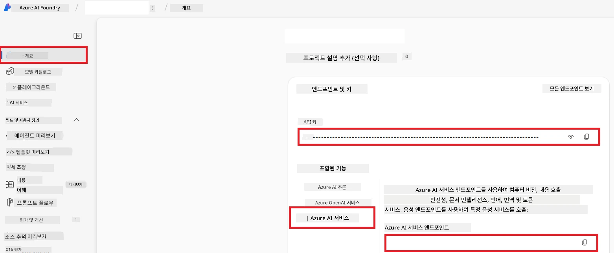

# Co-op Translator용 Azure AI 설정 (Azure OpneAI & Azure AI Vision)

이 안내서는 Azure AI Foundry 내에서 언어 번역을 위한 Azure OpenAI와 이미지 기반 번역에 사용할 수 있는 이미지 콘텐츠 분석을 위한 Azure Computer Vision 설정 과정을 안내합니다.

**사전 요구 사항:**
- 활성 구독이 연결된 Azure 계정.
- Azure 구독에서 리소스 및 배포를 생성할 수 있는 충분한 권한.

## Azure AI 프로젝트 생성

AI 리소스를 중앙에서 관리할 수 있는 Azure AI 프로젝트를 먼저 생성합니다.

1. [https://ai.azure.com](https://ai.azure.com)로 이동하여 Azure 계정으로 로그인합니다.

1. <strong>+Create</strong>를 선택하여 새 프로젝트를 생성합니다.

1. 다음 작업을 수행합니다:
   - **프로젝트 이름** 입력 (예: `CoopTranslator-Project`).
   - **AI hub** 선택 (예: `CoopTranslator-Hub`) (필요 시 새로 만듭니다).

1. "**Review and Create**"를 클릭하여 프로젝트를 설정합니다. 프로젝트 개요 페이지로 이동합니다.

## 언어 번역용 Azure OpenAI 설정

프로젝트 내에서 Azure OpenAI 모델을 배포하여 텍스트 번역 백엔드로 사용합니다.

### 프로젝트로 이동

아직 열지 않았다면 Azure AI Foundry에서 새로 만든 프로젝트(예: `CoopTranslator-Project`)를 엽니다.

### OpenAI 모델 배포

1. 프로젝트 좌측 메뉴의 "My assets" 아래에서 "**Models + endpoints**"를 선택합니다.

1. <strong>+ Deploy model</strong>을 선택합니다.

1. <strong>Deploy Base Model</strong>을 선택합니다.

1. 사용 가능한 모델 목록이 표시됩니다. 적절한 GPT 모델을 필터링하거나 검색합니다. `gpt-4o`를 권장합니다.

1. 원하는 모델을 선택하고 <strong>Confirm</strong>을 클릭합니다.

1. <strong>Deploy</strong>를 선택합니다.

### Azure OpenAI 구성

배포 후 "**Models + endpoints**" 페이지에서 배포를 선택하면 **REST endpoint URL**, **Key**, **Deployment name**, **Model name**, <strong>API version</strong>을 확인할 수 있습니다. 이는 번역 모델을 애플리케이션에 통합할 때 필요합니다.

> [!NOTE]
> 필요에 따라 [API version deprecation](https://learn.microsoft.com/azure/ai-services/openai/api-version-deprecation) 페이지에서 API 버전을 선택할 수 있습니다. Azure AI Foundry의 "**Models + endpoints**" 페이지에 표시된 <strong>API 버전</strong>은 <strong>모델 버전</strong>과 다르다는 점에 유의하세요.

## 이미지 번역용 Azure Computer Vision 설정

이미지 내 텍스트 번역을 활성화하려면 Azure AI Service API Key와 Endpoint를 찾아야 합니다.

1. Azure AI 프로젝트(예: `CoopTranslator-Project`)로 이동합니다. 프로젝트 개요 페이지에 있는지 확인하세요.

### Azure AI 서비스 구성

Azure AI 서비스에서 API Key와 Endpoint를 찾습니다.

1. Azure AI 프로젝트(예: `CoopTranslator-Project`)로 이동합니다. 프로젝트 개요 페이지에 있는지 확인하세요.

1. Azure AI Service 탭에서 <strong>API Key</strong>와 <strong>Endpoint</strong>를 찾습니다.

    

이 연결을 통해 연결된 Azure AI Services 리소스(이미지 분석 포함)의 기능을 AI Foundry 프로젝트에서 사용할 수 있습니다. 이후 노트북 또는 애플리케이션에서 이 연결을 사용해 이미지에서 텍스트를 추출하고, 추출된 텍스트는 Azure OpenAI 모델로 전송되어 번역에 활용할 수 있습니다.

## 자격 증명 정리

이제 다음 정보를 확보했을 것입니다:

**Azure OpenAI (텍스트 번역용):**
- Azure OpenAI Endpoint
- Azure OpenAI API Key
- Azure OpenAI 모델 이름 (예: `gpt-4o`)
- Azure OpenAI 배포 이름 (예: `cooptranslator-gpt4o`)
- Azure OpenAI API 버전

**Azure AI Services (Vision 기반 이미지 텍스트 추출용):**
- Azure AI Service Endpoint
- Azure AI Service API Key

### 예시: 환경 변수 구성 (미리보기)

이후 애플리케이션을 구축할 때 수집한 자격 증명으로 다음과 같이 환경 변수를 설정하여 구성할 가능성이 높습니다:

```bash
# Azure AI 서비스 자격 증명 (이미지 번역에 필요함)
AZURE_AI_SERVICE_API_KEY="your_azure_ai_service_api_key" # 예: 21xasd...
AZURE_AI_SERVICE_ENDPOINT="https://your_azure_ai_service_endpoint.cognitiveservices.azure.com/"

# 선택적 대체 세트: 접미사 _1/_2가 붙은 중복 변수들 (세트 내 모든 변수에 동일한 인덱스)
AZURE_AI_SERVICE_API_KEY_1="your_azure_ai_service_api_key_1"
AZURE_AI_SERVICE_ENDPOINT_1="https://your_azure_ai_service_endpoint_1.cognitiveservices.azure.com/"

# Azure OpenAI 자격 증명 (텍스트 번역에 필요함)
AZURE_OPENAI_API_KEY="your_azure_openai_api_key" # 예: 21xasd...
AZURE_OPENAI_ENDPOINT="https://your_azure_openai_endpoint.openai.azure.com/"
AZURE_OPENAI_MODEL_NAME="your_model_name" # 예: gpt-4o
AZURE_OPENAI_CHAT_DEPLOYMENT_NAME="your_deployment_name" # 예: cooptranslator-gpt4o
AZURE_OPENAI_API_VERSION="your_api_version" # 예: 2024-12-01-preview

# 선택적 대체 세트: 접미사 _1/_2가 붙은 전체 AZURE_OPENAI_* 세트 복제 (모든 변수에 동일한 인덱스)
```

---

### 추가 자료

- [Azure AI Foundry에서 프로젝트 생성하는 방법](https://learn.microsoft.com/azure/ai-foundry/how-to/create-projects?tabs=ai-studio)
- [Azure AI 리소스 생성하는 방법](https://learn.microsoft.com/azure/ai-foundry/how-to/create-azure-ai-resource?tabs=portal)
- [Azure AI Foundry에서 OpenAI 모델 배포하는 방법](https://learn.microsoft.com/en-us/azure/ai-foundry/how-to/deploy-models-openai)

---

<!-- CO-OP TRANSLATOR DISCLAIMER START -->
**면책 조항**:  
이 문서는 AI 번역 서비스 [Co-op Translator](https://github.com/Azure/co-op-translator)를 사용하여 번역되었습니다. 정확성을 위해 최선을 다하고 있으나, 자동 번역에는 오류나 부정확한 내용이 포함될 수 있음을 유의하시기 바랍니다. 원문 문서는 해당 원어로 된 문서가 권위 있는 출처로 간주되어야 합니다. 중요한 정보에 대해서는 전문적인 인간 번역을 권장합니다. 이 번역본 사용으로 인해 발생하는 오해나 오용에 대해 당사는 책임을 지지 않습니다.
<!-- CO-OP TRANSLATOR DISCLAIMER END -->