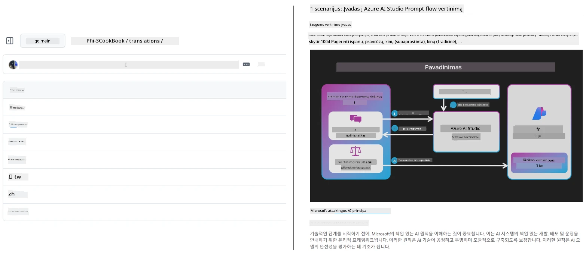
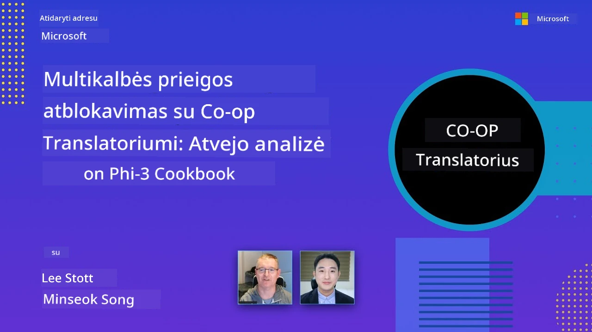

# Co-op Translator

_Lengvai automatizuokite ir palaikykite savo švietimo GitHub turinio vertimus keliomis kalbomis, kai jūsų projektas vystosi._


[](https://pypi.org/project/co-op-translator/)
[](https://github.com/azure/co-op-translator/blob/main/LICENSE)
[](https://pepy.tech/project/co-op-translator)
[](https://pepy.tech/project/co-op-translator)
[](https://github.com/azure/co-op-translator/pkgs/container/co-op-translator)
[](https://github.com/psf/black)

[](https://GitHub.com/azure/co-op-translator/graphs/contributors/)
[](https://GitHub.com/azure/co-op-translator/issues/)
[](https://GitHub.com/azure/co-op-translator/pulls/)
[](http://makeapullrequest.com)

### 🌐 Daugia kalbų palaikymas

#### Palaikoma naudojant [Co-op Translator](https://github.com/Azure/Co-op-Translator)

<!-- CO-OP TRANSLATOR LANGUAGES TABLE START -->
[Arabic](../ar/README.md) | [Bengali](../bn/README.md) | [Bulgarian](../bg/README.md) | [Burmese (Myanmar)](../my/README.md) | [Chinese (Simplified)](../zh-CN/README.md) | [Chinese (Traditional, Hong Kong)](../zh-HK/README.md) | [Chinese (Traditional, Macau)](../zh-MO/README.md) | [Chinese (Traditional, Taiwan)](../zh-TW/README.md) | [Croatian](../hr/README.md) | [Czech](../cs/README.md) | [Danish](../da/README.md) | [Dutch](../nl/README.md) | [Estonian](../et/README.md) | [Finnish](../fi/README.md) | [French](../fr/README.md) | [German](../de/README.md) | [Greek](../el/README.md) | [Hebrew](../he/README.md) | [Hindi](../hi/README.md) | [Hungarian](../hu/README.md) | [Indonesian](../id/README.md) | [Italian](../it/README.md) | [Japanese](../ja/README.md) | [Kannada](../kn/README.md) | [Khmer](../km/README.md) | [Korean](../ko/README.md) | [Lithuanian](./README.md) | [Malay](../ms/README.md) | [Malayalam](../ml/README.md) | [Marathi](../mr/README.md) | [Nepali](../ne/README.md) | [Nigerian Pidgin](../pcm/README.md) | [Norwegian](../no/README.md) | [Persian (Farsi)](../fa/README.md) | [Polish](../pl/README.md) | [Portuguese (Brazil)](../pt-BR/README.md) | [Portuguese (Portugal)](../pt-PT/README.md) | [Punjabi (Gurmukhi)](../pa/README.md) | [Romanian](../ro/README.md) | [Russian](../ru/README.md) | [Serbian (Cyrillic)](../sr/README.md) | [Slovak](../sk/README.md) | [Slovenian](../sl/README.md) | [Spanish](../es/README.md) | [Swahili](../sw/README.md) | [Swedish](../sv/README.md) | [Tagalog (Filipino)](../tl/README.md) | [Tamil](../ta/README.md) | [Telugu](../te/README.md) | [Thai](../th/README.md) | [Turkish](../tr/README.md) | [Ukrainian](../uk/README.md) | [Urdu](../ur/README.md) | [Vietnamese](../vi/README.md)

> **Norite klonuoti lokaliai?**
>
> Šiame saugykloje yra daugiau nei 50 kalbų vertimų, kurie ženkliai padidina atsisiuntimo dydį. Norėdami klonuoti be vertimų, naudokite sparse checkout:
>
> **Bash / macOS / Linux:**
> ```bash
> git clone --filter=blob:none --sparse https://github.com/Azure/co-op-translator.git
> cd co-op-translator
> git sparse-checkout set --no-cone '/*' '!translations' '!translated_images'
> ```
>
> **CMD (Windows):**
> ```cmd
> git clone --filter=blob:none --sparse https://github.com/Azure/co-op-translator.git
> cd co-op-translator
> git sparse-checkout set --no-cone "/*" "!translations" "!translated_images"
> ```
>
> Tai suteikia jums viską, ko reikia kursui užbaigti, daug greičiau atsisiunčiant.
<!-- CO-OP TRANSLATOR LANGUAGES TABLE END -->

[](https://GitHub.com/azure/co-op-translator/watchers/)
[](https://GitHub.com/azure/co-op-translator/network/)
[](https://GitHub.com/azure/co-op-translator/stargazers/)

[](https://discord.gg/nTYy5BXMWG)

[](https://codespaces.new/azure/co-op-translator)

## Apžvalga

**Co-op Translator** padeda jums lengvai lokalizuoti savo edukacinį GitHub turinį keliomis kalbomis.
Atnaujinant Markdown failus, vaizdus ar užrašų knygeles, vertimai automatiškai sinchronizuojami, užtikrinant, kad jūsų turinys liktų tikslus ir atnaujintas mokiniams visame pasaulyje.

Kaip organizuojamas išverstas turinys:



## Kaip valdomos vertimo būsenos

Co-op Translator valdo išverstą turinį kaip **versijuotus programinės įrangos artefaktus**,  
o ne kaip statinius failus.

Įrankis seka išverstų Markdown, vaizdų ir užrašų būklę
naudodamas **kalbai priskirtą metaduomenų informaciją**.

Šis dizainas leidžia Co-op Translator:

- Patikimai aptikti pasenusius vertimus
- Nuosekliai tvarkyti Markdown, vaizdus ir užrašų knygeles
- Saugiai skalėti didelėse, sparčiai besivystančiose, daugiakalbėse saugyklose

Modeliuodamas vertimus kaip valdomus artefaktus,
vertimo darbo eiga natūraliai dera su moderniais
programinės įrangos priklausomybių ir artefaktų valdymo principais.

→ [Kaip valdomos vertimo būsenos](https://techcommunity.microsoft.com/blog/azuredevcommunityblog/rethinking-documentation-translation-treating-translations-as-versioned-software/4491755)


## Greitas startas

```bash
# Sukurkite ir suaktyvinkite virtualią aplinką (rekomenduojama)
python -m venv .venv
# Windows
.venv\Scripts\activate
# macOS/Linux
source .venv/bin/activate
# Įdiekite paketą
pip install co-op-translator
# Išversti
translate -l "ko ja fr" -md
```

Docker:

```bash
# Atsisiųskite viešą atvaizdą iš GHCR
docker pull ghcr.io/azure/co-op-translator:latest
# Paleiskite su prijungtu dabartiniu katalogu ir pateiktu .env (Bash/Zsh)
docker run --rm -it --env-file .env -v "${PWD}:/work" ghcr.io/azure/co-op-translator:latest -l "ko ja fr" -md
```

## Minimalus nustatymas

1. Patikrinkite, ar turite palaikomą Python versiją (šiuo metu 3.10-3.12). Poetry (pyproject.toml) tai automatiškai valdo.
2. Sukurkite `.env` failą naudodami šabloną: [.env.template](../../.env.template)
3. Konfigūruokite vieną LLM tiekėją (Azure OpenAI arba OpenAI)
4. (Pasirinktinai) Vaizdų vertimui (`-img`), sukonfigūruokite Azure AI Vision
5. (Pasirinktinai) Galite sukonfigūruoti kelis kredencialų rinkinius kopijuodami kintamuosius su priesagomis kaip `_1`, `_2` ir t.t. Visi kintamieji viename rinkinyje turi turėti tą pačią priesagą.
6. (Rekomenduojama) Išvalykite ankstesnius vertimus konfliktų išvengimui (pvz., `translations/`)
7. (Rekomenduojama) Pridėkite vertimų skyrių į savo README naudodami [README kalbų šabloną](./getting_started/README_languages_template.md)
8. Žr.: [Nustatyti Azure AI](./getting_started/set-up-azure-ai.md)

## Naudojimas

Versti visus palaikomus tipus:

```bash
translate -l "ko ja"
```

Tik Markdown:

```bash
translate -l "de" -md
```

Markdown + vaizdai:

```bash
translate -l "pt" -md -img
```

Tik užrašų knygelės:

```bash
translate -l "zh" -nb
```

Daugiau parinkčių: [Komandų nuoroda](./getting_started/command-reference.md)

## Funkcijos

- Automatizuotas vertimas Markdown, užrašų knygelių ir vaizdų
- Laiko vertimus sinchronizuotus su šaltiniu
- Veikia lokaliai (CLI) arba CI (GitHub Actions)
- Naudoja Azure OpenAI arba OpenAI; pasirenkama Azure AI Vision vaizdams 
- Išsaugo Markdown formatavimą ir struktūrą

## Dokumentacija

- [Komandų eilutės vadovas](./getting_started/command-line-guide/command-line-guide.md)
- [GitHub Actions vadovas (Viešos saugyklos ir standartiniai slaptieji raktai)](./getting_started/github-actions-guide/github-actions-guide-public.md)
- [GitHub Actions vadovas (Microsoft organizacijos saugyklos ir organizacijos lygio nustatymai)](./getting_started/github-actions-guide/github-actions-guide-org.md)
- [README kalbų šablonas](./getting_started/README_languages_template.md)
- [Palaikomos kalbos](./getting_started/supported-languages.md)
- [Prisidėti](./CONTRIBUTING.md)
- [Trikčių šalinimas](./getting_started/troubleshooting.md)

### Microsoft specifinis vadovas
> [!NOTE]
> Tik Microsoft „For Beginners“ saugyklų prižiūrėtojams.

- [„Kiti kursai“ sąrašo atnaujinimas (tik MS Beginners saugykloms)](./getting_started/update-other-courses.md)

## Palaikykite mus ir skatinkite pasaulinį mokymąsi

Prisijunkite prie mūsų revoliucionuojant, kaip švietimo turinys dalijamasi visame pasaulyje! Duokite [Co-op Translator](https://github.com/azure/co-op-translator) ⭐ GitHub platformoje ir palaikykite mūsų misiją įveikti kalbų barjerus mokyme ir technologijose. Jūsų susidomėjimas ir indėlis daro didelį poveikį! Kodo indėliai ir funkcijų pasiūlymai visuomet laukiami.

### Atraskite Microsoft švietimo turinį savo kalba

- [LangChain4j-for-Beginners](https://github.com/microsoft/LangChain4j-for-Beginners)
- [AZD for Beginners](https://github.com/microsoft/AZD-for-beginners)
- [Edge AI for Beginners](https://github.com/microsoft/edgeai-for-beginners)
- [Model Context Protocol (MCP) For Beginners](https://github.com/microsoft/mcp-for-beginners)
- [AI Agents for Beginners](https://github.com/microsoft/ai-agents-for-beginners)
- [Generative AI for Beginners using .NET](https://github.com/microsoft/Generative-AI-for-beginners-dotnet)
- [Generative AI for Beginners](https://github.com/microsoft/generative-ai-for-beginners)
- [Generative AI for Beginners using Java](https://github.com/microsoft/generative-ai-for-beginners-java)
- [ML for Beginners](https://aka.ms/ml-beginners)
- [Data Science for Beginners](https://aka.ms/datascience-beginners)
- [AI for Beginners](https://aka.ms/ai-beginners)
- [Cybersecurity for Beginners](https://github.com/microsoft/Security-101)
- [Web Dev for Beginners](https://aka.ms/webdev-beginners)
- [IoT for Beginners](https://aka.ms/iot-beginners)
- [PhiCookBook](https://github.com/microsoft/PhiCookBook)

## Vaizdo pristatymai

👉 Spauskite žemiau esantį paveikslėlį, kad žiūrėtumėte YouTube.

- **Open at Microsoft**: Trumpas 18 minučių įvadas ir greitas vadovas, kaip naudoti Co-op Translator.

  [](https://www.youtube.com/watch?v=jX_swfH_KNU)

## Prisidėjimas

Šis projektas kviečia teikti indėlius ir pasiūlymus. Domitės prisidėti prie Azure Co-op Translator? Prašome peržiūrėti mūsų [CONTRIBUTING.md](./CONTRIBUTING.md), kad sužinotumėte, kaip galite padėti padaryti Co-op Translator prieinamesnį.

## Dalyviai
[](https://github.com/Azure/co-op-translator/graphs/contributors)

## Elgesio kodeksas

Šis projektas priėmė [Microsoft viešojo kodo elgesio kodeksą](https://opensource.microsoft.com/codeofconduct/).
Daugiau informacijos rasite [Elgesio kodekso DUK](https://opensource.microsoft.com/codeofconduct/faq/) arba
kreipkitės el. paštu [opencode@microsoft.com](mailto:opencode@microsoft.com) dėl papildomų klausimų ar pastebėjimų.

## Atsakingas dirbtinis intelektas

Microsoft įsipareigoja padėti mūsų klientams atsakingai naudoti mūsų DI produktus, dalintis mūsų įžvalgomis ir kurti pasitikėjimu grįstas partnerystes per tokias priemones kaip Skaidrumo pastabos ir poveikio vertinimai. Daugelis šių išteklių yra pasiekiami adresu [https://aka.ms/RAI](https://aka.ms/RAI).
Microsoft požiūris į atsakingą DI remiasi mūsų DI principais: teisingumu, patikimumu ir saugumu, privatumu ir apsauga, įtrauktimi, skaidrumu ir atsakomybe.

Didesnio masto natūralios kalbos, vaizdų ir kalbos modeliai - kaip tie, kurie naudojami šiame pavyzdyje - gali elgtis neteisingai, nepatikimai ar įžeidžiančiai, dėl to sukelti žalą. Prašome pasitikrinti [Azure OpenAI tarnybos Skaidrumo pastabą](https://learn.microsoft.com/legal/cognitive-services/openai/transparency-note?tabs=text), kad sužinotumėte apie rizikas ir apribojimus.

Rekomenduojamas šių rizikų mažinimo būdas – įtraukti saugumo sistemą į savo architektūrą, kuri galėtų aptikti ir užkirsti kelią žalingam elgesiui. [Azure AI Content Safety](https://learn.microsoft.com/azure/ai-services/content-safety/overview) teikia nepriklausomą apsaugos sluoksnį, galintį aptikti žalingą vartotojo ir DI sukurtą turinį programose ir paslaugose. Azure AI Content Safety apima tekstų ir vaizdų API, kurios leidžia aptikti žalingą medžiagą. Taip pat turime interaktyvų Content Safety Studio, leidžiantį peržiūrėti, tirti ir išbandyti pavyzdinį kodą žalingo turinio aptikimui įvairiose srityse. Toliau pateikta [greito pradžios dokumentacija](https://learn.microsoft.com/azure/ai-services/content-safety/quickstart-text?tabs=visual-studio%2Clinux&pivots=programming-language-rest) padės jums atlikti užklausas į šią paslaugą.

Kita svarbi sritis – bendras programos našumas. Su daugialypėmis ir daugiamodelių programomis laikome našumu, kai sistema veikia taip, kaip tikitės jūs ir jūsų vartotojai, įskaitant tai, kad nesukuria žalingų rezultatų. Svarbu įvertinti bendrą programos našumą naudojant [kūrimo kokybės bei rizikos ir saugumo metrikas](https://learn.microsoft.com/azure/ai-studio/concepts/evaluation-metrics-built-in).

Galite vertinti savo DI programą kūrimo aplinkoje naudodami [prompt flow SDK](https://microsoft.github.io/promptflow/index.html). Turint bandomąjį duomenų rinkinį ar tikslą, jūsų generuojamos DI programos rezultatai kiekybiškai įvertinami naudojant įmontuotus arba pasirinktinius vertinimo įrankius. Norėdami pradėti naudoti prompt flow sdk savo sistemos vertinimui, sekite [greitos pradžios gidą](https://learn.microsoft.com/azure/ai-studio/how-to/develop/flow-evaluate-sdk). Įvykdžius vertinimą, galite [vizualizuoti rezultatus Azure AI Studio](https://learn.microsoft.com/azure/ai-studio/how-to/evaluate-flow-results).

## Prekės ženklai

Šiame projekte gali būti naudojami prekės ženklai arba logotipai projektams, produktams ar paslaugoms. Leidžiama naudoti Microsoft
prekės ženklus ar logotipus tik pagal [Microsoft prekės ženklų ir prekės ženklo gairių](https://www.microsoft.com/en-us/legal/intellectualproperty/trademarks/usage/general) nurodymus ir taisykles.
Leidžiama Microsoft prekės ženklų ar logotipų naudojimas modifikuotose šio projekto versijose neturi sukelti painiavos ar rodyti Microsoft rėmimą.
Bet koks trečiųjų šalių prekės ženklų ar logotipų naudojimas yra reglamentuojamas atitinkamų trečiųjų šalių politikų.

## Pagalba

Jei užstrigote ar turite klausimų apie DI programų kūrimą, prisijunkite prie:

[](https://discord.gg/nTYy5BXMWG)

Jei turite atsiliepimų apie produktą ar klaidų kūrimo metu, apsilankykite:

[](https://aka.ms/foundry/forum)

---

<!-- CO-OP TRANSLATOR DISCLAIMER START -->
**Atsakomybės apribojimas**:
Šis dokumentas buvo išverstas naudojant dirbtinio intelekto vertimo paslaugą [Co-op Translator](https://github.com/Azure/co-op-translator). Nors siekiame tikslumo, prašome atkreipti dėmesį, kad automatiniai vertimai gali turėti klaidų ar netikslumų. Originalus dokumentas gimtąja kalba turėtų būti laikomas autoritetingu šaltiniu. Kritinei informacijai rekomenduojamas profesionalus žmogaus vertimas. Mes neatsakome už jokius nesusipratimus ar neteisingus aiškinimus, kilusius dėl šio vertimo naudojimo.
<!-- CO-OP TRANSLATOR DISCLAIMER END -->