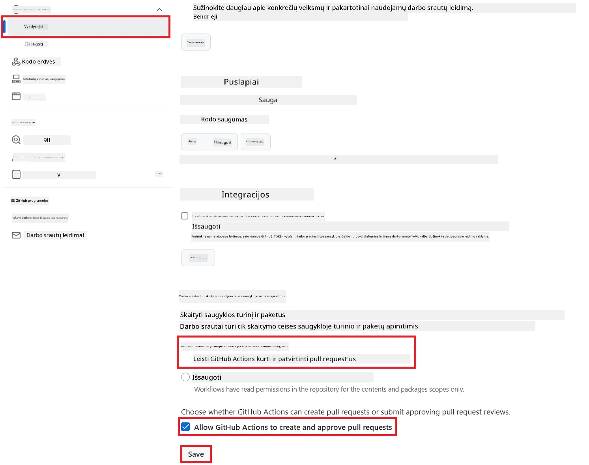

# Co-op Translator GitHub Action naudojimas (Viešas nustatymas)

**Kam skirta:** Šis vadovas skirtas naudotojams daugumoje viešų ar privačių repozitorijų, kur pakanka standartinių GitHub Actions leidimų. Naudojamas integruotas `GITHUB_TOKEN`.

Automatiškai išverskite savo repozitorijos dokumentaciją be vargo naudodami Co-op Translator GitHub Action. Šiame vadove rasite, kaip sukonfigūruoti veiksmą, kad automatiškai būtų kuriami pull request'ai su atnaujintais vertimais, kai tik pasikeičia jūsų pirminiai Markdown failai ar paveikslėliai.

> [!IMPORTANT]
>
> **Pasirinkite tinkamą vadovą:**
>
> Šiame vadove aprašytas **paprastesnis nustatymas naudojant standartinį `GITHUB_TOKEN`**. Tai rekomenduojamas būdas daugumai naudotojų, nes nereikia rūpintis jautrių GitHub App privačių raktų valdymu.
>

## Prieš pradedant

Prieš konfigūruodami GitHub Action, pasirūpinkite, kad turėtumėte reikiamus AI paslaugų prisijungimo duomenis.

**1. Privaloma: AI kalbos modelio prisijungimo duomenys**
Reikia prisijungimo duomenų bent vienam palaikomam kalbos modeliui:

- **Azure OpenAI**: Reikalingas Endpoint, API Key, Model/Deployment pavadinimai, API versija.
- **OpenAI**: Reikalingas API Key, (Pasirinktinai: Org ID, Base URL, Model ID).
- Daugiau informacijos rasite [Palaikomi modeliai ir paslaugos](../../../../README.md).

**2. Pasirinktinai: AI Vision prisijungimo duomenys (vaizdų vertimui)**

- Reikalinga tik jei norite versti tekstą paveikslėliuose.
- **Azure AI Vision**: Reikalingas Endpoint ir Subscription Key.
- Jei nepateiksite, veiksmas veiks [tik su Markdown](../markdown-only-mode.md).

## Nustatymas ir konfigūravimas

Vadovaukitės šiais žingsniais, kad sukonfigūruotumėte Co-op Translator GitHub Action savo repozitorijoje naudodami standartinį `GITHUB_TOKEN`.

### 1 žingsnis: Supraskite autentifikaciją (naudojant `GITHUB_TOKEN`)

Ši darbo eiga naudoja integruotą `GITHUB_TOKEN`, kurį suteikia GitHub Actions. Šis tokenas automatiškai suteikia leidimus darbo eigai sąveikauti su jūsų repozitorija pagal nustatymus, kuriuos sukonfigūruosite **3 žingsnyje**.

### 2 žingsnis: Konfigūruokite repozitorijos slaptus duomenis

Jums tereikia pridėti savo **AI paslaugų prisijungimo duomenis** kaip užšifruotus slaptus duomenis repozitorijos nustatymuose.

1.  Eikite į norimą GitHub repozitoriją.
2.  Pasirinkite **Settings** > **Secrets and variables** > **Actions**.
3.  Skiltyje **Repository secrets** spauskite **New repository secret** kiekvienam reikiamam AI paslaugos slaptažodžiui, nurodytam žemiau.

     *(Paveikslėlio nuoroda: Parodo, kur pridėti slaptus duomenis)*

**Reikalingi AI paslaugų slaptažodžiai (pridėkite VISUS, kurie tinka pagal jūsų Prieš pradedant):**

| Slaptažodžio pavadinimas            | Aprašymas                                 | Vertės šaltinis                  |
| :---------------------------------- | :---------------------------------------- | :------------------------------- |
| `AZURE_AI_SERVICE_API_KEY`            | Azure AI Service raktas (Computer Vision)  | Jūsų Azure AI Foundry               |
| `AZURE_AI_SERVICE_ENDPOINT`         | Azure AI Service endpoint (Computer Vision) | Jūsų Azure AI Foundry               |
| `AZURE_OPENAI_API_KEY`              | Azure OpenAI paslaugos raktas             | Jūsų Azure AI Foundry               |
| `AZURE_OPENAI_ENDPOINT`             | Azure OpenAI paslaugos endpoint           | Jūsų Azure AI Foundry               |
| `AZURE_OPENAI_MODEL_NAME`           | Azure OpenAI modelio pavadinimas          | Jūsų Azure AI Foundry               |
| `AZURE_OPENAI_CHAT_DEPLOYMENT_NAME` | Azure OpenAI diegimo pavadinimas          | Jūsų Azure AI Foundry               |
| `AZURE_OPENAI_API_VERSION`          | Azure OpenAI API versija                  | Jūsų Azure AI Foundry               |
| `OPENAI_API_KEY`                    | OpenAI API raktas                         | Jūsų OpenAI Platforma               |
| `OPENAI_ORG_ID`                     | OpenAI organizacijos ID (pasirinktinai)   | Jūsų OpenAI Platforma               |
| `OPENAI_CHAT_MODEL_ID`              | Konkretus OpenAI modelio ID (pasirinktinai)| Jūsų OpenAI Platforma               |
| `OPENAI_BASE_URL`                   | Individualus OpenAI API bazinis URL (pasirinktinai) | Jūsų OpenAI Platforma      |

### 3 žingsnis: Konfigūruokite darbo eigos leidimus

GitHub Action reikia leidimų, suteikiamų per `GITHUB_TOKEN`, kad galėtų pasiekti kodą ir kurti pull request'us.

1.  Savo repozitorijoje eikite į **Settings** > **Actions** > **General**.
2.  Slinkite žemyn iki **Workflow permissions** skilties.
3.  Pasirinkite **Read and write permissions**. Tai suteiks `GITHUB_TOKEN` reikiamus `contents: write` ir `pull-requests: write` leidimus šiai darbo eigai.
4.  Įsitikinkite, kad pažymėta **Allow GitHub Actions to create and approve pull requests**.
5.  Spauskite **Save**.



### 4 žingsnis: Sukurkite darbo eigos failą

Galiausiai sukurkite YAML failą, apibrėžiantį automatizuotą darbo eigą naudojant `GITHUB_TOKEN`.

1.  Repozitorijos šakniniame kataloge sukurkite `.github/workflows/` katalogą, jei jo dar nėra.
2.  Kataloge `.github/workflows/` sukurkite failą pavadinimu `co-op-translator.yml`.
3.  Įklijuokite šį turinį į `co-op-translator.yml`.

```yaml
name: Co-op Translator

on:
  push:
    branches:
      - main

jobs:
  co-op-translator:
    runs-on: ubuntu-latest

    permissions:
      contents: write
      pull-requests: write

    steps:
      - name: Checkout repository
        uses: actions/checkout@v4
        with:
          fetch-depth: 0

      - name: Set up Python
        uses: actions/setup-python@v4
        with:
          python-version: '3.10'

      - name: Install Co-op Translator
        run: |
          python -m pip install --upgrade pip
          pip install co-op-translator

      - name: Run Co-op Translator
        env:
          PYTHONIOENCODING: utf-8
          # === AI Service Credentials ===
          AZURE_AI_SERVICE_API_KEY: ${{ secrets.AZURE_AI_SERVICE_API_KEY }}
          AZURE_AI_SERVICE_ENDPOINT: ${{ secrets.AZURE_AI_SERVICE_ENDPOINT }}
          AZURE_OPENAI_API_KEY: ${{ secrets.AZURE_OPENAI_API_KEY }}
          AZURE_OPENAI_ENDPOINT: ${{ secrets.AZURE_OPENAI_ENDPOINT }}
          AZURE_OPENAI_MODEL_NAME: ${{ secrets.AZURE_OPENAI_MODEL_NAME }}
          AZURE_OPENAI_CHAT_DEPLOYMENT_NAME: ${{ secrets.AZURE_OPENAI_CHAT_DEPLOYMENT_NAME }}
          AZURE_OPENAI_API_VERSION: ${{ secrets.AZURE_OPENAI_API_VERSION }}
          OPENAI_API_KEY: ${{ secrets.OPENAI_API_KEY }}
          OPENAI_ORG_ID: ${{ secrets.OPENAI_ORG_ID }}
          OPENAI_CHAT_MODEL_ID: ${{ secrets.OPENAI_CHAT_MODEL_ID }}
          OPENAI_BASE_URL: ${{ secrets.OPENAI_BASE_URL }}
        run: |
          # =====================================================================
          # IMPORTANT: Set your target languages here (REQUIRED CONFIGURATION)
          # =====================================================================
          # Example: Translate to Spanish, French, German. Add -y to auto-confirm.
          translate -l "es fr de" -y  # <--- MODIFY THIS LINE with your desired languages

      - name: Create Pull Request with translations
        uses: peter-evans/create-pull-request@v5
        with:
          token: ${{ secrets.GITHUB_TOKEN }}
          commit-message: "🌐 Update translations via Co-op Translator"
          title: "🌐 Update translations via Co-op Translator"
          body: |
            This PR updates translations for recent changes to the main branch.

            ### 📋 Changes included
            - Translated contents are available in the `translations/` directory
            - Translated images are available in the `translated_images/` directory

            ---
            🌐 Automatically generated by the [Co-op Translator](https://github.com/Azure/co-op-translator) GitHub Action.
          branch: update-translations
          base: main
          labels: translation, automated-pr
          delete-branch: true
          add-paths: |
            translations/
            translated_images/
```
4.  **Priderinkite darbo eigą:**
  - **[!IMPORTANT] Tikslinės kalbos:** `Run Co-op Translator` žingsnyje **BŪTINAI peržiūrėkite ir pakeiskite kalbų kodų sąrašą** komandoje `translate -l "..." -y`, kad atitiktų jūsų projekto poreikius. Pavyzdinis sąrašas (`ar de es...`) turi būti pakeistas arba pakoreguotas.
  - **Trigger (`on:`):** Dabartinis trigger'is veikia kiekvieną kartą, kai įvyksta push į `main`. Didelėms repozitorijoms apsvarstykite galimybę pridėti `paths:` filtrą (žr. YAML komentaruose), kad darbo eiga būtų vykdoma tik pasikeitus aktualiems failams (pvz., dokumentacijai), taip taupant runner minutes.
  - **PR informacija:** Prireikus pritaikykite `commit-message`, `title`, `body`, `branch` pavadinimą ir `labels` žingsnyje `Create Pull Request`.

## Darbo eigos paleidimas

> [!WARNING]  
> **GitHub-hosted Runner laiko limitas:**  
> GitHub-hosted runner'iai, tokie kaip `ubuntu-latest`, turi **maksimalų vykdymo laiką – 6 valandos**.  
> Jei didelės dokumentacijos repozitorijoje vertimo procesas užtruks ilgiau nei 6 valandas, darbo eiga bus automatiškai nutraukta.  
> Kad to išvengtumėte, apsvarstykite:  
> - Naudoti **self-hosted runner** (be laiko limito)  
> - Sumažinti tikslinių kalbų skaičių per vieną paleidimą

Kai `co-op-translator.yml` failas bus sujungtas į jūsų pagrindinę šaką (arba šaką, nurodytą `on:` trigger'yje), darbo eiga automatiškai paleis kiekvieną kartą, kai į tą šaką bus įkelti pakeitimai (ir atitiks `paths` filtrą, jei sukonfigūruota).

---

**Atsakomybės atsisakymas**:  
Šis dokumentas buvo išverstas naudojant dirbtinio intelekto vertimo paslaugą [Co-op Translator](https://github.com/Azure/co-op-translator). Nors siekiame tikslumo, prašome atkreipti dėmesį, kad automatiniai vertimai gali turėti klaidų ar netikslumų. Originalus dokumentas jo gimtąja kalba turėtų būti laikomas autoritetingu šaltiniu. Kritinei informacijai rekomenduojame profesionalų žmogaus vertimą. Mes neatsakome už nesusipratimus ar neteisingą interpretavimą, kilusį naudojantis šiuo vertimu.