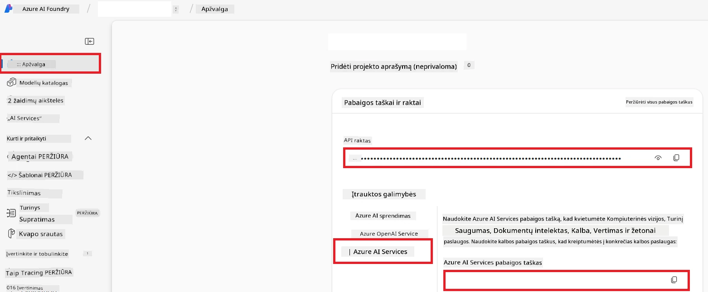

# Azure AI nustatymas Co-op Translator (Azure OpneAI ir Azure AI Vision)

Šis vadovas padės jums sukurti Azure OpenAI kalbų vertimui ir Azure Kompiuterinį Regėjimą vaizdų turinio analizei (kuris vėliau gali būti naudojamas vaizdų vertimui) Azure AI Foundry aplinkoje.

**Prieš pradedant:**
- Azure paskyra su aktyvia prenumerata.
- Pakankamos teisės kurti išteklius ir diegimus jūsų Azure prenumeratoje.

## Sukurkite Azure AI projektą

Pradėsite kurdami Azure AI projektą, kuris veikia kaip centrinė vieta valdyti jūsų AI išteklius.

1. Eikite į [https://ai.azure.com](https://ai.azure.com) ir prisijunkite su savo Azure paskyra.

1. Pasirinkite **+Create** norėdami sukurti naują projektą.

1. Atlikite šias užduotis:
   - Įveskite **Projekto pavadinimą** (pvz., `CoopTranslator-Project`).
   - Pasirinkite **AI hub** (pvz., `CoopTranslator-Hub`) (sukurkite naują, jei reikia).

1. Spustelėkite "**Review and Create**", kad sukurtumėte savo projektą. Būsite nukreipti į projekto apžvalgos puslapį.

## Azure OpenAI nustatymas kalbų vertimui

Projekte įdiegsite Azure OpenAI modelį, kuris veiks kaip tekstų vertimo pagrindas.

### Eikite į savo projektą

Jei dar nesate, atidarykite ką tik sukurtą projektą (pvz., `CoopTranslator-Project`) Azure AI Foundry.

### Įdiekite OpenAI modelį

1. Nuo projekto kairės pusės meniu, skiltyje "My assets", pasirinkite "**Models + endpoints**".

1. Pasirinkite **+ Deploy model**.

1. Pasirinkite **Deploy Base Model**.

1. Bus pateiktas galimų modelių sąrašas. Filtruokite arba ieškokite tinkamo GPT modelio. Rekomenduojame `gpt-4o`.

1. Pasirinkite norimą modelį ir spustelėkite **Confirm**.

1. Pasirinkite **Deploy**.

### Azure OpenAI konfigūracija

Įdiegę, galite pasirinkti diegimą iš "**Models + endpoints**" puslapio, kad rastumėte jo **REST endpoint URL**, **Key**, **Deployment name**, **Model name** ir **API version**. Šie duomenys reikalingi integruojant vertimo modelį į jūsų programą.

> [!NOTE]
> API versijas galite pasirinkti pagal savo poreikius iš [API version deprecation](https://learn.microsoft.com/azure/ai-services/openai/api-version-deprecation) puslapio. Atkreipkite dėmesį, kad **API versija** skiriasi nuo **Modelio versijos**, rodytos **Models + endpoints** puslapyje Azure AI Foundry.

## Azure Kompiuterinio Regėjimo nustatymas vaizdų vertimui

Norėdami įgalinti tekstų vertimą iš vaizdų, turite surasti Azure AI Service API raktą ir galinį tašką.

1. Eikite į savo Azure AI projektą (pvz., `CoopTranslator-Project`). Įsitikinkite, kad esate projekto apžvalgos puslapyje.

### Azure AI Service konfigūracija

Suraskite API raktą ir galinį tašką Azure AI Service.

1. Eikite į savo Azure AI projektą (pvz., `CoopTranslator-Project`). Įsitikinkite, kad esate projekto apžvalgos puslapyje.

1. Suraskite **API Key** ir **Endpoint** Azure AI Service skirtuke.

    

Šis ryšys suteikia galimybę susietam Azure AI Services ištekliui (įskaitant vaizdų analizę) būti prieinamam jūsų AI Foundry projektui. Tuomet galite naudoti šį ryšį savo užrašinėse arba programose tekstui iš vaizdų išgauti, o vėliau tą tekstą siųsti Azure OpenAI modeliui vertimui.

## Jūsų kredencialų konsolidavimas

Iki šiol turėtumėte surinkti šiuos duomenis:

**Azure OpenAI (Teksto vertimui):**
- Azure OpenAI endpoint
- Azure OpenAI API raktas
- Azure OpenAI modelio pavadinimas (pvz., `gpt-4o`)
- Azure OpenAI diegimo pavadinimas (pvz., `cooptranslator-gpt4o`)
- Azure OpenAI API versija

**Azure AI Services (Teksto išgavimui iš vaizdų per Vision):**
- Azure AI Service endpoint
- Azure AI Service API raktas

### Pavyzdys: Aplinkos kintamųjų konfigūracija (Peržiūra)

Vėliau, kuriant programą, greičiausiai naudosite surinktus kredencialus kaip aplinkos kintamuosius, pvz.:

```bash
# Azure AI paslaugų prisijungimo kredencialai (privaloma vaizdo vertimui)
AZURE_AI_SERVICE_API_KEY="your_azure_ai_service_api_key" # pvz., 21xasd...
AZURE_AI_SERVICE_ENDPOINT="https://your_azure_ai_service_endpoint.cognitiveservices.azure.com/"

# Pasirinktiniai atsarginiai rinkiniai: dublikatai kintamųjų su priesaga _1/_2 (tas pats indeksas visiems rinkinio kintamiesiems)
AZURE_AI_SERVICE_API_KEY_1="your_azure_ai_service_api_key_1"
AZURE_AI_SERVICE_ENDPOINT_1="https://your_azure_ai_service_endpoint_1.cognitiveservices.azure.com/"

# Azure OpenAI prisijungimo kredencialai (privaloma teksto vertimui)
AZURE_OPENAI_API_KEY="your_azure_openai_api_key" # pvz., 21xasd...
AZURE_OPENAI_ENDPOINT="https://your_azure_openai_endpoint.openai.azure.com/"
AZURE_OPENAI_MODEL_NAME="your_model_name" # pvz., gpt-4o
AZURE_OPENAI_CHAT_DEPLOYMENT_NAME="your_deployment_name" # pvz., cooptranslator-gpt4o
AZURE_OPENAI_API_VERSION="your_api_version" # pvz., 2024-12-01-preview

# Pasirinktiniai atsarginiai rinkiniai: dublikuokite visą AZURE_OPENAI_* rinkinį su priesaga _1/_2 (tas pats indeksas visiems kintamiesiems)
```

---

### Tolimesnis skaitymas

- [Kaip sukurti projektą Azure AI Foundry](https://learn.microsoft.com/azure/ai-foundry/how-to/create-projects?tabs=ai-studio)
- [Kaip sukurti Azure AI išteklius](https://learn.microsoft.com/azure/ai-foundry/how-to/create-azure-ai-resource?tabs=portal)
- [Kaip diegti OpenAI modelius Azure AI Foundry](https://learn.microsoft.com/en-us/azure/ai-foundry/how-to/deploy-models-openai)

---

<!-- CO-OP TRANSLATOR DISCLAIMER START -->
**Atsakomybės atsisakymas**:  
Šis dokumentas buvo išverstas naudojant AI vertimo paslaugą [Co-op Translator](https://github.com/Azure/co-op-translator). Nors siekiame tikslumo, prašome atkreipti dėmesį, kad automatizuoti vertimai gali turėti klaidų ar netikslumų. Originalus dokumentas gimtąja kalba turėtų būti laikomas autoritetingu šaltiniu. Dėl svarbios informacijos rekomenduojama pasitelkti profesionalų žmogaus vertimą. Mes neprisiimame atsakomybės už bet kokius nesusipratimus ar neteisingą vertimo interpretaciją.
<!-- CO-OP TRANSLATOR DISCLAIMER END -->