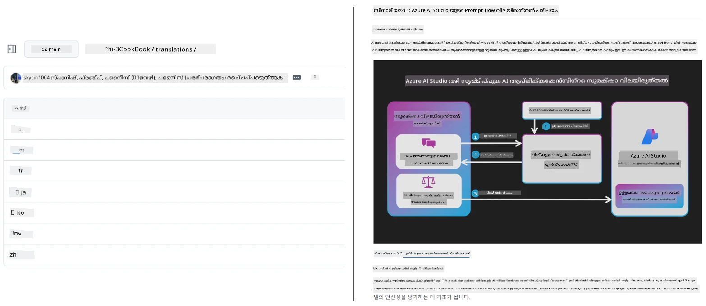
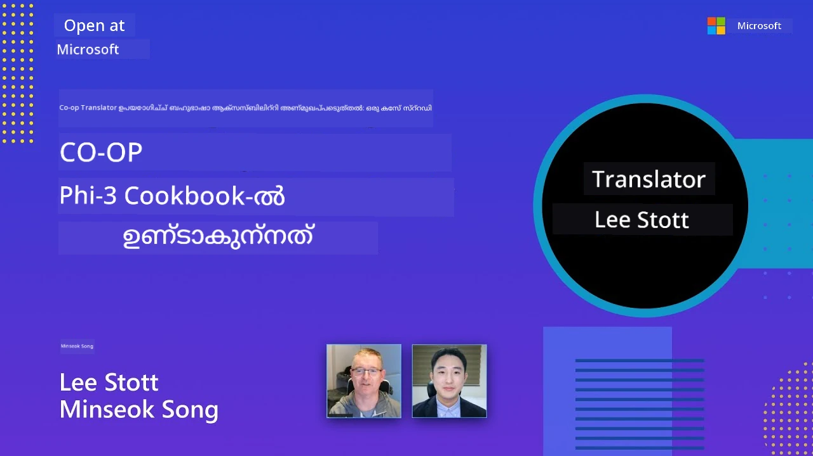

# Co-op Translator

_നിങ്ങളുടെ വിദ്യാഭ്യാസ GitHub ഉള്ളടക്കം ഒരു പദ്ധതിയായി വികസിക്കുമ്പോൾ ബഹുഭാഷകളിൽ അനവതരിപ്പിപ്പിക്കുന്നതും സൂക്ഷിക്കുന്നതും എളുപ്പത്തിൽ യാന്ത്രികമാക്കുക._


[](https://pypi.org/project/co-op-translator/)
[](https://github.com/azure/co-op-translator/blob/main/LICENSE)
[](https://pepy.tech/project/co-op-translator)
[](https://pepy.tech/project/co-op-translator)
[](https://github.com/azure/co-op-translator/pkgs/container/co-op-translator)
[](https://github.com/psf/black)

[](https://GitHub.com/azure/co-op-translator/graphs/contributors/)
[](https://GitHub.com/azure/co-op-translator/issues/)
[](https://GitHub.com/azure/co-op-translator/pulls/)
[](http://makeapullrequest.com)

### 🌐 ബഹുഭാഷാ പിന്തുണ

#### [Co-op Translator](https://github.com/Azure/Co-op-Translator) വഴി പിന്തുണയ്ക്കുന്നു

<!-- CO-OP TRANSLATOR LANGUAGES TABLE START -->
[അറബിക്](../ar/README.md) | [ബംഗാളി](../bn/README.md) | [ബൾഗേറിയൻ](../bg/README.md) | [ബർമീസ് (മ്യാൻമാർ)](../my/README.md) | [ചൈനീസ് (സിംപ്ലിഫൈഡ്)](../zh-CN/README.md) | [ചൈനീസ് (പരമ്പരാഗതം, ഹോങ്കോങ്)](../zh-HK/README.md) | [ചൈനീസ് (പരമ്പരാഗതം, മക്കാവ്)](../zh-MO/README.md) | [ചൈനീസ് (പരമ്പരാഗതം, തായ്‌വാൻ)](../zh-TW/README.md) | [ക്രൊയേഷ്യൻ](../hr/README.md) | [ചെക്ക്](../cs/README.md) | [ഡാനിഷ്](../da/README.md) | [ഡച്ച്](../nl/README.md) | [എസ്റ്റോണിയൻ](../et/README.md) | [ഫിന്നിഷ്](../fi/README.md) | [ഫ്രെഞ്ച്](../fr/README.md) | [ജർമ്മൻ](../de/README.md) | [ഗ്രീക്ക്](../el/README.md) | [ഹീബ്രു](../he/README.md) | [ഹിന്ദി](../hi/README.md) | [ഹംഗേറിയൻ](../hu/README.md) | [ഇന്തോനേഷ്യൻ](../id/README.md) | [ഇറ്റാലിയൻ](../it/README.md) | [ജാപ്പനീസ്](../ja/README.md) | [കന്നഡ](../kn/README.md) | [ഖ്മേർ](../km/README.md) | [കൊറിയൻ](../ko/README.md) | [ലിതുവേനിയൻ](../lt/README.md) | [മലയാളം](./README.md) | [മലയാളം](./README.md) | [മറാത്തി](../mr/README.md) | [നേപ്പാളി](../ne/README.md) | [നൈIjീരിയൻ പിഡ്ജിൻ](../pcm/README.md) | [നോർവീജിയൻ](../no/README.md) | [പേർഷ്യൻ (ഫാർസി)](../fa/README.md) | [പോളിഷ്](../pl/README.md) | [പോർച്ചുഗീസ് (ബ്രസീൽ)](../pt-BR/README.md) | [പോർച്ചുഗീസ് (പോർച്ചുഗൽ)](../pt-PT/README.md) | [പഞ്ചാബി (ഗുരുമുഖി)](../pa/README.md) | [റൊമാനിയൻ](../ro/README.md) | [റഷ്യൻ](../ru/README.md) | [സെർബിയൻ (സിറിലിക്)](../sr/README.md) | [സ്ലൊവാക്](../sk/README.md) | [സ്ലൊവേനിയൻ](../sl/README.md) | [സ്പാനിഷ്](../es/README.md) | [സ്വാഹിലി](../sw/README.md) | [സ്വീഡിഷ്](../sv/README.md) | [ടഗാലോഗ് (ഫിലിപ്പീൻ)](../tl/README.md) | [തമിഴ്](../ta/README.md) | [തെളുങ്ക്](../te/README.md) | [തമ്](../th/README.md) | [ടർക്കിഷ്](../tr/README.md) | [ഉക്രைத்தിയൻ](../uk/README.md) | [ഉർദു](../ur/README.md) | [വിയറ്റ്‌നാമീസ്](../vi/README.md)

> **പ്രാദേശികമായി ക്ലോൺ ചെയ്യാൻ ഇഷ്ടമാണോ?**
>
> ഈ സംഭരണം 50-ൽ പരം ഭാഷാ പരിഭാഷകൾ ഉൾക്കൊള്ളിക്കുന്നു, ഇത് ഡൗൺലോഡ് വലുപ്പം കാര്യമായും വർദ്ധിപ്പിക്കുന്നു. പരിഭാഷകൾ ഇല്ലാതെ ക്ലോൺ ചെയ്യാൻ sparse checkout ഉപയോഗിക്കുക:
>
> **Bash / macOS / Linux:**
> ```bash
> git clone --filter=blob:none --sparse https://github.com/skytin1004/co-op-translator.git
> cd co-op-translator
> git sparse-checkout set --no-cone '/*' '!translations' '!translated_images'
> ```
>
> **CMD (Windows):**
> ```cmd
> git clone --filter=blob:none --sparse https://github.com/skytin1004/co-op-translator.git
> cd co-op-translator
> git sparse-checkout set --no-cone "/*" "!translations" "!translated_images"
> ```
>
> ഇത് നിങ്ങൾക്ക് കൂടാതെ വളരെ വേഗത്തോടെ പാഠം പൂർത്തിയാക്കാൻ ആവശ്യമായ എല്ലാ കാര്യങ്ങളും നൽകുന്നു.
<!-- CO-OP TRANSLATOR LANGUAGES TABLE END -->

[](https://GitHub.com/azure/co-op-translator/watchers/)
[](https://GitHub.com/azure/co-op-translator/network/)
[](https://GitHub.com/azure/co-op-translator/stargazers/)

[](https://discord.gg/nTYy5BXMWG)

[](https://codespaces.new/azure/co-op-translator)

## അവലോകനം

**Co-op Translator** നിങ്ങളുടെ വിദ്യാഭ്യാസ GitHub ഉള്ളടക്കം ബഹുഭാഷകളിലേക്ക് എളുപ്പത്തിൽ അനവതരിപ്പിക്കുന്നതിൽ സഹായിക്കുന്നു.  
നിങ്ങൾ നിങ്ങളുടെ Markdown ഫയലുകൾ, ഇമേജുകൾ, അല്ലെങ്കിൽ നോട്ട്‌ബുക്കുകൾ അപ്ഡേറ്റ് ചെയ്യുമ്പോൾ, പരിഭാഷകൾ സ്വയം ഒത്തുനിൽക്കുന്നു, ആഗോള učenാർത്ഥികൾക്ക് ഉള്ളടക്കം യഥാർത്ഥവും പരിഷ്കൃതവുമാവുക ഉറപ്പുവരുത്തുന്നു.

പരിഭാഷപ്പെടുത്തിയ ഉള്ളടക്കം എങ്ങിനെയാണ് ക്രമീകരിച്ചിരിക്കുന്നത് എന്ന ഉദാഹരണം:



## പരിഭാഷാ നില എങ്ങനെ നിയന്ത്രിക്കുന്നു

Co-op Translator പരിഭാഷപ്പെടുത്തിയ ഉള്ളടക്കം **വർഷൻ ചെയ്‌ത സോഫ്‌റ്റ്‌വെയർ ആർട്ടിഫാക്റ്റുകൾ** ആയി  
നിയന്ത്രിക്കുന്നു, സ്ഥിരമായ ഫയലുകളായി അല്ല.

ഉപകരണം ഭാഷാ പാളിയ metadata ഉപയോഗിച്ച്  
പരിഭാഷപ്പെടുത്തിയ Markdown, ഇമേജുകൾ, നോട്ട്‌ബുക്കുകളുടെ നില പിന്തുടരുന്നു.

ഈ രൂപകൽപ്പന Co-op Translator-ന് ഈ കാര്യങ്ങൾ ചെയ്യാൻ സഹായിക്കുന്നു:

- പഴകിയ പരിഭാഷകൾ വിശ്വസനീയമായി കണ്ടെത്തുക  
- Markdown, ഇമേജുകൾ, നോട്ട്‌ബുക്കുകൾ ഒരേപോലെ കൈകാര്യം ചെയ്യുക  
- വലുതും ദ്രുതഗതിയുള്ള ബഹുഭാഷാ സംഭരണങ്ങളിൽ സുരക്ഷയോടെ വലുതാക്കുക

പരിഭാഷ കളക്ടുചെയ്യുന്നവർ ആർട്ടിഫാക്റ്റുകളായി മോഡലാക്കി,  
പരിഭാഷാ പ്രവാഹങ്ങൾ നൂതന സോഫ്റ്റ്‌വെയർ சார്പ്പും ആർട്ടിഫാക്റ്റ് മാനേജുമെന്റ് പ്രാക്ടിസുകളുമായി പ്രകൃത്യാപൂർവ്വം പൊരുത്തപ്പെടുന്നു.

→ [പരിഭാഷാ നില എങ്ങനെ നിയന്ത്രിക്കുന്നു](https://techcommunity.microsoft.com/blog/azuredevcommunityblog/rethinking-documentation-translation-treating-translations-as-versioned-software/4491755)


## ദ്രുത തുടങ്ങിയിരിക്കുക

```bash
# ഒരു വർച്ച്വൽ എൻവയോൺമെന്റ് സൃഷ്ടിക്കുകയും സജീവമാക്കുകയും ചെയ്യുക (പരാമർശിക്കപ്പെട്ടത്)
python -m venv .venv
# വിൻഡോസ്
.venv\Scripts\activate
# മാക്‌ഓഎസ്/ലിനക്സ്
source .venv/bin/activate
# പാക്കേജ് ഇൻസ്റ്റാൾ ചെയ്യുക
pip install co-op-translator
# പരിഭാഷപ്പെടുത്തുക
translate -l "ko ja fr" -md
```

Docker:

```bash
# GHCRൽ നിന്ന് പൊതു ഇമേജ് ആകെ എടുക്കുക
docker pull ghcr.io/azure/co-op-translator:latest
# നിലവിലെ ഫോൾഡർ മൗണ്ടു ചെയ്ത് .env നൽകിയാണ് ഓടിക്കുക (Bash/Zsh)
docker run --rm -it --env-file .env -v "${PWD}:/work" ghcr.io/azure/co-op-translator:latest -l "ko ja fr" -md
```

## കുറഞ്ഞ ക്രമീകരണം

1. നിങ്ങൾക്ക് പിന്തുണയുള്ള Python പതിപ്പ് (ഇപ്പോൾ 3.10-3.12) ഉണ്ടെന്ന് ഉറപ്പാക്കുക. poetry (pyproject.toml) ഇൽ ഇത് സ്വയം കൈകാര്യം ചെയ്യുന്നു.  
2. ടെമ്പ്ലേറ്റ് ഉപയോഗിച്ച് `.env` ഫയൽ സൃഷ്ടിക്കുക: [.env.template](../../.env.template)  
3. ഒരു LLM പ്രൊവൈഡർ എങ്കിൽ (Azure OpenAI അല്ലെങ്കിൽ OpenAI) സജ്ജീകരിക്കുക  
4. (ഐച്ഛികം) ഇമേജ് പരിഭാഷയ്ക്കായി (`-img`) Azure AI Vision സജ്ജീകരിക്കുക  
5. (ഐച്ഛികം) `_1`, `_2` പോലുള്ള സഫ്ഫിക്സുകൾ ഉപയോഗിച്ച് വേരിയബിൾകൾ പകർന്നു എത്രമാത്രം ക്രഡൻഷ്യൽ സെറ്റുകൾ ആവശ്യമോ സജ്ജീകരിക്കാം. ഒരു സെറ്റിലെ എല്ലാ വേരിയബിൾകൾക്കും ഒരേ സഫിക്സ് ഉണ്ടായിരിക്കണം.  
6. (ശിപാർശ ചെയ്യപ്പെടുന്നു) മുൻപരിഭാഷകൾ حذفചെയ്ത് സംഘർഷം ഒഴിവാക്കുക (ഉദാ., `translations/`)  
7. (ശിപാർശ ചെയ്യപ്പെടുന്നു) നിങ്ങളുടെ README-യിൽ [README languages template](./getting_started/README_languages_template.md) ഉപയോഗിച്ച് ഒരു പരിഭാഷാ വിഭാഗം ചേർക്കുക  
8. കാണുക: [Azure AI ക്രമീകരിക്കൽ](./getting_started/set-up-azure-ai.md)  

## ഉപയോഗം

എല്ലാ പിന്തുണയുള്ള തരം പരിഭാഷ ചെയ്യുക:

```bash
translate -l "ko ja"
```

Markdown മാത്രം:

```bash
translate -l "de" -md
```

Markdown + ഇമേജുകൾ:

```bash
translate -l "pt" -md -img
```

പരിച്ഛേദനോട്ടുകളും മാത്രം:

```bash
translate -l "zh" -nb
```

കൂടുതൽ ഫ്ലാഗുകൾ: [ആജ്ഞാ റഫറൻസ്](./getting_started/command-reference.md)

## സവിശേഷതകൾ

- Markdown, നോട്ട്‌ബുക്കുകൾ, ഇമേജുകൾ എന്നിവയ്ക്ക് യാന്ത്രിക പരിഭാഷ  
- ഉറവിടം മാറ്റങ്ങൾക്കൊപ്പം പരിഭാഷകൾ ഒത്തുസഞ്ചിതമാക്കുന്നു  
- പ്രാദേശികമായി (CLI) അല്ലെങ്കിൽ CI (GitHub Actions) ൽ പ്രവർത്തിക്കുന്നു  
- Azure OpenAI അല്ലെങ്കിൽ OpenAI ഉപയോഗിക്കുന്നു; ഇമേജുകൾക്ക് ഐച്ഛിക Azure AI Vision  
- Markdown ഫോർമാറ്റും ഘടനയും സൂക്ഷിക്കുന്നു  

## ഡോക്യൂമെന്റേഷൻ

- [കമാൻഡ് ലൈനിൻ ഗൈഡ്](./getting_started/command-line-guide/command-line-guide.md)  
- [GitHub Actions ഗൈഡ് (പബ്ലിക് റിപ്പോസിറ്ററികൾ & സ്റ്റാൻഡേർഡ് സീക്രെറ്റുകൾ)](./getting_started/github-actions-guide/github-actions-guide-public.md)  
- [GitHub Actions ഗൈഡ് (Microsoft ഓർഗനൈസേഷൻ റിപ്പോസിറ്ററികൾ & ഓർഗനൈസേഷൻ നില ക്രമീകരണങ്ങൾ)](./getting_started/github-actions-guide/github-actions-guide-org.md)  
- [README ഭാഷാ ടെമ്പ്ലേറ്റ്](./getting_started/README_languages_template.md)  
- [പിന്തുണയുള്ള ഭാഷകൾ](./getting_started/supported-languages.md)  
- [സംഭാഗം നൽകൽ](./CONTRIBUTING.md)  
- [പ്രശ്നപരിഹാരം](./getting_started/troubleshooting.md)  

### Microsoft-നിർദ്ദിഷ്ട ഗൈഡ്  
> [!NOTE]  
> Microsoft "For Beginners" റിപ്പോസിറ്ററികളുടെ മെയിന്റെയിനർമാർക്കായി മാത്രം.

- [“മറ്റു കോഴ്സുകൾ” പട്ടിക അപ്ഡേറ്റ് ചെയ്യൽ (MS Beginners റിപ്പോസിറ്ററികൾക്കായി മാത്രം)](./getting_started/update-other-courses.md)  

## ഞങ്ങളെ പിന്തുണയ്ക്കുക, ആഗോള പഠനം പ്രോത്സാഹിപ്പിക്കുക

വിദ്യാഭ്യാസ ഉള്ളടക്കം ആഗോള തലത്തിൽ എങ്ങനെ പങ്കുവയ്ക്കുന്നുവെന്ന് ഞങ്ങളോടൊപ്പം വിപ്ലവം സൃഷ്ടിക്കൂ! [Co-op Translator](https://github.com/azure/co-op-translator) നു GitHub-ൽ ⭐ തരൂ, പഠനത്തിന്റെയും സാങ്കേതികവിദ്യയുടെയുമായ ഭാഷാ വിശദമാക്കലുകൾ തകർക്കയാണ് ഞങ്ങളുടെ ദൗത്യം. നിങ്ങളുടെ താൽപര്യവും സംഭാവനകളും വലിയ ഫലപ്രദമായ ഭാവിയിലേക്ക് നയിക്കുന്നു! കോഡ് സംഭാവനകളും സവിശേഷത നിർദ്ദേശങ്ങളും എപ്പോഴും സ്വാഗതം.

### Microsoft വിദ്യാഭ്യാസ ഉള്ളടക്കം നിങ്ങളുടെ ഭാഷയിൽ അന്വേഷിക്കുക

- [LangChain4j-for-Beginners](https://github.com/microsoft/LangChain4j-for-Beginners)  
- [AZD for Beginners](https://github.com/microsoft/AZD-for-beginners)  
- [Edge AI for Beginners](https://github.com/microsoft/edgeai-for-beginners)  
- [Model Context Protocol (MCP) For Beginners](https://github.com/microsoft/mcp-for-beginners)  
- [AI Agents for Beginners](https://github.com/microsoft/ai-agents-for-beginners)  
- [Generative AI for Beginners using .NET](https://github.com/microsoft/Generative-AI-for-beginners-dotnet)  
- [Generative AI for Beginners](https://github.com/microsoft/generative-ai-for-beginners)  
- [Generative AI for Beginners using Java](https://github.com/microsoft/generative-ai-for-beginners-java)  
- [ML for Beginners](https://aka.ms/ml-beginners)  
- [Data Science for Beginners](https://aka.ms/datascience-beginners)  
- [AI for Beginners](https://aka.ms/ai-beginners)  
- [Cybersecurity for Beginners](https://github.com/microsoft/Security-101)  
- [Web Dev for Beginners](https://aka.ms/webdev-beginners)  
- [IoT for Beginners](https://aka.ms/iot-beginners)  
- [PhiCookBook](https://github.com/microsoft/PhiCookBook)  

## വീഡിയോ അവതരണങ്ങൾ

👉 താഴെ ചിത്രം ക്ലിക്ക് ചെയ്ത് YouTube-ൽ കാണുക.

- **Open at Microsoft**: Co-op Translator എങ്ങനെ ഉപയോഗിക്കാമെന്ന് 18 മിനുട്ട് ലഘു പരിചയം കുറിപ്പും ഗൈഡും.

  [](https://www.youtube.com/watch?v=jX_swfH_KNU)

## സംഭാവനകൾ

ഈ പ്രോജക്റ്റ് സംഭാവനകളും നിർദ്ദേശങ്ങളും സ്വാഗതം ചെയ്യുന്നു. Azure Co-op Translator-ന് സംഭാവന ചെയ്യാൻ താത്പര്യമുണ്ടോ? ഞങ്ങളുടെ [CONTRIBUTING.md](./CONTRIBUTING.md) കാണുക, Co-op Translator കൂടുതൽ ആക്സസ് ചെയ്യാവുന്ന വിധം നിർമ്മിക്കാൻ നിങ്ങളെ സഹായിക്കാൻ ഉള്ള മാർഗ്ഗനിർദ്ദേശങ്ങൾക്കായി.

## സംഭാവകർ
[](https://github.com/Azure/co-op-translator/graphs/contributors)

## പെരുമാറ്റ ചട്ടങ്ങൾ

ഈ പദ്ധതി [Microsoft Open Source Code of Conduct](https://opensource.microsoft.com/codeofconduct/) സ്വീകരിച്ചിട്ടുണ്ട്.  
കൂടുതൽ വിവരങ്ങൾക്ക് [Code of Conduct FAQ](https://opensource.microsoft.com/codeofconduct/faq/) കാണുക അല്ലെങ്കിൽ  
[opencode@microsoft.com](mailto:opencode@microsoft.com) എന്നാക്ക് ഏതെങ്കിലും അധിക ചോദ്യങ്ങൾ അല്ലെങ്കിൽ അഭിപ്രായങ്ങൾ അറിയിക്കുക.

## ഉത്തരവാദിത്വമുള്ള AI

Microsoft ഞങ്ങളുടെ ഉപഭോക്താക്കളെ നമ്മുടെ AI ഉൽപ്പന്നങ്ങൾ ഉത്തരവാദിത്വത്തോടെ ഉപയോഗിക്കാൻ സഹായിക്കാനും, നമ്മുടെ പഠനങ്ങൾ പങ്കുവെക്കാനും, Transparency Notes, Impact Assessments പോലുള്ള ഉപകരണങ്ങളിലൂടെ വിശ്വാസം അടിസ്ഥാനമാക്കിയ പങ്കാളിത്തങ്ങൾ നിർമ്മിക്കാനുമുള്ള പ്രതിജ്ഞാബദ്ധമാണ്. ഈ വിഭവങ്ങളുടെ പലതും [https://aka.ms/RAI](https://aka.ms/RAI) ൽ കാണാം.  
Microsoftന്റെ ഉത്തരവാദിത്വമുള്ള AI പ്രതിരോധം നീതി, വിശ്വാസ്യത, സുരക്ഷ, സ്വകാര്യത, ഉൾപ്പെടുത്തൽ, പാരദർശിത്വം, വിശദവിവരണശേഷി തുടങ്ങിയ AI പ്രിൻസിപ്പിളുകളിൽ ആധാരമാക്കിയതാണ്.

ഈ സാമ്പിൾ ഇറങ്ങിയ വലിയ സ്‌കെയിൽ പ്രകൃതി ഭാഷ, ചിത്രം, ശബ്ദ മോഡലുകൾ - അവ മറ്റുപക്ഷങ്ങളിൽ അനീതിയുള്ള, വിശ്വാസ്യതയില്ലാത്ത, അപമാനകരമായ രീതിയിൽ പെരുമാറാൻ സാധ്യതയുള്ളതാണ് - ഇത് ഇടതു പരിക്ക് ഉണ്ടാക്കാം. [Azure OpenAI സേവന Transparency note](https://learn.microsoft.com/legal/cognitive-services/openai/transparency-note?tabs=text) ൽ അപകടങ്ങളും പരിമിതികളും സംബന്ധിച്ച വിവരം 얻ുക.

ഇ러한 അപകടങ്ങൾ മുഴുമിച്ചു നേരിടാൻ ശുപാർശ ചെയ്‌ത സമീപനം നിങ്ങളുടെ ആർക്കിടെക്ചറിൽ ഒരു സുരക്ഷാ സംവിധാനമുണ്ടാക്കുക എന്നതാണ്, അത് ഹാനികരമായ പെരുമാറ്റം കണ്ടെത്തുകയും തടയുകയും ചെയ്യുകയും ചെയ്യും. [Azure AI Content Safety](https://learn.microsoft.com/azure/ai-services/content-safety/overview) സ്വതന്ത്ര സംരക്ഷണ നിലയായി പ്രവർത്തിക്കുന്നു, ആപ്ലിക്കേഷനുകളിലും സേവനങ്ങളിലും ഹാനികരമായ ഉപയോക്തൃ-സൃഷ്ടിയായും AI സൃഷ്ടിയായും ഉള്ള ഉള്ളടക്കം കണ്ടെത്താൻ കഴിയും. Azure AI Content Safety ടെക്സ്റ്റ്, ചിത്രം APIകൾ ഉൾപ്പെടുന്നു, അവ പോരാതെയുള്ള ഉള്ളടക്കം കണ്ടെത്താൻ സഹായിക്കുന്നു. നാം ഒരു ഇന്ററാക്ടീവ് Content Safety Studio ഉണ്ട്, അതു വഴി വ്യത്യസ്ത മോഡാലിറ്റികളിലൂടെയുള്ള ഹാനികരമായ ഉള്ളടക്കങ്ങൾ കണ്ടെത്താനുള്ള സാമ്പിൾ കോഡ് കണ്ടുകൊണ്ട് പരീക്ഷിക്കാനും കഴിയും. താഴെ കൊടുത്ത [quickstart ഡോക്യുമെന്റേഷൻ](https://learn.microsoft.com/azure/ai-services/content-safety/quickstart-text?tabs=visual-studio%2Clinux&pivots=programming-language-rest) സേവനത്തിലേക്ക് അപേക്ഷകള്‍ അയക്കാന്‍ സഹായിക്കുന്നു.

മറ്റൊരു കാര്യമാണ് ആപ്ലിക്കേഷൻ മൊത്തത്തിലുള്ള കാര്യക്ഷമത. മൾട്ടി-മൊഡൽ, മൾട്ടി-മോഡലുകൾ ഉള്ള ആപ്ലിക്കേഷനുമായി, സിസ്റ്റം നിങ്ങളും നിങ്ങളുടെ ഉപയോക്താക്കളും പ്രതീക്ഷിക്കുന്ന പോലെ പ്രവർത്തിക്കണം, ഹാനികരമായ ഫലങ്ങൾ ഉണ്ടാകാതെ. നിങ്ങളുടെ ആപ്ലിക്കേഷന്റെ മൊത്തത്തിലുള്ള കാര്യക്ഷമത [generation quality and risk and safety metrics](https://learn.microsoft.com/azure/ai-studio/concepts/evaluation-metrics-built-in) ഉപയോഗിച്ച് വിലയിരുത്തുന്നത് പ്രധാനമാണ്.

നിങ്ങളുടെ AI ആപ്ലിക്കേഷൻ വികസന പരിതസ്ഥിതിയിൽ [prompt flow SDK](https://microsoft.github.io/promptflow/index.html) ഉപയോഗിച്ച് വിലയിരുത്താം. ഒരു ടെസ്റ്റ് ഡാറ്റാസെറ്റ് അല്ലെങ്കിൽ ലക്ഷ്യമാണ് നൽകിയിരിക്കുന്നത്, നിങ്ങളുടെ സൃഷ്ടിആധാര AI ആപ്ലിക്കേഖാർ നിർമ്മിക്കുന്ന ഫലങ്ങൾ തുല്യതാപരമായി నేറവിയാം, നിർമിതമല്ലെങ്കിൽ ഓട്ടോമേറ്റഡ് വിലയിരുത്തൽ സംവിധാനങ്ങൾ ഉപയോഗിച്ച്. prompt flow sdk ഉപയോഗിച്ച് നിങ്ങളുടെ സിസ്റ്റത്തിന്റെ മൂല്യനിർണയം ആരംഭിക്കാൻ [quickstart മാര്‍ഗനിർദേശങ്ങള്](https://learn.microsoft.com/azure/ai-studio/how-to/develop/flow-evaluate-sdk) കാണാം. വിലയിരുത്തൽ നടത്തുമ്പോൾ, ഫലങ്ങൾ [Azure AI Studioയിൽ ചേർന്ന് കാണാനാകും](https://learn.microsoft.com/azure/ai-studio/how-to/evaluate-flow-results).

## ട്രേഡ്മാർക്ക്

ഈ പദ്ധതി പ്രൊജക്ടുകൾ, ഉൽപ്പന്നങ്ങൾ അല്ലെങ്കിൽ സേവനങ്ങൾക്കുള്ള ട്രേഡ്മാർക്കുകൾ അല്ലെങ്കിൽ ലോഗോകൾ ഉൾക്കൊള്ളിക്കാം. Microsoft  
ട്രേഡ്മാർക്കുകളുടെയും ലോഗോകളുടെയും അംഗീകൃത ഉപയോഗം [Microsoft's Trademark & Brand Guidelines](https://www.microsoft.com/en-us/legal/intellectualproperty/trademarks/usage/general) അനുസരിച്ച് ആയിരിക്കണം.  
ഈ പദ്ധതിയുടെ മാറ്റം വരുത്തിയ പതിപ്പുകളിൽ Microsoft ട്രേഡ്മാർക്കുകളോ ലോഗോകളോ ഉപയോഗിക്കുന്നത് വേഗം പിടിക്കുകയോ അല്ലെങ്കിൽ Microsoftയുടെ ഔദ്യോഗിക പിന്തുണ പോലുള്ള ആശയം സൃഷ്ടിക്കുകയോ പാടില്ല.  
മൂന്നാം പാർട്ടി ട്രേഡ്മാർക്കുകളോ ലോഗോകളോ ഉപയോഗിക്കുന്നത് അതിന്റേതായ നയങ്ങൾക്കും നിയന്ത്രണങ്ങൾക്കും വിധേയമാണ്.

## സഹായം ലഭിക്കുക

AI ആപ്ലിക്കേഷനുകൾ നിർമ്മിക്കുമ്പോൾ പ്രശ്നങ്ങൾ ഉണ്ടാകുമ്പോൾ അല്ലെങ്കിൽ ഏതെങ്കിലും ചോദ്യങ്ങൾ ഉണ്ടെന്നാൽ ചേരുക:

[](https://discord.gg/nTYy5BXMWG)

നിങ്ങളുടെ ഉൽപ്പന്ന പ്രതികരണങ്ങൾ അല്ലെങ്കിൽ പിഴവുകൾ അറിയിക്കണമെങ്കിൽ സന്ദർശിക്കുക:

[](https://aka.ms/foundry/forum)

---

<!-- CO-OP TRANSLATOR DISCLAIMER START -->
**ഡിസ്‌ക്ലെയിമർ**:  
ഈ ഡോക്യുമെന്റ് AI പരിഭാഷ സേവനമായ [Co-op Translator](https://github.com/Azure/co-op-translator) ഉപയോഗിച്ച് പരിഭാഷപ്പെടുത്തിയതാണ്. ഞങ്ങൾ കൃത്യതയ്ക്കായി പരിശ്രമിച്ചിട്ടുണ്ടെങ്കിലും, സ്വയമേധയാ പരിഭാഷകളിൽ പിശകുകൾ അല്ലെങ്കിൽ അകൃതികള്‍ ഉണ്ടാകാമെന്ന് ശ്രദ്ധിക്കുക. യഥാർത്ഥ ഡോക്യുമെന്റ് അതിന്റെ പ്രാദേശിക ഭാഷയിലുള്ള ദസ്താവേശം അധികാരപരമായ സ്രോതസ്സായി പരിഗണിക്കണം. പ്രധാനപ്പെട്ട വിവരങ്ങൾക്ക് പ്രൊഫഷണൽ മനുഷ്യ പരിഭാഷ സൗകര്യം ഉപയോഗിക്കുന്നത് ശുപാർശ ചെയ്യപ്പെടുന്നു. ഈ പരിഭാഷ ഉപയോഗിച്ചതിലുള്ള തെറ്റിദ്ധാരണകൾക്ക് അല്ലെങ്കിൽ തെറ്റായ വ്യാഖ്യാനങ്ങൾക്കുമായി ഞങ്ങൾ ഉത്തരവാദികളല്ല.
<!-- CO-OP TRANSLATOR DISCLAIMER END -->