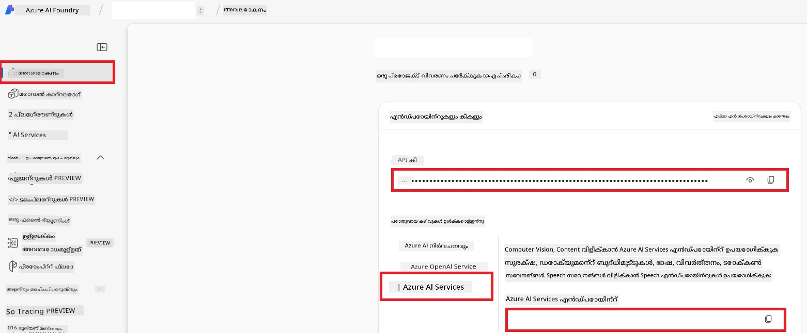

# Co-op Translator (Azure OpneAI & Azure AI Vision) നു Azure AI ക്രമീകരിക്കൽ

Azure AI Foundry എന്നതിലുള്ള ഭാഷാ പരിഭാഷയ്ക്കും ചിത്രം-അടിസ്ഥാനത്തിലുള്ള പരിഭാഷയ്ക്കായി ചിത്ര ഉള്ളടക്ക വിശകലനത്തിനും Azure OpenAI സജ്ജീകരിക്കുന്നതിലെ ഈ ഗൈഡ് നിങ്ങളെ സഹായിക്കുന്നു.

**ആവശ്യ യോഗ്യതകൾ:**
- സജീവ സബ്സ്ക്രിപ്ഷൻ ഉള്ള ഒരു Azure അക്കൗണ്ട്.
- നിങ്ങളുടെ Azure സബ്സ്ക്രിപ്ഷനിൽ റിസോഴ്‌സുകളും വിന്യാസങ്ങളും സൃഷ്ടിക്കുന്നതിന് ആവശ്യമായ പ്രമാണപരമായി അനുവദനീയത.

## Azure AI പ്രോജക്റ്റ് സൃഷ്ടിക്കുക

നിങ്ങളുടെ AI റിസോഴ്‌സുകൾ നിയന്ത്രിക്കാൻ കേന്ദ്ര സ്ഥലമായി പ്രവർത്തിക്കുന്ന ഒരു Azure AI പ്രോജക്റ്റ് നിങ്ങൾ ആരംഭിക്കാം.

1. [https://ai.azure.com](https://ai.azure.com) ലേക്ക് പോയി നിങ്ങളുടെ Azure അക്കൗണ്ടിൽ സൈൻ ഇൻ ചെയ്യുക.

1. **+Create** ക്ലിക്ക് ചെയ്ത് ഒരു പുതിയ പ്രോജക്റ്റ് സൃഷ്ടിക്കുക.

1. താഴെപറയുന്ന കാര്യങ്ങൾ പൂർത്തിയാക്കുക:
   - **Project name** നൽകുക (ഉദാ: `CoopTranslator-Project`).
   - **AI hub** തിരഞ്ഞെടുക്കുക (ഉദാ: `CoopTranslator-Hub`) (ആവശ്യമെങ്കിൽ പുതിയതായി സൃഷ്ടിക്കുക).

1. "**Review and Create**" ക്ലിക്ക് ചെയ്ത് നിങ്ങളുടെ പ്രോജക്റ്റ് സജ്ജീകരിക്കുക. നിങ്ങൾ പ്രോജക്റ്റിന്റെ അവലോകന പേജിലേക്ക് നീങ്ങും.

## ഭാഷാ പരിഭാഷയ്ക്കായി Azure OpenAI സജ്ജീകരിക്കുക

നിങ്ങളുടെ പ്രോജക്റ്റിന്റെ ആഭ്യന്തരത്തിൽ, ടെക്സ്റ്റ് പരിഭാഷയ്ക്കായി ബാക്ക്എണ്ടായി പ്രവർത്തിക്കാനുള്ള Azure OpenAI മോഡൽ വിന്യസിക്കും.

### നിങ്ങളുടെ പ്രോജക്റ്റിലേക്ക് പോകുക

ഇതു വരെ ചെയ്യാതിരുന്നാൽ, Azure AI Foundry-യിൽ നിങ്ങളുടെ പുതിയ പ്രോജക്റ്റ് (ഉദാ: `CoopTranslator-Project`) തുറക്കുക.

### OpenAI മോഡൽ വിന്യസം

1. നിങ്ങളുടെ പ്രോജക്റ്റിന്റെ ഇടത് മെനുവിൽ "My assets" എന്നതിൽ താഴെ "**Models + endpoints**" തിരഞ്ഞെടുത്ത്.

1. **+ Deploy model** തിരഞ്ഞെടുക്കുക.

1. **Deploy Base Model** തിരഞ്ഞെടുക്കുക.

1. ലഭ്യമായ മോഡലുകളുടെ പട്ടിക കാണിക്കും. അനുയോജ്യമായ GPT മോഡൽ ഫിൽടർ ചെയ്ത് തിരയുക. ഞങ്ങൾ `gpt-4o` ശിപാർശ ചെയ്യുന്നു.

1. നിങ്ങളുടെ ഇഷ്ടമുള്ള മോഡൽ തിരഞ്ഞെടുക്കുകയും **Confirm** ക്ലിക്ക് ചെയ്യുകയും ചെയ്യുക.

1. **Deploy** ക്ലിക്ക് ചെയ്യുക.

### Azure OpenAI ക്രമീകരണം

വിന്യസിച്ച ശേഷം, "**Models + endpoints**" പേജിൽ നിന്ന് വിന്യാസം തിരഞ്ഞെടുക്കുന്നതിലൂടെ അതിന്റെ **REST endpoint URL**, **Key**, **Deployment name**, **Model name** மற்றும் **API version** കണ്ടെത്താം. ഈ വിവരങ്ങൾ പരിഭാഷാ മോഡൽ നിങ്ങളുടെ ആപ്പ്ലിക്കേഷനിൽ ഇന്റഗ്രേറ്റുചെയ്യാൻ ആവശ്യമാണ്.

> [!NOTE]
> നിങ്ങളുടെ ആവശ്യത്തിനനുസരിച്ച് [API version deprecation](https://learn.microsoft.com/azure/ai-services/openai/api-version-deprecation) പേജിൽ നിന്നു API പതിപ്പുകൾ തിരഞ്ഞെടുക്കാം. Azure AI Foundry-യിലെ "**Models + endpoints**" പേജില്‍ കാണിക്കുന്ന **Model version** എന്നത് **API version**-ലിൽ നിന്നു വ്യത്യസ്തമാണെന്ന് ശ്രദ്ധിക്കുക.

## ചിത്രം പരിഭാഷയ്ക്കായി Azure കമ്പ്യൂട്ടർ വിഷൻ സജ്ജീകരിക്കൽ

ചിത്രങ്ങളിലുള്ള എഴുത്തിന്റെ പരിഭാഷ സാധ്യമാക്കാൻ, Azure AI Service API കീയും എൻഡ്പോയിന്റും കണ്ടെത്തേണ്ടതാണ്.

1. നിങ്ങളുടെ Azure AI പ്രോജക്റ്റിലേക്ക് പോകുക (ഉദാ: `CoopTranslator-Project`). പ്രോജക്റ്റ് അവലോകന പേജിൽ ഉള്ളതായി ഉറപ്പാക്കുക.

### Azure AI Service ക്രമീകരണം

Azure AI Service-ൽ നിന്ന് API കീയും എൻഡ്പോയിന്റും കണ്ടെത്തുക.

1. നിങ്ങളുടെ Azure AI പ്രോജക്റ്റിലേക്ക് പോകുക (ഉദാ: `CoopTranslator-Project`). പ്രോജക്റ്റ് അവലോകന പേജിലാണ് എന്ന് ഉറപ്പാക്കുക.

1. Azure AI Service ടാബിൽ നിന്ന് **API Key**യും **Endpoint**യും കണ്ടെത്തുക.

    

ഈ ബന്ധം നിങ്ങളുടെ AI Foundry പ്രോജക്ടിലേക്ക് ബന്ധപ്പെട്ട Azure AI Services റിസോഴ്‌സ് (ചിത്ര വിശകലനം ഉൾപ്പെടെ) വാഗ്ദാനം ചെയ്യുന്നു. തുടർന്ന് നിങ്ങൾക്ക് ഈ ബന്ധം നിങ്ങളുടെ നോട്ട്‌ബുക്കുകളിലും ആപ്പ്ലിക്കേഷനുകളിലും ഉപയോഗിച്ച് ചിത്രങ്ങളിൽ നിന്ന് എഴുത്ത് ഒഴുക്കാമെന്നും പിന്നീട് Azure OpenAI മോഡലിലേക്ക് പരിഭാഷയ്ക്കായി അയക്കാമെന്നും സാധിക്കും.

## നിങ്ങളുടെ ക്രെഡൻഷ്യലുകൾ ഏകീകരിക്കൽ

ഇപ്പോൾ വരെ നിങ്ങൾ ഈ വസ്തുക്കൾ ശേഖരിച്ചിരിക്കണമെന്ന് പ്രതീക്ഷിക്കുന്നു:

**Azure OpenAI (ടെക്സ്റ്റ് പരിഭാഷക്ക്):**
- Azure OpenAI Endpoint
- Azure OpenAI API Key
- Azure OpenAI Model Name (ഉദാ: `gpt-4o`)
- Azure OpenAI Deployment Name (ഉദാ: `cooptranslator-gpt4o`)
- Azure OpenAI API Version

**Azure AI Services (Vision വഴി ചിത്രം എഴുത്ത് മ:VEVENTടിപ്പിക്കൽ):**
- Azure AI Service Endpoint
- Azure AI Service API Key

### ഉദാഹരണം: എൻവയോൺമെന്റ് വേരിയബിൾ ക്രമീകരണം (പ്രീവ്യൂ)

നിങ്ങളുടെ ആപ്പ്ലിക്കേഷൻ നിർമ്മിക്കുമ്പോൾ, ഈ ശേഖരിച്ച ക്രെഡൻഷ്യലുകൾ എൻവയോൺമെന്റ് വേരിയബിൾസ് ആയി ക്രമീകരിക്കുന്നതായി ഒരു ഉദാഹരണം:

```bash
# ആസ്യൂർ എ ഐ സേവന ക്രെഡൻഷ്യലുകൾ (ചിത്രം പരിഭാഷയ്ക്കായി ആവശ്യമാണ്)
AZURE_AI_SERVICE_API_KEY="your_azure_ai_service_api_key" # ഉദാ., 21xasd...
AZURE_AI_SERVICE_ENDPOINT="https://your_azure_ai_service_endpoint.cognitiveservices.azure.com/"

# ഐച്ഛിക തിരിച്ചടിസ്ഥാന സെറ്റുകൾ: കോടതികൾക്കായി _1/_2 എന്ന സഫിക്സ് ഉപയോഗിച്ച് പകർപ്പ് മൂല്യങ്ങൾ (സെറ്റിലുള്ള എല്ലാ മാറ്റികളുടെയും സമാന സൂചിക)
AZURE_AI_SERVICE_API_KEY_1="your_azure_ai_service_api_key_1"
AZURE_AI_SERVICE_ENDPOINT_1="https://your_azure_ai_service_endpoint_1.cognitiveservices.azure.com/"

# ആസ്യൂർ ഒപ്പൺഎഐ ക്രെഡൻഷ്യലുകൾ (വാചകം പരിഭാഷയ്ക്കായി ആവശ്യമാണ്)
AZURE_OPENAI_API_KEY="your_azure_openai_api_key" # ഉദാ., 21xasd...
AZURE_OPENAI_ENDPOINT="https://your_azure_openai_endpoint.openai.azure.com/"
AZURE_OPENAI_MODEL_NAME="your_model_name" # ഉദാ., gpt-4o
AZURE_OPENAI_CHAT_DEPLOYMENT_NAME="your_deployment_name" # ഉദാ., cooptranslator-gpt4o
AZURE_OPENAI_API_VERSION="your_api_version" # ഉദാ., 2024-12-01-പ്രിവ്യൂ

# ഐച്ഛിക തിരിച്ചടിസ്ഥാന സെറ്റുകൾ: മുഴുവൻ AZURE_OPENAI_* സെറ്റ് _1/_2 എന്ന സഫിക്സോടെ പകർクリックചെയ്യുക (എല്ലാ മൂല്യങ്ങളുടെയും സമാന സൂചിക)
```

---

### കൂടുതൽ വായനയ്‌ക്ക്

- [Azure AI Foundry-യിൽ പ്രോജക്റ്റ് സൃഷ്ടിക്കുന്ന വിധം](https://learn.microsoft.com/azure/ai-foundry/how-to/create-projects?tabs=ai-studio)
- [Azure AI റിസോഴ്‌സുകൾ സൃഷ്ടിക്കുന്നത് എങ്ങനെ](https://learn.microsoft.com/azure/ai-foundry/how-to/create-azure-ai-resource?tabs=portal)
- [Azure AI Foundry-യിൽ OpenAI മോഡലുകൾ വിന്യസിക്കുന്ന വിധം](https://learn.microsoft.com/en-us/azure/ai-foundry/how-to/deploy-models-openai)

---

<!-- CO-OP TRANSLATOR DISCLAIMER START -->
**അസ്വീകാര്യപ്രഖ്യാപനം**:  
ഈ രേഖ [Co-op Translator](https://github.com/Azure/co-op-translator) എന്ന എഐ വിവർത്തന സേവനം ഉപയോഗിച്ച് വിവർത്തനം ചെയ്തതാണ്. നമുക്ക് കൃത്യതക്ക് മികവേണം എന്നത് ശ്രമിക്കുമ്പോഴും, ഓട്ടോമേറ്റഡ് വിവർത്തനങ്ങളിൽ പിഴവുകൾ അല്ലെങ്കിൽ അസി മാറിയതാകാം ഉള്ളത്. സ്വന്തം ഭാഷയിലുള്ള പ്രാഥമിക രേഖ അവകാശപ്പെട്ട ഉറപ്പുള്ള വൃത്തമാണ് കണക്കാക്കേണ്ടത്. നിർണായക വിവരങ്ങൾക്ക് പ്രൊഫഷണൽ മാനവപരിഭാഷ നിർദ്ദേശിക്കുന്നു. ഈ വിവർത്തനത്തിന്റെ ഉപയോഗത്തിൽ നിന്നുള്ള തെറ്റിദ്ധാരണകൾക്കും തെറ്റായ വ്യാഖ്യാനങ്ങൾക്കും ഞങ്ങൾ ഉത്തരവാദികളല്ല.
<!-- CO-OP TRANSLATOR DISCLAIMER END -->