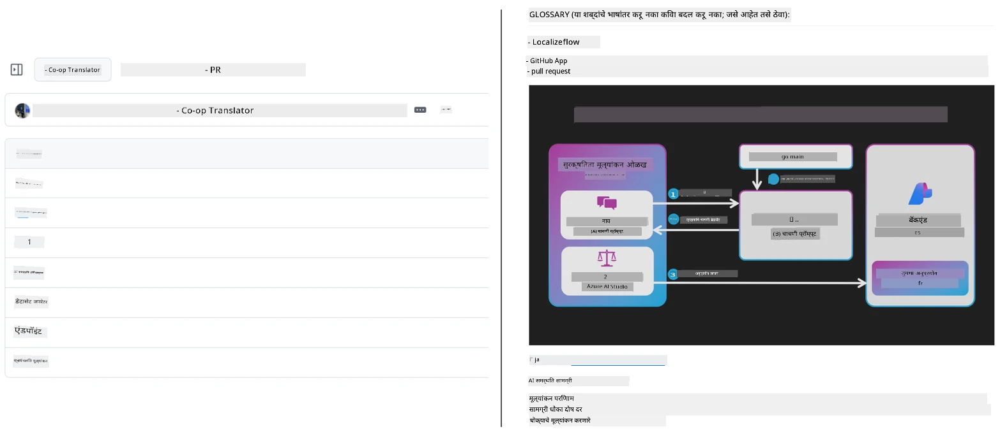
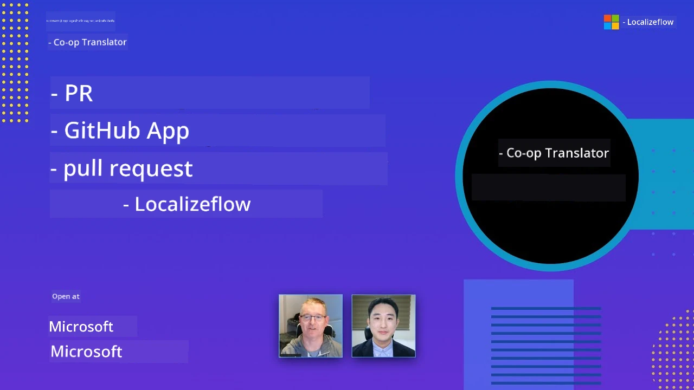

# Co-op Translator

_शैक्षणिक GitHub सामग्रीसाठी आपल्या प्रकल्पाच्या प्रगतीनुसार अनेक भाषांमध्ये अनुवाद सहजपणे स्वयंचलित करा आणि राखा._


[](https://pypi.org/project/co-op-translator/)
[](https://github.com/azure/co-op-translator/blob/main/LICENSE)
[](https://pepy.tech/project/co-op-translator)
[](https://pepy.tech/project/co-op-translator)
[](https://github.com/azure/co-op-translator/pkgs/container/co-op-translator)
[](https://github.com/psf/black)

[](https://GitHub.com/azure/co-op-translator/graphs/contributors/)
[](https://GitHub.com/azure/co-op-translator/issues/)
[](https://GitHub.com/azure/co-op-translator/pulls/)
[](http://makeapullrequest.com)

### 🌐 बहुभाषिक समर्थन

#### [Co-op Translator](https://github.com/Azure/Co-op-Translator) द्वारे समर्थित

<!-- CO-OP TRANSLATOR LANGUAGES TABLE START -->
[Arabic](../ar/README.md) | [Bengali](../bn/README.md) | [Bulgarian](../bg/README.md) | [Burmese (Myanmar)](../my/README.md) | [Chinese (Simplified)](../zh-CN/README.md) | [Chinese (Traditional, Hong Kong)](../zh-HK/README.md) | [Chinese (Traditional, Macau)](../zh-MO/README.md) | [Chinese (Traditional, Taiwan)](../zh-TW/README.md) | [Croatian](../hr/README.md) | [Czech](../cs/README.md) | [Danish](../da/README.md) | [Dutch](../nl/README.md) | [Estonian](../et/README.md) | [Finnish](../fi/README.md) | [French](../fr/README.md) | [German](../de/README.md) | [Greek](../el/README.md) | [Hebrew](../he/README.md) | [Hindi](../hi/README.md) | [Hungarian](../hu/README.md) | [Indonesian](../id/README.md) | [Italian](../it/README.md) | [Japanese](../ja/README.md) | [Kannada](../kn/README.md) | [Khmer](../km/README.md) | [Korean](../ko/README.md) | [Lithuanian](../lt/README.md) | [Malay](../ms/README.md) | [Malayalam](../ml/README.md) | [Marathi](./README.md) | [Nepali](../ne/README.md) | [Nigerian Pidgin](../pcm/README.md) | [Norwegian](../no/README.md) | [Persian (Farsi)](../fa/README.md) | [Polish](../pl/README.md) | [Portuguese (Brazil)](../pt-BR/README.md) | [Portuguese (Portugal)](../pt-PT/README.md) | [Punjabi (Gurmukhi)](../pa/README.md) | [Romanian](../ro/README.md) | [Russian](../ru/README.md) | [Serbian (Cyrillic)](../sr/README.md) | [Slovak](../sk/README.md) | [Slovenian](../sl/README.md) | [Spanish](../es/README.md) | [Swahili](../sw/README.md) | [Swedish](../sv/README.md) | [Tagalog (Filipino)](../tl/README.md) | [Tamil](../ta/README.md) | [Telugu](../te/README.md) | [Thai](../th/README.md) | [Turkish](../tr/README.md) | [Ukrainian](../uk/README.md) | [Urdu](../ur/README.md) | [Vietnamese](../vi/README.md)

> **स्थानिक कॉपी करणे पसंत करता?**
>
> या संग्रहात 50+ भाषांचे अनुवाद समाविष्ट आहेत ज्यामुळे डाउनलोड आकार मोठा होतो. अनुवादांशिवाय क्लोन करण्यासाठी sparse checkout वापरा:
>
> **Bash / macOS / Linux:**
> ```bash
> git clone --filter=blob:none --sparse https://github.com/skytin1004/co-op-translator.git
> cd co-op-translator
> git sparse-checkout set --no-cone '/*' '!translations' '!translated_images'
> ```
>
> **CMD (Windows):**
> ```cmd
> git clone --filter=blob:none --sparse https://github.com/skytin1004/co-op-translator.git
> cd co-op-translator
> git sparse-checkout set --no-cone "/*" "!translations" "!translated_images"
> ```
>
> यामुळे आपल्याला कोर्स पूर्ण करण्यासाठी आवश्यक असलेले सर्वकाही मोठ्या वेगाने डाउनलोड होईल.
<!-- CO-OP TRANSLATOR LANGUAGES TABLE END -->

[](https://GitHub.com/azure/co-op-translator/watchers/)
[](https://GitHub.com/azure/co-op-translator/network/)
[](https://GitHub.com/azure/co-op-translator/stargazers/)

[](https://discord.gg/nTYy5BXMWG)

[](https://codespaces.new/azure/co-op-translator)

## आढावा

**Co-op Translator** आपली शैक्षणिक GitHub सामग्री सहजपणे अनेक भाषांमध्ये स्थानिकरित्या रूपांतरित करण्यात मदत करतो.  
जेव्हा आपण Markdown फाइल, चित्रे किंवा नोटबुक अद्ययावत करता, तेव्हा अनुवाद आपोआप सिंक्रनाइझ होत राहतात, ज्यामुळे जगभरातील शिकणाऱ्यांसाठी आपली सामग्री अचूक आणि सद्य राहते.

भाषांतरित सामग्री कशी आयोजित केली जाते याचे उदाहरण:



## अनुवाद स्थिती कशी व्यवस्थापित केली जाते

Co-op Translator भाषांतरित सामग्री **आवृत्ती असलेले सॉफ्टवेअर अवयव** म्हणून व्यवस्थापित करतो,  
स्टॅटिक फाइल्स म्हणून नाही.

हे टूल भाषांतरित Markdown, चित्रे, आणि नोटबुकची स्थिती  
**भाषिक-अधिकारित मेटाडेटा** वापरून ट्रॅक करते.

हा डिझाईन Co-op Translator ला परवानगी देतो की:

- जुने भाषांतर विश्वसनीयरित्या ओळखता येतील
- Markdown, चित्रे, आणि नोटबुकचे सातत्याने वागणूक होईल
- मोठ्या, जलदगतीने बदलणाऱ्या, बहुभाषिक संघटनांमध्ये सुरक्षितपणे स्केल करता येईल

भाषांतरांना व्यवस्थापित अवयव म्हणून मॉडेल करून,  
भाषांतर वर्कफ्लो आधुनिक सॉफ्टवेअर अवलंबित्व आणि अवयव व्यवस्थापन पद्धतींशी नैसर्गिकरित्या जुळते.

→ [अनुवाद स्थिती कशी व्यवस्थापित केली जाते](https://techcommunity.microsoft.com/blog/azuredevcommunityblog/rethinking-documentation-translation-treating-translations-as-versioned-software/4491755)


## जलद प्रारंभ

```bash
# एक आभासी वातावरण तयार करा आणि सक्रिय करा (शिफारस केलेले)
python -m venv .venv
# विंडोज
.venv\Scripts\activate
# मॅकोएस/लिनक्स
source .venv/bin/activate
# पॅकेज स्थापित करा
pip install co-op-translator
# भाषांतर करा
translate -l "ko ja fr" -md
```

Docker:

```bash
# GHCR कडून सार्वजनिक प्रतिमा खेचा
docker pull ghcr.io/azure/co-op-translator:latest
# चालू फोल्डर माउंट करून आणि .env उपलब्ध करून चालवा (Bash/Zsh)
docker run --rm -it --env-file .env -v "${PWD}:/work" ghcr.io/azure/co-op-translator:latest -l "ko ja fr" -md
```

## किमान सेटअप

1. आपल्याकडे समर्थित Python आवृत्ती आहे याची खात्री करा (सध्या 3.10-3.12). poetry (pyproject.toml) मध्ये हे स्वयंचलितपणे हाताळले जाते.
2. खालील साच्याद्वारे `.env` फाइल तयार करा: [.env.template](../../.env.template)
3. एक LLM प्रदाता कॉन्फिगर करा (Azure OpenAI किंवा OpenAI)
4. (ऐच्छिक) प्रतिमा भाषांतरासाठी (`-img`), Azure AI Vision कॉन्फिगर करा
5. (ऐच्छिक) `_1`, `_2` इत्यादी उपसर्गांसह भिन्न क्रेडेन्शियल सेट कॉन्फिगर करण्यासाठी व्हेरिएबल डुप्लिकेट करा. एका सेटमधील सर्व व्हेरिएबल्सना समान उपसर्ग असावा.
6. (शिफारस केलेले) संघर्ष टाळण्यासाठी मागील कोणतेही भाषांतर साफ करा (उदा., `translations/`)
7. (शिफारस केलेले) [README languages template](./getting_started/README_languages_template.md) वापरून आपल्या README मध्ये भाषांतर विभाग जोडा
8. पहा: [Set up Azure AI](./getting_started/set-up-azure-ai.md)

## वापर

सर्व समर्थित प्रकारांचे भाषांतर करा:

```bash
translate -l "ko ja"
```

फक्त Markdown:

```bash
translate -l "de" -md
```

Markdown + चित्रे:

```bash
translate -l "pt" -md -img
```

फक्त नोटबुक:

```bash
translate -l "zh" -nb
```

अधिक फ्लेग्स: [Command reference](./getting_started/command-reference.md)

## वैशिष्ट्ये

- Markdown, नोटबुक, आणि चित्रांसाठी स्वयञ्चलित भाषांतर
- स्त्रोत बदलांसह भाषांतर सिंक्रनाइझ ठेवते
- स्थानिकरित्या (CLI) किंवा CI (GitHub Actions) मध्ये कार्य करते
- Azure OpenAI किंवा OpenAI वापरते; प्रतिमांसाठी ऐच्छिक Azure AI Vision
- Markdown स्वरूपन आणि रचना जपते

## दस्तऐवज

- [कमांड-लाइन मार्गदर्शक](./getting_started/command-line-guide/command-line-guide.md)
- [GitHub Actions मार्गदर्शक (सार्वजनिक संग्रह आणि सामान्य सीक्रेट्स)](./getting_started/github-actions-guide/github-actions-guide-public.md)
- [GitHub Actions मार्गदर्शक (Microsoft संस्था संग्रह आणि संस्था-स्तरीय सेटअप)](./getting_started/github-actions-guide/github-actions-guide-org.md)
- [README भाषांतर साचा](./getting_started/README_languages_template.md)
- [समर्थित भाषा](./getting_started/supported-languages.md)
- [योगदान देणे](./CONTRIBUTING.md)
- [समस्या निवारण](./getting_started/troubleshooting.md)

### Microsoft-विशिष्ट मार्गदर्शक
> [!NOTE]
> फक्त Microsoft "For Beginners" संग्रहातील देखभाल करणाऱ्यांसाठी.

- [“other courses” सूची अद्यतनित करणे (फक्त MS Beginners संग्रहासाठी)](./getting_started/update-other-courses.md)

## आमचे समर्थन करा आणि जागतिक शिक्षण वाढवा

शैक्षणिक सामग्री कशी जागतिक पातळीवर सामायिक केली जाते यामध्ये आमच्या निधीसह सहभागी व्हा!  
[Co-op Translator](https://github.com/azure/co-op-translator) ला GitHub वर ⭐ द्या आणि भाषा अडथळे तोडण्याच्या आमच्या मिशनला समर्थन करा.  
आपल्या रुची आणि योगदानाचा मोठा परिणाम होतो! कोड योगदान आणि वैशिष्ट्ये सुचवणे सर्व वेळ स्वागतार्ह आहे.

### आपल्या भाषेत Microsoft शैक्षणिक सामग्री एक्सप्लोर करा

- [LangChain4j-for-Beginners](https://github.com/microsoft/LangChain4j-for-Beginners)
- [AZD for Beginners](https://github.com/microsoft/AZD-for-beginners)
- [Edge AI for Beginners](https://github.com/microsoft/edgeai-for-beginners)
- [Model Context Protocol (MCP) For Beginners](https://github.com/microsoft/mcp-for-beginners)
- [AI Agents for Beginners](https://github.com/microsoft/ai-agents-for-beginners)
- [Generative AI for Beginners using .NET](https://github.com/microsoft/Generative-AI-for-beginners-dotnet)
- [Generative AI for Beginners](https://github.com/microsoft/generative-ai-for-beginners)
- [Generative AI for Beginners using Java](https://github.com/microsoft/generative-ai-for-beginners-java)
- [ML for Beginners](https://aka.ms/ml-beginners)
- [Data Science for Beginners](https://aka.ms/datascience-beginners)
- [AI for Beginners](https://aka.ms/ai-beginners)
- [Cybersecurity for Beginners](https://github.com/microsoft/Security-101)
- [Web Dev for Beginners](https://aka.ms/webdev-beginners)
- [IoT for Beginners](https://aka.ms/iot-beginners)
- [PhiCookBook](https://github.com/microsoft/PhiCookBook)

## व्हिडिओ सादरीकरणे

👉 खालील प्रतिमा क्लिक करून YouTube वर पाहा.

- **Microsoft येथे उघडा**: Co-op Translator कसे वापरायचे यावर 18 मिनिटांचे संक्षिप्त परिचय आणि जलद मार्गदर्शक.

  [](https://www.youtube.com/watch?v=jX_swfH_KNU)

## योगदान

हा प्रकल्प योगदान आणि सूचना स्वागत करतो. Azure Co-op Translator मध्ये योगदान देण्यास इच्छुक आहात? कृपया आमचा [CONTRIBUTING.md](./CONTRIBUTING.md) पहा ज्यात Co-op Translator अधिक प्रवेशयोग्य कसा बनवायचा याबाबत मार्गदर्शक आहे.

## योगदानकर्ते
[](https://github.com/Azure/co-op-translator/graphs/contributors)

## वर्तन संहिता

या प्रकल्पाने [Microsoft Open Source Code of Conduct](https://opensource.microsoft.com/codeofconduct/) स्वीकारली आहे.
अधिक माहितीसाठी [Code of Conduct FAQ](https://opensource.microsoft.com/codeofconduct/faq/) पाहा किंवा
कोणत्याही अतिरिक्त प्रश्नांसाठी किंवा टिपांसाठी [opencode@microsoft.com](mailto:opencode@microsoft.com) शी संपर्क करा.

## जबाबदार AI

Microsoft आपल्या ग्राहकांना आमचे AI उत्पादने जबाबदारीने वापरण्यास मदत करण्यासाठी, आमच्या शिकवण्या सामायिक करण्यासाठी आणि Transparency Notes आणि Impact Assessments सारख्या साधनांद्वारे विश्वास-आधारित भागीदाऱ्या बांधण्यासाठी वचनबद्ध आहे. अशा अनेक संसाधनांचा शोध [https://aka.ms/RAI](https://aka.ms/RAI) येथे घेता येऊ शकतो.
जबाबदार AI बद्दल Microsoft ची दृष्टिकोन आमच्या AI तत्त्वांवर आधारित आहे जसे की न्याय्यतेचा, विश्वासार्हता आणि सुरक्षितता, गोपनीयता आणि सुरक्षा, समावेशकता, पारदर्शकता, आणि जबाबदारी.

या नमुन्यात वापरल्या गेलेल्या मोठ्या प्रमाणावर नैसर्गिक भाषा, प्रतिमा, आणि भाषण मॉडेल्स कदाचित अन्यायकारक, अविश्वसनीय, किंवा आक्षेपार्ह पद्धतीने वागू शकतात, ज्यामुळे नुकसान होऊ शकते. कृपया धोके आणि मर्यादा याबद्दल माहिती घेण्यासाठी [Azure OpenAI service Transparency note](https://learn.microsoft.com/legal/cognitive-services/openai/transparency-note?tabs=text) पहा.

या धोके टाळण्यासाठी शिफारस केलेली पद्धत म्हणजे अशा काळजीपूर्वक प्रणालीचा समावेश करणे जी हानिकारक वर्तन ओळखू आणि प्रतिबंध करू शकते. [Azure AI Content Safety](https://learn.microsoft.com/azure/ai-services/content-safety/overview) स्वतंत्र संरक्षणपरत स्तर प्रदान करते, जे अनुप्रयोगांमध्ये आणि सेवांमध्ये हानिकारक वापरकर्ता निर्मित तसेच AI निर्मित सामग्री ओळखू शकते. Azure AI Content Safety मध्ये मजकूर आणि प्रतिमा API समाविष्ट आहेत जे हानिकारक सामग्री शोधण्याची परवानगी देतात. आमच्याकडे Content Safety Studio नावाचे इंटरऐक्टिव्ह साधन देखील आहे जे वेगवेगळ्या प्रकारच्या हानिकारक सामग्री शोधण्यासाठी नमुना कोड पाहण्यास, शोधण्यासाठी आणि प्रयत्न करण्यास अनुमती देते. पुढील [quickstart दस्तऐवज](https://learn.microsoft.com/azure/ai-services/content-safety/quickstart-text?tabs=visual-studio%2Clinux&pivots=programming-language-rest) तुम्हाला सेवेवर विनंत्या कशा कराव्यात यामध्ये मार्गदर्शन करतो.

दुसरी बाब म्हणजे एकूण अनुप्रयोग कार्यक्षमता. बहु-मोडल आणि बहु-मॉडेल अनुप्रयोगांसाठी, आपली अपेक्षा म्हणजे प्रणाली आपली आणि आपल्याच्या वापरकर्त्यांची अपेक्षा पूर्ण करत आहे, ज्यात हानिकारक आउटपुट तयार न करणे याचा समावेश आहे. आपला एकूण अनुप्रयोग कार्यक्षमता तपासण्यासाठी [generation quality and risk and safety metrics](https://learn.microsoft.com/azure/ai-studio/concepts/evaluation-metrics-built-in) वापरणे महत्वाचे आहे.

आपल्या AI अनुप्रयोगाचे मूल्यांकन आपल्या विकास वातावरणात [prompt flow SDK](https://microsoft.github.io/promptflow/index.html) वापरून करू शकता. चाचणी डेटासेट किंवा लक्ष्य दिल्यास, तुमच्या जनरेटिव्ह AI अनुप्रयोगांच्या जनरेशनचे मोजमाप अंगभूत मूल्यांकनकर्ते किंवा आपल्या पसंतीचे सानुकूल मूल्यांकनकर्त्यांद्वारे केले जाते. तुमच्या प्रणालीचे मूल्यांकन करण्यासाठी prompt flow sdk शी सुरुवात करण्यासाठी, तुम्ही [quickstart guide](https://learn.microsoft.com/azure/ai-studio/how-to/develop/flow-evaluate-sdk) अनुसरू शकता. एकदा तुम्ही मूल्यांकन चालवलात की, तुम्ही [Azure AI Studio मध्ये परिणामांचे दृश्यांकन करू शकता](https://learn.microsoft.com/azure/ai-studio/how-to/evaluate-flow-results).

## ट्रेडमार्क

हा प्रकल्प प्रकल्प, उत्पादने, किंवा सेवा यांचे ट्रेडमार्क किंवा लॉगोस असू शकतात. Microsoft ट्रेडमार्क किंवा लॉगोसच्या अधिकृत वापरासाठी आणि त्याचे अनुसरण करण्यासाठी [Microsoft's Trademark & Brand Guidelines](https://www.microsoft.com/en-us/legal/intellectualproperty/trademarks/usage/general) या नियमांचे पालन करणे आवश्यक आहे.
Microsoft ट्रेडमार्क किंवा लॉगोसचा या प्रकल्पाच्या सुधारित आवृत्त्यांमध्ये वापर केल्यास गोंधळ निर्माण होऊ नये किंवा Microsoft चा समर्थन असल्याचा अर्थ न लावता यावे.
तृतीय-पक्ष ट्रेडमार्क किंवा लॉगोसच्या वापरासाठी त्या तृतीय-पक्षाच्या धोरणांचे पालन करणे आवश्यक आहे.

## मदत मिळवा

जर तुम्हाला अडचण किंवा AI अनुप्रयोग तयार करण्याबाबत कोणतेही प्रश्न असल्यास, सामील व्हा:

[](https://discord.gg/nTYy5BXMWG)

जर तुम्हाला उत्पाद प्रतिक्रिया किंवा तयार करताना त्रुटी आढळल्या तर भेट द्या:

[](https://aka.ms/foundry/forum)

---

<!-- CO-OP TRANSLATOR DISCLAIMER START -->
**अस्वीकरण**:
हा दस्तऐवज AI अनुवाद सेवा [Co-op Translator](https://github.com/Azure/co-op-translator) वापरून अनुवादित केला आहे. आम्ही अचूकतेसाठी प्रयत्नशील असलो तरी, कृपया लक्षात घ्या की स्वयंचलित अनुवादांमध्ये चुका किंवा असत्यता असू शकतात. मूळ दस्तऐवज त्याच्या स्थानिक भाषेत अधिकृत स्रोत मानले जावे. महत्त्वाची माहिती साठी व्यावसायिक मानव अनुवाद शिफारस केली जाते. या अनुवादाच्या वापरामुळे उद्भवलेल्या कोणत्याही गैरसमज किंवा चुकीच्या अर्थलागीसाठी आम्ही जबाबदार नाही.
<!-- CO-OP TRANSLATOR DISCLAIMER END -->