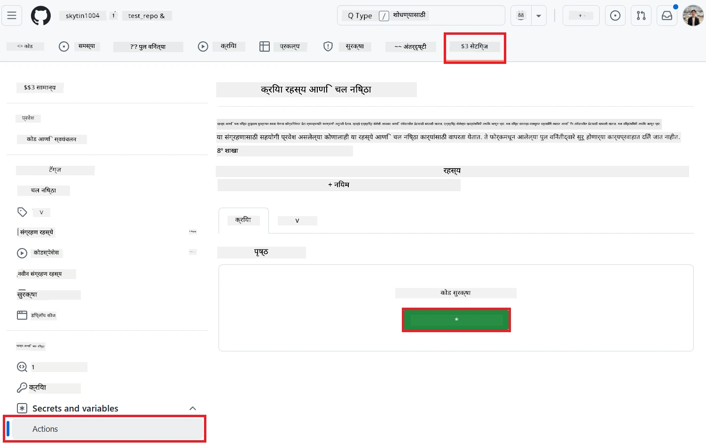
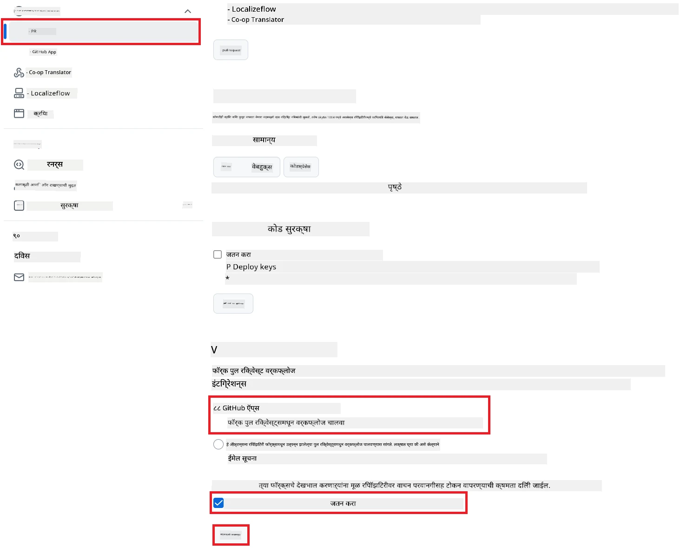

# Co-op Translator GitHub Action वापरणे (सार्वजनिक सेटअप)

**लक्ष्य वाचक:** हे मार्गदर्शन बहुतेक सार्वजनिक किंवा खाजगी रेपॉजिटरीसाठी आहे जिथे GitHub Actions ची सामान्य परवानगी पुरेशी आहे. यात अंगभूत `GITHUB_TOKEN` वापरले जाते.

तुमच्या रेपॉजिटरीच्या डॉक्युमेंटेशनचे भाषांतर Co-op Translator GitHub Action वापरून सहजपणे ऑटोमेट करा. हे मार्गदर्शन तुम्हाला हे Action सेटअप करण्याची प्रक्रिया समजावते, जेणेकरून तुमच्या मूळ Markdown फाइल्स किंवा प्रतिमा बदलल्यावर अपडेटेड भाषांतरांसह आपोआप pull requests तयार होतील.

> [!IMPORTANT]
>
> **योग्य मार्गदर्शन निवडा:**
>
> हे मार्गदर्शन **सोप्या सेटअपसाठी आहे, ज्यात फक्त `GITHUB_TOKEN` वापरले जाते**. हेच बहुतेक वापरकर्त्यांसाठी शिफारसीय आहे, कारण यात GitHub App Private Keys हाताळण्याची गरज नाही.
>

## पूर्वतयारी

GitHub Action कॉन्फिगर करण्यापूर्वी, आवश्यक AI सेवा क्रेडेन्शियल्स तयार ठेवा.

**1. आवश्यक: AI भाषा मॉडेल क्रेडेन्शियल्स**
किमान एका समर्थित Language Model साठी क्रेडेन्शियल्स लागतील:

- **Azure OpenAI**: Endpoint, API Key, Model/Deployment Names, API Version लागते.
- **OpenAI**: API Key लागते, (पर्यायी: Org ID, Base URL, Model ID).
- तपशीलांसाठी [Supported Models and Services](../../../../README.md) पहा.

**2. पर्यायी: AI Vision क्रेडेन्शियल्स (प्रतिमा भाषांतरासाठी)**

- फक्त प्रतिमांमधील मजकूराचे भाषांतर हवे असल्यासच आवश्यक.
- **Azure AI Vision**: Endpoint आणि Subscription Key लागते.
- दिले नाही, तर Action [Markdown-only mode](../markdown-only-mode.md) मध्ये चालेल.

## सेटअप आणि कॉन्फिगरेशन

GitHub Action मध्ये Co-op Translator सेटअप करण्यासाठी खालील स्टेप्स फॉलो करा, ज्यात फक्त `GITHUB_TOKEN` वापरले जाते.

### Step 1: प्रमाणीकरण समजून घ्या (`GITHUB_TOKEN` वापरून)

हा workflow GitHub Actions ने दिलेला अंगभूत `GITHUB_TOKEN` वापरतो. या टोकनला तुमच्या रेपॉजिटरीशी संवाद साधण्यासाठी आवश्यक परवानग्या आपोआप मिळतात, ज्या **Step 3** मध्ये सेट केल्या जातील.

### Step 2: रेपॉजिटरी Secrets कॉन्फिगर करा

फक्त तुमचे **AI सेवा क्रेडेन्शियल्स** रेपॉजिटरी सेटिंग्जमध्ये encrypted secrets म्हणून जोडायचे आहेत.

1.  तुमच्या GitHub रेपॉजिटरीमध्ये जा.
2.  **Settings** > **Secrets and variables** > **Actions** येथे जा.
3.  **Repository secrets** अंतर्गत, प्रत्येक आवश्यक AI सेवा साठी खालीलप्रमाणे **New repository secret** वर क्लिक करा.

     *(प्रतिमा संदर्भ: Secrets कुठे जोडायचे ते दाखवते)*

**आवश्यक AI सेवा Secrets (पूर्वतयारीनुसार लागू असलेले सर्व जोडा):**

| Secret Name                         | वर्णन                                 | Value Source                     |
| :---------------------------------- | :------------------------------------ | :------------------------------- |
| `AZURE_AI_SERVICE_API_KEY`            | Azure AI Service (Computer Vision) साठी Key  | तुमचे Azure AI Foundry               |
| `AZURE_AI_SERVICE_ENDPOINT`         | Azure AI Service (Computer Vision) साठी Endpoint | तुमचे Azure AI Foundry               |
| `AZURE_OPENAI_API_KEY`              | Azure OpenAI साठी Key                 | तुमचे Azure AI Foundry               |
| `AZURE_OPENAI_ENDPOINT`             | Azure OpenAI साठी Endpoint            | तुमचे Azure AI Foundry               |
| `AZURE_OPENAI_MODEL_NAME`           | Azure OpenAI Model Name               | तुमचे Azure AI Foundry               |
| `AZURE_OPENAI_CHAT_DEPLOYMENT_NAME` | Azure OpenAI Deployment Name          | तुमचे Azure AI Foundry               |
| `AZURE_OPENAI_API_VERSION`          | Azure OpenAI साठी API Version         | तुमचे Azure AI Foundry               |
| `OPENAI_API_KEY`                    | OpenAI साठी API Key                   | तुमचे OpenAI Platform              |
| `OPENAI_ORG_ID`                     | OpenAI Organization ID (पर्यायी)      | तुमचे OpenAI Platform              |
| `OPENAI_CHAT_MODEL_ID`              | OpenAI model ID (पर्यायी)             | तुमचे OpenAI Platform              |
| `OPENAI_BASE_URL`                   | OpenAI API Base URL (पर्यायी)         | तुमचे OpenAI Platform              |

### Step 3: Workflow Permissions कॉन्फिगर करा

GitHub Action ला `GITHUB_TOKEN` द्वारे कोड checkout आणि pull requests तयार करण्यासाठी परवानगी लागते.

1.  रेपॉजिटरीमध्ये **Settings** > **Actions** > **General** येथे जा.
2.  **Workflow permissions** विभागापर्यंत खाली स्क्रोल करा.
3.  **Read and write permissions** निवडा. यामुळे `GITHUB_TOKEN` ला `contents: write` आणि `pull-requests: write` परवानगी मिळेल.
4.  **Allow GitHub Actions to create and approve pull requests** या चेकबॉक्सला **चेक** करा.
5.  **Save** निवडा.



### Step 4: Workflow फाइल तयार करा

शेवटी, `GITHUB_TOKEN` वापरून ऑटोमेटेड workflow डिफाइन करणारी YAML फाइल तयार करा.

1.  रेपॉजिटरीच्या मूळ फोल्डरमध्ये `.github/workflows/` फोल्डर नसेल तर तयार करा.
2.  `.github/workflows/` मध्ये `co-op-translator.yml` नावाची फाइल तयार करा.
3.  खालील मजकूर `co-op-translator.yml` मध्ये पेस्ट करा.

```yaml
name: Co-op Translator

on:
  push:
    branches:
      - main

jobs:
  co-op-translator:
    runs-on: ubuntu-latest

    permissions:
      contents: write
      pull-requests: write

    steps:
      - name: Checkout repository
        uses: actions/checkout@v4
        with:
          fetch-depth: 0

      - name: Set up Python
        uses: actions/setup-python@v4
        with:
          python-version: '3.10'

      - name: Install Co-op Translator
        run: |
          python -m pip install --upgrade pip
          pip install co-op-translator

      - name: Run Co-op Translator
        env:
          PYTHONIOENCODING: utf-8
          # === AI Service Credentials ===
          AZURE_AI_SERVICE_API_KEY: ${{ secrets.AZURE_AI_SERVICE_API_KEY }}
          AZURE_AI_SERVICE_ENDPOINT: ${{ secrets.AZURE_AI_SERVICE_ENDPOINT }}
          AZURE_OPENAI_API_KEY: ${{ secrets.AZURE_OPENAI_API_KEY }}
          AZURE_OPENAI_ENDPOINT: ${{ secrets.AZURE_OPENAI_ENDPOINT }}
          AZURE_OPENAI_MODEL_NAME: ${{ secrets.AZURE_OPENAI_MODEL_NAME }}
          AZURE_OPENAI_CHAT_DEPLOYMENT_NAME: ${{ secrets.AZURE_OPENAI_CHAT_DEPLOYMENT_NAME }}
          AZURE_OPENAI_API_VERSION: ${{ secrets.AZURE_OPENAI_API_VERSION }}
          OPENAI_API_KEY: ${{ secrets.OPENAI_API_KEY }}
          OPENAI_ORG_ID: ${{ secrets.OPENAI_ORG_ID }}
          OPENAI_CHAT_MODEL_ID: ${{ secrets.OPENAI_CHAT_MODEL_ID }}
          OPENAI_BASE_URL: ${{ secrets.OPENAI_BASE_URL }}
        run: |
          # =====================================================================
          # IMPORTANT: Set your target languages here (REQUIRED CONFIGURATION)
          # =====================================================================
          # Example: Translate to Spanish, French, German. Add -y to auto-confirm.
          translate -l "es fr de" -y  # <--- MODIFY THIS LINE with your desired languages

      - name: Create Pull Request with translations
        uses: peter-evans/create-pull-request@v5
        with:
          token: ${{ secrets.GITHUB_TOKEN }}
          commit-message: "🌐 Update translations via Co-op Translator"
          title: "🌐 Update translations via Co-op Translator"
          body: |
            This PR updates translations for recent changes to the main branch.

            ### 📋 Changes included
            - Translated contents are available in the `translations/` directory
            - Translated images are available in the `translated_images/` directory

            ---
            🌐 Automatically generated by the [Co-op Translator](https://github.com/Azure/co-op-translator) GitHub Action.
          branch: update-translations
          base: main
          labels: translation, automated-pr
          delete-branch: true
          add-paths: |
            translations/
            translated_images/
```
4.  **Workflow कस्टमाईझ करा:**
  - **[!IMPORTANT] Target Languages:** `Run Co-op Translator` स्टेपमध्ये, `translate -l "..." -y` कमांडमधील भाषा कोड्सची यादी **तुमच्या प्रोजेक्टनुसार तपासा आणि बदला**. उदाहरणातील यादी (`ar de es...`) बदलणे किंवा अ‍ॅडजस्ट करणे आवश्यक आहे.
  - **Trigger (`on:`):** सध्या प्रत्येक `main` वरच्या push ला workflow चालतो. मोठ्या रेपॉजिटरीसाठी, YAML मधील उदाहरणाप्रमाणे `paths:` फिल्टर वापरून फक्त संबंधित फाइल्स बदलल्यावर workflow चालेल, ज्यामुळे runner minutes वाचतील.
  - **PR तपशील:** `Create Pull Request` स्टेपमधील `commit-message`, `title`, `body`, `branch` नाव, आणि `labels` गरजेनुसार कस्टमाईझ करा.

## Workflow चालवणे

> [!WARNING]  
> **GitHub-hosted Runner Time Limit:**  
> GitHub-hosted runners जसे की `ubuntu-latest` यांना **कमाल 6 तासांची execution time limit** आहे.  
> मोठ्या डॉक्युमेंटेशन रेपॉजिटरीसाठी, भाषांतर प्रक्रिया 6 तासांपेक्षा जास्त झाली तर workflow आपोआप थांबेल.  
> हे टाळण्यासाठी:  
> - **self-hosted runner** वापरा (वेळेची मर्यादा नाही)  
> - प्रत्येक रनमध्ये target languages ची संख्या कमी करा

`co-op-translator.yml` फाइल मुख्य ब्रँचमध्ये (किंवा `on:` trigger मध्ये दिलेल्या ब्रँचमध्ये) merge झाल्यावर, त्या ब्रँचवर (आणि `paths` फिल्टर लागू असल्यास, त्यानुसार) बदल push झाले की workflow आपोआप चालेल.

---

**अस्वीकरण**:
हे दस्तऐवज AI भाषांतर सेवा [Co-op Translator](https://github.com/Azure/co-op-translator) वापरून भाषांतरित केले आहे. आम्ही अचूकतेसाठी प्रयत्नशील असलो तरी, कृपया लक्षात घ्या की स्वयंचलित भाषांतरांमध्ये चुका किंवा अचूकतेचा अभाव असू शकतो. मूळ भाषेतील दस्तऐवज हा अधिकृत स्रोत मानावा. अत्यावश्यक माहितीसाठी, व्यावसायिक मानवी भाषांतराची शिफारस केली जाते. या भाषांतराचा वापर करून झालेल्या कोणत्याही गैरसमज किंवा चुकीच्या अर्थासाठी आम्ही जबाबदार राहणार नाही.