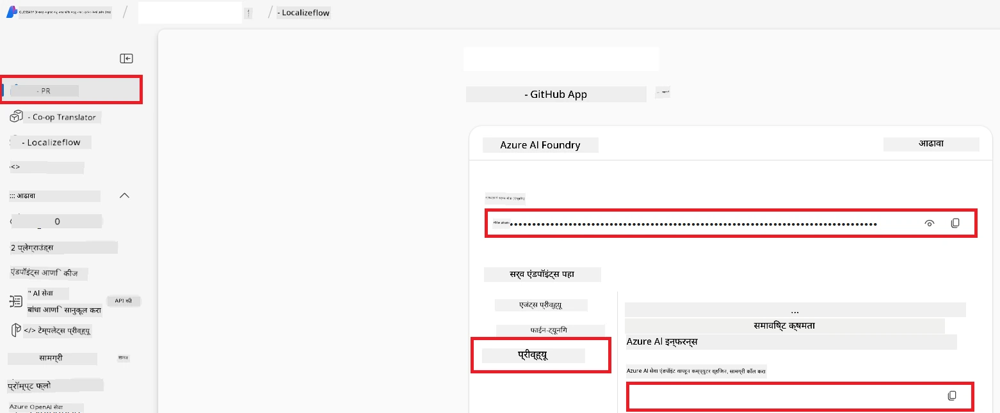

# Co-op Translator साठी Azure AI सेट अप करा (Azure OpneAI & Azure AI Vision)

हा मार्गदर्शक तुम्हाला Azure AI Foundry मध्ये भाषा अनुवादासाठी Azure OpenAI आणि प्रतिमेतील सामग्री विश्लेषणासाठी Azure Computer Vision (जे नंतर प्रतिमाधारित अनुवादासाठी वापरले जाऊ शकते) सेट अप कसे करायचे ते दर्शवितो.

**पूर्वआवश्यकता:**
- सक्रिय सदस्यता असलेले एक Azure खाते.
- आपल्या Azure सदस्यत्वात संसाधने आणि डिप्लॉयमेंट तयार करण्यासाठी पुरेशा परवानग्या.

## Azure AI प्रोजेक्ट तयार करा

तुम्ही Azure AI प्रोजेक्ट तयार करून सुरू कराल, जे तुमच्या AI संसाधनांचे व्यवस्थापन करण्यासाठी एक केंद्रीय स्थान म्हणून कार्य करते.

1. [https://ai.azure.com](https://ai.azure.com) येथे जा आणि तुमच्या Azure खात्याने साइन इन करा.

1. नवीन प्रोजेक्ट तयार करण्यासाठी **+Create** निवडा.

1. पुढील कार्य करा:
   - **Project name** एंटर करा (उदा., `CoopTranslator-Project`).
   - **AI hub** निवडा (उदा., `CoopTranslator-Hub`) (गरज असल्यास नवीन तयार करा).

1. तुमचा प्रोजेक्ट सेट अप करण्यासाठी "**Review and Create**" क्लिक करा. तुम्हाला तुमच्या प्रोजेक्टच्या ओव्हरव्ह्यू पृष्ठावर नेले जाईल.

## भाषांतरासाठी Azure OpenAI सेट अप करा

तुमच्या प्रोजेक्टमध्ये, तुम्ही मजकूर अनुवादासाठी बॅकएंड म्हणून कार्य करणार्‍या Azure OpenAI मॉडेलचे डिप्लॉयमेंट कराल.

### तुमच्या प्रोजेक्टमध्ये जा

जर आधीपासूनच नसल्यास, तुमचा नव्याने तयार केलेला प्रोजेक्ट (उदा., `CoopTranslator-Project`) Azure AI Foundry मध्ये उघडा.

### OpenAI मॉडेल डिप्लॉय करा

1. तुमच्या प्रोजेक्टच्या डाव्या बाजूच्या मेनूमध्ये, "My assets" अंतर्गत "**Models + endpoints**" निवडा.

1. **+ Deploy model** निवडा.

1. **Deploy Base Model** निवडा.

1. तुम्हाला उपलब्ध मॉडेल्सची यादी दर्शविली जाईल. योग्य GPT मॉडेल शोधा किंवा फिल्टर करा. आम्ही `gpt-4o` ची शिफारस करतो.

1. तुमचे इच्छित मॉडेल निवडा आणि **Confirm** क्लिक करा.

1. **Deploy** निवडा.

### Azure OpenAI कॉन्फिगरेशन

एकदा डिप्लॉय केल्यानंतर, तुम्ही "**Models + endpoints**" पृष्ठावरून त्याचा **REST endpoint URL**, **Key**, **Deployment name**, **Model name** आणि **API version** पाहू शकता. हे तुमच्या अनुप्रयोगात अनुवाद मॉडेल एकत्रित करण्यासाठी आवश्यक असतील.

> [!NOTE]
> तुम्ही तुमच्या गरजेनुसार [API version deprecation](https://learn.microsoft.com/azure/ai-services/openai/api-version-deprecation) पृष्ठावरून API आवृत्त्या निवडू शकता. लक्षात ठेवा की **API version** हे Azure AI Foundry मधील **Models + endpoints** पृष्ठावर दिसणाऱ्या **Model version** पेक्षा वेगळे आहे.

## प्रतिमा अनुवादासाठी Azure Computer Vision सेट अप करा

प्रतिमांमधील मजकूराचा अनुवाद सक्षम करण्यासाठी, तुम्हाला Azure AI Service API Key आणि Endpoint शोधायचे आहे.

1. तुमच्या Azure AI प्रोजेक्टमध्ये जा (उदा., `CoopTranslator-Project`). प्रोजेक्टच्या ओव्हरव्ह्यू पृष्ठावर असलेले सुनिश्चित करा.

### Azure AI सेवा कॉन्फिगरेशन

Azure AI सेवा मधून API Key आणि Endpoint शोधा.

1. तुमच्या Azure AI प्रोजेक्टमध्ये जा (उदा., `CoopTranslator-Project`). प्रोजेक्टच्या ओव्हरव्ह्यू पृष्ठावर असलेले सुनिश्चित करा.

1. Azure AI Service टॅबमध्ये **API Key** आणि **Endpoint** शोधा.

    

ही कनेक्शन लिंक केलेल्या Azure AI Services संसाधनाच्या (प्रतिमा विश्लेषणासहित) क्षमता तुमच्या AI Foundry प्रोजेक्टला उपलब्ध करून देते. तुम्ही नंतर या कनेक्शनचा वापर करून नॉटबुक्स किंवा अनुप्रयोगांमध्ये प्रतिमांमधून मजकूर काढू शकता, जो नंतर अनुवादासाठी Azure OpenAI मॉडेलकडे पाठवला जाऊ शकतो.

## तुमचे प्रमाणपत्र एकत्रित करणे

आत्तापर्यंत, तुम्ही खालील गोष्टी जमा केल्या असाव्यात:

**Azure OpenAI साठी (मजकूर अनुवाद):**
- Azure OpenAI Endpoint
- Azure OpenAI API Key
- Azure OpenAI Model Name (उदा., `gpt-4o`)
- Azure OpenAI Deployment Name (उदा., `cooptranslator-gpt4o`)
- Azure OpenAI API Version

**Azure AI सेवा साठी (दृष्टीद्वारे प्रतिमा मजकूर काढणे):**
- Azure AI Service Endpoint
- Azure AI Service API Key

### उदाहरण: पर्यावरण चल कॉन्फिगरेशन (पूर्वावलोकन)

नंतर, जेव्हा तुम्ही तुमचा अनुप्रयोग तयार कराल, तेव्हा तुम्ही हे जमा केलेले प्रमाणपत्रे वापरून त्यास कॉन्फिगर कराल. उदाहरणार्थ, तुम्ही त्यांना पर्यावरण चल म्हणून सेट करू शकता:

```bash
# Azure AI सेवा क्रेडेंशियल्स (छायाचित्र अनुवादासाठी आवश्यक)
AZURE_AI_SERVICE_API_KEY="your_azure_ai_service_api_key" # उदा., 21xasd...
AZURE_AI_SERVICE_ENDPOINT="https://your_azure_ai_service_endpoint.cognitiveservices.azure.com/"

# ऐच्छिक फॉलबॅक सेट: प्रत्यय _1/_2 सह समान चलांची प्रत (सर्व चलांसाठी सेटमधील समान निर्देशांक)
AZURE_AI_SERVICE_API_KEY_1="your_azure_ai_service_api_key_1"
AZURE_AI_SERVICE_ENDPOINT_1="https://your_azure_ai_service_endpoint_1.cognitiveservices.azure.com/"

# Azure OpenAI क्रेडेंशियल्स (मजकूर अनुवादासाठी आवश्यक)
AZURE_OPENAI_API_KEY="your_azure_openai_api_key" # उदा., 21xasd...
AZURE_OPENAI_ENDPOINT="https://your_azure_openai_endpoint.openai.azure.com/"
AZURE_OPENAI_MODEL_NAME="your_model_name" # उदा., gpt-4o
AZURE_OPENAI_CHAT_DEPLOYMENT_NAME="your_deployment_name" # उदा., cooptranslator-gpt4o
AZURE_OPENAI_API_VERSION="your_api_version" # उदा., 2024-12-01-preview

# ऐच्छिक फॉलबॅक सेट: प्रत्यय _1/_2 सह पूर्ण AZURE_OPENAI_* सेटची प्रत (सर्व चलांसाठी समान निर्देशांक)
```

---

### पुढील वाचन

- [Azure AI Foundry मध्ये प्रोजेक्ट कसे तयार करावे](https://learn.microsoft.com/azure/ai-foundry/how-to/create-projects?tabs=ai-studio)
- [Azure AI संसाधने कशी तयार करावी](https://learn.microsoft.com/azure/ai-foundry/how-to/create-azure-ai-resource?tabs=portal)
- [Azure AI Foundry मध्ये OpenAI मॉडेल कसे डिप्लॉय करावे](https://learn.microsoft.com/en-us/azure/ai-foundry/how-to/deploy-models-openai)

---

<!-- CO-OP TRANSLATOR DISCLAIMER START -->
**अस्वीकरण**:
या दस्तऐवजाचे भाषांतर AI अनुवाद सेवा [Co-op Translator](https://github.com/Azure/co-op-translator) वापरून केले आहे. आम्ही अचूकतेसाठी प्रयत्न करतो, तरीही कृपया लक्षात घ्या की स्वयंचलित अनुवादांमध्ये चुका किंवा असत्यता असू शकतात. मूळ दस्तऐवज त्याच्या स्थानिक भाषेत अधिकृत स्रोत मानला पाहिजे. महत्त्वाच्या माहितीसाठी व्यावसायिक मानवी अनुवादाची शिफारस केली जाते. या अनुवादाच्या वापरामुळे झालेल्या कोणत्याही गैरसमज किंवा चुकीच्या अर्थ लागण्याच्या जबाबदारी आम्ही घेत नाही.
<!-- CO-OP TRANSLATOR DISCLAIMER END -->