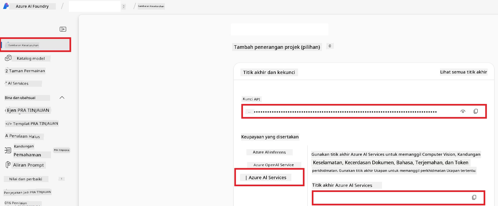

# Sediakan Azure AI untuk Co-op Translator (Azure OpneAI & Azure AI Vision)

Panduan ini akan membimbing anda melalui penyediaan Azure OpenAI untuk terjemahan bahasa dan Azure Computer Vision untuk analisis kandungan imej (yang kemudian boleh digunakan untuk terjemahan berasaskan imej) dalam Azure AI Foundry.

**Prasyarat:**
- Akaun Azure dengan langganan aktif.
- Kebenaran yang mencukupi untuk mencipta sumber dan penempatan dalam langganan Azure anda.

## Cipta Projek Azure AI

Anda akan memulakan dengan mencipta Projek Azure AI, yang berfungsi sebagai tempat pusat untuk mengurus sumber AI anda.

1. Lawati [https://ai.azure.com](https://ai.azure.com) dan log masuk dengan akaun Azure anda.

1. Pilih **+Create** untuk mencipta projek baru.

1. Lakukan tugasan berikut:
   - Masukkan **Nama Projek** (contoh, `CoopTranslator-Project`).
   - Pilih **AI hub** (contoh, `CoopTranslator-Hub`) (Cipta yang baru jika perlu).

1. Klik "**Review and Create**" untuk menyediakan projek anda. Anda akan dibawa ke halaman gambaran keseluruhan projek anda.

## Sediakan Azure OpenAI untuk Terjemahan Bahasa

Dalam projek anda, anda akan menempatkan model Azure OpenAI sebagai backend untuk terjemahan teks.

### Navigasi ke Projek Anda

Jika belum berada di sana, buka projek baru anda (contoh, `CoopTranslator-Project`) dalam Azure AI Foundry.

### Tempatkan Model OpenAI

1. Dari menu kiri projek anda, di bawah "My assets", pilih "**Models + endpoints**".

1. Pilih **+ Deploy model**.

1. Pilih **Deploy Base Model**.

1. Anda akan dipaparkan senarai model yang ada. Tapis atau cari model GPT yang sesuai. Kami mengesyorkan `gpt-4o`.

1. Pilih model yang anda inginkan dan klik **Confirm**.

1. Pilih **Deploy**.

### Konfigurasi Azure OpenAI

Setelah ditempatkan, anda boleh memilih penempatan dari halaman "**Models + endpoints**" untuk mencari **REST endpoint URL**, **Kunci**, **Nama penempatan**, **Nama model** dan **Versi API**. Ini diperlukan untuk mengintegrasikan model terjemahan ke dalam aplikasi anda.

> [!NOTE]
> Anda boleh memilih versi API dari halaman [API version deprecation](https://learn.microsoft.com/azure/ai-services/openai/api-version-deprecation) mengikut keperluan anda. Perlu diingat bahawa **Versi API** berbeza daripada **Versi Model** yang dipaparkan pada halaman **Models + endpoints** dalam Azure AI Foundry.

## Sediakan Azure Computer Vision untuk Terjemahan Imej

Untuk membolehkan terjemahan teks dalam imej, anda perlu mencari Kunci API dan Endpoint Perkhidmatan Azure AI.

1. Lawati Projek Azure AI anda (contoh, `CoopTranslator-Project`). Pastikan anda berada di halaman gambaran keseluruhan projek.

### Konfigurasi Perkhidmatan Azure AI

Cari Kunci API dan Endpoint dari Perkhidmatan Azure AI.

1. Lawati Projek Azure AI anda (contoh, `CoopTranslator-Project`). Pastikan anda berada di halaman gambaran keseluruhan projek.

1. Cari **Kunci API** dan **Endpoint** dari tab Perkhidmatan Azure AI.

    

Sambungan ini membolehkan kemampuan sumber Perkhidmatan Azure AI yang dipautkan (termasuk analisis imej) tersedia untuk projek AI Foundry anda. Anda kemudian boleh menggunakan sambungan ini dalam buku nota atau aplikasi anda untuk mengekstrak teks dari imej, yang seterusnya boleh dihantar ke model Azure OpenAI untuk terjemahan.

## Menggabungkan Kredensial Anda

Sekarang, anda sepatutnya telah mengumpul:

**Untuk Azure OpenAI (Terjemahan Teks):**
- Endpoint Azure OpenAI
- Kunci API Azure OpenAI
- Nama Model Azure OpenAI (contoh, `gpt-4o`)
- Nama Penempatan Azure OpenAI (contoh, `cooptranslator-gpt4o`)
- Versi API Azure OpenAI

**Untuk Perkhidmatan Azure AI (Pengekstrakan Teks Imej melalui Vision):**
- Endpoint Perkhidmatan Azure AI
- Kunci API Perkhidmatan Azure AI

### Contoh: Konfigurasi Pembolehubah Persekitaran (Pratonton)

Kemudian, apabila membina aplikasi anda, anda mungkin akan mengkonfigurasinya menggunakan kredensial yang telah dikumpul. Sebagai contoh, anda mungkin menetapkannya sebagai pembolehubah persekitaran seperti berikut:

```bash
# Kredensial Perkhidmatan Azure AI (Diperlukan untuk terjemahan imej)
AZURE_AI_SERVICE_API_KEY="your_azure_ai_service_api_key" # contohnya, 21xasd...
AZURE_AI_SERVICE_ENDPOINT="https://your_azure_ai_service_endpoint.cognitiveservices.azure.com/"

# Set fallback pilihan: gandakan pembolehubah dengan sufiks _1/_2 (indeks sama untuk semua pembolehubah dalam set)
AZURE_AI_SERVICE_API_KEY_1="your_azure_ai_service_api_key_1"
AZURE_AI_SERVICE_ENDPOINT_1="https://your_azure_ai_service_endpoint_1.cognitiveservices.azure.com/"

# Kredensial Azure OpenAI (Diperlukan untuk terjemahan teks)
AZURE_OPENAI_API_KEY="your_azure_openai_api_key" # contohnya, 21xasd...
AZURE_OPENAI_ENDPOINT="https://your_azure_openai_endpoint.openai.azure.com/"
AZURE_OPENAI_MODEL_NAME="your_model_name" # contohnya, gpt-4o
AZURE_OPENAI_CHAT_DEPLOYMENT_NAME="your_deployment_name" # contohnya, cooptranslator-gpt4o
AZURE_OPENAI_API_VERSION="your_api_version" # contohnya, 2024-12-01-preview

# Set fallback pilihan: gandakan set AZURE_OPENAI_* penuh dengan sufiks _1/_2 (indeks sama untuk semua pembolehubah)
```

---

### Bacaan Lanjut

- [Cara Cipta projek dalam Azure AI Foundry](https://learn.microsoft.com/azure/ai-foundry/how-to/create-projects?tabs=ai-studio)
- [Cara Cipta sumber Azure AI](https://learn.microsoft.com/azure/ai-foundry/how-to/create-azure-ai-resource?tabs=portal)
- [Cara Menempatkan model OpenAI dalam Azure AI Foundry](https://learn.microsoft.com/en-us/azure/ai-foundry/how-to/deploy-models-openai)

---

<!-- CO-OP TRANSLATOR DISCLAIMER START -->
**Penafian**:  
Dokumen ini telah diterjemahkan menggunakan perkhidmatan terjemahan AI [Co-op Translator](https://github.com/Azure/co-op-translator). Walaupun kami berusaha untuk ketepatan, sila ambil maklum bahawa terjemahan automatik mungkin mengandungi kesilapan atau ketidakakuratan. Dokumen asal dalam bahasa asalnya harus dianggap sebagai sumber yang sahih. Untuk maklumat penting, terjemahan manusia profesional disyorkan. Kami tidak bertanggungjawab terhadap sebarang salah faham atau salah tafsir yang timbul daripada penggunaan terjemahan ini.
<!-- CO-OP TRANSLATOR DISCLAIMER END -->