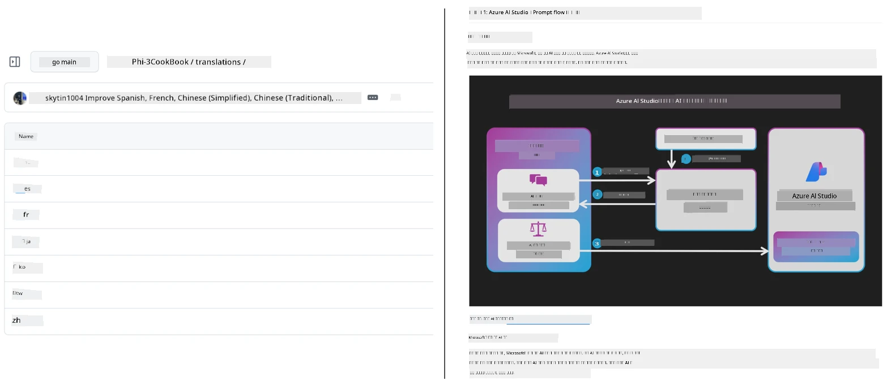
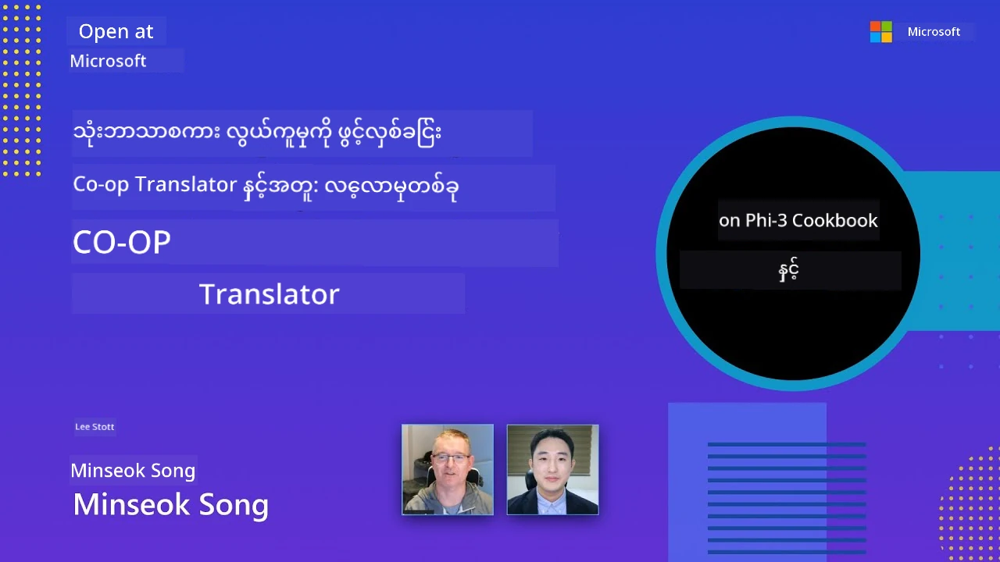

# Co-op Translator

_သင့်ပညာရေး GitHub အကြောင်းအရာများကို ဘာသာစကားများစွာဖြင့် ပရောဂျက်တိုးတက်မှုနှင့်အမျှ လွယ်ကူစွာ အလိုအလျောက်ဘာသာပြန်ပြီး ထိန်းသိမ်းနိုင်ပါသည်။_


[](https://pypi.org/project/co-op-translator/)
[](https://github.com/azure/co-op-translator/blob/main/LICENSE)
[](https://pepy.tech/project/co-op-translator)
[](https://pepy.tech/project/co-op-translator)
[](https://github.com/azure/co-op-translator/pkgs/container/co-op-translator)
[](https://github.com/psf/black)

[](https://GitHub.com/azure/co-op-translator/graphs/contributors/)
[](https://GitHub.com/azure/co-op-translator/issues/)
[](https://GitHub.com/azure/co-op-translator/pulls/)
[](http://makeapullrequest.com)

### 🌐 ဘာသာစကားစုံ ထောက်ခံမှု

#### [Co-op Translator](https://github.com/Azure/Co-op-Translator) မှ ထောက်ခံသည်

<!-- CO-OP TRANSLATOR LANGUAGES TABLE START -->
[Arabic](../ar/README.md) | [Bengali](../bn/README.md) | [Bulgarian](../bg/README.md) | [Burmese (Myanmar)](./README.md) | [Chinese (Simplified)](../zh-CN/README.md) | [Chinese (Traditional, Hong Kong)](../zh-HK/README.md) | [Chinese (Traditional, Macau)](../zh-MO/README.md) | [Chinese (Traditional, Taiwan)](../zh-TW/README.md) | [Croatian](../hr/README.md) | [Czech](../cs/README.md) | [Danish](../da/README.md) | [Dutch](../nl/README.md) | [Estonian](../et/README.md) | [Finnish](../fi/README.md) | [French](../fr/README.md) | [German](../de/README.md) | [Greek](../el/README.md) | [Hebrew](../he/README.md) | [Hindi](../hi/README.md) | [Hungarian](../hu/README.md) | [Indonesian](../id/README.md) | [Italian](../it/README.md) | [Japanese](../ja/README.md) | [Kannada](../kn/README.md) | [Khmer](../km/README.md) | [Korean](../ko/README.md) | [Lithuanian](../lt/README.md) | [Malay](../ms/README.md) | [Malayalam](../ml/README.md) | [Marathi](../mr/README.md) | [Nepali](../ne/README.md) | [Nigerian Pidgin](../pcm/README.md) | [Norwegian](../no/README.md) | [Persian (Farsi)](../fa/README.md) | [Polish](../pl/README.md) | [Portuguese (Brazil)](../pt-BR/README.md) | [Portuguese (Portugal)](../pt-PT/README.md) | [Punjabi (Gurmukhi)](../pa/README.md) | [Romanian](../ro/README.md) | [Russian](../ru/README.md) | [Serbian (Cyrillic)](../sr/README.md) | [Slovak](../sk/README.md) | [Slovenian](../sl/README.md) | [Spanish](../es/README.md) | [Swahili](../sw/README.md) | [Swedish](../sv/README.md) | [Tagalog (Filipino)](../tl/README.md) | [Tamil](../ta/README.md) | [Telugu](../te/README.md) | [Thai](../th/README.md) | [Turkish](../tr/README.md) | [Ukrainian](../uk/README.md) | [Urdu](../ur/README.md) | [Vietnamese](../vi/README.md)

> **ဒေသတွင်း ကလုန်းလုပ်ချင်ပါသလား?**
>
> ဤမှုရင်းတွင် ဘာသာပြန်ချက် ၅၀ ကျော် ပါဝင်သည့်အတွက် ဒေါင်းလုဒ်အရွယ်အစား အလွန်ကြီးလာနိုင်ပါသည်။ ဘာသာပြန်ချက် မပါဘဲ ကလုန်းလုပ်ရန် sparse checkout ကို အသုံးပြုပါ။
>
> **Bash / macOS / Linux:**
> ```bash
> git clone --filter=blob:none --sparse https://github.com/Azure/co-op-translator.git
> cd co-op-translator
> git sparse-checkout set --no-cone '/*' '!translations' '!translated_images'
> ```
>
> **CMD (Windows):**
> ```cmd
> git clone --filter=blob:none --sparse https://github.com/Azure/co-op-translator.git
> cd co-op-translator
> git sparse-checkout set --no-cone "/*" "!translations" "!translated_images"
> ```
>
> ၎င်းသည် သင်ကို သင့်ဘာသာသင်ကြားမှုကို အလျင်အမြန်ပြီးစုံစမ်းပြီး ပြီးစီးနိုင်ရန် လိုအပ်သမျှ အရာအားလုံးကို ပေးပါသည်။
<!-- CO-OP TRANSLATOR LANGUAGES TABLE END -->

[](https://GitHub.com/azure/co-op-translator/watchers/)
[](https://GitHub.com/azure/co-op-translator/network/)
[](https://GitHub.com/azure/co-op-translator/stargazers/)

[](https://discord.gg/nTYy5BXMWG)

[](https://codespaces.new/azure/co-op-translator)

## အကြောင်းအရာအမြင်

**Co-op Translator** သည် သင်၏ ပညာရေး GitHub အကြောင်းအရာများကို ဘာသာစကားစုံသို့ လွယ်ကူစွာ လိုကာထိုက်ထိုက် ပြဿနာကင်းစွာ ဘာသာပြန်နိုင်ပါသည်။
Markdown ဖိုင်များ၊ ပုံများ သို့မဟုတ် notebook များကို အပ်ဒိတ်လုပ်သည်နှင့်အမျှ ဘာသာပြန်ချက်များသည် အလိုအလျောက် ကိုက်ညီစွာ အချိန်နောက်လေးကျစေမှုမရှိပါ။
ကမ္ဘာတဝှမ်းရှိ သင်ယူသူများအတွက် သတင်းအချက်အလက်များမှန်ကန်စွာ၊ စနစ်တကျ ရှိနေပါသည်။

ဘာသာပြန်ထားသော အကြောင်းအရာ များသည် ပုံမှန် စီစဉ်မှု အတိုင်း အောက်ပါပုံစံဖြင့် ပါရှိသည် -



## ဘာသာပြန်ခြင်းအခြေအနေကို မည်သို့စီမံသည်

Co-op Translator သည် ဘာသာပြန်ထားသော အကြောင်းအရာများကို **ဗားရှင်း ထိန်းချုပ်ထားသော ဆော့ဖ်ဝဲ ပစ္စည်းများ** အဖြစ် စီမံသည်၊  
တည်၍ ရှိရာဖိုင်များအဖြစ် မဟုတ်ပါ။

အဆိုပါကိရိယာ သည် ဘာသာပြန်ထားသော Markdown, ပုံများနှင့် notebooks အခြေအနေကို  
**ဘာသာစကားအလိုက် Metadata** ဖြင့် ဆက်လက်နားလည်သည်။

ဒီဖွဲ့စည်းပုံကြောင့် Co-op Translator သည် -

- စံနှုန်းမကျသော ဘာသာပြန်ချက်များအား ယုံကြည်စိတ်ချစွာ ရှာဖွေနိုင်သည်
- Markdown, ပုံများနှင့် notebooks များကို တပြိုင်နက်ထဲ ယှဉ်တွဲ ချိန်ညှိနိုင်သည်
- အကြီးစား၊ မြန်ဆန်ပြီး ဘာသာစကားစုံ repository များတွင် လုံခြုံစိတ်ချစွာ များပြားစွာ တိုးချဲ့နိုင်သည်

ဘာသာပြန်ကို ထိန်းချုပ်ထားသည့် ပစ္စည်းများအဖြစ် မော်ဒယ်ဖော်ခြင်းဖြင့်၊  
ဘာသာပြန်လုပ်ငန်းစဉ်များအား ဆော့ဖ်ဝဲ စွဲချက်နှင့် ပစ္စည်းစီမံခန့်ခွဲမှု နည်းလမ်းများနှင့် သဘာဝကျစွာ ကိုက်ညီစေပါသည်။

→ [ဘာသာပြန်ခြင်းအခြေအနေကို မည်သို့စီမံသည်](https://techcommunity.microsoft.com/blog/azuredevcommunityblog/rethinking-documentation-translation-treating-translations-as-versioned-software/4491755)


## လျင်မြန်စတင်အသုံးပြုခြင်း

```bash
# အမြင့်တင်သာသော ပတ်ဝန်းကျင်တစ်ခုကို ဖန်တီးနှင့် ဖွင့်လှစ်ပါ (အကြံပြုချက်)
python -m venv .venv
# Windows
.venv\Scripts\activate
# macOS/Linux
source .venv/bin/activate
# ထုပ်ပိုးမှုကို တပ်ဆင်ပါ
pip install co-op-translator
# ဘာသာပြန်ပါ
translate -l "ko ja fr" -md
```

Docker:

```bash
# GHCR မှ ပြည်သူ့ပုံရိပ်ကို ဆွဲယူပါ
docker pull ghcr.io/azure/co-op-translator:latest
# လက်ရှိဖိုလ်ဒါနှင့် .env ကို ပေးပြီး အလှည့်ကျ လည်ပတ်ပါ (Bash/Zsh)
docker run --rm -it --env-file .env -v "${PWD}:/work" ghcr.io/azure/co-op-translator:latest -l "ko ja fr" -md
```

## အနည်းဆုံး စတင်ထားခြင်း

1. သင်သည် သတ်မှတ် ထောက်ခံထားသော Python ဗားရှင်း (လက်ရှိမှာ 3.10-3.12) ရှိကြောင်း သေချာစေပါ။ poetry (pyproject.toml) တွင် အလိုအလျောက် တာဝန်ယူထားသည်။
2. နမူနာအတိုင်း `.env` ဖိုင်တစ်ခု ဖန်တီးပါ: [.env.template](../../.env.template)
3. LLM ပံ့ပိုးသူတစ်ခု (Azure OpenAI သို့မဟုတ် OpenAI) ကို ပြင်ဆင်ပါ
4. (ရွေးချယ်စရာ) ပုံဘာသာပြန်ခြင်းအတွက် (`-img`), Azure AI Vision ကို ပြင်ဆင်ပါ
5. (ရွေးချယ်စရာ) စာရင်းတစ်ခုထက်ပိုသော လက်မှတ်အတည်ပြုချက်များအား `_1`, `_2` စသဖြင့် ထပ်တိုးရန် ရှိပါက ပြုလုပ်နိုင်သည်။ တစ်ခုချင်းစီ၏ အပြည့်အစုံ variable များသည် suffix တူညီရပါမည်။
6. (အကြံပြုချက်) ယခင်ဘာသာပြန်ချက်များကို အတုမရှိစေရန် ရှင်းလင်းပေးပါ (ဥပမာ `translations/`)
7. (အကြံပြုချက်) သင်၏ README ထဲတွင် ဘာသာပြန်အပိုင်း တစ်ခု ထည့်ပါ: [README languages template](./getting_started/README_languages_template.md)
8. ကြည့်ရန်: [Azure AI ပြင်ဆင်ခြင်း](./getting_started/set-up-azure-ai.md)

## အသုံးပြုမှု

ထောက်ခံသော အမျိုးအစားအားလုံးကို ဘာသာပြန်ပါ:

```bash
translate -l "ko ja"
```

Markdown သာ:

```bash
translate -l "de" -md
```

Markdown + ပုံများ:

```bash
translate -l "pt" -md -img
```

Notebook သာ:

```bash
translate -l "zh" -nb
```

အပိုတံဆိပ်များ: [ကိရိယာ ရည်ညွှန်းချက်](./getting_started/command-reference.md)

## လက္ခဏာများ

- Markdown, notebooks, ပုံတို့ကို အလိုအလျောက် ဘာသာပြန်ခြင်း
- မူလအကြောင်းအရာ ပြောင်းလဲမှသာ ဘာသာပြန်ချက်များကို ကိုက်ညီစေခြင်း
- ဒေသတွင်း (CLI) သို့မဟုတ် CI (GitHub Actions) မှာ အသုံးပြုနိုင်
- Azure OpenAI သို့မဟုတ် OpenAI ကို သုံးပြီး ပုံများအတွက် Azure AI Vision ကို ရွေးချယ်အသုံးပြုနိုင်ခြင်း
- Markdown အတွင်းပုံစံနှင့် ဖွဲ့စည်းပုံကို ထိန်းသိမ်းထားခြင်း

## စာရွက်စာတမ်းများ

- [ကိရိယာ လမ်းညွှန်](./getting_started/command-line-guide/command-line-guide.md)
- [GitHub Actions လမ်းညွှန် (အများပိုင် repositories နှင့် စံများ secret များ)](./getting_started/github-actions-guide/github-actions-guide-public.md)
- [GitHub Actions လမ်းညွှန် (Microsoft အဖွဲ့အစည်း repositories နှင့် အဖွဲ့အစည်းအဆင့် စနစ်များ)](./getting_started/github-actions-guide/github-actions-guide-org.md)
- [README languages template](./getting_started/README_languages_template.md)
- [ထောက်ခံသော ဘာသာစကားများ](./getting_started/supported-languages.md)
- [ဆက်လက်ပံ့ပိုးရေး](./CONTRIBUTING.md)
- [ပြဿနာဖြေရှင်းခြင်း](./getting_started/troubleshooting.md)

### Microsoft အတွက် အထူးလမ်းညွှန်
> [!NOTE]
> Microsoft “For Beginners” repositories များအတွက် maintainers များသာ။

- [“အခြားဘာသာရပ်များ” စာရင်း ကို ရှင်းလင်းချက် (MS Beginners repositories အတွက်)](./getting_started/update-other-courses.md)

## ကျွန်ုပ်တို့အား ပံ့ပိုးပေးပြီး ကမ္ဘာတစ်ဝှမ်း သင်ယူမှု ဖွံ့ဖြိုးတိုးတက်စေခြင်း

ပညာရေး အကြောင်းအရာများကို ကမ္ဘာတစ်ဝှမ်းတွင် မည်သို့မျှဝေကြောင်း ကြီးမားသော ပြောင်းလဲမှုတွင် ကျွန်ုပ်တို့နှင့်တကွပါဝင်ပါ။ [Co-op Translator](https://github.com/azure/co-op-translator) အတွက် GitHub တွင် ⭐ ပေးပြီး သင်ယူခြင်းနှင့် နည်းပညာဘက်ကန့်သတ်ချက်များကို ပြိုကွဲစေခြင်းဆိုင်ရာ ကျွန်ုပ်တို့၏ ရည်မှန်းချက်ကို ထောက်ပံ့ပါ။ သင်၏ စိတ်ဝင်စားမှုနှင့် အစီရင်ခံချက်များသည် အရေးပါသော သက်ရောက်မှုရှိစေပါသည်။ ကုဒ်နှင့် လက္ခဏာ အကြံပြုချက်များကို အမြဲလက်ခံပါသည်။

### သင့်ဘာသာစကားဖြင့် Microsoft ပညာရေး အကြောင်းအရာများကို ရှာဖွေပါ

- [LangChain4j-for-Beginners](https://github.com/microsoft/LangChain4j-for-Beginners)
- [AZD for Beginners](https://github.com/microsoft/AZD-for-beginners)
- [Edge AI for Beginners](https://github.com/microsoft/edgeai-for-beginners)
- [Model Context Protocol (MCP) For Beginners](https://github.com/microsoft/mcp-for-beginners)
- [AI Agents for Beginners](https://github.com/microsoft/ai-agents-for-beginners)
- [Generative AI for Beginners using .NET](https://github.com/microsoft/Generative-AI-for-beginners-dotnet)
- [Generative AI for Beginners](https://github.com/microsoft/generative-ai-for-beginners)
- [Generative AI for Beginners using Java](https://github.com/microsoft/generative-ai-for-beginners-java)
- [ML for Beginners](https://aka.ms/ml-beginners)
- [Data Science for Beginners](https://aka.ms/datascience-beginners)
- [AI for Beginners](https://aka.ms/ai-beginners)
- [Cybersecurity for Beginners](https://github.com/microsoft/Security-101)
- [Web Dev for Beginners](https://aka.ms/webdev-beginners)
- [IoT for Beginners](https://aka.ms/iot-beginners)
- [PhiCookBook](https://github.com/microsoft/PhiCookBook)

## ဗီဒီယို တင်ဆက်မှုများ

👉 အောက်ဖော်ပြပါပုံကို နှိပ်၍ YouTube တွင် ကြည့်ရှုပါ။

- **Open at Microsoft**: Co-op Translator ကို မည်သို့ အသုံးပြုရမည်ကို အနည်းငယ် ၁၈ မိနစ်စာ မိတ်ဆက်ခြင်းနှင့် အလျင်အျမန္ လမ်းညွှန်ချက်။

  [](https://www.youtube.com/watch?v=jX_swfH_KNU)

## ဝင်ရောက်ပံ့ပိုးခြင်း

ဤပရောဂျက်သည် ဝင်ရောက်ပံ့ပိုးမှုများနှင့် အကြံပေးချက်များအား ကြိုဆိုပါသည်။ Azure Co-op Translator တွင် ဝင်ရောက် ပံ့ပိုးလိုပါက ကျွန်ုပ်တို့၏ [CONTRIBUTING.md](./CONTRIBUTING.md) ကို ကြည့်ရှု၍ Co-op Translator ကို ပိုမိုလွယ်ကူစေရန် အကြံပြုနည်းလမ်းများ စာအလိုက် လမ်းညွှန်ချက်များကို ပြုလုပ်ပါ။

## ဝင်ရောက် ပံ့ပိုးသူများ
[](https://github.com/Azure/co-op-translator/graphs/contributors)

## လုပ်ငန်းစည်းကမ်းချက်

ဤပရောဂျက်သည် [Microsoft Open Source Code of Conduct](https://opensource.microsoft.com/codeofconduct/) အသုံးပြုထားသည်။
ပိုမိုသိရှိလိုပါက [Code of Conduct FAQ](https://opensource.microsoft.com/codeofconduct/faq/) ကိုကြည့်ရှုပါ 
သို့မဟုတ် ပိုမိုမေးမြန်းချင်သည်များအတွက် [opencode@microsoft.com](mailto:opencode@microsoft.com) သို့ ဆက်သွယ်နိုင်ပါသည်။

## တာဝန်ယူသော AI

Microsoft သည် ကျွန်ုပ်တို့၏ AI ထုတ်ကုန်များကို တာဝန်ရှိစွာ အသုံးပြုရန် သုံးစွဲသူများကို အကူအညီပေးရန်၊ သင်ခန်းစာများကို မွေ့လျော်ဝေှပ်ရန်နှင့် Transparency Notes နှင့် Impact Assessments ကဲ့သို့သော ကိရိယာများမှတဆင့် ယုံကြည်မှုအခြေပြု ပူးပေါင်းဆောင်ရွက်မှုများ တည်ဆောက်ရန် ကတိပြုထားသည်။ ဤရင်းမြစ်များအများအပြားကို [https://aka.ms/RAI](https://aka.ms/RAI) တွင်တွေ့ရှိနိုင်ပါသည်။
Microsoft ၏ တာဝန်ယူသော AI သဘောထားသည် တရားမျှတမှု၊ ယုံကြည်စိတ်ချရမှုနှင့် လုံခြုံမှု၊ ကိုယ်ရေးကိုယ်တာမှုနှင့် လုံခြုံမှု၊ ပါဝင်မှု၊ ထုတ်ဖော်ပြသမှုနှင့် တာဝန်ယူမှုတို့ကို အခြေခံထားသည်။

ဤနမူနာတွင် အသုံးပြုသော အကြီးမားဆုံး သဘာဝဘာသာစကား၊ ပုံနှင့် အသံ မော်ဒယ်များက တရားမျှတမှုမရှိခြင်း၊ ယုံကြည်စိတ်ချရမှုမရှိခြင်း သို့မဟုတ် တရားမဝင်သောအပြုအမူများပြုရန် အလားရှိပြီး ထိုသို့ဖြစ်လိမ့်မည်သည်ဟု ထင်မြင်နိုင်ပြီး ထိုကဲ့သို့၏ အဲဒီပြဿနာများကို ကာကွယ်ရန် ทาง [Azure OpenAI service Transparency note](https://learn.microsoft.com/legal/cognitive-services/openai/transparency-note?tabs=text) တွင် အန္တရာယ်များနှင့် ကန့်သတ်ချက်များကို သတိပြုလေ့လာနိုင်ပါသည်။

ဤအန္တရာယ်များကို လျော့နည်းစေရန် အကြံပြုသောနည်းလမ်းသည် စနစ် architecture ထဲတွင် ကာကွယ်မှုစနစ်တစ်ခု ထည့်သွင်း၍ အဆိုးပြု အပြုအမူများကို တွေ့ရှိတားဆီးနိုင်စေရန် ဖြစ်သည်။ [Azure AI Content Safety](https://learn.microsoft.com/azure/ai-services/content-safety/overview) သည် သီးခြားကာကွယ်စောင့်ရှောက်မှုအဆင့်တစ်ခုဖြစ်ပြီး အသုံးပြုသူမှ ဖန်တီးသော ထုတ်ကုန်များနှင့် AI ဖန်တီးသော အကြောင်းအရာများကို ရှာဖွေတားဆီးနိုင်သည်။ Azure AI Content Safety သည်စာသားနှင့် ပုံ API များပါဝင်ပြီး အဆိုးပြု အကြောင်းအရာများကို ရှာဖွေဖော်ထုတ်နိုင်သည်။ ထို့ပြင် Content Safety Studio ကိုလည်း အသုံးပြုနိုင်ပြီး အပြောက်အနေ အမျိုးမျိုးရှိသော လူမှုဆက်ဆံမှုများအတွက် သင့်အနေဖြင့် ကြည့်ရှု၊ စူးစမ်း နှင့် နမူနာကုဒ်များကို စမ်းသပ်နိုင်ပါသည်။ အောက်ပါ [quickstart documentation](https://learn.microsoft.com/azure/ai-services/content-safety/quickstart-text?tabs=visual-studio%2Clinux&pivots=programming-language-rest) သည် ဝန်ဆောင်မှုကို အဆိုပြုလွှာများ ဖြင့် ခေါ်ယူရန် လမ်းညွှန်ပေးသည်။

တစ်ခြားအချက်မှာ စာရင်းလုံးစုံ application performance ဖြစ်သည်။ multi-modal နှင့် multi-models applications များတွင် performance ဆိုသည်မှာ ဆော့ဖ်ဝဲလ်သည် သင်နှင့် သုံးစွဲသူများ မျှော်လင့်သောအတိုင်း လုပ်ဆောင်နိုင်မှုဖြစ်ပြီး အဆိုးအမြှောက်များ မထုတ်လွှတ်ပေးခြင်းပါရှိသည်။ သင့်၏ လုံး၀ application performance ကို [generation quality and risk and safety metrics](https://learn.microsoft.com/azure/ai-studio/concepts/evaluation-metrics-built-in) အသုံးပြု၍ တုံ့ပြန်မှုများကို သုံးသပ်ရန်အရေးကြီးသည်။

သင်၏ AI application ကို ဖွံ့ဖြိုးတိုးတက်ရေးပတ်ဝန်းကျင် အတွင်းတွင် [prompt flow SDK](https://microsoft.github.io/promptflow/index.html) အသုံးပြု၍ အကဲဖြတ်နိုင်သည်။ စမ်းသပ် dataset များ သို့မဟုတ် ရည်မှန်းချက်တစ်ခုရှိပါက သင့် generative AI application ပေါ်မှ ထုတ်လွှတ်မှုများကို built-in evaluators သို့မဟုတ် ကိုယ်ပိုင် evaluator များဖြင့် စာရင်းချုပ် တိကျစွာ တိုင်းတာနိုင်ပါသည်။ prompt flow sdk နဲ့ စနစ်ကို အကဲဖြတ်ရန် စတင်လိုပါက [quickstart guide](https://learn.microsoft.com/azure/ai-studio/how-to/develop/flow-evaluate-sdk) ကို လိုက်နာနိုင်ပါသည်။ အကဲဖြတ်မှု run ကို အပြီးသတ်လျှင် [Azure AI Studio တွင် ရလဒ်များကို ကြည့်ရှုနိုင်ပါသည်](https://learn.microsoft.com/azure/ai-studio/how-to/evaluate-flow-results)။

## ခွင့်ပြုထားသောအမှတ်တံဆိပ်များ

ဤပရောဂျက်တွင် ပရောဂျက်၊ ထုတ်ကုန် သို့မဟုတ် ဝန်ဆောင်မှုများအတွက် အမှတ်တံဆိပ် သို့မဟုတ် လိုဂိုများ ပါဝင်နိုင်သည်။ Microsoft ၏ အမှတ်တံဆိပ် သို့မဟုတ် လိုဂိုများကို ပြင်ဆင် အသုံးပြုမှုသည် [Microsoft's Trademark & Brand Guidelines](https://www.microsoft.com/en-us/legal/intellectualproperty/trademarks/usage/general) ကိုလိုက်နာရမည်ဖြစ်သည်။
Microsoft အမှတ်တံဆိပ် သို့မဟုတ် လိုဂိုများကို ဤပရောဂျက်၏ ပြင်ဆင်ထားသော ဗားရှင်းများတွင် သုံးမှုသည် ရောယှက်မှုမရှိရန် သို့မဟုတ် Microsoft ကြီးကြပ်မှုရှိသည်ဟု မှတ်ယူရန် မဖြစ်ရပါ။
တတိယပါတီအမှတ်တံဆိပ် သို့မဟုတ် လိုဂိုများကို အသုံးပြုခြင်းသည် ထိုတတိယပါတီ၏ မူဝါဒများ ချုပ်ဆိုချက်ပေါ်တွင် အခြေခံသည်။

## ကူညီစေခြင်း

အကူအညီလိုအပ်ပါက၊ AI apps ဖန်တီးနေစဥ်တွင် မေးခွန်းများရှိပါက၊ ဝင်ရောက်ပါ -

[](https://discord.gg/nTYy5BXMWG)

ထုတ်ကုန်တုံ့ပြန်မှုများ သို့မဟုတ် ဖော်ပြချက်အမှားများ ရှိပါက၊ အောက်ပါလင့်ခ်တွင် သွားရောက်နိုင်သည် -

[](https://aka.ms/foundry/forum)

---

<!-- CO-OP TRANSLATOR DISCLAIMER START -->
**အတည်မပေးချက်**  
ဤစာရွက်သို့ AI ဘာသာပြန်ဝန်ဆောင်မှု [Co-op Translator](https://github.com/Azure/co-op-translator) ကို အသုံးပြုပြီး ဘာသာပြန်ထားခြင်းဖြစ်ပါသည်။ တိကျမှုအတွက် ကြိုးစားပေမယ့် အလိုအလြောဘာသာပြန်ချက်များတွင် အမှားများ သို့မဟုတ် မှန်ကန်မှုလွဲမှားမှုများ ပါရှိနိုင်ကြောင်း ကျေးဇူးပြု၍ သတိပြုပါ။ မူရင်းစာရွက်ကို ရိုးရာဘာသာစကားဖြင့်သာအတည်ပြုရမည့်အရင်းအမြစ်အဖြစ် တွက်ချက်သင့်ပါသည်။ အရေးကြီးသော သတင်းအချက်အလက်များအတွက် ပညာရှင်လူသား ဘာသာပြန်ခြင်းကို ဦးစားပေးအသုံးပြုသင့်ပါသည်။ ဤဘာသာပြန်ချက်ကို အသုံးပြုခြင်းကြောင့် ဖြစ်ပေါ်နိုင်သည့် မှားနားသောနားလည်မှုပို့ဆောင်မှုများအတွက် ကျွန်ုပ်တို့မှာ တာဝန်မခံပါကြောင်း သတိပေးအပ်ပါသည်။
<!-- CO-OP TRANSLATOR DISCLAIMER END -->