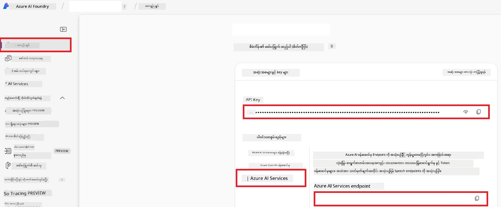

# Co-op Translator အတွက် Azure AI ကို စတင်တပ်ဆင်ခြင်း (Azure OpneAI & Azure AI Vision)

ဒီလမ်းညွှန်မှာ Azure AI Foundry အတွင်းမှာ ဘာသာပြန်ခြင်းအတွက် Azure OpenAI နဲ့ ပုံရိပ်အကြောင်းအရာ ခွဲခြမ်းစိတ်ဖြာခြင်းအတွက် Azure Computer Vision ကို စတင်တပ်ဆင်ခြင်းကို အဆင့်ဆင့် လမ်းပြပေးထားပါတယ် (ဒါနဲ့ပုံအခြေပြု ဘာသာပြန်မှုကိုလည်း အသုံးပြုနိုင်ပါတယ်)။

**လိုအပ်ချက်များ:**
- အက်တစ်ဘ်သော တွဲဖက်စရင်းပါရှိသော Azure အကောင့်။
- Azure သင့်တွဲဖက်စရင်းတွင် အရင်းအမြစ်များနှင့် တပ်ဆင်မှုများ ဖန်တီးခွင့်ရှိခြင်း။

## Azure AI Project တစ်ခု ဖန်တီးပါ

သင်၏ AI အရင်းအမြစ်များကို စီမံခန့်ခွဲရန် ဗဟိုနေရာအဖြစ် ဆောင်ရွက်မယ့် Azure AI Project တစ်ခု ဖန်တီးခြင်းဖြင့် စတင်ပါမယ်။

1. [https://ai.azure.com](https://ai.azure.com) သို့သွားပြီး သင်၏ Azure အကောင့်ဖြင့် လက်မှတ်ထိုးဝင်ပါ။

1. **+Create** ကိုရွေးပြီး Project အသစ် တစ်ခု ဖန်တီးပါ။

1. အောက်ပါ လုပ်ဆောင်ချက်များကို ပြုလုပ်ပါ။
   - **Project name** ထည့်ပါ (ဥပမာ `CoopTranslator-Project`)။
   - **AI hub** ကို ရွေးချယ်ပါ (ဥပမာ `CoopTranslator-Hub`) (လိုအပ်ပါက အသစ်ဖန်တီးပါ)။

1. "**Review and Create**" ကိုနှိပ်ပြီး Project ကို စတင်တပ်ဆင်ပါ။ သင်၏ Project အကျဉ်းပြချက် စာမျက်နှာသို့ ရွှေ့မည်။

## ဘာသာပြန်ခြင်းအတွက် Azure OpenAI ကို တပ်ဆင်ခြင်း

သင်၏ Project အတွင်း၌ စာသားဘာသာပြန်မှု အဖြစ် အသုံးပြုမယ့် Azure OpenAI မော်ဒယ်တစ်ခု ကို ဖြန့်ချိပါမယ်။

### သင့် Project သို့ သွားပါ

မတိုင်ခင်ကမရှိသေးလျှင် သင်ဖန်တီးထားသော Project (ဥပမာ `CoopTranslator-Project`) ကို Azure AI Foundry တွင်ဖွင့်ပါ။

### OpenAI မော်ဒယ် တပ်ဆင်ပါ

1. သင့် Project ၏ ဘယ်ဖက်မီနူးအောက်ရှိ "My assets" ထဲမှ "**Models + endpoints**" ကိုရွေးချယ်ပါ။

1. **+ Deploy model** ကိုရွေးပါ။

1. **Deploy Base Model** ကိုရွေးချယ်ပါ။

1. ရနိုင်သည့် မော်ဒယ်များစာရင်းကို မြင်ရပါမည်။ သင့်လိုအပ်မှုအတွက် သင့်တော်တဲ့ GPT မော်ဒယ္ကို စစ်ဆေးဖော်ထုတ်ပါ။ ကျွန်ုပ်တို့က `gpt-4o` ကို 추천합니다။

1. မော်ဒယ်ကို ရွေးပြီး **Confirm** ကိုနှိပ်ပါ။

1. **Deploy** ကိုရွေးချယ်ပါ။

### Azure OpenAI အဆင့်တင် ပြင်ဆင်မှု

တပ်ဆင်ပြီးလျှင် "**Models + endpoints**" စာမျက်နှာမှ အတပ်ဆင်မှုကို ရွေးပြီး **REST endpoint URL**, **Key**, **Deployment name**, **Model name** နဲ့ **API version** ကို တွေ့နိုင်ပါသည်။ ဤအချက်အလက်များသည် သင့်အပလီကေးရှင်းထဲသို့ ဘာသာပြန်မော်ဒယ်ကို ပေါင်းစည်းရန် လိုအပ်ပါသည်။

> [!NOTE]
> သင်လိုအပ်ချက်အရ [API version deprecation](https://learn.microsoft.com/azure/ai-services/openai/api-version-deprecation) စာမျက်နှာမှ API version များကို ရွေးချယ်နိုင်ပါသည်။ **API version** သည် Azure AI Foundry ၏ "**Models + endpoints**" စာမျက်နှာတွင် ပြသသော **Model version** နှင့် ကွာခြားသည်ကို သတိပြုပါ။

## ပုံအတွက် ဘာသာပြန်ခြင်းအတွက် Azure Computer Vision ကို တပ်ဆင်ခြင်း

ပုံအတွင်းရှိစာသားဘာသာပြန်ရန်အတွက် Azure AI Service API Key နဲ့ Endpoint ကို ရှာဖွေရပါမယ်။

1. သင့် Azure AI Project (ဥပမာ `CoopTranslator-Project`) ကိုသွားပါ။ Project အကျဉ်း စာမျက်နှာပေါ်မှာ ရှိနေခြင်းကို သေချာစေပါ။

### Azure AI Service ပြင်ဆင်မှု

Azure AI Service မှ API Key နဲ့ Endpoint ကို ရှာပါ။

1. သင့် Azure AI Project (ဥပမာ `CoopTranslator-Project`) ကိုသွားပါ။ Project အကျဉ်း စာမျက်နှာပေါ်မှာ ရှိနေခြင်းကို သေချာစေပါ။

1. Azure AI Service အတန်းမှ **API Key** နှင့် **Endpoint** ကို ရှာဖွေပါ။

    

ဒီဆက်တင်သည် ဆက်သွယ်ထားသော Azure AI Services အရင်းအမြစ် ၏ စွမ်းဆောင်ရည်များ (ပုံခွဲခြမ်းစိတ်ဖြာမှုအပါအဝင်) ကို သင့် AI Foundry Project သို့ အသုံးပြုနိုင်စေသည်။ သင်၏ notebook သို့မဟုတ် အပလီကေးရှင်းများတွင် ဤဆက်တင်ကို အသုံးပြုပြီး ပုံထဲမှ စာသားများကို လွှတ်ယူနိုင်ပြီး မလွဲမှားဘဲ Azure OpenAI မော်ဒယ်သို့ ဖြတ်သန်း၍ ဘာသာပြန်မှုအတွက် ပို့ဆောင်နိုင်ပါသည်။

## သင့်လက်မှတ်များကို စုပေါင်းခြင်း

ယခုအထိ သင်စုဆောင်းထားသည့် အချက်အလက်များမှာ -

**Azure OpenAI (စာသားဘာသာပြန်ခြင်း) အတွက်:**
- Azure OpenAI Endpoint
- Azure OpenAI API Key
- Azure OpenAI Model Name (ဥပမာ `gpt-4o`)
- Azure OpenAI Deployment Name (ဥပမာ `cooptranslator-gpt4o`)
- Azure OpenAI API Version

**Azure AI Services (Vision ဖြင့် ပုံအတွင်း စာသားထုတ်ယူခြင်း) အတွက်:**
- Azure AI Service Endpoint
- Azure AI Service API Key

### ဥပမာ - ပတ်ဝန်းကျင် ပြောင်းလဲသတ်မှတ်မှု (အစမ်း)

နောက်ပိုင်း သင်၏ အပလီကေးရှင်း တည်ဆောက်ရာတွင် စုဆောင်းထားသည့် လက်မှတ်များဖြင့် ပတ်ဝန်းကျင် ပြောင်းလဲသတ်မှတ်ချက်များ ကို ဆောင်ရွက်မည် ဖြစ်ပြီး ဥပမာ အနေဖြင့် အောက်ပါအတိုင်း သတ်မှတ်နိုင်ပါသည်။

```bash
# Azure AI ဝန်ဆောင်မှု အချက်အလက်များ (ပုံဘာသာပြန်ရန်လိုအပ်သည်)
AZURE_AI_SERVICE_API_KEY="your_azure_ai_service_api_key" # ဥပမာ၊ 21xasd...
AZURE_AI_SERVICE_ENDPOINT="https://your_azure_ai_service_endpoint.cognitiveservices.azure.com/"

# ရွေးချယ်နိုင်သော fallback စနစ်များ- suffix _1/_2 ဖြင့် ပြန်လည်ထပ်ရိုက်ထားသော အမျိုးအစားများ (အုပ်စုအတွင်း Variableတိုင်းအတွက် ဒေတာညီတူ)
AZURE_AI_SERVICE_API_KEY_1="your_azure_ai_service_api_key_1"
AZURE_AI_SERVICE_ENDPOINT_1="https://your_azure_ai_service_endpoint_1.cognitiveservices.azure.com/"

# Azure OpenAI အချက်အလက်များ (စာသားဘာသာပြန်ရန်လိုအပ်သည်)
AZURE_OPENAI_API_KEY="your_azure_openai_api_key" # ဥပမာ၊ 21xasd...
AZURE_OPENAI_ENDPOINT="https://your_azure_openai_endpoint.openai.azure.com/"
AZURE_OPENAI_MODEL_NAME="your_model_name" # ဥပမာ၊ gpt-4o
AZURE_OPENAI_CHAT_DEPLOYMENT_NAME="your_deployment_name" # ဥပမာ၊ cooptranslator-gpt4o
AZURE_OPENAI_API_VERSION="your_api_version" # ဥပမာ၊ 2024-12-01-preview

# ရွေးချယ်နိုင်သော fallback စနစ်များ- AZURE_OPENAI_* အစုံတစ်ပါတ်ကို suffix _1/_2 ဖြင့် ပြန်လည်ထပ်ရိုက်ထားသော (Variable အားလုံးအတွက် ဒေတာညီတူ)
```

---

### နောက်ထပ်ဖတ်ရှုရန်

- [Azure AI Foundry တွင် Project တစ်ခု ဖန်တီးနည်း](https://learn.microsoft.com/azure/ai-foundry/how-to/create-projects?tabs=ai-studio)
- [Azure AI အရင်းအမြစ်များ ဖန်တီးနည်း](https://learn.microsoft.com/azure/ai-foundry/how-to/create-azure-ai-resource?tabs=portal)
- [Azure AI Foundry တွင် OpenAI မော်ဒယ်များ Deploy နည်း](https://learn.microsoft.com/en-us/azure/ai-foundry/how-to/deploy-models-openai)

---

<!-- CO-OP TRANSLATOR DISCLAIMER START -->
**ကန့်သတ်ချက်**။  
ဤစာတမ်းကို AI ဘာသာပြန်မှုဝန်ဆောင်မှု [Co-op Translator](https://github.com/Azure/co-op-translator) ကိုအသုံးပြု၍ ဘာသာပြန်ထားပါသည်။ ကျွန်ုပ်တို့သည် တိကျမှန်ကန်မှုပိုမိုရရှိစေရန် ကြိုးပမ်းပါသော်လည်း၊ အော်တိုမေတက်ဘာသာပြန်မှုတွင် အမှားအယွင်းများ သို့မဟုတ် မှားယွင်းချက်များ ပါဝင်နိုင်ကြောင်း သတိပြုပါ။ မူရင်းစာတမ်းကို၎င်း၏ မူလဘာသာဖြင့် အာဏာရှိသော အရင်းအမြစ်အဖြစ် သတ်မှတ်လေ့ရှိသည်။ အရေးကြီးသော သတင်းအချက်အလက်များအတွက် လူကြီးမင်းသည် professional လူသား ဘာသာပြန်မှုကို အသုံးပြုရန် အကြံပြုပါသည်။ ဤဘာသာပြန်မှုကို အသုံးပြုခြင်းကြောင့် ဖြစ်ပေါ်သည့် နားလည်မှု ခြေရာခံမှားခြင်းများအတွက် ကျွနု်ပ္တို့မှာ တာဝန်မရှိပါ။
<!-- CO-OP TRANSLATOR DISCLAIMER END -->