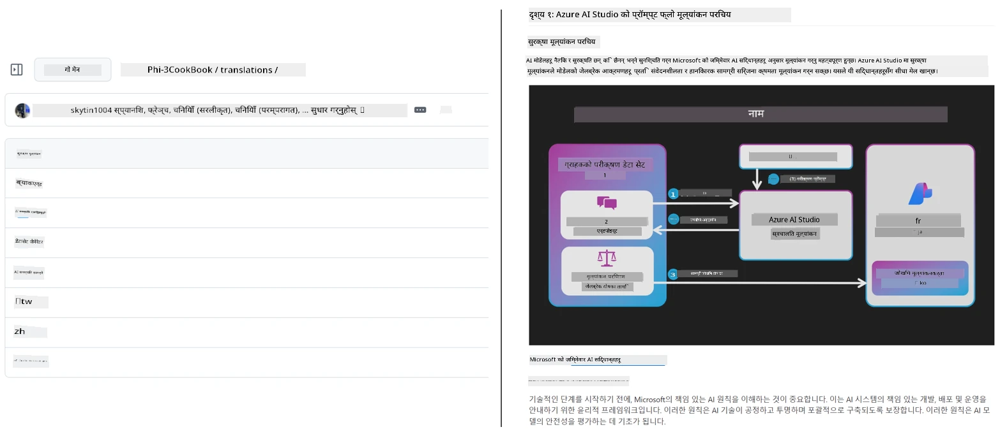
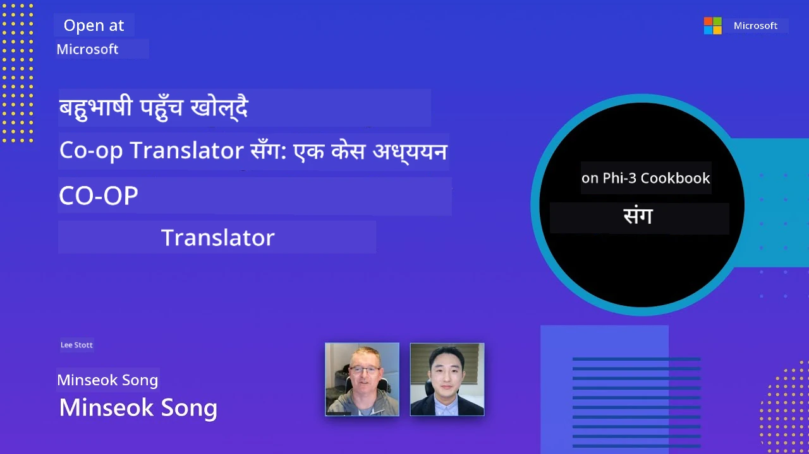

# Co-op Translator

_आफ्नो शैक्षिक GitHub सामग्रीलाई धेरै भाषाहरूमा सजिलै अनुवाद र रखरखाव गर्नुहोस् जस्तै तपाईंको परियोजना विकास हुँदै गइरहेको छ।_


[](https://pypi.org/project/co-op-translator/)
[](https://github.com/azure/co-op-translator/blob/main/LICENSE)
[](https://pepy.tech/project/co-op-translator)
[](https://pepy.tech/project/co-op-translator)
[](https://github.com/azure/co-op-translator/pkgs/container/co-op-translator)
[](https://github.com/psf/black)

[](https://GitHub.com/azure/co-op-translator/graphs/contributors/)
[](https://GitHub.com/azure/co-op-translator/issues/)
[](https://GitHub.com/azure/co-op-translator/pulls/)
[](http://makeapullrequest.com)

### 🌐 बहुभाषिक समर्थन

#### [Co-op Translator](https://github.com/Azure/Co-op-Translator) द्वारा समर्थित

<!-- CO-OP TRANSLATOR LANGUAGES TABLE START -->
[Arabic](../ar/README.md) | [Bengali](../bn/README.md) | [Bulgarian](../bg/README.md) | [Burmese (Myanmar)](../my/README.md) | [Chinese (Simplified)](../zh-CN/README.md) | [Chinese (Traditional, Hong Kong)](../zh-HK/README.md) | [Chinese (Traditional, Macau)](../zh-MO/README.md) | [Chinese (Traditional, Taiwan)](../zh-TW/README.md) | [Croatian](../hr/README.md) | [Czech](../cs/README.md) | [Danish](../da/README.md) | [Dutch](../nl/README.md) | [Estonian](../et/README.md) | [Finnish](../fi/README.md) | [French](../fr/README.md) | [German](../de/README.md) | [Greek](../el/README.md) | [Hebrew](../he/README.md) | [Hindi](../hi/README.md) | [Hungarian](../hu/README.md) | [Indonesian](../id/README.md) | [Italian](../it/README.md) | [Japanese](../ja/README.md) | [Kannada](../kn/README.md) | [Khmer](../km/README.md) | [Korean](../ko/README.md) | [Lithuanian](../lt/README.md) | [Malay](../ms/README.md) | [Malayalam](../ml/README.md) | [Marathi](../mr/README.md) | [Nepali](./README.md) | [Nigerian Pidgin](../pcm/README.md) | [Norwegian](../no/README.md) | [Persian (Farsi)](../fa/README.md) | [Polish](../pl/README.md) | [Portuguese (Brazil)](../pt-BR/README.md) | [Portuguese (Portugal)](../pt-PT/README.md) | [Punjabi (Gurmukhi)](../pa/README.md) | [Romanian](../ro/README.md) | [Russian](../ru/README.md) | [Serbian (Cyrillic)](../sr/README.md) | [Slovak](../sk/README.md) | [Slovenian](../sl/README.md) | [Spanish](../es/README.md) | [Swahili](../sw/README.md) | [Swedish](../sv/README.md) | [Tagalog (Filipino)](../tl/README.md) | [Tamil](../ta/README.md) | [Telugu](../te/README.md) | [Thai](../th/README.md) | [Turkish](../tr/README.md) | [Ukrainian](../uk/README.md) | [Urdu](../ur/README.md) | [Vietnamese](../vi/README.md)

> **स्थानीय रूपमा क्लोन गर्न मन लाग्छ?**
>
> यस रिपोजिटरीमा 50+ भाषाका अनुवादहरू छन् जसले डाउनलोड आकारलाई ठूलो बनाउँछ। अनुवादहरू बिना क्लोन गर्न, sparse checkout प्रयोग गर्नुहोस्:
>
> **Bash / macOS / Linux:**
> ```bash
> git clone --filter=blob:none --sparse https://github.com/Azure/co-op-translator.git
> cd co-op-translator
> git sparse-checkout set --no-cone '/*' '!translations' '!translated_images'
> ```
>
> **CMD (Windows):**
> ```cmd
> git clone --filter=blob:none --sparse https://github.com/Azure/co-op-translator.git
> cd co-op-translator
> git sparse-checkout set --no-cone "/*" "!translations" "!translated_images"
> ```
>
> यसले तपाईंलाई कोर्स पूरा गर्न आवश्यक सबै कुरा छिटो डाउनलोडको साथ दिन्छ।
<!-- CO-OP TRANSLATOR LANGUAGES TABLE END -->

[](https://GitHub.com/azure/co-op-translator/watchers/)
[](https://GitHub.com/azure/co-op-translator/network/)
[](https://GitHub.com/azure/co-op-translator/stargazers/)

[](https://discord.gg/nTYy5BXMWG)

[](https://codespaces.new/azure/co-op-translator)

## अवलोकन

**Co-op Translator** ले तपाईंको शैक्षिक GitHub सामग्रीलाई धेरै भाषामा सजिलै स्थानीयकरण गर्न सहयोग गर्छ।  
जब तपाईंले Markdown फाइलहरू, छविहरू, वा नोटबुकहरू अपडेट गर्नुहुन्छ, अनुवादहरू स्वतः समक्रमित रहन्छन्, जसले विश्वव्यापी सिक्नेहरूका लागि तपाईंको सामग्री सही र अद्यावधिक रहन्छ भनी सुनिश्चित गर्दछ।

अनुवादित सामग्री कसरी व्यवस्थित हुन्छ भन्ने उदाहरण:



## अनुवाद अवस्थाको व्यवस्थापन कसरी हुन्छ

Co-op Translator ले अनुवादित सामग्रीलाई **संस्करण गरिएको सफ्टवेयर वस्तुहरू** का रूपमा व्यवस्थापन गर्छ,  
स्थिर फाइलहरू जस्तै होइन।

यो उपकरणले अनुवादित Markdown, छविहरू, र नोटबुकहरूको अवस्था ट्रयाक गर्दछ  
**भाषा-विस्तारित मेटाडेटा** प्रयोग गरी।

यो डिजाइनले Co-op Translator लाई निम्न अनुमति दिन्छ:

- पुराना अनुवादहरू भरपर्दो रूपमा फेला पार्न
- Markdown, छविहरू, र नोटबुकहरूलाई समान रूपमा व्यवहार गर्न
- ठूलो, तीव्र विकास हुने बहुभाषिक रिपोजिटरीहरूमा सुरक्षित रूपमा स्केल गर्न

अनुवादहरूलाई व्यवस्थापन गरिएको वस्तुहरूको रूपमा मोडल गरेर,  
अनुवाद कार्यप्रवाहहरू आधुनिक  
सफ्टवेयर निर्भरता र वस्तु व्यवस्थापन अभ्यासहरूसँग स्वाभाविक रूपमा मेल खान्छ।

→ [अनुवाद अवस्थाको व्यवस्थापन कसरी हुन्छ](https://techcommunity.microsoft.com/blog/azuredevcommunityblog/rethinking-documentation-translation-treating-translations-as-versioned-software/4491755)


## छिटो सुरु गर्ने तरिका

```bash
# एउटा भर्चुअल वातावरण सिर्जना गर्नुहोस् र सक्रिय गर्नुहोस् (सिफारिस गरिएको)
python -m venv .venv
# विन्डोज
.venv\Scripts\activate
# म्याकओएस/लिनक्स
source .venv/bin/activate
# प्याकेज स्थापना गर्नुहोस्
pip install co-op-translator
# अनुवाद गर्नुहोस्
translate -l "ko ja fr" -md
```

Docker:

```bash
# GHCR बाट सार्वजनिक छवि तान्नुहोस्
docker pull ghcr.io/azure/co-op-translator:latest
# हालको फोल्डर माउन्ट गरी चलाउनुहोस् र .env उपलब्ध गराउनुहोस् (Bash/Zsh)
docker run --rm -it --env-file .env -v "${PWD}:/work" ghcr.io/azure/co-op-translator:latest -l "ko ja fr" -md
```

## न्यूनतम सेटअप

1. तपाईंको Python संस्करण समर्थन गरिएको छ भन्ने सुनिश्चित गर्नुहोस् (हाल 3.10-3.12)। poetry (pyproject.toml) मा यो स्वचालित रूपमा ह्यान्डल हुन्छ।
2. टेम्प्लेट प्रयोग गर्दै `.env` फाइल सिर्जना गर्नुहोस्: [.env.template](../../.env.template)
3. एउटा LLM प्रदायक कन्फिगर गर्नुहोस् (Azure OpenAI वा OpenAI)
4. (वैकल्पिक) छवि अनुवादको लागि (`-img`), Azure AI Vision कन्फिगर गर्नुहोस्
5. (वैकल्पिक) तपाईं विभिन्न क्रेडेन्शियल सेटहरूलाई `_1`, `_2` जस्ता उपसर्गहरू सहित डुप्लिकेट गरेर कन्फिगर गर्न सक्नुहुन्छ। सेटभित्र सबै भेरिएबलहरूले एउटै उपसर्ग साझा गर्नुपर्छ।
6. (सिफारिस) अघिल्लो अनुवादहरू सफा गर्नुहोस् ताकि द्वन्द्व नहोस् (जस्तै, `translations/`)
7. (सिफारिस) README मा अनुवाद विभाग थप्नुहोस् [README languages template](./getting_started/README_languages_template.md) प्रयोग गरेर
8. हेर्नुहोस्: [Azure AI सेटअप गर्न](./getting_started/set-up-azure-ai.md)

## प्रयोग

समर्थित सबै प्रकारका अनुवाद गर्नुहोस्:

```bash
translate -l "ko ja"
```

Markdown मात्र:

```bash
translate -l "de" -md
```

Markdown + छविहरू:

```bash
translate -l "pt" -md -img
```

मात्र नोटबुकहरू:

```bash
translate -l "zh" -nb
```

थप झण्डाहरू: [Command reference](./getting_started/command-reference.md)

## सुविधाहरू

- Markdown, नोटबुक, र छविहरूको लागि स्वचालित अनुवाद
- स्रोत परिवर्तनहरूमा अनुवादहरूलाई समक्रमित राख्छ
- स्थानीय रूपमा (CLI) वा CI (GitHub Actions) मा काम गर्छ
- Azure OpenAI वा OpenAI प्रयोग गर्छ; छविहरूको लागि वैकल्पिक Azure AI Vision
- Markdown ढाँचा र संरचना जोगाउँछ

## कागजातहरू

- [Command-line guide](./getting_started/command-line-guide/command-line-guide.md)
- [GitHub Actions guide (सार्वजनिक रिपोजिटरी र मानक सीक्रेट्स)](./getting_started/github-actions-guide/github-actions-guide-public.md)
- [GitHub Actions guide (Microsoft संगठनका रिपोजिटरीहरू र संस्था स्तर सेटअप)](./getting_started/github-actions-guide/github-actions-guide-org.md)
- [README भाषाहरूको टेम्प्लेट](./getting_started/README_languages_template.md)
- [समर्थित भाषाहरू](./getting_started/supported-languages.md)
- [योगदान गर्न](./CONTRIBUTING.md)
- [समस्या समाधान](./getting_started/troubleshooting.md)

### Microsoft-विशिष्ट गाइड
> [!NOTE]
> Microsoft “For Beginners” रिपोजिटरीका मर्मतकर्ता मात्रका लागि।

- [“अन्य कोर्सहरू” सूची अपडेट गर्ने (MS Beginners रिपोजिटरीका लागि मात्र)](./getting_started/update-other-courses.md)

## हामीलाई समर्थन गर्नुहोस् र विश्वव्यापी सिकाइ प्रवर्द्धन गर्नुहोस्

शैक्षिक सामग्रीलाई विश्वव्यापी रूपमा साझा गर्ने तरिका क्रान्ति गर्न हामीसँग सामेल हुनुहोस्!  
[Co-op Translator](https://github.com/azure/co-op-translator) लाई GitHub मा ⭐ दिनुहोस् र भाषागत बाधाहरूलाई विद्यार्थी र प्रविधि क्षेत्रमा टुटाउन हाम्रो मिशनलाई समर्थन गर्नुहोस्। तपाईंको चासो र योगदान महत्वपूर्ण प्रभाव पार्छ! कोड योगदान र सुविधा सुझावहरू सधैं स्वागत छ।

### Microsoft शैक्षिक सामग्री तपाईंको भाषामा एक्स्प्लोर गर्नुहोस्

- [LangChain4j-for-Beginners](https://github.com/microsoft/LangChain4j-for-Beginners)
- [AZD for Beginners](https://github.com/microsoft/AZD-for-beginners)
- [Edge AI for Beginners](https://github.com/microsoft/edgeai-for-beginners)
- [Model Context Protocol (MCP) For Beginners](https://github.com/microsoft/mcp-for-beginners)
- [AI Agents for Beginners](https://github.com/microsoft/ai-agents-for-beginners)
- [Generative AI for Beginners using .NET](https://github.com/microsoft/Generative-AI-for-beginners-dotnet)
- [Generative AI for Beginners](https://github.com/microsoft/generative-ai-for-beginners)
- [Generative AI for Beginners using Java](https://github.com/microsoft/generative-ai-for-beginners-java)
- [ML for Beginners](https://aka.ms/ml-beginners)
- [Data Science for Beginners](https://aka.ms/datascience-beginners)
- [AI for Beginners](https://aka.ms/ai-beginners)
- [Cybersecurity for Beginners](https://github.com/microsoft/Security-101)
- [Web Dev for Beginners](https://aka.ms/webdev-beginners)
- [IoT for Beginners](https://aka.ms/iot-beginners)
- [PhiCookBook](https://github.com/microsoft/PhiCookBook)

## भिडियो प्रस्तुति

👉 तलको चित्रमा क्लिक गरेर YouTube मा हेर्नुहोस्।

- **Microsoft मा खुल्ला**: Co-op Translator कसरी प्रयोग गर्नेछ भन्ने छोटो 18 मिनेटको परिचय र छिटो मार्गदर्शन।

  [](https://www.youtube.com/watch?v=jX_swfH_KNU)

## योगदान

यो परियोजनामा योगदान र सुझावहरू स्वागत छ। Azure Co-op Translator मा योगदान गर्न इच्छुक हुनुहुन्छ? कृपया हाम्रो [CONTRIBUTING.md](./CONTRIBUTING.md) हेर्नुहोस् जसले Co-op Translator लाई अझ पहुँचयोग्य बनाउन तपाईं कसरी मद्दत गर्न सक्नुहुन्छ बताउँछ।

## योगदानकर्ता
[](https://github.com/Azure/co-op-translator/graphs/contributors)

## आचार संहिता

यस परियोजनाले [Microsoft Open Source Code of Conduct](https://opensource.microsoft.com/codeofconduct/)लाई अपनाएको छ।
थप जानकारीको लागि [Code of Conduct FAQ](https://opensource.microsoft.com/codeofconduct/faq/) हेर्नुहोस् वा
कुनै अतिरिक्त प्रश्न वा टिप्पणीहरूका लागि [opencode@microsoft.com](mailto:opencode@microsoft.com) मा सम्पर्क गर्नुहोस्।

## जिम्मेवार AI

Microsoft ले हाम्रा ग्राहकहरूलाई हाम्रा AI उत्पादनहरू जिम्मेवार तरिकाले प्रयोग गर्न सहयोग गर्न प्रतिबद्ध छ, हाम्रा सिकाइहरू साझेदारी गर्ने, र Transparency Notes र Impact Assessments जस्ता उपकरणहरू मार्फत विश्वास-आधारित साझेदारीहरू निर्माण गर्ने। यी स्रोतहरू मध्ये धेरै [https://aka.ms/RAI](https://aka.ms/RAI) मा फेला पार्न सकिन्छ।
Microsoft को जिम्मेवार AI को दृष्टिकोण हाम्रा AI सिद्धान्तहरूमा आधारित छ जुनमा निष्पक्षता, विश्वसनीयता र सुरक्षा, गोपनीयता र सुरक्षा, समावेशिता, पारदर्शिता, र जवाफदेहिताको समावेश छ।

ठूलो स्तरको प्राकृतिक भाषा, छवि, र भाषण मोडेलहरू - यी नमूनाहरूमा प्रयोग गरिएका मोडेलहरूसँग समान - सम्भावित रूपमा असमान, अविश्वसनीय, वा अपमानजनक तरिकाले व्यवहार गर्न सक्छन्, जसले नोक्सानी पुर्याउन सक्छ। कृपया जोखिम र सीमाहरूको बारेमा जानकारीका लागि [Azure OpenAI सेवा Transparency note](https://learn.microsoft.com/legal/cognitive-services/openai/transparency-note?tabs=text) सल्लाह लिनुहोस्।

यी जोखिमहरूको न्यूनीकरण गर्न सिफारिस गरिएको विधि भनेको तपाईंको आर्किटेक्चरमा एउटा सुरक्षा प्रणाली समावेश गर्नु हो जसले हानिकारक व्यवहार पत्ता लगाउन र रोक्न सक्छ। [Azure AI Content Safety](https://learn.microsoft.com/azure/ai-services/content-safety/overview) एउटा स्वतन्त्र सुरक्षा तह प्रदान गर्छ, जसले अनुप्रयोग र सेवाहरूमा हानिकारक प्रयोगकर्ता-उत्पन्न र AI-उत्पन्न सामग्री पत्ता लगाउन सक्षम छ। Azure AI Content Safety मा पाठ र छवि API हरू समावेश छन् जसले तपाईंलाई हानिकारक सामग्री पत्ता लगाउन अनुमति दिन्छ। साथै हामीसँग एक अन्तरक्रियात्मक Content Safety Studio पनि छ जसले तपाईंलाई विभिन्न मोडालिटीजमा हानिकारक सामग्री पत्ता लगाउन नमूना कोडहरू हेर्न, अन्वेषण गर्न, र प्रयोग गर्न अनुमति दिन्छ। तलको [quickstart कागजात](https://learn.microsoft.com/azure/ai-services/content-safety/quickstart-text?tabs=visual-studio%2Clinux&pivots=programming-language-rest) ले तपाईंलाई सेवामा अनुरोधहरू गर्ने तरिका देखाउँछ।

अर्को विचार गर्नुपर्ने पक्ष भनेको समग्र अनुप्रयोग कार्यसम्पादन हो। बहु-मोडाल र बहु-मोडेल अनुप्रयोगहरूसँग, हामी कार्यसम्पादनलाई त्यसरी बुझ्दछौं कि प्रणालीले तपाईं र तपाईंका प्रयोगकर्ताहरूको अपेक्षा अनुसार प्रदर्शन गर्छ, जसमा हानिकारक नतिजाहरू उत्पादन नगर्नु पनि समावेश छ। तपाईंले आफ्नो समग्र अनुप्रयोगको कार्यसम्पादन [generation quality र risk and safety metrics](https://learn.microsoft.com/azure/ai-studio/concepts/evaluation-metrics-built-in) प्रयोग गरेर मूल्यांकन गर्नु आवश्यक छ।

तपाईंले आफ्नो विकास वातावरणमा AI अनुप्रयोगलाई [prompt flow SDK](https://microsoft.github.io/promptflow/index.html) प्रयोग गरेर मूल्यांकन गर्न सक्नुहुन्छ। परीक्षण डेटासेट वा लक्षित मान दिइएपछि, तपाईंको जेनरेटिभ AI अनुप्रयोगका उत्पादनहरू स्वचालित रूपमा निर्मित मूल्याँकनकर्ताहरू वा तपाईंको रोजाइका अनुकूलित मूल्याँकनकर्ताहरू द्वारा मात्रात्मक रूपमा मापन गरिन्छ। तपाईं आफ्नो प्रणाली मूल्यांकन गर्न prompt flow sdk प्रयोग सुरु गर्न [quickstart गाइड](https://learn.microsoft.com/azure/ai-studio/how-to/develop/flow-evaluate-sdk) अनुसरण गर्न सक्नुहुन्छ। एक पटक मूल्यांकन सञ्‍चालन गरेपछि, तपाईंले [Azure AI Studio मा परिणामहरू देख्न](https://learn.microsoft.com/azure/ai-studio/how-to/evaluate-flow-results) सक्नुहुन्छ।

## ट्रेडमार्क

यस परियोजनामा प्रोजेक्ट, उत्पादन, वा सेवाहरूका लागि ट्रेडमार्क वा लोगोहरू समावेश हुन सक्छन्। Microsoft ट्रेडमार्क वा लोगोहरूको अधिकारप्राप्त प्रयोग [Microsoft's Trademark & Brand Guidelines](https://www.microsoft.com/en-us/legal/intellectualproperty/trademarks/usage/general) अनुसार र त्यसका अधीनमा हुनुपर्छ।
परियोजनाका संशोधित संस्करणहरूमा Microsoft ट्रेडमार्क वा लोगोहरूको प्रयोगले भ्रम सिर्जना गर्नु वा Microsoft प्रायोजनको अर्थ लाग्नुहुँदैन।
तेस्रो पक्षका ट्रेडमार्क वा लोगोहरूको कुनै पनि प्रयोग ती तेस्रो पक्षका नीतिहरूमा निर्भर गर्दछ।

## मद्दत प्राप्त गर्ने तरिका

यदि तपाईं अड्किनुहुन्छ वा AI अनुप्रयोगहरू विकास गर्दा कुनै प्रश्नहरू छन् भने, सामेल हुनुहोस्:

[](https://discord.gg/nTYy5BXMWG)

यदि तपाईंलाई उत्पादन सम्बन्धी प्रतिक्रिया वा त्रुटिहरू छन् भने:

[](https://aka.ms/foundry/forum)

---

<!-- CO-OP TRANSLATOR DISCLAIMER START -->
**अस्वीकरण**:
यस दस्तावेजलाई AI अनुवाद सेवा [Co-op Translator](https://github.com/Azure/co-op-translator) को प्रयोग गरी अनुवाद गरिएको हो। हामी शुद्धताको प्रयास गर्छौं, तर कृपया जानकार हुनुहोस् कि स्वचालित अनुवादहरूमा त्रुटिहरू वा अशुद्धता हुन सक्छन्। मूल दस्तावेजलाई यसको मूल भाषामा अधिकारप्राप्त स्रोतको रूपमा मानिनु पर्छ। महत्त्वपूर्ण जानकारीको लागि, व्यावसायिक मानव अनुवाद सिफारिस गरिन्छ। यस अनुवादको प्रयोगबाट उत्पन्न हुने कुनै पनि गलत बुझाइ वा गलत व्याख्याको लागि हामी जिम्मेवार छैनौं।
<!-- CO-OP TRANSLATOR DISCLAIMER END -->