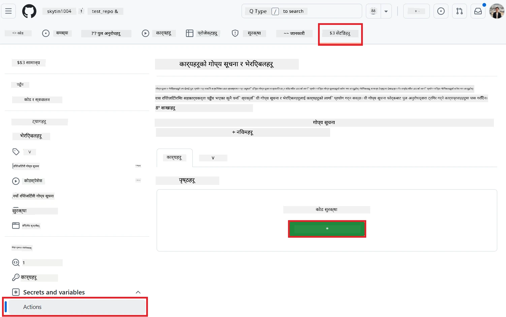
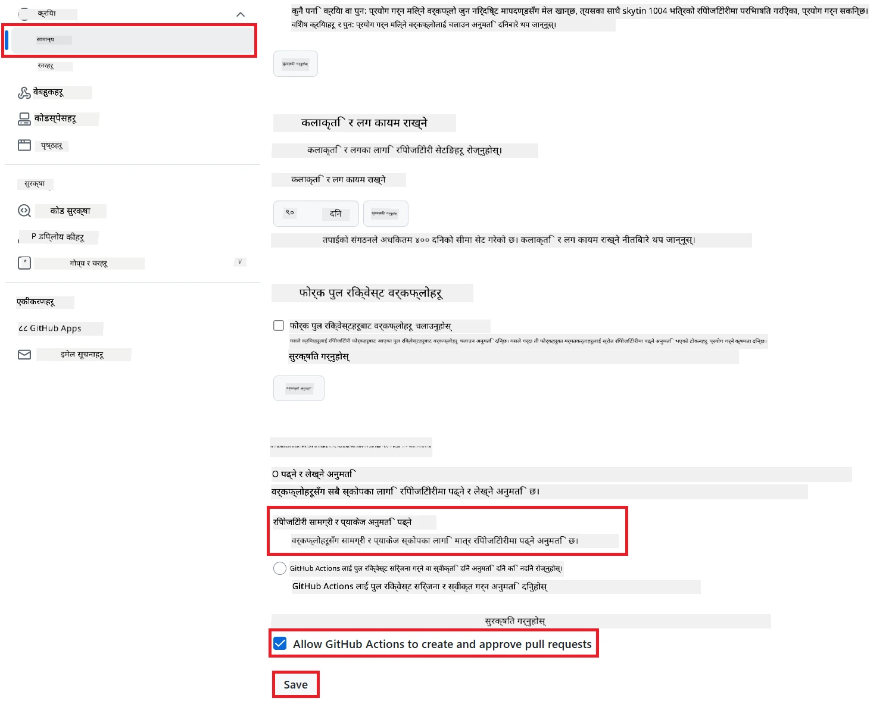

# Co-op Translator GitHub Action (सार्वजनिक सेटअप) प्रयोग गर्दै

**लक्ष्य समूह:** यो मार्गदर्शिका अधिकांश सार्वजनिक वा निजी रिपोजिटोरीका प्रयोगकर्ताहरूका लागि हो जहाँ सामान्य GitHub Actions अनुमति पर्याप्त हुन्छ। यसमा बिल्ट-इन `GITHUB_TOKEN` प्रयोग गरिएको छ।

आफ्नो रिपोजिटोरीको डक्युमेन्टेसन अनुवाद स्वचालित रूपमा गर्न Co-op Translator GitHub Action प्रयोग गर्नुहोस्। यो मार्गदर्शिकाले तपाईंलाई कसरी Action सेटअप गर्ने भन्ने देखाउँछ, जसले गर्दा जब तपाईंको स्रोत Markdown फाइल वा तस्बिरहरू परिवर्तन हुन्छन्, तब स्वचालित रूपमा अपडेट गरिएको अनुवादसहित Pull Request बनाइन्छ।

> [!IMPORTANT]
>
> **सही मार्गदर्शिका छान्नुहोस्:**
>
> यो मार्गदर्शिकामा **साधारण सेटअप (सामान्य `GITHUB_TOKEN` प्रयोग गरेर)** को विवरण छ। अधिकांश प्रयोगकर्ताहरूका लागि यो नै सिफारिस गरिएको विधि हो किनभने यसमा संवेदनशील GitHub App Private Keys व्यवस्थापन गर्न आवश्यक पर्दैन।
>

## पूर्वशर्तहरू

GitHub Action कन्फिगर गर्नु अघि, तपाईंले आवश्यक AI सेवा प्रमाणपत्र तयार गर्नु आवश्यक छ।

**१. आवश्यक: AI Language Model प्रमाणपत्रहरू**
तपाईंलाई कम्तीमा एउटा समर्थित Language Model को प्रमाणपत्र चाहिन्छ:

- **Azure OpenAI**: Endpoint, API Key, Model/Deployment Name, API Version आवश्यक।
- **OpenAI**: API Key आवश्यक, (वैकल्पिक: Org ID, Base URL, Model ID)।
- थप जानकारीका लागि [Supported Models and Services](../../../../README.md) हेर्नुहोस्।

**२. वैकल्पिक: AI Vision प्रमाणपत्रहरू (तस्बिर अनुवादका लागि)**

- तस्बिरभित्रको पाठ अनुवाद गर्न आवश्यक भएमा मात्र।
- **Azure AI Vision**: Endpoint र Subscription Key आवश्यक।
- यदि उपलब्ध छैन भने, Action [Markdown-only mode](../markdown-only-mode.md) मा चल्छ।

## सेटअप र कन्फिगरेसन

सामान्य `GITHUB_TOKEN` प्रयोग गरेर आफ्नो रिपोजिटोरीमा Co-op Translator GitHub Action कन्फिगर गर्न यी चरणहरू पालना गर्नुहोस्।

### चरण १: प्रमाणीकरण बुझ्नुहोस् (`GITHUB_TOKEN` प्रयोग गर्दै)

यो workflow मा GitHub Actions द्वारा उपलब्ध गराइएको बिल्ट-इन `GITHUB_TOKEN` प्रयोग गरिएको छ। यो टोकनले **चरण ३** मा कन्फिगर गरिएका सेटिङअनुसार रिपोजिटोरीसँग अन्तरक्रिया गर्न स्वचालित रूपमा अनुमति दिन्छ।

### चरण २: रिपोजिटोरी Secrets कन्फिगर गर्नुहोस्

तपाईंले आफ्नो **AI सेवा प्रमाणपत्रहरू** मात्र रिपोजिटोरी सेटिङमा इन्क्रिप्टेड secrets को रूपमा थप्नुपर्छ।

१.  आफ्नो लक्षित GitHub रिपोजिटोरीमा जानुहोस्।
२.  **Settings** > **Secrets and variables** > **Actions** मा जानुहोस्।
३.  **Repository secrets** अन्तर्गत, तल सूचीबद्ध प्रत्येक आवश्यक AI सेवा secret का लागि **New repository secret** क्लिक गर्नुहोस्।

     *(तस्बिर सन्दर्भ: Secrets कहाँ थप्ने देखाइएको छ)*

**आवश्यक AI सेवा Secrets (पूर्वशर्त अनुसार सबै लागू हुने थप्नुहोस्):**

| Secret Name                         | विवरण                               | Value Source                     |
| :---------------------------------- | :---------------------------------- | :------------------------------- |
| `AZURE_AI_SERVICE_API_KEY`            | Azure AI Service (Computer Vision) को Key  | तपाईंको Azure AI Foundry               |
| `AZURE_AI_SERVICE_ENDPOINT`         | Azure AI Service (Computer Vision) को Endpoint | तपाईंको Azure AI Foundry               |
| `AZURE_OPENAI_API_KEY`              | Azure OpenAI सेवा को Key              | तपाईंको Azure AI Foundry               |
| `AZURE_OPENAI_ENDPOINT`             | Azure OpenAI सेवा को Endpoint         | तपाईंको Azure AI Foundry               |
| `AZURE_OPENAI_MODEL_NAME`           | तपाईंको Azure OpenAI Model Name              | तपाईंको Azure AI Foundry               |
| `AZURE_OPENAI_CHAT_DEPLOYMENT_NAME` | तपाईंको Azure OpenAI Deployment Name         | तपाईंको Azure AI Foundry               |
| `AZURE_OPENAI_API_VERSION`          | Azure OpenAI को API Version              | तपाईंको Azure AI Foundry               |
| `OPENAI_API_KEY`                    | OpenAI को API Key                        | तपाईंको OpenAI Platform              |
| `OPENAI_ORG_ID`                     | OpenAI Organization ID (वैकल्पिक)         | तपाईंको OpenAI Platform              |
| `OPENAI_CHAT_MODEL_ID`              | विशेष OpenAI model ID (वैकल्पिक)       | तपाईंको OpenAI Platform              |
| `OPENAI_BASE_URL`                   | Custom OpenAI API Base URL (वैकल्पिक)     | तपाईंको OpenAI Platform              |

### चरण ३: Workflow अनुमति कन्फिगर गर्नुहोस्

GitHub Action लाई `GITHUB_TOKEN` मार्फत कोड checkout गर्न र pull request बनाउन अनुमति आवश्यक छ।

१.  आफ्नो रिपोजिटोरीमा **Settings** > **Actions** > **General** मा जानुहोस्।
२.  **Workflow permissions** सेक्सनसम्म स्क्रोल गर्नुहोस्।
३.  **Read and write permissions** चयन गर्नुहोस्। यसले `GITHUB_TOKEN` लाई यो workflow का लागि आवश्यक `contents: write` र `pull-requests: write` अनुमति दिन्छ।
४.  **Allow GitHub Actions to create and approve pull requests** को लागि checkbox **checked** भएको सुनिश्चित गर्नुहोस्।
५.  **Save** चयन गर्नुहोस्।



### चरण ४: Workflow फाइल बनाउनुहोस्

अन्ततः, `GITHUB_TOKEN` प्रयोग गरेर स्वचालित workflow परिभाषित गर्ने YAML फाइल बनाउनुहोस्।

१.  आफ्नो रिपोजिटोरीको root directory मा `.github/workflows/` फोल्डर छैन भने बनाउनुहोस्।
२.  `.github/workflows/` भित्र `co-op-translator.yml` नामको फाइल बनाउनुहोस्।
३.  तलको सामग्री `co-op-translator.yml` मा टाँस्नुहोस्।

```yaml
name: Co-op Translator

on:
  push:
    branches:
      - main

jobs:
  co-op-translator:
    runs-on: ubuntu-latest

    permissions:
      contents: write
      pull-requests: write

    steps:
      - name: Checkout repository
        uses: actions/checkout@v4
        with:
          fetch-depth: 0

      - name: Set up Python
        uses: actions/setup-python@v4
        with:
          python-version: '3.10'

      - name: Install Co-op Translator
        run: |
          python -m pip install --upgrade pip
          pip install co-op-translator

      - name: Run Co-op Translator
        env:
          PYTHONIOENCODING: utf-8
          # === AI Service Credentials ===
          AZURE_AI_SERVICE_API_KEY: ${{ secrets.AZURE_AI_SERVICE_API_KEY }}
          AZURE_AI_SERVICE_ENDPOINT: ${{ secrets.AZURE_AI_SERVICE_ENDPOINT }}
          AZURE_OPENAI_API_KEY: ${{ secrets.AZURE_OPENAI_API_KEY }}
          AZURE_OPENAI_ENDPOINT: ${{ secrets.AZURE_OPENAI_ENDPOINT }}
          AZURE_OPENAI_MODEL_NAME: ${{ secrets.AZURE_OPENAI_MODEL_NAME }}
          AZURE_OPENAI_CHAT_DEPLOYMENT_NAME: ${{ secrets.AZURE_OPENAI_CHAT_DEPLOYMENT_NAME }}
          AZURE_OPENAI_API_VERSION: ${{ secrets.AZURE_OPENAI_API_VERSION }}
          OPENAI_API_KEY: ${{ secrets.OPENAI_API_KEY }}
          OPENAI_ORG_ID: ${{ secrets.OPENAI_ORG_ID }}
          OPENAI_CHAT_MODEL_ID: ${{ secrets.OPENAI_CHAT_MODEL_ID }}
          OPENAI_BASE_URL: ${{ secrets.OPENAI_BASE_URL }}
        run: |
          # =====================================================================
          # IMPORTANT: Set your target languages here (REQUIRED CONFIGURATION)
          # =====================================================================
          # Example: Translate to Spanish, French, German. Add -y to auto-confirm.
          translate -l "es fr de" -y  # <--- MODIFY THIS LINE with your desired languages

      - name: Create Pull Request with translations
        uses: peter-evans/create-pull-request@v5
        with:
          token: ${{ secrets.GITHUB_TOKEN }}
          commit-message: "🌐 Update translations via Co-op Translator"
          title: "🌐 Update translations via Co-op Translator"
          body: |
            This PR updates translations for recent changes to the main branch.

            ### 📋 Changes included
            - Translated contents are available in the `translations/` directory
            - Translated images are available in the `translated_images/` directory

            ---
            🌐 Automatically generated by the [Co-op Translator](https://github.com/Azure/co-op-translator) GitHub Action.
          branch: update-translations
          base: main
          labels: translation, automated-pr
          delete-branch: true
          add-paths: |
            translations/
            translated_images/
```

४.  **Workflow अनुकूलन गर्नुहोस्:**
  - **[!IMPORTANT] लक्षित भाषा:** `Run Co-op Translator` चरणमा, तपाईंले `translate -l "..." -y` कमाण्डमा भाषा कोडहरूको सूची **अवश्य समीक्षा र परिमार्जन गर्नुहोस्** ताकि तपाईंको परियोजनाको आवश्यकतासँग मिलोस्। उदाहरण सूची (`ar de es...`) लाई बदल्नु वा मिलाउनु आवश्यक छ।
  - **Trigger (`on:`):** हालको trigger ले `main` मा हरेक push मा workflow चलाउँछ। ठूलो रिपोजिटोरीका लागि, `paths:` filter थप्ने विचार गर्नुहोस् (YAML मा टिप्पणी गरिएको उदाहरण हेर्नुहोस्) ताकि workflow केवल सम्बन्धित फाइलहरू (जस्तै स्रोत डक्युमेन्टेसन) परिवर्तन हुँदा मात्र चलोस्, जसले runner minutes बचत गर्छ।
  - **PR विवरण:** आवश्यक भएमा `commit-message`, `title`, `body`, `branch` नाम, र `labels` लाई `Create Pull Request` चरणमा अनुकूलन गर्नुहोस्।

## Workflow चलाउने

> [!WARNING]  
> **GitHub-hosted Runner समय सीमा:**  
> GitHub-hosted runner जस्तै `ubuntu-latest` मा **अधिकतम ६ घण्टा execution समय सीमा** हुन्छ।  
> ठूलो डक्युमेन्टेसन रिपोजिटोरीका लागि, यदि अनुवाद प्रक्रिया ६ घण्टा भन्दा बढी लाग्यो भने workflow स्वचालित रूपमा बन्द हुन्छ।  
> यसलाई रोक्नका लागि:  
> - **Self-hosted runner** प्रयोग गर्नुहोस् (समय सीमा छैन)  
> - प्रत्येक रनमा लक्षित भाषाहरूको संख्या घटाउनुहोस्

`co-op-translator.yml` फाइल मुख्य शाखामा (वा `on:` trigger मा निर्दिष्ट शाखामा) merge भएपछि, जब-जब परिवर्तनहरू सो शाखामा push हुन्छन् (र `paths` filter मिल्छ भने), workflow स्वचालित रूपमा चल्नेछ।

---

**अस्वीकरण**:
यो दस्तावेज़ AI अनुवाद सेवा [Co-op Translator](https://github.com/Azure/co-op-translator) प्रयोग गरेर अनुवाद गरिएको हो। हामी शुद्धताको लागि प्रयास गर्छौं, तर कृपया ध्यान दिनुहोस् कि स्वचालित अनुवादमा त्रुटि वा अशुद्धता हुन सक्छ। मूल भाषामा रहेको दस्तावेज़लाई नै अधिकारिक स्रोत मान्नुपर्छ। महत्वपूर्ण जानकारीको लागि, व्यावसायिक मानव अनुवाद सिफारिस गरिन्छ। यस अनुवादको प्रयोगबाट उत्पन्न हुने कुनै पनि गलतफहमी वा गलत व्याख्याको लागि हामी जिम्मेवार हुने छैनौं।