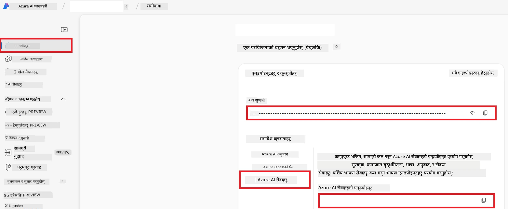

# Co-op Translator का लागि Azure AI सेट अप गर्नुहोस् (Azure OpneAI र Azure AI Vision)

यस मार्गदर्शनले तपाईंलाई Azure AI Foundry भित्र भाषा अनुवादको लागि Azure OpenAI र छवि सामग्री विश्लेषणका लागि Azure Computer Vision (जसलाई पछि छवि आधारित अनुवादका लागि प्रयोग गर्न सकिन्छ) सेटअप गर्ने चरणहरू देखाउँछ।

**पूर्वशर्तहरू:**
- सक्रिय सदस्यता भएको Azure खाता।
- तपाईंको Azure सदस्यतामा स्रोतहरू र परिनियोजनहरू सिर्जना गर्ने पर्याप्त अनुमति।

## Azure AI प्रोजेक्ट सिर्जना गर्नुहोस्

तपाईं Azure AI प्रोजेक्ट सिर्जना गर्न सुरु गर्नुहुनेछ, जुन तपाईका AI स्रोतहरूको व्यवस्थापनको लागि केन्द्रीय ठाउँको रूपमा कार्य गर्दछ।

1. [https://ai.azure.com](https://ai.azure.com) मा जानुहोस् र आफ्नो Azure खातासँग साइन इन गर्नुहोस्।

1. नयाँ प्रोजेक्ट सिर्जना गर्न **+Create** छान्नुहोस्।

1. निम्न कार्यहरू गर्नुहोस्:
   - **Project name** प्रविष्ट गर्नुहोस् (जस्तै, `CoopTranslator-Project`)।
   - **AI hub** छान्नुहोस् (जस्तै, `CoopTranslator-Hub`) (आवश्यक परे नयाँ सिर्जना गर्नुहोस्)।

1. आफ्नो प्रोजेक्ट सेटअप गर्न "**Review and Create**" क्लिक गर्नुहोस्। तपाईंलाई तपाईंको प्रोजेक्टको अवलोकन पृष्ठमा लैजान्छ।

## भाषा अनुवादको लागि Azure OpenAI सेट अप गर्नुहोस्

तपाईंको प्रोजेक्ट भित्र, तपाईंले पाठ अनुवादको लागि ब्याकएन्डको रूपमा सेवा दिन Azure OpenAI मोडेल परिनियोजन गर्नुहुनेछ।

### आफ्नो प्रोजेक्टमा जानुहोस्

यदि पहिले नै छैन भने, Azure AI Foundry मा तपाईंले नयाँ सिर्जना गरेको प्रोजेक्ट (जस्तै, `CoopTranslator-Project`) खोल्नुहोस्।

### OpenAI मोडेल परिनियोजन गर्नुहोस्

1. तपाईंको प्रोजेक्टको बायाँ मेनूबाट, "My assets" अन्तर्गत, "**Models + endpoints**" छान्नुहोस्।

1. **+ Deploy model** छान्नुहोस्।

1. **Deploy Base Model** छान्नुहोस्।

1. उपलब्ध मोडेलहरूको सूची प्रस्तुत गरिनेछ। उपयुक्त GPT मोडेल फिल्टर वा खोज्नुहोस्। हामी `gpt-4o` सिफारिस गर्छौं।

1. आफ्नो इच्छाइएको मोडेल छान्नुहोस् र **Confirm** क्लिक गर्नुहोस्।

1. **Deploy** छान्नुहोस्।

### Azure OpenAI कन्फिगरेसन

परिनियोजन पछि, तपाईं "**Models + endpoints**" पृष्ठबाट यसको **REST endpoint URL**, **Key**, **Deployment name**, **Model name** र **API version** पत्ता लगाउन सक्नुहुन्छ। यी तपाईंको एप्लिकेशनमा अनुवाद मोडेल अन्तर्क्रियामा आवश्यक पर्नेछन्।

> [!NOTE]
> तपाईं आफ्नो आवश्यकताअनुसार [API version deprecation](https://learn.microsoft.com/azure/ai-services/openai/api-version-deprecation) पृष्ठबाट API संस्करणहरू चयन गर्न सक्नुहुन्छ। ध्यान दिनुहोस् कि **API version** Azure AI Foundry को "**Models + endpoints**" पृष्ठमा देखिने **Model version** भन्दा फरक हुन्छ।

## छवि अनुवादको लागि Azure Computer Vision सेट अप गर्नुहोस्

छविहरू भित्रको पाठ अनुवाद सक्षम पार्न, तपाईंले Azure AI Service को API Key र Endpoint पत्ता लगाउनुपर्छ।

1. तपाईंको Azure AI प्रोजेक्ट (जस्तै, `CoopTranslator-Project`) मा जानुहोस्। प्रोजेक्ट अवलोकन पृष्ठमा हुनुहोस्।

### Azure AI Service कन्फिगरेसन

Azure AI Service बाट API Key र Endpoint पत्ता लगाउनुहोस्।

1. तपाईंको Azure AI प्रोजेक्ट (जस्तै, `CoopTranslator-Project`) मा जानुहोस्। प्रोजेक्ट अवलोकन पृष्ठमा हुनुहोस्।

1. Azure AI Service ट्याबबाट **API Key** र **Endpoint** पत्ता लगाउनुहोस्।

    

यो कनेक्सनले लिंक गरिएको Azure AI Services स्रोतको (छवि विश्लेषण सहित) क्षमता तपाईंको AI Foundry प्रोजेक्टमा उपलब्ध गराउँछ। तपाईं यस कनेक्सनलाई आफ्नो नोटबुक वा एप्लिकेशनहरूमा प्रयोग गरेर छविहरूबाट पाठ निकाली त्यसलाई Azure OpenAI मोडेलमा अनुवादका लागि पठाउन सक्नुहुन्छ।

## आफ्नो प्रमाणपत्रहरू समेट्नुहोस्

अबसम्म, तपाईंले निम्न कुरा सङ्कलन गरिसक्नुभएको हुनु पर्छ:

**Azure OpenAI (पाठ अनुवाद) का लागि:**
- Azure OpenAI Endpoint
- Azure OpenAI API Key
- Azure OpenAI Model Name (जस्तै, `gpt-4o`)
- Azure OpenAI Deployment Name (जस्तै, `cooptranslator-gpt4o`)
- Azure OpenAI API Version

**Azure AI Services (Vision मार्फत छवि पाठ निकासी) का लागि:**
- Azure AI Service Endpoint
- Azure AI Service API Key

### उदाहरण: वातावरण भेरिएबल कन्फिगरेसन (पूर्वावलोकन)

पछि, जब तपाईंले आफ्नो एप्लिकेशन निर्माण गर्नुहुन्छ, सम्भावित रूपमा यी सङ्कलित प्रमाणपत्रहरूलाई वातावरण भेरिएबलहरूको रूपमा कन्फिगर गर्नुहुनेछ।

```bash
# Azure AI सेवा प्रमाणपत्रहरू (छवि अनुवादको लागि आवश्यक)
AZURE_AI_SERVICE_API_KEY="your_azure_ai_service_api_key" # जस्तै, 21xasd...
AZURE_AI_SERVICE_ENDPOINT="https://your_azure_ai_service_endpoint.cognitiveservices.azure.com/"

# वैकल्पिक फलब्याक सेटहरू: प्रत्यायकहरूलाई _1/_2 उपसर्गसहित नक्कल गर्नुहोस् (सेटका सबै प्रत्यायकहरूको लागि उही अनुक्रमणिका)
AZURE_AI_SERVICE_API_KEY_1="your_azure_ai_service_api_key_1"
AZURE_AI_SERVICE_ENDPOINT_1="https://your_azure_ai_service_endpoint_1.cognitiveservices.azure.com/"

# Azure OpenAI प्रमाणपत्रहरू (पाठ अनुवादको लागि आवश्यक)
AZURE_OPENAI_API_KEY="your_azure_openai_api_key" # जस्तै, 21xasd...
AZURE_OPENAI_ENDPOINT="https://your_azure_openai_endpoint.openai.azure.com/"
AZURE_OPENAI_MODEL_NAME="your_model_name" # जस्तै, gpt-4o
AZURE_OPENAI_CHAT_DEPLOYMENT_NAME="your_deployment_name" # जस्तै, cooptranslator-gpt4o
AZURE_OPENAI_API_VERSION="your_api_version" # जस्तै, 2024-12-01-preview

# वैकल्पिक फलब्याक सेटहरू: पूर्ण AZURE_OPENAI_* सेटलाई _1/_2 उपसर्गसहित नक्कल गर्नुहोस् (सबै प्रत्यायकहरूको लागि उही अनुक्रमणिका)
```

---

### थप पढ्नका लागि

- [Azure AI Foundry मा प्रोजेक्ट कसरी सिर्जना गर्ने](https://learn.microsoft.com/azure/ai-foundry/how-to/create-projects?tabs=ai-studio)
- [Azure AI स्रोतहरू कसरी सिर्जना गर्ने](https://learn.microsoft.com/azure/ai-foundry/how-to/create-azure-ai-resource?tabs=portal)
- [Azure AI Foundry मा OpenAI मोडेलहरू कसरी परिनियोजन गर्ने](https://learn.microsoft.com/en-us/azure/ai-foundry/how-to/deploy-models-openai)

---

<!-- CO-OP TRANSLATOR DISCLAIMER START -->
**अस्वीकरण**:  
यस दस्तावेजलाई AI अनुवाद सेवा [Co-op Translator](https://github.com/Azure/co-op-translator) को प्रयोग गरी अनुवाद गरिएको छ। हामी शुद्धताका लागि प्रयासरत छौं, तर कृपया अवगत हुनुस् कि स्वचालित अनुवादमा त्रुटि वा अशुद्धता हुन सक्नेछ। मूल दस्तावेज यसको मूल भाषामा अधिकारिक स्रोत मानिनुपर्छ। महत्वपूर्ण जानकारीका लागि, व्यावसायिक मानवीय अनुवाद सिफारिस गरिन्छ। यस अनुवादको प्रयोगबाट उत्पन्न हुने कुनै पनि गलतफहमी वा गलत व्याख्याका लागि हामी जिम्मेवार हुनेछैनौँ।
<!-- CO-OP TRANSLATOR DISCLAIMER END -->