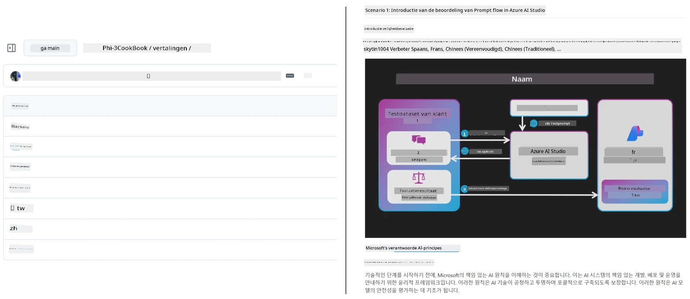
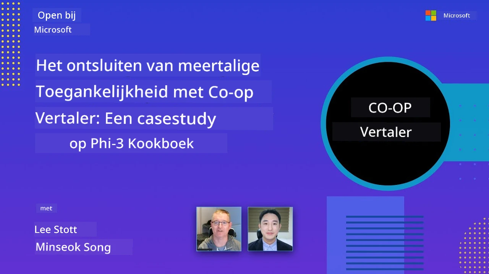

# Co-op Translator

_Easily automate and maintain translations for your educational GitHub content across multiple languages as your project evolves._


[](https://pypi.org/project/co-op-translator/)
[](https://github.com/azure/co-op-translator/blob/main/LICENSE)
[](https://pepy.tech/project/co-op-translator)
[](https://pepy.tech/project/co-op-translator)
[](https://github.com/azure/co-op-translator/pkgs/container/co-op-translator)
[](https://github.com/psf/black)

[](https://GitHub.com/azure/co-op-translator/graphs/contributors/)
[](https://GitHub.com/azure/co-op-translator/issues/)
[](https://GitHub.com/azure/co-op-translator/pulls/)
[](http://makeapullrequest.com)

### 🌐 Meertalige ondersteuning

#### Ondersteund door [Co-op Translator](https://github.com/Azure/Co-op-Translator)

<!-- CO-OP TRANSLATOR LANGUAGES TABLE START -->
[Arabisch](../ar/README.md) | [Bengaals](../bn/README.md) | [Bulgaars](../bg/README.md) | [Birmaans (Myanmar)](../my/README.md) | [Chinees (vereenvoudigd)](../zh-CN/README.md) | [Chinees (traditioneel, Hong Kong)](../zh-HK/README.md) | [Chinees (traditioneel, Macau)](../zh-MO/README.md) | [Chinees (traditioneel, Taiwan)](../zh-TW/README.md) | [Kroatisch](../hr/README.md) | [Tsjechisch](../cs/README.md) | [Deens](../da/README.md) | [Nederlands](./README.md) | [Ests](../et/README.md) | [Fins](../fi/README.md) | [Frans](../fr/README.md) | [Duits](../de/README.md) | [Grieks](../el/README.md) | [Hebreeuws](../he/README.md) | [Hindi](../hi/README.md) | [Hongaars](../hu/README.md) | [Indonesisch](../id/README.md) | [Italiaans](../it/README.md) | [Japans](../ja/README.md) | [Kannada](../kn/README.md) | [Khmer](../km/README.md) | [Koreaans](../ko/README.md) | [Litouws](../lt/README.md) | [Maleis](../ms/README.md) | [Malayalam](../ml/README.md) | [Marathi](../mr/README.md) | [Nepalees](../ne/README.md) | [Nigerdelta Pidgin](../pcm/README.md) | [Noors](../no/README.md) | [Perzisch (Farsi)](../fa/README.md) | [Pools](../pl/README.md) | [Portugees (Brazilië)](../pt-BR/README.md) | [Portugees (Portugal)](../pt-PT/README.md) | [Punjabi (Gurmukhi)](../pa/README.md) | [Roemeens](../ro/README.md) | [Russisch](../ru/README.md) | [Servisch (Cyrillisch)](../sr/README.md) | [Slowaaks](../sk/README.md) | [Sloveens](../sl/README.md) | [Spaans](../es/README.md) | [Swahili](../sw/README.md) | [Zweeds](../sv/README.md) | [Tagalog (Filipijns)](../tl/README.md) | [Tamil](../ta/README.md) | [Telugu](../te/README.md) | [Thais](../th/README.md) | [Turks](../tr/README.md) | [Oekraïens](../uk/README.md) | [Urdu](../ur/README.md) | [Vietnamees](../vi/README.md)

> **Liever lokaal klonen?**
>
> Deze repository bevat meer dan 50 taalvertalingen die de downloadgrootte aanzienlijk vergroten. Om te klonen zonder vertalingen, gebruik sparse checkout:
>
> **Bash / macOS / Linux:**
> ```bash
> git clone --filter=blob:none --sparse https://github.com/Azure/co-op-translator.git
> cd co-op-translator
> git sparse-checkout set --no-cone '/*' '!translations' '!translated_images'
> ```
>
> **CMD (Windows):**
> ```cmd
> git clone --filter=blob:none --sparse https://github.com/Azure/co-op-translator.git
> cd co-op-translator
> git sparse-checkout set --no-cone "/*" "!translations" "!translated_images"
> ```
>
> Dit geeft je alles wat je nodig hebt om de cursus te voltooien met een veel snellere download.
<!-- CO-OP TRANSLATOR LANGUAGES TABLE END -->

[](https://GitHub.com/azure/co-op-translator/watchers/)
[](https://GitHub.com/azure/co-op-translator/network/)
[](https://GitHub.com/azure/co-op-translator/stargazers/)

[](https://discord.gg/nTYy5BXMWG)

[](https://codespaces.new/azure/co-op-translator)

## Overzicht

**Co-op Translator** helpt je om je educatieve GitHub-inhoud moeiteloos te lokaliseren in meerdere talen.  
Wanneer je je Markdown-bestanden, afbeeldingen of notebooks bijwerkt, blijven vertalingen automatisch synchroon, zodat je inhoud accuraat en actueel blijft voor leerlingen wereldwijd.

Voorbeeld van hoe vertaalde inhoud is georganiseerd:



## Hoe de staat van vertalingen wordt beheerd

Co-op Translator beheert vertaalde inhoud als **geversioneerde software-artifacten**,  
niet als statische bestanden.

De tool volgt de staat van vertaalde Markdown, afbeeldingen en notebooks  
met behulp van **talen-specifieke metadata**.

Dit ontwerp stelt Co-op Translator in staat om:

- Verouderde vertalingen betrouwbaar te detecteren  
- Markdown, afbeeldingen en notebooks consistent te behandelen  
- Veilig te schalen over grote, snel bewegende, meertalige repositories

Door vertalingen te modelleren als beheerde artifacten,  
komen vertaalworkflows natuurlijk overeen met moderne  
praktijken voor softwareafhankelijkheden en artifactbeheer.

→ [Hoe de staat van vertalingen wordt beheerd](https://techcommunity.microsoft.com/blog/azuredevcommunityblog/rethinking-documentation-translation-treating-translations-as-versioned-software/4491755)


## Snelstart

```bash
# Maak en activeer een virtuele omgeving (aanbevolen)
python -m venv .venv
# Windows
.venv\Scripts\activate
# macOS/Linux
source .venv/bin/activate
# Installeer het pakket
pip install co-op-translator
# Vertalen
translate -l "ko ja fr" -md
```

Docker:

```bash
# Haal de openbare image van GHCR
docker pull ghcr.io/azure/co-op-translator:latest
# Run met de huidige map gemonteerd en .env geleverd (Bash/Zsh)
docker run --rm -it --env-file .env -v "${PWD}:/work" ghcr.io/azure/co-op-translator:latest -l "ko ja fr" -md
```

## Minimale installatie

1. Zorg dat je een ondersteunde Python-versie hebt (momenteel 3.10-3.12). Dit wordt in poetry (pyproject.toml) automatisch geregeld.  
2. Maak een `.env`-bestand aan met de sjabloon: [.env.template](../../.env.template)  
3. Configureer één LLM-provider (Azure OpenAI of OpenAI)  
4. (Optioneel) Voor beeldvertaling (`-img`), configureer Azure AI Vision  
5. (Optioneel) Je kunt meerdere inloggegevenssets configureren door variabelen te dupliceren met achtervoegsels zoals `_1`, `_2`, etc. Alle variabelen in één set moeten hetzelfde achtervoegsel delen.  
6. (Aanbevolen) Ruim vorige vertalingen op om conflicten te vermijden (bijv. `translations/`)  
7. (Aanbevolen) Voeg een vertaalsectie toe aan je README met de [README-taalsjabloon](./getting_started/README_languages_template.md)  
8. Zie: [Azure AI instellen](./getting_started/set-up-azure-ai.md)

## Gebruik

Vertaal alle ondersteunde types:

```bash
translate -l "ko ja"
```

Alleen Markdown:

```bash
translate -l "de" -md
```

Markdown + afbeeldingen:

```bash
translate -l "pt" -md -img
```

Alleen notebooks:

```bash
translate -l "zh" -nb
```

Meer opties: [Commandoreferentie](./getting_started/command-reference.md)

## Kenmerken

- Geautomatiseerde vertaling voor Markdown, notebooks en afbeeldingen  
- Houdt vertalingen synchroon met bronwijzigingen  
- Werkt lokaal (CLI) of in CI (GitHub Actions)  
- Gebruikt Azure OpenAI of OpenAI; optioneel Azure AI Vision voor afbeeldingen  
- Behoudt Markdown-opmaak en structuur

## Documentatie

- [Commandoreferentie](./getting_started/command-line-guide/command-line-guide.md)  
- [GitHub Actions-gids (Openbare repositories en standaardsecrets)](./getting_started/github-actions-guide/github-actions-guide-public.md)  
- [GitHub Actions-gids (Microsoft organisatie repositories en organisatiebrede instellingen)](./getting_started/github-actions-guide/github-actions-guide-org.md)  
- [README-taalsjabloon](./getting_started/README_languages_template.md)  
- [Ondersteunde talen](./getting_started/supported-languages.md)  
- [Bijdragen leveren](./CONTRIBUTING.md)  
- [Probleemoplossing](./getting_started/troubleshooting.md)

### Microsoft-specifieke gids
> [!NOTE]
> Alleen voor beheerders van de Microsoft “Voor Beginners” repositories.

- [Bijwerken van de “andere cursussen” lijst (alleen voor MS Beginners repositories)](./getting_started/update-other-courses.md)

## Steun ons en bevorder wereldwijd leren

Doe mee aan de revolutie in het delen van educatieve inhoud wereldwijd! Geef [Co-op Translator](https://github.com/azure/co-op-translator) een ⭐ op GitHub en steun onze missie om taalbarrières in leren en technologie te doorbreken. Jouw interesse en bijdragen maken een groot verschil! Codebijdragen en ideeën voor nieuwe functies zijn altijd welkom.

### Ontdek Microsoft educatieve inhoud in jouw taal

- [LangChain4j-for-Beginners](https://github.com/microsoft/LangChain4j-for-Beginners)  
- [AZD for Beginners](https://github.com/microsoft/AZD-for-beginners)  
- [Edge AI for Beginners](https://github.com/microsoft/edgeai-for-beginners)  
- [Model Context Protocol (MCP) For Beginners](https://github.com/microsoft/mcp-for-beginners)  
- [AI Agents for Beginners](https://github.com/microsoft/ai-agents-for-beginners)  
- [Generative AI for Beginners using .NET](https://github.com/microsoft/Generative-AI-for-beginners-dotnet)  
- [Generative AI for Beginners](https://github.com/microsoft/generative-ai-for-beginners)  
- [Generative AI for Beginners using Java](https://github.com/microsoft/generative-ai-for-beginners-java)  
- [ML for Beginners](https://aka.ms/ml-beginners)  
- [Data Science for Beginners](https://aka.ms/datascience-beginners)  
- [AI for Beginners](https://aka.ms/ai-beginners)  
- [Cybersecurity for Beginners](https://github.com/microsoft/Security-101)  
- [Web Dev for Beginners](https://aka.ms/webdev-beginners)  
- [IoT for Beginners](https://aka.ms/iot-beginners)  
- [PhiCookBook](https://github.com/microsoft/PhiCookBook)

## Video presentaties

👉 Klik op de afbeelding hieronder om deze op YouTube te bekijken.

- **Open at Microsoft**: Een korte introductie van 18 minuten en snelle gids over het gebruik van Co-op Translator.

  [](https://www.youtube.com/watch?v=jX_swfH_KNU)

## Bijdragen leveren

Dit project verwelkomt bijdragen en suggesties. Geïnteresseerd om bij te dragen aan Azure Co-op Translator? Zie onze [CONTRIBUTING.md](./CONTRIBUTING.md) voor richtlijnen over hoe je kunt helpen om Co-op Translator toegankelijker te maken.

## Bijdragers
[](https://github.com/Azure/co-op-translator/graphs/contributors)

## Gedragscode

Dit project heeft de [Microsoft Open Source Gedragscode](https://opensource.microsoft.com/codeofconduct/) overgenomen.
Voor meer informatie zie de [Gedragscode FAQ](https://opensource.microsoft.com/codeofconduct/faq/) of
neem contact op met [opencode@microsoft.com](mailto:opencode@microsoft.com) bij eventuele aanvullende vragen of opmerkingen.

## Verantwoorde AI

Microsoft zet zich in om onze klanten te helpen onze AI-producten op een verantwoorde manier te gebruiken, onze inzichten te delen en vertrouwen gebaseerde partnerschappen op te bouwen via tools zoals Transparency Notes en Impact Assessments. Veel van deze bronnen zijn te vinden op [https://aka.ms/RAI](https://aka.ms/RAI).
De aanpak van Microsoft voor verantwoorde AI is gebaseerd op onze AI-principes van rechtvaardigheid, betrouwbaarheid en veiligheid, privacy en beveiliging, inclusiviteit, transparantie en verantwoordelijkheid.

Grootschalige modellen voor natuurlijke taal, beeld en spraak - zoals degenen die in dit voorbeeld worden gebruikt - kunnen zich potentieel op een manier gedragen die oneerlijk, onbetrouwbaar of aanstootgevend is, wat op zijn beurt schade kan veroorzaken. Raadpleeg de [Azure OpenAI service Transparency note](https://learn.microsoft.com/legal/cognitive-services/openai/transparency-note?tabs=text) om geïnformeerd te worden over risico's en beperkingen.

De aanbevolen aanpak om deze risico's te beperken is het opnemen van een veiligheidssysteem in uw architectuur dat schadelijk gedrag kan detecteren en voorkomen. [Azure AI Content Safety](https://learn.microsoft.com/azure/ai-services/content-safety/overview) biedt een onafhankelijke beschermlaag die schadelijke gebruikersgegenereerde en AI-gegenereerde inhoud kan detecteren in applicaties en diensten. Azure AI Content Safety bevat tekst- en beeld-API's waarmee u materiaal kunt detecteren dat schadelijk is. We hebben ook een interactieve Content Safety Studio waarmee u voorbeeldcode kunt bekijken, verkennen en uitproberen voor het detecteren van schadelijke inhoud in verschillende modaliteiten. De volgende [quickstart-documentatie](https://learn.microsoft.com/azure/ai-services/content-safety/quickstart-text?tabs=visual-studio%2Clinux&pivots=programming-language-rest) begeleidt u bij het maken van verzoeken aan de service.

Een ander aspect om rekening mee te houden is de algehele applicatieprestaties. Bij multi-modale en multi-model applicaties verstaan we onder prestaties dat het systeem presteert zoals u en uw gebruikers verwachten, inclusief het niet genereren van schadelijke outputs. Het is belangrijk om de prestaties van uw gehele applicatie te beoordelen met behulp van [generatiekwaliteit en risico- en veiligheidsmetriek](https://learn.microsoft.com/azure/ai-studio/concepts/evaluation-metrics-built-in).

U kunt uw AI-applicatie evalueren in uw ontwikkelomgeving met behulp van de [prompt flow SDK](https://microsoft.github.io/promptflow/index.html). Gegeven een testdataset of een doel, worden de generaties van uw generatieve AI-applicatie kwantitatief gemeten met ingebouwde evaluatoren of aangepaste evaluatoren van uw keuze. Om aan de slag te gaan met de prompt flow sdk voor het evalueren van uw systeem, kunt u de [quickstart-gids](https://learn.microsoft.com/azure/ai-studio/how-to/develop/flow-evaluate-sdk) volgen. Nadat u een evaluatieronde hebt uitgevoerd, kunt u [de resultaten visualiseren in Azure AI Studio](https://learn.microsoft.com/azure/ai-studio/how-to/evaluate-flow-results).

## Handelsmerken

Dit project kan handelsmerken of logo's bevatten voor projecten, producten of diensten. Toegestaan gebruik van Microsoft
handelsmerken of logo's is onderworpen aan en moet voldoen aan
[Microsofts Richtlijnen voor handelsmerken en merken](https://www.microsoft.com/en-us/legal/intellectualproperty/trademarks/usage/general).
Gebruik van Microsoft-handelsmerken of logo's in gewijzigde versies van dit project mag geen verwarring veroorzaken of impliceren dat Microsoft sponsor is.
Elk gebruik van handelsmerken of logo's van derden is onderworpen aan het beleid van die derden.

## Hulp krijgen

Als u vastloopt of vragen hebt over het bouwen van AI-apps, sluit dan aan bij:

[](https://discord.gg/nTYy5BXMWG)

Als u productfeedback of fouten ervaart tijdens het bouwen, bezoek dan:

[](https://aka.ms/foundry/forum)

---

<!-- CO-OP TRANSLATOR DISCLAIMER START -->
**Disclaimer**:  
Dit document is vertaald met behulp van de AI-vertalingsdienst [Co-op Translator](https://github.com/Azure/co-op-translator). Hoewel we streven naar nauwkeurigheid, verzoeken wij u te realiseren dat geautomatiseerde vertalingen fouten of onnauwkeurigheden kunnen bevatten. Het originele document in de oorspronkelijke taal dient als de gezaghebbende bron te worden beschouwd. Voor kritieke informatie wordt professionele menselijke vertaling aanbevolen. Wij zijn niet aansprakelijk voor enige misverstanden of foutieve interpretaties voortvloeiend uit het gebruik van deze vertaling.
<!-- CO-OP TRANSLATOR DISCLAIMER END -->