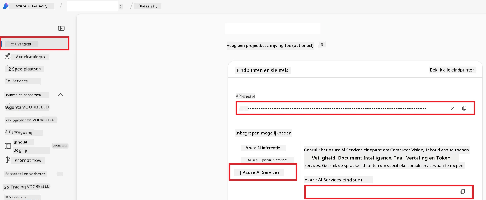

# Azure AI instellen voor Co-op Translator (Azure OpneAI & Azure AI Vision)

Deze handleiding begeleidt je bij het instellen van Azure OpenAI voor taalvertaling en Azure Computer Vision voor beeldinhoudanalyse (die vervolgens kan worden gebruikt voor beeldgebaseerde vertaling) binnen Azure AI Foundry.

**Vereisten:**
- Een Azure-account met een actief abonnement.
- Voldoende rechten om resources en implementaties te maken in je Azure-abonnement.

## Maak een Azure AI-project aan

Je begint met het aanmaken van een Azure AI-project, dat fungeert als een centrale plek voor het beheren van je AI-resources.

1. Ga naar [https://ai.azure.com](https://ai.azure.com) en meld je aan met je Azure-account.

1. Selecteer **+Create** om een nieuw project aan te maken.

1. Voer de volgende taken uit:
   - Voer een **Projectnaam** in (bijv. `CoopTranslator-Project`).
   - Selecteer de **AI hub** (bijv. `CoopTranslator-Hub`) (Maak er een nieuwe aan indien nodig).

1. Klik op "**Review and Create**" om je project op te zetten. Je wordt naar de overzichtspagina van je project geleid.

## Azure OpenAI instellen voor taalvertaling

Binnen je project implementeer je een Azure OpenAI-model als backend voor tekstvertaling.

### Navigeer naar je project

Als je nog niet daar bent, open dan je nieuw aangemaakte project (bijv. `CoopTranslator-Project`) in Azure AI Foundry.

### Implementeer een OpenAI-model

1. Selecteer in het menu aan de linkerkant van je project, onder "My assets", "**Models + endpoints**".

1. Selecteer **+ Deploy model**.

1. Selecteer **Deploy Base Model**.

1. Er wordt een lijst met beschikbare modellen weergegeven. Filter of zoek naar een geschikt GPT-model. Wij raden `gpt-4o` aan.

1. Selecteer het gewenste model en klik op **Confirm**.

1. Selecteer **Deploy**.

### Azure OpenAI-configuratie

Zodra het is geïmplementeerd, kun je de implementatie selecteren op de pagina "**Models + endpoints**" om de **REST endpoint URL**, **Key**, **Deployment name**, **Model name** en **API version** te vinden. Deze heb je nodig om het vertaalmodel in je toepassing te integreren.

> [!NOTE]
> Je kunt API-versies selecteren vanaf de [API version deprecation](https://learn.microsoft.com/azure/ai-services/openai/api-version-deprecation) pagina op basis van je vereisten. Houd er rekening mee dat de **API version** verschilt van de **Model version** die op de pagina **Models + endpoints** in Azure AI Foundry wordt weergegeven.

## Azure Computer Vision instellen voor beeldvertaling

Om vertaling van tekst binnen afbeeldingen mogelijk te maken, moet je de Azure AI Service API-sleutel en endpoint vinden.

1. Navigeer naar je Azure AI-project (bijv. `CoopTranslator-Project`). Zorg dat je op de overzichtspagina van het project bent.

### Azure AI Service-configuratie

Vind de API-sleutel en endpoint van de Azure AI Service.

1. Navigeer naar je Azure AI-project (bijv. `CoopTranslator-Project`). Zorg dat je op de overzichtspagina van het project bent.

1. Vind de **API Key** en **Endpoint** onder het tabblad Azure AI Service.

    

Deze verbinding maakt de mogelijkheden van de gekoppelde Azure AI Services-resource (inclusief beeldanalyse) beschikbaar voor je AI Foundry-project. Je kunt deze verbinding daarna in je notebooks of applicaties gebruiken om tekst uit afbeeldingen te extraheren, die vervolgens naar het Azure OpenAI-model gestuurd kan worden voor vertaling.

## Je inloggegevens consolideren

Je zou nu het volgende verzameld moeten hebben:

**Voor Azure OpenAI (tekstvertaling):**
- Azure OpenAI Endpoint
- Azure OpenAI API Key
- Azure OpenAI Modelnaam (bijv. `gpt-4o`)
- Azure OpenAI Implementatienaam (bijv. `cooptranslator-gpt4o`)
- Azure OpenAI API Versie

**Voor Azure AI Services (tekstextractie uit afbeeldingen via Vision):**
- Azure AI Service Endpoint
- Azure AI Service API Key

### Voorbeeld: Omgevingsvariabeleconfiguratie (Preview)

Later, bij het bouwen van je toepassing, configureer je deze waarschijnlijk met deze verzamelde inloggegevens. Bijvoorbeeld, je zou ze als omgevingsvariabelen kunnen instellen zoals hieronder:

```bash
# Azure AI-service referenties (Vereist voor beeldvertaling)
AZURE_AI_SERVICE_API_KEY="your_azure_ai_service_api_key" # bijv., 21xasd...
AZURE_AI_SERVICE_ENDPOINT="https://your_azure_ai_service_endpoint.cognitiveservices.azure.com/"

# Optionele fallback sets: dupliceer variabelen met achtervoegsel _1/_2 (zelfde index voor alle variabelen in de set)
AZURE_AI_SERVICE_API_KEY_1="your_azure_ai_service_api_key_1"
AZURE_AI_SERVICE_ENDPOINT_1="https://your_azure_ai_service_endpoint_1.cognitiveservices.azure.com/"

# Azure OpenAI referenties (Vereist voor tekstvertaling)
AZURE_OPENAI_API_KEY="your_azure_openai_api_key" # bijv., 21xasd...
AZURE_OPENAI_ENDPOINT="https://your_azure_openai_endpoint.openai.azure.com/"
AZURE_OPENAI_MODEL_NAME="your_model_name" # bijv., gpt-4o
AZURE_OPENAI_CHAT_DEPLOYMENT_NAME="your_deployment_name" # bijv., cooptranslator-gpt4o
AZURE_OPENAI_API_VERSION="your_api_version" # bijv., 2024-12-01-preview

# Optionele fallback sets: dupliceer de volledige AZURE_OPENAI_* set met achtervoegsel _1/_2 (zelfde index voor alle variabelen)
```

---

### Verder lezen

- [Hoe maak je een project in Azure AI Foundry](https://learn.microsoft.com/azure/ai-foundry/how-to/create-projects?tabs=ai-studio)
- [Hoe maak je Azure AI-resources aan](https://learn.microsoft.com/azure/ai-foundry/how-to/create-azure-ai-resource?tabs=portal)
- [Hoe implementeer je OpenAI-modellen in Azure AI Foundry](https://learn.microsoft.com/en-us/azure/ai-foundry/how-to/deploy-models-openai)

---

<!-- CO-OP TRANSLATOR DISCLAIMER START -->
**Disclaimer**:  
Dit document is vertaald met behulp van de AI-vertalingsdienst [Co-op Translator](https://github.com/Azure/co-op-translator). Hoewel we streven naar nauwkeurigheid, dient u er rekening mee te houden dat geautomatiseerde vertalingen fouten of onnauwkeurigheden kunnen bevatten. Het originele document in de oorspronkelijke taal wordt beschouwd als de gezaghebbende bron. Voor kritieke informatie wordt professionele menselijke vertaling aanbevolen. Wij zijn niet aansprakelijk voor enige misverstanden of verkeerde interpretaties die voortvloeien uit het gebruik van deze vertaling.
<!-- CO-OP TRANSLATOR DISCLAIMER END -->