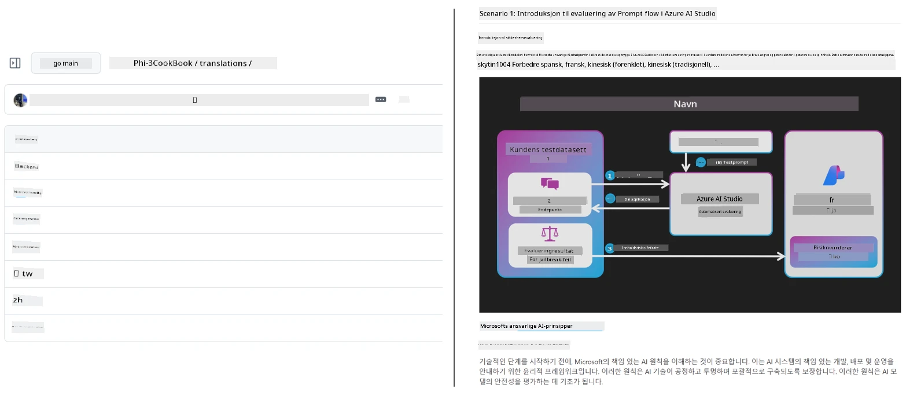
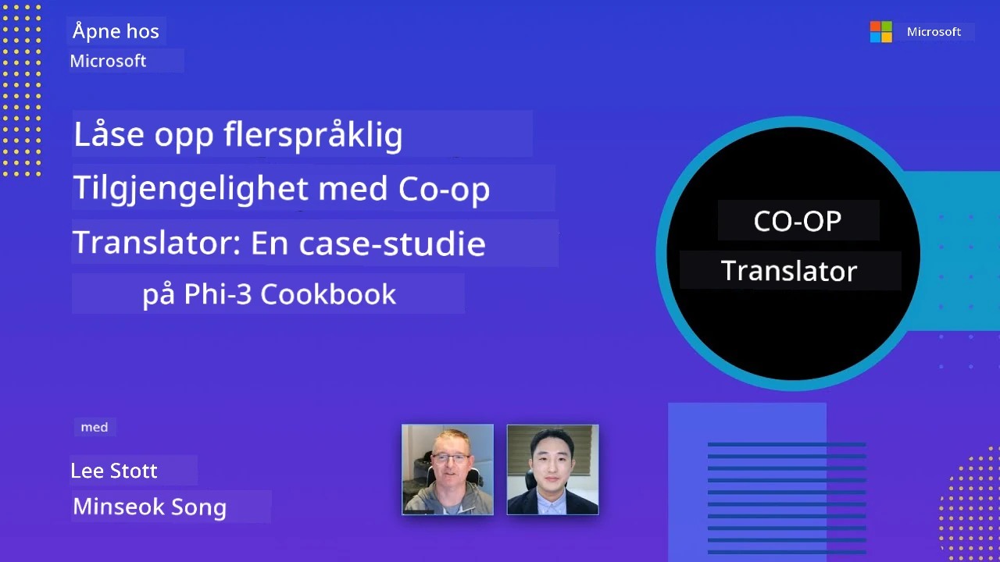

# Co-op Translator

_Effektivt automatiser og vedlikehold oversettelser for ditt undervisningsinnhold på GitHub på flere språk etter hvert som prosjektet utvikler seg._


[](https://pypi.org/project/co-op-translator/)
[](https://github.com/azure/co-op-translator/blob/main/LICENSE)
[](https://pepy.tech/project/co-op-translator)
[](https://pepy.tech/project/co-op-translator)
[](https://github.com/azure/co-op-translator/pkgs/container/co-op-translator)
[](https://github.com/psf/black)

[](https://GitHub.com/azure/co-op-translator/graphs/contributors/)
[](https://GitHub.com/azure/co-op-translator/issues/)
[](https://GitHub.com/azure/co-op-translator/pulls/)
[](http://makeapullrequest.com)

### 🌐 Flerspråklig støtte

#### Støttet av [Co-op Translator](https://github.com/Azure/Co-op-Translator)

<!-- CO-OP TRANSLATOR LANGUAGES TABLE START -->
[Arabic](../ar/README.md) | [Bengali](../bn/README.md) | [Bulgarian](../bg/README.md) | [Burmese (Myanmar)](../my/README.md) | [Chinese (Simplified)](../zh-CN/README.md) | [Chinese (Traditional, Hong Kong)](../zh-HK/README.md) | [Chinese (Traditional, Macau)](../zh-MO/README.md) | [Chinese (Traditional, Taiwan)](../zh-TW/README.md) | [Croatian](../hr/README.md) | [Czech](../cs/README.md) | [Danish](../da/README.md) | [Dutch](../nl/README.md) | [Estonian](../et/README.md) | [Finnish](../fi/README.md) | [French](../fr/README.md) | [German](../de/README.md) | [Greek](../el/README.md) | [Hebrew](../he/README.md) | [Hindi](../hi/README.md) | [Hungarian](../hu/README.md) | [Indonesian](../id/README.md) | [Italian](../it/README.md) | [Japanese](../ja/README.md) | [Kannada](../kn/README.md) | [Khmer](../km/README.md) | [Korean](../ko/README.md) | [Lithuanian](../lt/README.md) | [Malay](../ms/README.md) | [Malayalam](../ml/README.md) | [Marathi](../mr/README.md) | [Nepali](../ne/README.md) | [Nigerian Pidgin](../pcm/README.md) | [Norwegian](./README.md) | [Persian (Farsi)](../fa/README.md) | [Polish](../pl/README.md) | [Portuguese (Brazil)](../pt-BR/README.md) | [Portuguese (Portugal)](../pt-PT/README.md) | [Punjabi (Gurmukhi)](../pa/README.md) | [Romanian](../ro/README.md) | [Russian](../ru/README.md) | [Serbian (Cyrillic)](../sr/README.md) | [Slovak](../sk/README.md) | [Slovenian](../sl/README.md) | [Spanish](../es/README.md) | [Swahili](../sw/README.md) | [Swedish](../sv/README.md) | [Tagalog (Filipino)](../tl/README.md) | [Tamil](../ta/README.md) | [Telugu](../te/README.md) | [Thai](../th/README.md) | [Turkish](../tr/README.md) | [Ukrainian](../uk/README.md) | [Urdu](../ur/README.md) | [Vietnamese](../vi/README.md)

> **Foretrekker du å klone lokalt?**
>
> Dette depotet inkluderer over 50 språkoversettelser, noe som betydelig øker nedlastingsstørrelsen. For å klone uten oversettelser, bruk sparse checkout:
>
> **Bash / macOS / Linux:**
> ```bash
> git clone --filter=blob:none --sparse https://github.com/skytin1004/co-op-translator.git
> cd co-op-translator
> git sparse-checkout set --no-cone '/*' '!translations' '!translated_images'
> ```
>
> **CMD (Windows):**
> ```cmd
> git clone --filter=blob:none --sparse https://github.com/skytin1004/co-op-translator.git
> cd co-op-translator
> git sparse-checkout set --no-cone "/*" "!translations" "!translated_images"
> ```
>
> Dette gir deg alt du trenger for å fullføre kurset med en mye raskere nedlasting.
<!-- CO-OP TRANSLATOR LANGUAGES TABLE END -->

[](https://GitHub.com/azure/co-op-translator/watchers/)
[](https://GitHub.com/azure/co-op-translator/network/)
[](https://GitHub.com/azure/co-op-translator/stargazers/)

[](https://discord.gg/nTYy5BXMWG)

[](https://codespaces.new/azure/co-op-translator)

## Oversikt

**Co-op Translator** hjelper deg med å lokaltilpasse ditt undervisningsinnhold på GitHub til flere språk uten anstrengelse.  
Når du oppdaterer Markdown-filene, bildene eller notatbøkene dine, holder oversettelsene seg automatisk synkroniserte, slik at innholdet ditt forblir nøyaktig og oppdatert for elever over hele verden.

Eksempel på hvordan oversatt innhold er organisert:



## Hvordan oversettelsestilstanden administreres

Co-op Translator håndterer oversatt innhold som **versjonsstyrte programvareartefakter**,  
ikke som statiske filer.

Verktøyet sporer tilstanden til oversatt Markdown, bilder og notatbøker  
ved hjelp av **språkspesifikk metadata**.

Denne utformingen gjør at Co-op Translator kan:

- Pålitelig oppdage utdaterte oversettelser
- Behandle Markdown, bilder og notatbøker konsekvent
- Skalere trygt på tvers av store, hurtig bevegende flerspråklige depot

Ved å modellere oversettelser som administrerte artefakter,  
tilpasses oversettelsesarbeidsflyter naturlig med moderne  
programvareavhengigheter og artefaktadministrasjonspraksis.

→ [Hvordan oversettelsestilstanden administreres](https://techcommunity.microsoft.com/blog/azuredevcommunityblog/rethinking-documentation-translation-treating-translations-as-versioned-software/4491755)


## Rask start

```bash
# Opprett og aktiver et virtuelt miljø (anbefalt)
python -m venv .venv
# Windows
.venv\Scripts\activate
# macOS/Linux
source .venv/bin/activate
# Installer pakken
pip install co-op-translator
# Oversett
translate -l "ko ja fr" -md
```

Docker:

```bash
# Hent det offentlige bildet fra GHCR
docker pull ghcr.io/azure/co-op-translator:latest
# Kjør med gjeldende mappe montert og .env levert (Bash/Zsh)
docker run --rm -it --env-file .env -v "${PWD}:/work" ghcr.io/azure/co-op-translator:latest -l "ko ja fr" -md
```

## Minimal oppsett

1. Sørg for at du har en støttet Python-versjon (for øyeblikket 3.10-3.12). I poetry (pyproject.toml) håndteres dette automatisk.
2. Lag en `.env`-fil basert på malen: [.env.template](../../.env.template)
3. Konfigurer én LLM-leverandør (Azure OpenAI eller OpenAI)
4. (Valgfritt) For bildeoversettelse (`-img`), konfigurer Azure AI Vision
5. (Valgfritt) Du kan konfigurere flere sett med legitimasjoner ved å duplisere variabler med suffikser som `_1`, `_2`, osv. Alle variabler i et sett må dele samme suffiks.
6. (Anbefalt) Rydd opp i tidligere oversettelser for å unngå konflikter (f.eks. `translations/`)
7. (Anbefalt) Legg til en oversettelsesseksjon i README-en din ved å bruke [README languages template](./getting_started/README_languages_template.md)
8. Se: [Sett opp Azure AI](./getting_started/set-up-azure-ai.md)

## Bruk

Oversett alle støttede typer:

```bash
translate -l "ko ja"
```

Bare Markdown:

```bash
translate -l "de" -md
```

Markdown + bilder:

```bash
translate -l "pt" -md -img
```

Bare notatbøker:

```bash
translate -l "zh" -nb
```

Flere flagg: [Kommando referanse](./getting_started/command-reference.md)

## Funksjoner

- Automatisk oversettelse for Markdown, notatbøker og bilder
- Holder oversettelser i synk med endringer i kilden
- Fungerer lokalt (CLI) eller i CI (GitHub Actions)
- Bruker Azure OpenAI eller OpenAI; valgfritt Azure AI Vision for bilder
- Bevarer Markdown-formattering og struktur

## Dokumentasjon

- [Kommando-linje guide](./getting_started/command-line-guide/command-line-guide.md)
- [GitHub Actions guide (offentlige repoer & standardhemmeligheter)](./getting_started/github-actions-guide/github-actions-guide-public.md)
- [GitHub Actions guide (Microsoft-organisasjonsrepoer & org-nivå oppsett)](./getting_started/github-actions-guide/github-actions-guide-org.md)
- [README languages template](./getting_started/README_languages_template.md)
- [Støttede språk](./getting_started/supported-languages.md)
- [Bidra](./CONTRIBUTING.md)
- [Feilsøking](./getting_started/troubleshooting.md)

### Microsoft-spesifikk guide
> [!NOTE]
> For vedlikeholdere av Microsoft “For Beginners”-depotene alene.

- [Oppdatere listen over “andre kurs” (kun for MS Beginners-repositorier)](./getting_started/update-other-courses.md)

## Støtt oss og frem global læring

Bli med oss i å revolusjonere hvordan undervisningsinnhold deles globalt! Gi [Co-op Translator](https://github.com/azure/co-op-translator) en ⭐ på GitHub og støtt vår misjon om å bryte ned språkbarrierer i læring og teknologi. Din interesse og dine bidrag gjør en betydelig forskjell! Kodebidrag og forslag til funksjoner er alltid velkomne.

### Utforsk Microsoft undervisningsinnhold på ditt språk

- [LangChain4j-for-Beginners](https://github.com/microsoft/LangChain4j-for-Beginners)
- [AZD for Beginners](https://github.com/microsoft/AZD-for-beginners)
- [Edge AI for Beginners](https://github.com/microsoft/edgeai-for-beginners)
- [Model Context Protocol (MCP) For Beginners](https://github.com/microsoft/mcp-for-beginners)
- [AI Agents for Beginners](https://github.com/microsoft/ai-agents-for-beginners)
- [Generative AI for Beginners using .NET](https://github.com/microsoft/Generative-AI-for-beginners-dotnet)
- [Generative AI for Beginners](https://github.com/microsoft/generative-ai-for-beginners)
- [Generative AI for Beginners using Java](https://github.com/microsoft/generative-ai-for-beginners-java)
- [ML for Beginners](https://aka.ms/ml-beginners)
- [Data Science for Beginners](https://aka.ms/datascience-beginners)
- [AI for Beginners](https://aka.ms/ai-beginners)
- [Cybersecurity for Beginners](https://github.com/microsoft/Security-101)
- [Web Dev for Beginners](https://aka.ms/webdev-beginners)
- [IoT for Beginners](https://aka.ms/iot-beginners)
- [PhiCookBook](https://github.com/microsoft/PhiCookBook)

## Videopresentasjoner

👉 Klikk på bildet nedenfor for å se på YouTube.

- **Open at Microsoft**: En kort 18-minutters introduksjon og rask guide om hvordan man bruker Co-op Translator.

  [](https://www.youtube.com/watch?v=jX_swfH_KNU)

## Bidra

Dette prosjektet tar imot bidrag og forslag. Interessert i å bidra til Azure Co-op Translator? Se vår [CONTRIBUTING.md](./CONTRIBUTING.md) for retningslinjer om hvordan du kan hjelpe til med å gjøre Co-op Translator mer tilgjengelig.

## Bidragsytere
[](https://github.com/Azure/co-op-translator/graphs/contributors)

## Adferdskodeks

Dette prosjektet har tatt i bruk [Microsoft Open Source Code of Conduct](https://opensource.microsoft.com/codeofconduct/).
For mer informasjon, se [Code of Conduct FAQ](https://opensource.microsoft.com/codeofconduct/faq/) eller
kontakt [opencode@microsoft.com](mailto:opencode@microsoft.com) hvis du har spørsmål eller kommentarer.

## Ansvarlig AI

Microsoft er forpliktet til å hjelpe våre kunder med å bruke våre AI-produkter ansvarlig, dele våre erfaringer, og bygge tillitsbaserte partnerskap gjennom verktøy som Transparency Notes og Impact Assessments. Mange av disse ressursene finnes på [https://aka.ms/RAI](https://aka.ms/RAI).
Microsofts tilnærming til ansvarlig AI er basert på våre AI-prinsipper om rettferdighet, pålitelighet og sikkerhet, personvern og sikkerhet, inkludering, åpenhet og ansvarlighet.

Store skala modeller for naturlig språk, bilder og tale – som de som brukes i dette eksemplet – kan potensielt oppføre seg på måter som er urettferdige, upålitelige eller støtende, noe som kan forårsake skade. Vennligst les [Azure OpenAI service Transparency note](https://learn.microsoft.com/legal/cognitive-services/openai/transparency-note?tabs=text) for å bli informert om risikoer og begrensninger.

Anbefalt tilnærming for å dempe disse risikoene er å inkludere et sikkerhetssystem i arkitekturen din som kan oppdage og forhindre skadelig oppførsel. [Azure AI Content Safety](https://learn.microsoft.com/azure/ai-services/content-safety/overview) tilbyr et uavhengig beskyttelseslag som kan oppdage skadelig bruker- og AI-generert innhold i applikasjoner og tjenester. Azure AI Content Safety inkluderer tekst- og bilde-API-er som lar deg oppdage materiale som er skadelig. Vi har også et interaktivt Content Safety Studio som lar deg se, utforske og prøve ut eksempel-kode for å oppdage skadelig innhold på tvers av forskjellige modaliteter. Følgende [quickstart-dokumentasjon](https://learn.microsoft.com/azure/ai-services/content-safety/quickstart-text?tabs=visual-studio%2Clinux&pivots=programming-language-rest) guider deg gjennom hvordan du sender forespørsler til tjenesten.

En annen faktor å ta hensyn til er den samlede applikasjonsytelsen. Med multimodale og multimodell-applikasjoner definerer vi ytelse som at systemet fungerer som du og dine brukere forventer, inkludert at det ikke genererer skadelig innhold. Det er viktig å vurdere ytelsen til din totale applikasjon ved bruk av [genereringskvalitet og risiko- og sikkerhetsmålinger](https://learn.microsoft.com/azure/ai-studio/concepts/evaluation-metrics-built-in).

Du kan evaluere din AI-applikasjon i utviklingsmiljøet ved å bruke [prompt flow SDK](https://microsoft.github.io/promptflow/index.html). Gitt et testdatasett eller et mål, blir genereringene til din generative AI-applikasjon kvantitativt målt med innebygde evalueringsverktøy eller egendefinerte evaluerere du velger. For å komme i gang med prompt flow sdk for å evaluere systemet ditt, kan du følge [quickstart-guiden](https://learn.microsoft.com/azure/ai-studio/how-to/develop/flow-evaluate-sdk). Når du har kjørt en evaluering, kan du [visualisere resultatene i Azure AI Studio](https://learn.microsoft.com/azure/ai-studio/how-to/evaluate-flow-results).

## Varemerker

Dette prosjektet kan inneholde varemerker eller logoer for prosjekter, produkter eller tjenester. Autorisert bruk av Microsoft
varemerker eller logoer er gjenstand for og må følge
[Microsofts retningslinjer for varemerker og merkevarebruk](https://www.microsoft.com/en-us/legal/intellectualproperty/trademarks/usage/general).
Bruk av Microsoft varemerker eller logoer i modifiserte versjoner av dette prosjektet må ikke skape forvirring eller antyde Microsoft-sponsorering.
All bruk av tredjeparts varemerker eller logoer er underlagt disse tredjepartenes retningslinjer.

## Få hjelp

Hvis du står fast eller har spørsmål om å bygge AI-apps, bli med:

[](https://discord.gg/nTYy5BXMWG)

Hvis du har produkt-tilbakemeldinger eller opplever feil under utviklingen, besøk:

[](https://aka.ms/foundry/forum)

---

<!-- CO-OP TRANSLATOR DISCLAIMER START -->
**Ansvarsfraskrivelse**:  
Dette dokumentet er oversatt ved hjelp av AI-oversettelsestjenesten [Co-op Translator](https://github.com/Azure/co-op-translator). Selv om vi streber etter nøyaktighet, vennligst vær oppmerksom på at automatiserte oversettelser kan inneholde feil eller unøyaktigheter. Originaldokumentet på originalspråket skal anses som den autoritative kilden. For kritisk informasjon anbefales profesjonell menneskelig oversettelse. Vi er ikke ansvarlige for misforståelser eller feiltolkninger som oppstår ved bruk av denne oversettelsen.
<!-- CO-OP TRANSLATOR DISCLAIMER END -->