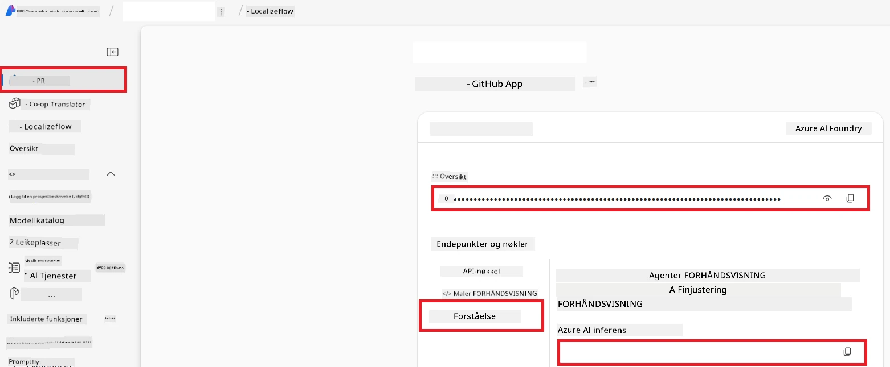

# Konfigurer Azure AI for Co-op Translator (Azure OpneAI & Azure AI Vision)

Denne veiledningen viser deg hvordan du setter opp Azure OpenAI for språköversettelse og Azure Computer Vision for bildeinnholdsanalyse (som deretter kan brukes til bildebasert oversettelse) i Azure AI Foundry.

**Forutsetninger:**
- En Azure-konto med et aktivt abonnement.
- Tilstrekkelige tillatelser til å opprette ressurser og distribusjoner i Azure-abonnementet ditt.

## Opprett et Azure AI-prosjekt

Du begynner med å opprette et Azure AI-prosjekt, som fungerer som et sentralt sted for å administrere AI-ressursene dine.

1. Gå til [https://ai.azure.com](https://ai.azure.com) og logg inn med Azure-kontoen din.

1. Velg **+Create** for å opprette et nytt prosjekt.

1. Utfør følgende oppgaver:
   - Angi et **Prosjektnavn** (f.eks. `CoopTranslator-Project`).
   - Velg **AI hub** (f.eks. `CoopTranslator-Hub`) (Opprett en ny om nødvendig).

1. Klikk "**Review and Create**" for å sette opp prosjektet ditt. Du vil bli tatt til prosjektets oversiktsside.

## Sett opp Azure OpenAI for språköversettelse

I prosjektet ditt vil du distribuere en Azure OpenAI-modell som skal fungere som backend for tekstovertsettelse.

### Naviger til prosjektet ditt

Hvis du ikke allerede er der, åpne ditt nylig opprettede prosjekt (f.eks. `CoopTranslator-Project`) i Azure AI Foundry.

### Distribuer en OpenAI-modell

1. Fra prosjektets venstremeny, under "My assets", velg "**Models + endpoints**".

1. Velg **+ Deploy model**.

1. Velg **Deploy Base Model**.

1. Du vil se en liste over tilgjengelige modeller. Filtrer eller søk etter en passende GPT-modell. Vi anbefaler `gpt-4o`.

1. Velg ønsket modell og klikk **Confirm**.

1. Velg **Deploy**.

### Azure OpenAI-konfigurasjon

Når modellen er distribuert, kan du velge distribusjonen fra siden "**Models + endpoints**" for å finne dens **REST endpoint URL**, **Key**, **Deployment name**, **Model name** og **API version**. Disse vil være nødvendige for å integrere oversettelsesmodellen i applikasjonen din.

> [!NOTE]
> Du kan velge API-versjoner fra siden [API version deprecation](https://learn.microsoft.com/azure/ai-services/openai/api-version-deprecation) basert på dine behov. Vær oppmerksom på at **API-versjonen** er forskjellig fra **Modellversjonen** som vises på siden **Models + endpoints** i Azure AI Foundry.

## Sett opp Azure Computer Vision for bildeoversettelse

For å kunne oversette tekst i bilder, må du finne Azure AI Service API-nøkkel og Endepunkt.

1. Naviger til Azure AI-prosjektet ditt (f.eks. `CoopTranslator-Project`). Sørg for at du befinner deg på prosjektets oversiktsside.

### Konfigurasjon av Azure AI Service

Finn API-nøkkelen og endepunktet fra Azure AI Service.

1. Naviger til Azure AI-prosjektet ditt (f.eks. `CoopTranslator-Project`). Sørg for at du befinner deg på prosjektets oversiktsside.

1. Finn **API Key** og **Endpoint** fra Azure AI Service-fanen.

    

Denne tilkoblingen gjør funksjonaliteten til den tilknyttede Azure AI Services-ressursen (inkludert bildeanalyse) tilgjengelig for AI Foundry-prosjektet ditt. Du kan deretter bruke denne tilkoblingen i notatbøker eller applikasjoner for å hente ut tekst fra bilder, som deretter kan sendes til Azure OpenAI-modellen for oversettelse.

## Konsolidering av legitimasjonen din

Nå burde du ha samlet inn følgende:

**For Azure OpenAI (tekstoversettelse):**
- Azure OpenAI Endpoint
- Azure OpenAI API Key
- Azure OpenAI Model Name (f.eks. `gpt-4o`)
- Azure OpenAI Deployment Name (f.eks. `cooptranslator-gpt4o`)
- Azure OpenAI API Version

**For Azure AI Services (uttrekking av tekst fra bilder via Vision):**
- Azure AI Service Endpoint
- Azure AI Service API Key

### Eksempel: Miljøvariabelkonfigurasjon (forhåndsvisning)

Senere, når du bygger applikasjonen din, vil du sannsynligvis konfigurere den ved å bruke disse innsamlede legitimasjonene. For eksempel kan du sette dem som miljøvariabler på denne måten:

```bash
# Azure AI Service-legitimasjon (påkrevd for bildetranslasjon)
AZURE_AI_SERVICE_API_KEY="your_azure_ai_service_api_key" # f.eks., 21xasd...
AZURE_AI_SERVICE_ENDPOINT="https://your_azure_ai_service_endpoint.cognitiveservices.azure.com/"

# Valgfrie fallbackssett: dupliser variabler med suffix _1/_2 (samme indeks for alle variabler i settet)
AZURE_AI_SERVICE_API_KEY_1="your_azure_ai_service_api_key_1"
AZURE_AI_SERVICE_ENDPOINT_1="https://your_azure_ai_service_endpoint_1.cognitiveservices.azure.com/"

# Azure OpenAI-legitimasjon (påkrevd for tekstoversettelse)
AZURE_OPENAI_API_KEY="your_azure_openai_api_key" # f.eks., 21xasd...
AZURE_OPENAI_ENDPOINT="https://your_azure_openai_endpoint.openai.azure.com/"
AZURE_OPENAI_MODEL_NAME="your_model_name" # f.eks., gpt-4o
AZURE_OPENAI_CHAT_DEPLOYMENT_NAME="your_deployment_name" # f.eks., cooptranslator-gpt4o
AZURE_OPENAI_API_VERSION="your_api_version" # f.eks., 2024-12-01-preview

# Valgfrie fallbackssett: dupliser hele AZURE_OPENAI_* settet med suffix _1/_2 (samme indeks for alle variabler)
```

---

### Videre lesning

- [How to Create a project in Azure AI Foundry](https://learn.microsoft.com/azure/ai-foundry/how-to/create-projects?tabs=ai-studio)
- [How to Create Azure AI resources](https://learn.microsoft.com/azure/ai-foundry/how-to/create-azure-ai-resource?tabs=portal)
- [How to Deploy OpenAI models in Azure AI Foundry](https://learn.microsoft.com/en-us/azure/ai-foundry/how-to/deploy-models-openai)

---

<!-- CO-OP TRANSLATOR DISCLAIMER START -->
**Ansvarsfraskrivelse**:  
Dette dokumentet er oversatt ved hjelp av AI-oversettelsestjenesten [Co-op Translator](https://github.com/Azure/co-op-translator). Selv om vi streber etter nøyaktighet, vær oppmerksom på at automatiserte oversettelser kan inneholde feil eller unøyaktigheter. Det opprinnelige dokumentet på originalspråket bør anses som den autoritative kilden. For kritisk informasjon anbefales profesjonell menneskelig oversettelse. Vi er ikke ansvarlige for eventuelle misforståelser eller feiltolkninger som følge av bruk av denne oversettelsen.
<!-- CO-OP TRANSLATOR DISCLAIMER END -->