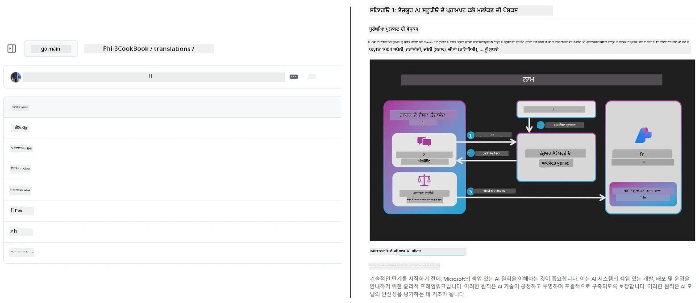
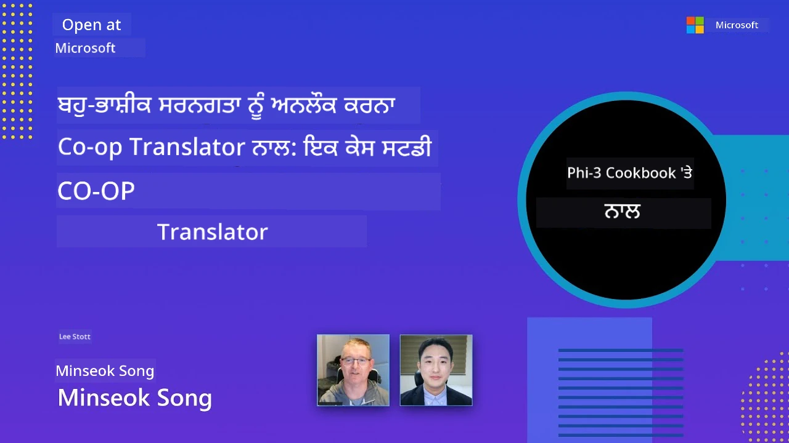

# Co-op Translator

_ਆਸਾਨੀ ਨਾਲ ਆਪਣੇ ਸਿੱਖਿਆ ਸੰਬੰਧੀ GitHub ਸਮੱਗਰੀ ਦਾ ਬਹੁਭਾਸ਼ੀ ਅਨੁਵਾਦ ਆਪਣੇ ਪ੍ਰੋਜੈਕਟ ਦੇ ਵਿਕਾਸ ਦੇ ਨਾਲ-ਨਾਲ ਸੁਚਾਰੂ ਬਣਾਓ ਅਤੇ ਇਸਦਾ ਸੰਭਾਲ ਕਰੋ।_


[](https://pypi.org/project/co-op-translator/)
[](https://github.com/azure/co-op-translator/blob/main/LICENSE)
[](https://pepy.tech/project/co-op-translator)
[](https://pepy.tech/project/co-op-translator)
[](https://github.com/azure/co-op-translator/pkgs/container/co-op-translator)
[](https://github.com/psf/black)

[](https://GitHub.com/azure/co-op-translator/graphs/contributors/)
[](https://GitHub.com/azure/co-op-translator/issues/)
[](https://GitHub.com/azure/co-op-translator/pulls/)
[](http://makeapullrequest.com)

### 🌐 ਬਹੁਭਾਸ਼ੀ ਸਹਾਇਤਾ

#### ਦੁਆਰਾ ਸਮਰਥਿਤ [Co-op Translator](https://github.com/Azure/Co-op-Translator)

<!-- CO-OP TRANSLATOR LANGUAGES TABLE START -->
[Arabic](../ar/README.md) | [Bengali](../bn/README.md) | [Bulgarian](../bg/README.md) | [Burmese (Myanmar)](../my/README.md) | [Chinese (Simplified)](../zh-CN/README.md) | [Chinese (Traditional, Hong Kong)](../zh-HK/README.md) | [Chinese (Traditional, Macau)](../zh-MO/README.md) | [Chinese (Traditional, Taiwan)](../zh-TW/README.md) | [Croatian](../hr/README.md) | [Czech](../cs/README.md) | [Danish](../da/README.md) | [Dutch](../nl/README.md) | [Estonian](../et/README.md) | [Finnish](../fi/README.md) | [French](../fr/README.md) | [German](../de/README.md) | [Greek](../el/README.md) | [Hebrew](../he/README.md) | [Hindi](../hi/README.md) | [Hungarian](../hu/README.md) | [Indonesian](../id/README.md) | [Italian](../it/README.md) | [Japanese](../ja/README.md) | [Kannada](../kn/README.md) | [Khmer](../km/README.md) | [Korean](../ko/README.md) | [Lithuanian](../lt/README.md) | [Malay](../ms/README.md) | [Malayalam](../ml/README.md) | [Marathi](../mr/README.md) | [Nepali](../ne/README.md) | [Nigerian Pidgin](../pcm/README.md) | [Norwegian](../no/README.md) | [Persian (Farsi)](../fa/README.md) | [Polish](../pl/README.md) | [Portuguese (Brazil)](../pt-BR/README.md) | [Portuguese (Portugal)](../pt-PT/README.md) | [Punjabi (Gurmukhi)](./README.md) | [Romanian](../ro/README.md) | [Russian](../ru/README.md) | [Serbian (Cyrillic)](../sr/README.md) | [Slovak](../sk/README.md) | [Slovenian](../sl/README.md) | [Spanish](../es/README.md) | [Swahili](../sw/README.md) | [Swedish](../sv/README.md) | [Tagalog (Filipino)](../tl/README.md) | [Tamil](../ta/README.md) | [Telugu](../te/README.md) | [Thai](../th/README.md) | [Turkish](../tr/README.md) | [Ukrainian](../uk/README.md) | [Urdu](../ur/README.md) | [Vietnamese](../vi/README.md)

> **ਕਿਉਂ ਨਾ ਲੋਕਲ ਕਲੋਨ ਕਰਨਾ ਵਧੀਆ ਹੈ?**
>
> ਇਹ ਰਿਪੋਜ਼ਿਟਰੀ 50+ ਬੋਲੀ ਦੇ ਅਨੁਵਾਦਾਂ ਨੂੰ ਸ਼ਾਮਿਲ ਕਰਦਾ ਹੈ ਜੋ ਡਾਊਨਲੋਡ ਸਾਈਜ਼ ਨੂੰ ਕਾਫੀ ਵਧਾ ਦਿੰਦਾ ਹੈ। ਬਿਨਾਂ ਅਨੁਵਾਦਾਂ ਦੇ ਕਲੋਨ ਕਰਨ ਲਈ sparse checkout ਵਰਤੋਂ:
>
> **ਬੈਸ਼ / macOS / Linux:**
> ```bash
> git clone --filter=blob:none --sparse https://github.com/skytin1004/co-op-translator.git
> cd co-op-translator
> git sparse-checkout set --no-cone '/*' '!translations' '!translated_images'
> ```
>
> **CMD (Windows):**
> ```cmd
> git clone --filter=blob:none --sparse https://github.com/skytin1004/co-op-translator.git
> cd co-op-translator
> git sparse-checkout set --no-cone "/*" "!translations" "!translated_images"
> ```
>
> ਇਸ ਨਾਲ ਤੁਹਾਨੂੰ ਐਸਾ ਸਭ ਕੁਝ ਮਿਲਦਾ ਹੈ ਜੋ ਕੋਰਸ ਨੂੰ ਜਲਦੀ ਡਾਊਨਲੋਡ ਕਰਕੇ ਮੁਕੰਮਲ ਕਰਨ ਲਈ ਲੋੜੀਂਦਾ ਹੈ।
<!-- CO-OP TRANSLATOR LANGUAGES TABLE END -->

[](https://GitHub.com/azure/co-op-translator/watchers/)
[](https://GitHub.com/azure/co-op-translator/network/)
[](https://GitHub.com/azure/co-op-translator/stargazers/)

[](https://discord.gg/nTYy5BXMWG)

[](https://codespaces.new/azure/co-op-translator)

## ਸੰਖੇਪ

**Co-op Translator** ਤੁਹਾਡੇ ਸਿੱਖਿਆ ਸੰਬੰਧੀ GitHub ਸਮੱਗਰੀ ਨੂੰ ਅਸਾਨੀ ਨਾਲ ਕਈ ਭਾਸ਼ਾਵਾਂ ਵਿੱਚ ਸਥਾਨਕ ਬਣਾਉਣ ਵਿੱਚ ਮਦਦ ਕਰਦਾ ਹੈ।  
ਜਦੋਂ ਤੁਸੀਂ ਆਪਣੇ Markdown ਫਾਈਲਾਂ, ਛਵੀਆਂ, ਜਾਂ ਨੋਟਬੁੱਕਸ ਅਪਡੇਟ ਕਰਦੇ ਹੋ, ਅਨੁਵਾਦ ਆਪੋ-ਆਪ ਹੀ ਸਿੰਕ ਰਹਿੰਦੇ ਹਨ, ਇਹ ਯਕੀਨੀ ਬਣਾਉਂਦੇ ਹੋਏ ਕਿ ਤੁਹਾਡੀ ਸਮੱਗਰੀ ਦੁਨੀਆ ਭਰ ਦੇ ਵਿਦਿਆਰਥੀਆਂ ਲਈ ਸਹੀ ਅਤੇ ਅੱਪਡੇਟ ਰਹੇ।

ਅਨੁਵਾਦਤ ਸਮੱਗਰੀ ਕਿਵੇਂ ਸੰਗਠਿਤ ਹੁੰਦੀ ਹੈ ਇਸਦਾ ਉਦਾਹਰਨ:



## ਅਨੁਵਾਦ ਦੀ ਸਥਿਤੀ ਕਿਸ ਤਰ੍ਹਾਂ ਸੰਭਾਲੀ ਜਾਂਦੀ ਹੈ

Co-op Translator ਅਨੁਵਾਦਤ ਸਮੱਗਰੀ ਨੂੰ **ਵਰਜਨ ਕੀਤੇ ਗਏ ਸਾਫਟਵੇਅਰ ਆਰਟੀਫੈਕਟਸ** ਵਜੋਂ ਸੰਭਾਲਦਾ ਹੈ,  
ਨਕਲੀ ਫਾਈਲਾਂ ਵਜੋਂ ਨਹੀਂ।

ਇਹ ਸੰਦ ਅਨੁਵਾਦਤ Markdown, ਚਿੱਤਰਾਂ ਅਤੇ ਨੋਟਬੁੱਕਸ ਦੀ ਸਥਿਤੀ ਨੂੰ ਟ੍ਰੈਕ ਕਰਦਾ ਹੈ  
**ਭਾਸ਼ਾ-ਵਿਸ਼ੇਸ਼ ਮੈਟਾਡੇਟਾ** ਦੀ ਵਰਤੋਂ ਕਰਕੇ।

ਇਹ ਡਿਜ਼ਾਇਨ Co-op Translator ਨੂੰ ਆਗਿਆ ਦਿੰਦੀ ਹੈ:

- ਪੁਰਾਣੇ ਹੋ ਚੁਕੇ ਅਨੁਵਾਦਾਂ ਦਾ ਭਰੋਸੇਮੰਦ ਪਤਾ ਲਗਾਉਣਾ
- Markdown, ਚਿੱਤਰ ਅਤੇ ਨੋਟਬੁੱਕਸ ਨੂੰ ਸਮਾਨ ਤਰੀਕੇ ਨਾਲ ਸੰਭਾਲਣਾ
- ਵੱਡੇ, ਤੇਜ਼-ਚਲਦੇ, ਬਹੁ-ਭਾਸ਼ਾਈ ਰਿਪੋਜ਼ਿਟਰੀز ਵਿੱਚ ਸੁਰੱਖਿਅਤ ਤਰੀਕੇ ਨਾਲ ਵਧਾਉਣਾ

ਅਨੁਵਾਦਾਂ ਨੂੰ ਪ੍ਰਬੰਧਤ ਆਰਟੀਫੈਕਟਸ ਵਜੋਂ ਮਾਡਲ ਕਰਕੇ, ਅਨੁਵਾਦ ਕਾਰਜਪ੍ਰਵਾਹ ਆਧੁਨਿਕ  
ਸਾਫਟਵੇਅਰ ਡਿਪੇਂਡੈਂਸੀ ਅਤੇ ਆਰਟੀਫੈਕਟ ਪ੍ਰਬੰਧਨ ਅਮਲਾਂ ਨਾਲ ਕੁਦਰਤੀ ਤੌਰ 'ਤੇ ਮਿਲਦੇ ਹਨ।

→ [ਅਨੁਵਾਦ ਦੀ ਸਥਿਤੀ ਕਿਸ ਤਰ੍ਹਾਂ ਸੰਭਾਲੀ ਜਾਂਦੀ ਹੈ](https://techcommunity.microsoft.com/blog/azuredevcommunityblog/rethinking-documentation-translation-treating-translations-as-versioned-software/4491755)


## ਤੇਜ਼ ਸ਼ੁਰੂਆਤ

```bash
# ਇੱਕ ਵਰਚੁਅਲ ਵਾਤਾਵਰਨ ਬਣਾਓ ਅਤੇ ਸਰਗਰਮ ਕਰੋ (ਸੁਝਾਇਆ ਗਿਆ)
python -m venv .venv
# ਵਿੰਡੋਜ਼
.venv\Scripts\activate
# ਮੈਕਓਐਸ/ਲਿਨਕਸ
source .venv/bin/activate
# ਪੈਕੇਜ ਇੰਸਟਾਲ ਕਰੋ
pip install co-op-translator
# ਅਨੁਵਾਦ ਕਰੋ
translate -l "ko ja fr" -md
```

ਡਾਕਰ:

```bash
# GHCR ਤੋਂ ਸਰਵਜਨਕ ਇਮੇਜ ਖਿੱਚੋ
docker pull ghcr.io/azure/co-op-translator:latest
# ਮੌਜੂਦਾ ਫੋਲਡਰ ਮਾਊਂਟ ਕੀਤਾ ਹੋਇਆ ਅਤੇ .env ਦਿੱਤਾ ਹੋਇਆ (Bash/Zsh) ਦੇ ਨਾਲ ਚਲਾਓ
docker run --rm -it --env-file .env -v "${PWD}:/work" ghcr.io/azure/co-op-translator:latest -l "ko ja fr" -md
```

## ਘੱਟੋ ਘੱਟ ਸੈਟਅੱਪ

1. ਯਕੀਨੀ ਬਣਾਓ ਕਿ ਤੁਹਾਡੇ ਕੋਲ ਸਮਰਥਿਤ Python ਵਰਜਨ ਹੈ (ਮੌਜੂਦਾ 3.10-3.12)। poetry (pyproject.toml) ਵਿੱਚ ਇਹ ਆਟੋਮੈਟਿਕ ਹੁੰਦਾ ਹੈ।  
2. ਇੱਕ `.env` ਫਾਈਲ ਬਣਾਓ ਟੈਂਪਲੇਟ ਦੀ ਵਰਤੋਂ ਕਰਕੇ: [.env.template](../../.env.template)  
3. ਇੱਕ LLM ਪ੍ਰਦਾਤਾ (Azure OpenAI ਜਾਂ OpenAI) ਨੂੰ ਸੈੱਟ ਕਰੋ  
4. (ਵਿਕਲਪਿਕ) ਚਿੱਤਰ ਅਨੁਵਾਦ ਲਈ (`-img`), Azure AI Vision ਸੈੱਟ ਕਰੋ  
5. (ਵਿਕਲਪਿਕ) ਤੁਸੀਂ ਕਈ ਕਰੇਡੈਂਸ਼ਲ ਸੈੱਟ ਭਿੰਨ ਭਿੰਨ ਸਫਿਕਸ ਜਿਵੇਂ `_1`, `_2` ਨਾਲ ਨਕਲ ਕਰਕੇ ਸੈੱਟ ਕਰ ਸਕਦੇ ਹੋ। ਸੈੱਟ ਵਿੱਚ ਸਾਰੇ ਵੈਰੀਏਬਲ ਇੱਕੋ ਸਫਿਕਸ ਹੋਣੇ ਚਾਹੀਦੇ ਹਨ।  
6. (ਸਿਫਾਰਸ਼ੀ) ਕਿਸੇ ਵੀ ਪਿਛਲੇ ਅਨੁਵਾਦ ਨੂੰ ਸਾਫ਼ ਕਰੋ ਤਾਂ ਜੋ ਟਕਰਾਅ ਨਾ ਹੋਵੇ (ਜਿਵੇਂ, `translations/`)  
7. (ਸਿਫਾਰਸ਼ੀ) ਆਪਣੇ README ਵਿੱਚ ਇੱਕ ਅਨੁਵਾਦ ਸੈਕਸ਼ਨ ਸ਼ਾਮਿਲ ਕਰੋ [README languages template](./getting_started/README_languages_template.md) ਦੀ ਵਰਤੋਂ ਨਾਲ  
8. ਵੇਖੋ: [Azure AI ਸੈਟਅੱਪ ਕਰੋ](./getting_started/set-up-azure-ai.md)

## ਵਰਤੋਂ

ਸਾਰੇ ਸਮਰਥਿਤ ਤਰ੍ਹਾਂ ਦੇ ਤਰਜਮੇ ਕਰੋ:

```bash
translate -l "ko ja"
```

ਕੇਵਲ Markdown:

```bash
translate -l "de" -md
```

Markdown + ਚਿੱਤਰ:

```bash
translate -l "pt" -md -img
```

ਕੇਵਲ ਨੋਟਬੁੱਕਸ:

```bash
translate -l "zh" -nb
```

ਹੋਰ ਫਲੈਗ: [ਕਮਾਂਡ ਸੰਦਰਭ](./getting_started/command-reference.md)

## ਖਾਸੀਅਤਾਂ

- Markdown, ਨੋਟਬੁੱਕਸ ਅਤੇ ਚਿੱਤਰਾਂ ਲਈ ਸਵੈਚਾਲਿਤ ਅਨੁਵਾਦ  
- ਅਨੁਵਾਦਾਂ ਨੂੰ ਸਰੋਤ ਬਦਲਾਵਾਂ ਨਾਲ ਸਿੰਕ ਵਿਚ ਰੱਖਦਾ ਹੈ  
- ਸਥਾਨਕ (CLI) ਜਾਂ CI (GitHub Actions) ਵਿੱਚ ਚਲਦਾ ਹੈ  
- Azure OpenAI ਜਾਂ OpenAI ਵਰਤਦਾ ਹੈ; ਚਿੱਤਰਾਂ ਲਈ ආਪਸ਼ਨਜ਼ Azure AI Vision  
- Markdown ਫਾਰਮੇਟਿੰਗ ਅਤੇ ਸਰਚਨਾ ਨੂੰ ਬਚਾਉਂਦਾ ਹੈ

## ਦਸਤਾਵੇਜ਼

- [ਕਮਾਂਡ-ਲਾਈਨ ਗਾਈਡ](./getting_started/command-line-guide/command-line-guide.md)  
- [GitHub Actions ਗਾਈਡ (ਪਬਲਿਕ ਰਿਪੋਜ਼ਿਟਰੀਜ਼ ਅਤੇ ਸਧਾਰਣ ਸੀਕਰੇਟਸ)](./getting_started/github-actions-guide/github-actions-guide-public.md)  
- [GitHub Actions ਗਾਈਡ (ਮਾਈਕ੍ਰੋਸਾਫਟ ਸੰਸਥਾ ਰਿਪੋਜ਼ਿਟਰੀਜ਼ ਅਤੇ ਓਰਗ-ਸਤਰ ਸੈੱਟਅੱਪ)](./getting_started/github-actions-guide/github-actions-guide-org.md)  
- [README ਭਾਸ਼ਾਵਾਂ ਟੈਂਪਲੇਟ](./getting_started/README_languages_template.md)  
- [ਸਮਰਥਿਤ ਭਾਸ਼ਾਵਾਂ](./getting_started/supported-languages.md)  
- [ਯੋਗਦਾਨ](./CONTRIBUTING.md)  
- [ਮੁੱਛੇਂ](./getting_started/troubleshooting.md)

### ਮਾਈਕ੍ਰੋਸਾਫਟ-ਖਾਸ ਗਾਈਡ
> [!NOTE]
> ਸਿਰਫ Microsoft “For Beginners” ਰਿਪੋਜ਼ਿਟਰੀਜ਼ ਦੇ ਮੁਰੰਮਤਕਾਰਾਂ ਲਈ।

- [“ਹੋਰ ਕੋਰਸਾਂ” ਸੂਚੀ ਅਪਡੇਟ ਕਰਨਾ (ਸਿਰਫ MS Beginners ਰਿਪੋਜ਼ਿਟਰੀਜ਼ ਲਈ)](./getting_started/update-other-courses.md)

## ਸਾਡੀ ਮਦਦ ਕਰੋ ਅਤੇ ਵਿਸ਼ਵ ਵਿਦਿਆਰਥੀ ਸਿੱਖਿਆ ਨੂੰ فروغ ਦਿਓ

ਸਾਡੇ ਨਾਲ ਮਿਲੋ ਜੋ ਕਿ ਸਿੱਖਿਆ ਸੰਬੰਧੀ ਸਮੱਗਰੀ ਨੂੰ ਵਿਸ਼ਵ ਪੱਧਰ 'ਤੇ ਸਾਂਝਾ ਕਰਨ ਦਾ ਤਰੀਕਾ ਬਦਲ ਰਹੇ ਹਨ! [Co-op Translator](https://github.com/azure/co-op-translator) ਨੂੰ GitHub 'ਤੇ ਇੱਕ ⭐ ਦਿਓ ਅਤੇ ਸਾਡਾ ਮਿਸ਼ਨ ਸਿੱਖਿਆ ਅਤੇ ਤਕਨਾਲੋਜੀ ਵਿੱਚ ਭਾਸ਼ਾਈ ਵਿਘਨਾਂ ਨੂੰ ਟੋੜਨ ਵਿੱਚ ਸਹਾਰਾ ਵਧਾਓ। ਤੁਹਾਡੀ ਦਿਲਚਸਪੀ ਅਤੇ ਯੋਗਦਾਨ ਸਮਾਜ ਉੱਤੇ ਮਹੱਤਵਪੂਰਕ ਪ੍ਰਭਾਵ ਪਾਉਂਦੇ ਹਨ! ਕੋਡ ਯੋਗਦਾਨ ਅਤੇ ਫੀਚਰ ਸਿਫਾਰਸ਼ਾਂ ਸਦਾ ਸਵਾਗਤ ਹਨ।

### ਆਪਣੀ ਭਾਸ਼ਾ ਵਿੱਚ ਮਾਈਕ੍ਰੋਸਾਫਟ ਸਿੱਖਿਆ ਸਮੱਗਰੀ ਖੋਜੋ

- [LangChain4j-for-Beginners](https://github.com/microsoft/LangChain4j-for-Beginners)  
- [AZD for Beginners](https://github.com/microsoft/AZD-for-beginners)  
- [Edge AI for Beginners](https://github.com/microsoft/edgeai-for-beginners)  
- [Model Context Protocol (MCP) For Beginners](https://github.com/microsoft/mcp-for-beginners)  
- [AI Agents for Beginners](https://github.com/microsoft/ai-agents-for-beginners)  
- [.NET ਨਾਲ ਜਨਰੇਟਿਵ AI ਫਾਰ ਬਿਗਿਨਰਜ਼](https://github.com/microsoft/Generative-AI-for-beginners-dotnet)  
- [ਜਨਰੇਟਿਵ AI ਫਾਰ ਬਿਗਿਨਰਜ਼](https://github.com/microsoft/generative-ai-for-beginners)  
- [ਜਾਵਾ ਨਾਲ ਜਨਰੇਟਿਵ AI ਫਾਰ ਬਿਗਿਨਰਜ਼](https://github.com/microsoft/generative-ai-for-beginners-java)  
- [ML for Beginners](https://aka.ms/ml-beginners)  
- [ਡੇਟਾ ਸਾਇੰਸ for Beginners](https://aka.ms/datascience-beginners)  
- [AI for Beginners](https://aka.ms/ai-beginners)  
- [Cybersecurity for Beginners](https://github.com/microsoft/Security-101)  
- [Web Dev for Beginners](https://aka.ms/webdev-beginners)  
- [IoT for Beginners](https://aka.ms/iot-beginners)  
- [PhiCookBook](https://github.com/microsoft/PhiCookBook)

## ਵੀਡੀਓ ਪ੍ਰਸਤੁਤੀਆਂ

👉 ਹੇਠਾਂ ਦਿੱਤੀ ਛਵੀ 'ਤੇ ਕਲਿੱਕ ਕਰਕੇ YouTube 'ਤੇ ਦੇਖੋ।

- **Microsoft ਤੇ ਖੋਲ੍ਹੋ**: Co-op Translator ਵਰਤਣ ਲਈ ਇੱਕ ਛੋਟੀ 18 ਮਿੰਟ ਦੀ ਜਾਣੂਗਾਰੀ ਅਤੇ ਤੁਰੰਤ ਮਾਰਗਦਰਸ਼ਨ।

  [](https://www.youtube.com/watch?v=jX_swfH_KNU)

## ਯੋਗਦਾਨ

ਇਹ ਪ੍ਰੋਜੈਕਟ ਯੋਗਦਾਨ ਅਤੇ ਸੁਝਾਵਾਂ ਸਵਾਗਤ ਕਰਦਾ ਹੈ। Azure Co-op Translator ਵਿੱਚ ਯੋਗਦਾਨ ਪਾਉਣ ਦੀ ਇੱਛਾ ਰੱਖਦੇ ਹੋ? ਕਿਰਪਾ ਕਰਕੇ ਸਾਡਾ [CONTRIBUTING.md](./CONTRIBUTING.md) ਵੇਖੋ ਜਿਸ ਵਿੱਚ ਤੁਹਾਡੀ ਮਦਦ ਕਰਨ ਲਈ ਦਿਸ਼ਾ-ਨਿਰਦੇਸ਼ ਹਨ।

## ਯੋਗਦਾਨਕਾਰ  

[](https://github.com/Azure/co-op-translator/graphs/contributors)

## ਕੋਡ ਆਫ ਕਨਡਕਟ

ਇਸ ਪ੍ਰੋਜੈਕਟ ਨੇ [Microsoft Open Source Code of Conduct](https://opensource.microsoft.com/codeofconduct/) ਅਪਣਾਇਆ ਹੈ। 
ਵਧੇਰੇ ਜਾਣਕਾਰੀ ਲਈ [Code of Conduct FAQ](https://opensource.microsoft.com/codeofconduct/faq/) ਵੇਖੋ ਜਾਂ
ਕਿਸੇ ਵੀ ਵਾਧੂ ਸਵਾਲ ਜਾਂ ਟਿੱਪਪਣੀ ਲਈ [opencode@microsoft.com](mailto:opencode@microsoft.com) ਨਾਲ ਸੰਪਰਕ ਕਰੋ।

## ਜ਼ਿੰਮੇਵਾਰ AI

Microsoft ਆਪਣੇ ਗਾਹਕਾਂ ਦੀ ਮਦਦ ਕਰਨ ਦੇ ਲਈ ਵਚਨਬੱਧ ਹੈ ਕਿ ਉਹ ਸਾਡੇ AI ਉਤਪਾਦਾਂ ਨੂੰ ਜ਼ਿੰਮੇਵਾਰ ਤਰੀਕੇ ਨਾਲ ਵਰਤਣ, ਸਾਡੀਆਂ ਸਿੱਖਿਆਵਾਂ ਸਾਂਝੀਆਂ ਕਰਨ ਅਤੇ Transparency Notes ਅਤੇ Impact Assessments ਵਰਗੇ ਸੰਦਾਂ ਰਾਹੀਂ ਭਰੋਸਾ-ਅਧਾਰਿਤ ਭਾਈਚਾਰਾ ਬਣਾਉਣ ਵਿੱਚ ਸਹਾਇਤਾ ਕਰੇ। ਇਹਨਾਂ ਵਿੱਚੋਂ ਬਹੁਤ ਸਾਰੇ ਸੰਸਾਧਨ [https://aka.ms/RAI](https://aka.ms/RAI) 'ਤੇ ਲਭੇ ਜਾ ਸਕਦੇ ਹਨ।  
ਮਾਈਕ੍ਰੋਸੋਫਟ ਦਾ ਜ਼ਿੰਮੇਵਾਰ AI ਵੱਲ ਦਾ ਰਵੱਈਆ ਸਾਡੇ AI ਸਿਧਾਂਤਾਂ 'ਤੇ ਆਧਾਰਿਤ ਹੈ ਜੋ ਨਿਆਂ, ਭਰੋਸੇਯੋਗਤਾ ਅਤੇ ਸੁਰੱਖਿਆ, ਪ੍ਰਾਈਵੇਸੀ ਅਤੇ ਸੁਰੱਖਿਆ, ਸ਼ਾਮਿਲਤਾ, ਪਾਰਦਰਸ਼ਤਾ, ਅਤੇ ਜਵਾਬਦੇਹੀ ਹਨ।

ਵੱਡੇ ਪੈਮਾਨੇ 'ਤੇ ਕੁਦਰਤੀ ਭਾਸ਼ਾ, ਛਵੀ ਅਤੇ ਭਾਸ਼ਣ ਮਾਡਲ - ਜਿਵੇਂ ਕਿ ਇਸ ਸੈਂਪਲ ਵਿੱਚ ਵਰਤੇ ਗਏ - ਸੰਭਵ ਹੈ ਕਿ ਐਸੇ ਤਰੀਕੇ ਨਾਲ ਵਿਆਚਾਰ ਕਰ ਸਕਦੇ ਹਨ ਜੋ ਅਨਿਆਂਸੂਚਕ, ਅਣਭਰੋਸੇਯੋਗ ਜਾਂ ਆਪਤੀਜਨਕ ਹੋ ਸਕਦੇ ਹਨ, ਜਿਸ ਕਰਕੇ ਨੁਕਸਾਨ ਹੋ ਸਕਦਾ ਹੈ। ਕਿਰਪਾ ਕਰਕੇ [Azure OpenAI service Transparency note](https://learn.microsoft.com/legal/cognitive-services/openai/transparency-note?tabs=text) ਨੂੰ ਦੇਖੋ ਤਾਂ ਜੋ ਖਤਰੇ ਅਤੇ ਸੀਮਾਵਾਂ ਬਾਰੇ ਜਾਣਕਾਰੀ ਮਿਲੇ।

ਇਨ੍ਹਾਂ ਖਤਰਿਆਂ ਨੂੰ ਘਟਾਉਣ ਲਈ ਸਿਫਾਰਸ਼ੀ ਤਰੀਕਾ ਹੈ ਕਿ ਆਪਣੇ ਆਰਕੀਟੈਕਚਰ ਵਿੱਚ ਇੱਕ ਸੁਰੱਖਿਆ ਪ੍ਰਣਾਲੀ ਸ਼ਾਮਿਲ ਕਰੋ ਜੋ ਨੁਕਸਾਨਦਾਈ ਵਿਵਹਾਰ ਨੂੰ ਪਹਚਾਣ ਸਕੇ ਅਤੇ ਰੋਕ ਸਕੇ। [Azure AI Content Safety](https://learn.microsoft.com/azure/ai-services/content-safety/overview) ਇੱਕ ਸੁਤੰਤਰ ਸੁਰੱਖਿਆ ਪਰਤ ਪ੍ਰਦਾਨ ਕਰਦਾ ਹੈ, ਜੋ ਐਪਲੀਕੇਸ਼ਨਾਂ ਅਤੇ ਸੇਵਾਵਾਂ ਵਿੱਚ ਨੁਕਸਾਨਦਾਈ ਯੂਜ਼ਰ-ਤਿਆਰ ਅਤੇ AI-ਤਿਆਰ ਸਮੱਗਰੀ ਨੂੰ ਪਹਚਾਣ ਸਕਦਾ ਹੈ। Azure AI Content Safety ਵਿੱਚ ਟੈਕਸਟ ਅਤੇ ਛਵੀ APIs ਸ਼ਾਮਿਲ ਹਨ ਜੋ ਤੁਹਾਨੂੰ ਨੁਕਸਾਨਦਾਈ ਸਮੱਗਰੀ ਦੀ ਪਹਚਾਣ ਕਰਨ ਦਿੰਦੇ ਹਨ। ਸਾਡੇ ਕੋਲ ਇੱਕ ਇੰਟਰਐਕਟਿਵ Content Safety Studio ਵੀ ਹੈ ਜੋ ਤੁਹਾਨੂੰ ਵੱਖ-ਵੱਖ ਮੋਡੈਲਿਟੀਜ਼ ਵਿੱਚ ਨੁਕਸਾਨਦਾਈ ਸਮੱਗਰੀ ਨੂੰ ਪਹਚਾਣਣ ਲਈ ਨਮੂਨਾ ਕੋਡ ਨੂੰ ਵੇਖਣ, ਖੋਜਣ ਅਤੇ ਟ੍ਰਾਈਆਊਟ ਕਰਨ ਦੀ ਆਗਿਆ ਦਿੰਦਾ ਹੈ। ਹੇਠਾਂ ਦਿੱਤੀ [quickstart documentation](https://learn.microsoft.com/azure/ai-services/content-safety/quickstart-text?tabs=visual-studio%2Clinux&pivots=programming-language-rest) ਤੁਹਾਨੂੰ ਸੇਵਾ ਨੂੰ ਬੇਨਤੀ ਕਰਨ ਦੇ ਰਾਹੇ ਦਿਖਾਉਂਦੀ ਹੈ।

ਇੱਕ ਹੋਰ ਪਹਿਲੂ ਜੋ ਧਿਆਨ ਵਿੱਚ ਰੱਖਣਾ ਹੈ ਉਹ ਸਾਰੀ ਐਪਲੀਕੇਸ਼ਨ ਦੀ ਕੁੱਲ ਕਾਰਗੁਜ਼ਾਰੀ ਹੈ। ਬਹੁ-ਮੋਡੈਲ ਅਤੇ ਬਹੁ-ਮਾਡਲ ਐਪਲੀਕੇਸ਼ਨਾਂ ਦੇ ਨਾਲ, ਅਸੀਂ ਕਾਰਗੁਜ਼ਾਰੀ ਦਾ ਮਤਲਬ ਇਹ ਲੈਂਦੇ ਹਾਂ ਕਿ ਪ੍ਰਣਾਲੀ ਤੁਹਾਡੇ ਅਤੇ ਤੁਹਾਡੇ ਯੂਜ਼ਰਾਂ ਦੀ ਉਮੀਦਾਂ ਦੇ ਅਨੁਸਾਰ ਕੰਮ ਕਰਦੀ ਹੈ, ਜਿਸ ਵਿੱਚ ਨੁਕਸਾਨਦਾਇਕ ਨਤੀਜੇ ਨਹੀਂ ਨਿਕਲਦੇ। [generation quality and risk and safety metrics](https://learn.microsoft.com/azure/ai-studio/concepts/evaluation-metrics-built-in) ਦੀ ਵਰਤੋਂ ਕਰਕੇ ਆਪਣੀ ਕੁੱਲ ਐਪਲੀਕੇਸ਼ਨ ਦੀ ਕਾਰਗੁਜ਼ਾਰੀ ਦਾ ਮੁਲਾਂਕਣ ਕਰਨਾ ਜਰੂਰੀ ਹੈ।

ਤੁਸੀਂ ਆਪਣੇ ਵਿਕਾਸ ਮਾਹੌਲ ਵਿੱਚ [prompt flow SDK](https://microsoft.github.io/promptflow/index.html) ਦੀ ਵਰਤੋਂ ਕਰਕੇ ਆਪਣੀ AI ਐਪਲੀਕੇਸ਼ਨ ਦਾ ਮੁਲਾਂਕਣ ਕਰ ਸਕਦੇ ਹੋ। ਚਾਹੇ ਇਹ ਟੈਸਟ ਡਾਟਾਸੇਟ ਹੋਵੇ ਜਾਂ ਕੋਈ ਲਕੜੀ, ਤੁਹਾਡੀ ਜਨਰੇਟਿਵ AI ਐਪਲੀਕੇਸ਼ਨ ਦੇ ਜਨਰੇਸ਼ਨ ਨੂੰ ਨਿਰਮਿਤ ਮਾਪਕਾਂ ਜਾਂ ਤੁਹਾਡੇ ਚੋਣ ਦੇ ਕਸਟਮ ਮਾਪਕਾਂ ਦੇ ਨਾਲ ਮਾਤਰਾਤਮਕ ਤੌਰ 'ਤੇ ਮਾਪਿਆ ਜਾਂਦਾ ਹੈ। prompt flow sdk ਨਾਲ ਆਪਣੀ ਪ੍ਰਣਾਲੀ ਦੀ ਮੁਲਾਂਕਣ ਸ਼ੁਰੂ ਕਰਨ ਲਈ, ਤੁਸੀਂ [quickstart guide](https://learn.microsoft.com/azure/ai-studio/how-to/develop/flow-evaluate-sdk) ਦੀ ਪਾਲਣਾ ਕਰ ਸਕਦੇ ਹੋ। ਜਦੋਂ ਤੁਸੀਂ ਮੁਲਾਂਕਣ ਚਲਾਉਂਦੇ ਹੋ, ਤਾਂ ਤੁਸੀਂ ਨਤੀਜੇ [Azure AI Studio](https://learn.microsoft.com/azure/ai-studio/how-to/evaluate-flow-results) ਵਿੱਚ ਵੇਖ ਸਕਦੇ ਹੋ।

## ਟਰੇਡਮਾਰਕ

ਇਸ ਪ੍ਰੋਜੈਕਟ ਵਿੱਚ ਪ੍ਰੋਜੈਕਟਾਂ, ਉਤਪਾਦਾਂ, ਜਾਂ ਸੇਵਾਵਾਂ ਲਈ ਟਰੇਡਮਾਰਕ ਜਾਂ ਲੋਗੋ ਹੋ ਸਕਦੇ ਹਨ। Microsoft ਟਰੇਡਮਾਰਕ ਜਾਂ ਲੋਗੋ ਦੀ ਮੰਨਤਾ ਪ੍ਰਾਪਤ ਵਰਤੋਂ ਓਹਦੇ ਤਹਿਤ ਹੈ ਅਤੇ [Microsoft's Trademark & Brand Guidelines](https://www.microsoft.com/en-us/legal/intellectualproperty/trademarks/usage/general) ਦੀ ਪਾਲਣਾ ਕਰਨੀ ਲਾਜ਼ਮੀ ਹੈ।  
Microsoft ਟਰੇਡਮਾਰਕ ਜਾਂ ਲੋਗੋ ਦੀ ਇਸ ਪ੍ਰੋਜੈਕਟ ਦੇ ਸੰਸ਼ੋਧਿਤ ਵਰਜਨਾਂ ਵਿੱਚ ਵਰਤੋਂ Microsoft ਦੇ ਪ੍ਰਾਯੋਜਕਤਾ ਜਾਂ ਸਮਰਥਨ ਦਾ ਭਰਮ ਨਾ ਪੈਦਾ ਕਰੇ।  
ਕਿਸੇ ਤੀਜੇ ਪਾਸੇ ਦੇ ਟਰੇਡਮਾਰਕ ਜਾਂ ਲੋਗੋ ਦੀ ਵਰਤੋਂ ਉਸ ਤੀਜੇ ਪਾਸੇ ਦੀਆਂ ਨੀਤੀਆਂ ਦੇ ਅਧੀਨ ਹੋਵੇਗੀ।

## ਮਦਦ ਪ੍ਰਾਪਤ ਕਰੋ

ਜੇ ਤੁਸੀਂ ਅਟਕ ਗਏ ਹੋ ਜਾਂ AI ਐਪ ਬਣਾਉਣ ਬਾਰੇ ਕਿਸੇ ਵੀ ਪ੍ਰਸ਼ਨ ਹਨ, ਤਾਂ ਜੁੜੋ:

[](https://discord.gg/nTYy5BXMWG)

ਜੇ ਤੁਹਾਡੇ ਕੋਲ ਉਤਪਾਦ ਫੀਡਬੈਕ ਜਾਂ ਬਣਾਉਣ ਸਮੇਂ ਗਲਤੀਆਂ ਹਨ ਤਾਂ ਇੱਥੇ ਜਾਓ:

[](https://aka.ms/foundry/forum)

---

<!-- CO-OP TRANSLATOR DISCLAIMER START -->
**ਡਿਸਕਲੇਮਰ**:  
ਇਹ ਦਸਤਾਵੇਜ਼ AI ਅਨੁਵਾਦ ਸੇਵਾ [Co-op Translator](https://github.com/Azure/co-op-translator) ਦੀ ਵਰਤੋਂ ਨਾਲ ਅਨੁਵਾਦ ਕੀਤਾ ਗਿਆ ਹੈ। ਜਦੋਂ ਕਿ ਅਸੀਂ ਸਹੀਤਾ ਲਈ ਕੋਸ਼ਿਸ਼ ਕਰਦੇ ਹਾਂ, ਕਿਰਪਾ ਕਰਕੇ ਧਿਆਨ ਵਿੱਚ ਰੱਖੋ ਕਿ ਸਵੈਚਾਲਿਤ ਅਨੁਵਾਦਾਂ ਵਿੱਚ ਗਲਤੀਆਂ ਜਾਂ ਅਸਥਿਰਤਾਵਾਂ ਹੋ ਸਕਦੀਆਂ ਹਨ। ਮੂਲ ਦਸਤਾਵੇਜ਼ ਆਪਣੇ ਮੂਲ ਭਾਸ਼ਾ ਵਿੱਚ ਹੀ ਅਧਿਕਾਰਤ ਸਰੋਤ ਮੰਨਿਆ ਜਾਣਾ ਚਾਹੀਦਾ ਹੈ। ਅਹਿਮ ਜਾਣਕਾਰੀ ਲਈ, ਪੇਸ਼ੇਵਰ ਮਨੁੱਖੀ ਅਨੁਵਾਦ ਦੀ ਸਿਫਾਰਸ਼ ਕੀਤੀ ਜਾਂਦੀ ਹੈ। ਅਸੀਂ ਇਸ ਅਨੁਵਾਦ ਦੇ ਇਸਤੇਮਾਲ ਤੋਂ ਉੱਠਣ ਵਾਲੀਆਂ ਕਿਸੇ ਵੀ ਗਲਤਫਹਮੀਆਂ ਜਾਂ ਗਲਤਵੀਖਿਆਵਾਂ ਲਈ ਜ਼ਿੰਮੇਵਾਰ ਨਹੀਂ ਹਾਂ।
<!-- CO-OP TRANSLATOR DISCLAIMER END -->