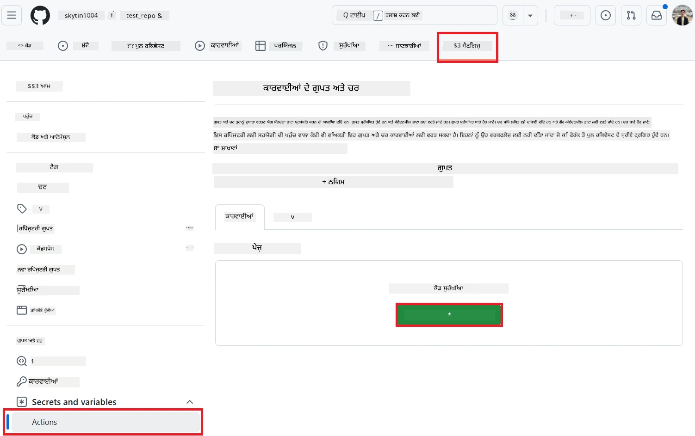
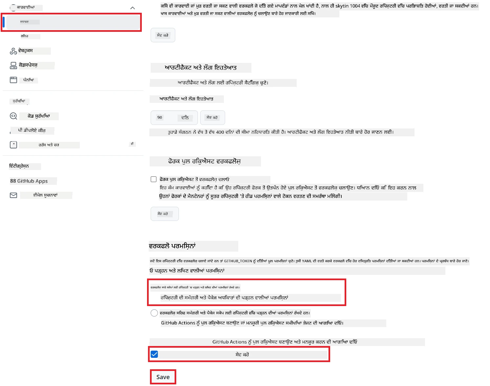

# ਕੋ-ਓਪ ਟ੍ਰਾਂਸਲੇਟਰ GitHub ਐਕਸ਼ਨ ਦੀ ਵਰਤੋਂ (ਪਬਲਿਕ ਸੈਟਅੱਪ)

**ਲਕੜੀ ਦਰਸ਼ਕ:** ਇਹ ਗਾਈਡ ਜ਼ਿਆਦਾਤਰ ਪਬਲਿਕ ਜਾਂ ਪ੍ਰਾਈਵੇਟ ਰਿਪੋਜ਼ਿਟਰੀਜ਼ ਵਿੱਚ ਵਰਤੋਂਕਾਰਾਂ ਲਈ ਹੈ, ਜਿੱਥੇ ਸਧਾਰਨ GitHub Actions ਪਰਮਿਸ਼ਨਾਂ ਨਾਲ ਕੰਮ ਚੱਲ ਜਾਂਦਾ ਹੈ। ਇਹ ਵਿੱਚ-ਬਿਲਟ `GITHUB_TOKEN` ਦੀ ਵਰਤੋਂ ਕਰਦਾ ਹੈ।

ਆਪਣੀ ਰਿਪੋਜ਼ਿਟਰੀ ਦੀ ਡੌਕੂਮੈਂਟੇਸ਼ਨ ਨੂੰ ਆਟੋਮੈਟਿਕ ਤੌਰ 'ਤੇ ਅਨੁਵਾਦ ਕਰਨ ਲਈ Co-op Translator GitHub Action ਦੀ ਵਰਤੋਂ ਕਰੋ। ਇਹ ਗਾਈਡ ਤੁਹਾਨੂੰ ਦੱਸਦੀ ਹੈ ਕਿ ਐਕਸ਼ਨ ਨੂੰ ਕਿਵੇਂ ਸੈੱਟ ਕਰਨਾ ਹੈ ਤਾਂ ਜੋ ਜਦੋਂ ਵੀ ਤੁਹਾਡੇ ਸਰੋਤ Markdown ਫਾਈਲਾਂ ਜਾਂ ਚਿੱਤਰਾਂ ਵਿੱਚ ਕੋਈ ਤਬਦੀਲੀ ਆਵੇ, ਨਵੇਂ ਅਨੁਵਾਦਾਂ ਵਾਲੀਆਂ pull requests ਆਟੋਮੈਟਿਕ ਬਣ ਜਾਣ।

> [!IMPORTANT]
>
> **ਸਹੀ ਗਾਈਡ ਚੁਣੋ:**
>
> ਇਹ ਗਾਈਡ **ਸਧਾਰਨ `GITHUB_TOKEN` ਨਾਲ ਆਸਾਨ ਸੈਟਅੱਪ** ਦੀ ਵਿਸਥਾਰ ਨਾਲ ਜਾਣਕਾਰੀ ਦਿੰਦੀ ਹੈ। ਇਹ ਜ਼ਿਆਦਾਤਰ ਵਰਤੋਂਕਾਰਾਂ ਲਈ ਸੁਝਾਅ ਦਿੱਤਾ ਜਾਂਦਾ ਤਰੀਕਾ ਹੈ, ਕਿਉਂਕਿ ਇਸ ਵਿੱਚ GitHub App Private Keys ਨੂੰ ਮੈਨੇਜ ਕਰਨ ਦੀ ਲੋੜ ਨਹੀਂ ਪੈਂਦੀ।
>

## ਪੂਰਵ-ਸ਼ਰਤਾਂ

GitHub Action ਨੂੰ ਕਨਫਿਗਰ ਕਰਨ ਤੋਂ ਪਹਿਲਾਂ, ਯਕੀਨੀ ਬਣਾਓ ਕਿ ਤੁਹਾਡੇ ਕੋਲ ਲੋੜੀਂਦੇ AI ਸਰਵਿਸ ਕ੍ਰੈਡੈਂਸ਼ਲ ਤਿਆਰ ਹਨ।

**1. ਲਾਜ਼ਮੀ: AI ਲੈਂਗਵੇਜ ਮਾਡਲ ਕ੍ਰੈਡੈਂਸ਼ਲ**
ਤੁਹਾਨੂੰ ਘੱਟੋ-ਘੱਟ ਇੱਕ ਸਪੋਰਟ ਕੀਤੇ ਲੈਂਗਵੇਜ ਮਾਡਲ ਲਈ ਕ੍ਰੈਡੈਂਸ਼ਲ ਚਾਹੀਦੇ ਹਨ:

- **Azure OpenAI**: Endpoint, API Key, Model/Deployment Names, API Version ਦੀ ਲੋੜ।
- **OpenAI**: API Key, (ਚੋਣਵੀਂ: Org ID, Base URL, Model ID) ਦੀ ਲੋੜ।
- ਵੇਖੋ [Supported Models and Services](../../../../README.md) ਹੋਰ ਜਾਣਕਾਰੀ ਲਈ।

**2. ਚੋਣਵੀਂ: AI Vision ਕ੍ਰੈਡੈਂਸ਼ਲ (ਚਿੱਤਰ ਅਨੁਵਾਦ ਲਈ)**

- ਜੇ ਤੁਸੀਂ ਚਿੱਤਰਾਂ ਵਿੱਚ ਲਿਖਤ ਦਾ ਅਨੁਵਾਦ ਕਰਨਾ ਹੈ, ਤਾਂ ਹੀ ਲੋੜੀਂਦੇ ਹਨ।
- **Azure AI Vision**: Endpoint ਅਤੇ Subscription Key ਦੀ ਲੋੜ।
- ਜੇ ਨਾ ਦਿੱਤੇ, ਤਾਂ ਐਕਸ਼ਨ [Markdown-only mode](../markdown-only-mode.md) 'ਤੇ ਚੱਲੇਗਾ।

## ਸੈਟਅੱਪ ਅਤੇ ਕਨਫਿਗਰੇਸ਼ਨ

ਹੇਠਾਂ ਦਿੱਤੇ ਕਦਮਾਂ ਦੀ ਪਾਲਣਾ ਕਰਕੇ Co-op Translator GitHub Action ਨੂੰ ਆਪਣੇ ਰਿਪੋਜ਼ਿਟਰੀ ਵਿੱਚ ਸਧਾਰਨ `GITHUB_TOKEN` ਨਾਲ ਕਨਫਿਗਰ ਕਰੋ।

### ਕਦਮ 1: ਪਰਮਾਣਕਤਾ ਨੂੰ ਸਮਝੋ (`GITHUB_TOKEN` ਦੀ ਵਰਤੋਂ)

ਇਹ workflow GitHub Actions ਵੱਲੋਂ ਦਿੱਤੇ built-in `GITHUB_TOKEN` ਦੀ ਵਰਤੋਂ ਕਰਦਾ ਹੈ। ਇਹ ਟੋਕਨ workflow ਨੂੰ ਤੁਹਾਡੇ ਰਿਪੋਜ਼ਿਟਰੀ ਨਾਲ ਇੰਟਰੈਕਟ ਕਰਨ ਦੀ ਆਟੋਮੈਟਿਕ ਪਰਮਿਸ਼ਨ ਦਿੰਦਾ ਹੈ, ਜੋ ਕਿ **ਕਦਮ 3** ਵਿੱਚ ਸੈੱਟ ਕੀਤੇ ਜਾਂਦੇ ਹਨ।

### ਕਦਮ 2: ਰਿਪੋਜ਼ਿਟਰੀ ਸੀਕ੍ਰੇਟਸ ਕਨਫਿਗਰ ਕਰੋ

ਤੁਹਾਨੂੰ ਸਿਰਫ਼ ਆਪਣੇ **AI ਸਰਵਿਸ ਕ੍ਰੈਡੈਂਸ਼ਲ** ਨੂੰ ਰਿਪੋਜ਼ਿਟਰੀ ਸੈਟਿੰਗਜ਼ ਵਿੱਚ encrypted secrets ਵਜੋਂ ਸ਼ਾਮਲ ਕਰਨਾ ਹੈ।

1.  ਆਪਣੇ ਟਾਰਗਟ GitHub ਰਿਪੋਜ਼ਿਟਰੀ 'ਤੇ ਜਾਓ।
2.  **Settings** > **Secrets and variables** > **Actions** 'ਤੇ ਜਾਓ।
3.  **Repository secrets** ਹੇਠਾਂ, ਹਰੇਕ ਲੋੜੀਂਦੇ AI ਸਰਵਿਸ ਸੀਕ੍ਰੇਟ ਲਈ **New repository secret** 'ਤੇ ਕਲਿੱਕ ਕਰੋ।

     *(ਚਿੱਤਰ ਹਵਾਲਾ: ਸੀਕ੍ਰੇਟ ਕਿੱਥੇ ਸ਼ਾਮਲ ਕਰਨੇ ਹਨ)*

**ਲਾਜ਼ਮੀ AI ਸਰਵਿਸ ਸੀਕ੍ਰੇਟਸ (ਆਪਣੀ ਪੂਰਵ-ਸ਼ਰਤਾਂ ਅਨੁਸਾਰ ਸਾਰੇ ਜੋੜੋ):**

| ਸੀਕ੍ਰੇਟ ਨਾਂ                         | ਵੇਰਵਾ                               | ਮੁੱਲ ਦਾ ਸਰੋਤ                     |
| :---------------------------------- | :---------------------------------- | :------------------------------- |
| `AZURE_AI_SERVICE_API_KEY`            | Azure AI Service (Computer Vision) ਲਈ ਕੁੰਜੀ  | ਤੁਹਾਡਾ Azure AI Foundry               |
| `AZURE_AI_SERVICE_ENDPOINT`         | Azure AI Service (Computer Vision) ਲਈ Endpoint | ਤੁਹਾਡਾ Azure AI Foundry               |
| `AZURE_OPENAI_API_KEY`              | Azure OpenAI service ਲਈ ਕੁੰਜੀ              | ਤੁਹਾਡਾ Azure AI Foundry               |
| `AZURE_OPENAI_ENDPOINT`             | Azure OpenAI service ਲਈ Endpoint         | ਤੁਹਾਡਾ Azure AI Foundry               |
| `AZURE_OPENAI_MODEL_NAME`           | ਤੁਹਾਡਾ Azure OpenAI Model Name              | ਤੁਹਾਡਾ Azure AI Foundry               |
| `AZURE_OPENAI_CHAT_DEPLOYMENT_NAME` | ਤੁਹਾਡਾ Azure OpenAI Deployment Name         | ਤੁਹਾਡਾ Azure AI Foundry               |
| `AZURE_OPENAI_API_VERSION`          | Azure OpenAI ਲਈ API Version              | ਤੁਹਾਡਾ Azure AI Foundry               |
| `OPENAI_API_KEY`                    | OpenAI ਲਈ API Key                        | ਤੁਹਾਡਾ OpenAI Platform              |
| `OPENAI_ORG_ID`                     | OpenAI Organization ID (ਚੋਣਵੀਂ)         | ਤੁਹਾਡਾ OpenAI Platform              |
| `OPENAI_CHAT_MODEL_ID`              | ਖਾਸ OpenAI model ID (ਚੋਣਵੀਂ)       | ਤੁਹਾਡਾ OpenAI Platform              |
| `OPENAI_BASE_URL`                   | Custom OpenAI API Base URL (ਚੋਣਵੀਂ)     | ਤੁਹਾਡਾ OpenAI Platform              |

### ਕਦਮ 3: Workflow ਪਰਮਿਸ਼ਨ ਕਨਫਿਗਰ ਕਰੋ

GitHub Action ਨੂੰ `GITHUB_TOKEN` ਰਾਹੀਂ ਕੋਡ ਚੈੱਕ ਆਉਟ ਕਰਨ ਅਤੇ pull requests ਬਣਾਉਣ ਦੀ ਪਰਮਿਸ਼ਨ ਚਾਹੀਦੀ ਹੈ।

1.  ਆਪਣੇ ਰਿਪੋਜ਼ਿਟਰੀ ਵਿੱਚ **Settings** > **Actions** > **General** 'ਤੇ ਜਾਓ।
2.  **Workflow permissions** ਸੈਕਸ਼ਨ ਤੱਕ ਸਕ੍ਰੋਲ ਕਰੋ।
3.  **Read and write permissions** ਚੁਣੋ। ਇਹ `GITHUB_TOKEN` ਨੂੰ ਇਸ workflow ਲਈ `contents: write` ਅਤੇ `pull-requests: write` ਪਰਮਿਸ਼ਨ ਦਿੰਦਾ ਹੈ।
4.  **Allow GitHub Actions to create and approve pull requests** ਵਾਲਾ ਚੈਕਬਾਕਸ **ਚੁਣਿਆ ਹੋਇਆ** ਹੋਣਾ ਚਾਹੀਦਾ ਹੈ।
5.  **Save** ਚੁਣੋ।



### ਕਦਮ 4: Workflow ਫਾਈਲ ਬਣਾਓ

ਆਖ਼ਰਕਾਰ, YAML ਫਾਈਲ ਬਣਾਓ ਜੋ ਕਿ `GITHUB_TOKEN` ਦੀ ਵਰਤੋਂ ਕਰਕੇ ਆਟੋਮੈਟਿਕ workflow ਨੂੰ ਪਰਿਭਾਸ਼ਿਤ ਕਰਦੀ ਹੈ।

1.  ਆਪਣੇ ਰਿਪੋਜ਼ਿਟਰੀ ਦੀ root ਡਾਇਰੈਕਟਰੀ ਵਿੱਚ `.github/workflows/` ਡਾਇਰੈਕਟਰੀ ਬਣਾਓ, ਜੇ ਨਹੀਂ ਹੈ।
2.  `.github/workflows/` ਵਿੱਚ `co-op-translator.yml` ਨਾਂ ਦੀ ਫਾਈਲ ਬਣਾਓ।
3.  ਹੇਠਾਂ ਦਿੱਤਾ ਸਮੱਗਰੀ `co-op-translator.yml` ਵਿੱਚ ਪੇਸਟ ਕਰੋ।

```yaml
name: Co-op Translator

on:
  push:
    branches:
      - main

jobs:
  co-op-translator:
    runs-on: ubuntu-latest

    permissions:
      contents: write
      pull-requests: write

    steps:
      - name: Checkout repository
        uses: actions/checkout@v4
        with:
          fetch-depth: 0

      - name: Set up Python
        uses: actions/setup-python@v4
        with:
          python-version: '3.10'

      - name: Install Co-op Translator
        run: |
          python -m pip install --upgrade pip
          pip install co-op-translator

      - name: Run Co-op Translator
        env:
          PYTHONIOENCODING: utf-8
          # === AI Service Credentials ===
          AZURE_AI_SERVICE_API_KEY: ${{ secrets.AZURE_AI_SERVICE_API_KEY }}
          AZURE_AI_SERVICE_ENDPOINT: ${{ secrets.AZURE_AI_SERVICE_ENDPOINT }}
          AZURE_OPENAI_API_KEY: ${{ secrets.AZURE_OPENAI_API_KEY }}
          AZURE_OPENAI_ENDPOINT: ${{ secrets.AZURE_OPENAI_ENDPOINT }}
          AZURE_OPENAI_MODEL_NAME: ${{ secrets.AZURE_OPENAI_MODEL_NAME }}
          AZURE_OPENAI_CHAT_DEPLOYMENT_NAME: ${{ secrets.AZURE_OPENAI_CHAT_DEPLOYMENT_NAME }}
          AZURE_OPENAI_API_VERSION: ${{ secrets.AZURE_OPENAI_API_VERSION }}
          OPENAI_API_KEY: ${{ secrets.OPENAI_API_KEY }}
          OPENAI_ORG_ID: ${{ secrets.OPENAI_ORG_ID }}
          OPENAI_CHAT_MODEL_ID: ${{ secrets.OPENAI_CHAT_MODEL_ID }}
          OPENAI_BASE_URL: ${{ secrets.OPENAI_BASE_URL }}
        run: |
          # =====================================================================
          # IMPORTANT: Set your target languages here (REQUIRED CONFIGURATION)
          # =====================================================================
          # Example: Translate to Spanish, French, German. Add -y to auto-confirm.
          translate -l "es fr de" -y  # <--- MODIFY THIS LINE with your desired languages

      - name: Create Pull Request with translations
        uses: peter-evans/create-pull-request@v5
        with:
          token: ${{ secrets.GITHUB_TOKEN }}
          commit-message: "🌐 Update translations via Co-op Translator"
          title: "🌐 Update translations via Co-op Translator"
          body: |
            This PR updates translations for recent changes to the main branch.

            ### 📋 Changes included
            - Translated contents are available in the `translations/` directory
            - Translated images are available in the `translated_images/` directory

            ---
            🌐 Automatically generated by the [Co-op Translator](https://github.com/Azure/co-op-translator) GitHub Action.
          branch: update-translations
          base: main
          labels: translation, automated-pr
          delete-branch: true
          add-paths: |
            translations/
            translated_images/
```
4.  **Workflow ਨੂੰ ਕਸਟਮਾਈਜ਼ ਕਰੋ:**
  - **[!IMPORTANT] ਟਾਰਗਟ ਭਾਸ਼ਾਵਾਂ:** `Run Co-op Translator` ਸਟੈਪ ਵਿੱਚ, ਤੁਸੀਂ **ਭਾਸ਼ਾ ਕੋਡਾਂ ਦੀ ਲਿਸਟ** `translate -l "..." -y` ਕਮਾਂਡ ਵਿੱਚ ਜ਼ਰੂਰ ਚੈੱਕ ਅਤੇ ਸੋਧੋ, ਤਾਂ ਜੋ ਤੁਹਾਡੇ ਪ੍ਰੋਜੈਕਟ ਦੀ ਲੋੜ ਮੁਤਾਬਕ ਹੋਵੇ। ਉਦਾਹਰਨ ਵਾਲੀ ਲਿਸਟ (`ar de es...`) ਨੂੰ ਬਦਲੋ ਜਾਂ ਸੋਧੋ।
  - **Trigger (`on:`):** ਮੌਜੂਦਾ trigger ਹਰ push 'ਤੇ `main` 'ਤੇ ਚਲਦਾ ਹੈ। ਵੱਡੀਆਂ ਰਿਪੋਜ਼ਿਟਰੀਜ਼ ਲਈ, `paths:` ਫਿਲਟਰ (YAML ਵਿੱਚ ਟਿੱਪਣੀ ਕੀਤੀ ਉਦਾਹਰਨ ਵੇਖੋ) ਜੋੜੋ, ਤਾਂ workflow ਸਿਰਫ਼ ਜਦੋਂ ਲੋੜੀਂਦੇ ਫਾਈਲਾਂ (ਜਿਵੇਂ ਸਰੋਤ ਡੌਕੂਮੈਂਟੇਸ਼ਨ) ਬਦਲਣ 'ਤੇ ਚੱਲੇ, runner minutes ਬਚਾਉਣ ਲਈ।
  - **PR ਵੇਰਵੇ:** ਜੇ ਲੋੜ ਹੋਵੇ, `commit-message`, `title`, `body`, `branch` ਨਾਂ, ਅਤੇ `labels` ਨੂੰ `Create Pull Request` ਸਟੈਪ ਵਿੱਚ ਕਸਟਮਾਈਜ਼ ਕਰੋ।

## Workflow ਚਲਾਉਣਾ

> [!WARNING]  
> **GitHub-hosted Runner ਸਮਾਂ ਸੀਮਾ:**  
> GitHub-hosted runners ਜਿਵੇਂ `ubuntu-latest` ਦੀ **ਵੱਧ ਤੋਂ ਵੱਧ ਚਲਣ ਦੀ ਸੀਮਾ 6 ਘੰਟੇ** ਹੈ।  
> ਵੱਡੀਆਂ ਡੌਕੂਮੈਂਟੇਸ਼ਨ ਰਿਪੋਜ਼ਿਟਰੀਜ਼ ਲਈ, ਜੇ ਅਨੁਵਾਦ ਪ੍ਰਕਿਰਿਆ 6 ਘੰਟਿਆਂ ਤੋਂ ਵੱਧ ਲੈਂਦੀ ਹੈ, workflow ਆਟੋਮੈਟਿਕ ਰੂਪ ਵਿੱਚ ਰੋਕ ਦਿੱਤਾ ਜਾਵੇਗਾ।  
> ਇਸ ਤੋਂ ਬਚਣ ਲਈ, ਸੋਚੋ:  
> - **Self-hosted runner** ਵਰਤੋ (ਕੋਈ ਸਮਾਂ ਸੀਮਾ ਨਹੀਂ)  
> - ਹਰ ਚਲਾਉਣ 'ਤੇ ਟਾਰਗਟ ਭਾਸ਼ਾਵਾਂ ਦੀ ਗਿਣਤੀ ਘੱਟ ਕਰੋ

ਜਦੋਂ `co-op-translator.yml` ਫਾਈਲ ਤੁਹਾਡੇ main branch (ਜਾਂ `on:` trigger ਵਿੱਚ ਦਿੱਤੇ branch) ਵਿੱਚ ਮਰਜ ਹੋ ਜਾਂਦੀ ਹੈ, workflow ਆਟੋਮੈਟਿਕ ਤੌਰ 'ਤੇ ਚੱਲੇਗਾ ਜਦੋਂ ਵੀ ਉਸ branch 'ਤੇ ਤਬਦੀਲੀਆਂ push ਕੀਤੀਆਂ ਜਾਂਦੀਆਂ ਹਨ (ਅਤੇ ਜੇ `paths` ਫਿਲਟਰ ਲਾਗੂ ਕੀਤਾ, ਤਾਂ ਉਸ ਮੁਤਾਬਕ)।

---

**ਅਸਵੀਕਰਨ**:
ਇਹ ਦਸਤਾਵੇਜ਼ AI ਅਨੁਵਾਦ ਸੇਵਾ [Co-op Translator](https://github.com/Azure/co-op-translator) ਦੀ ਵਰਤੋਂ ਕਰਕੇ ਅਨੁਵਾਦ ਕੀਤਾ ਗਿਆ ਹੈ। ਅਸੀਂ ਯਥਾਸੰਭਵ ਸਹੀ ਅਨੁਵਾਦ ਕਰਨ ਦੀ ਕੋਸ਼ਿਸ਼ ਕਰਦੇ ਹਾਂ, ਪਰ ਕਿਰਪਾ ਕਰਕੇ ਧਿਆਨ ਵਿੱਚ ਰੱਖੋ ਕਿ ਆਟੋਮੈਟਿਕ ਅਨੁਵਾਦ ਵਿੱਚ ਗਲਤੀਆਂ ਜਾਂ ਅਣਪਛਾਤੀਆਂ ਹੋ ਸਕਦੀਆਂ ਹਨ। ਮੂਲ ਭਾਸ਼ਾ ਵਿੱਚ ਮੂਲ ਦਸਤਾਵੇਜ਼ ਨੂੰ ਹੀ ਅਧਿਕਾਰਤ ਸਰੋਤ ਮੰਨਿਆ ਜਾਣਾ ਚਾਹੀਦਾ ਹੈ। ਮਹੱਤਵਪੂਰਨ ਜਾਣਕਾਰੀ ਲਈ, ਪੇਸ਼ੇਵਰ ਮਨੁੱਖੀ ਅਨੁਵਾਦ ਦੀ ਸਿਫਾਰਸ਼ ਕੀਤੀ ਜਾਂਦੀ ਹੈ। ਇਸ ਅਨੁਵਾਦ ਦੀ ਵਰਤੋਂ ਕਰਕੇ ਹੋਣ ਵਾਲੀਆਂ ਕਿਸੇ ਵੀ ਗਲਤਫਹਮੀਆਂ ਜਾਂ ਗਲਤ ਵਿਆਖਿਆਵਾਂ ਲਈ ਅਸੀਂ ਜ਼ਿੰਮੇਵਾਰ ਨਹੀਂ ਹਾਂ।