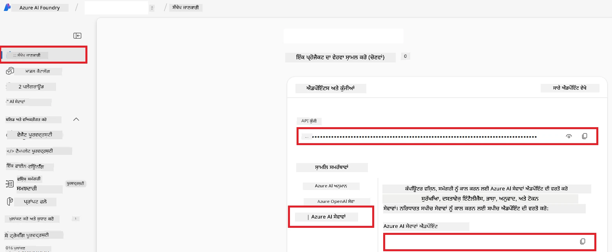

# Co-op Translator ਲਈ Azure AI ਸੈਟਅੱਪ ਕਰੋ (Azure OpneAI & Azure AI Vision)

ਇਹ ਗਾਈਡ ਤੁਹਾਨੂੰ Azure AI Foundry ਵਿੱਚ ਭਾਸ਼ਾ ਅਨੁਵਾਦ ਲਈ Azure OpenAI ਅਤੇ ਚਿੱਤਰ-ਅਧਾਰਿਤ ਅਨੁਵਾਦ ਲਈ ਚਿੱਤਰ ਸਮੱਗਰੀ ਵਿਸ਼ਲੇਸ਼ਣ ਲਈ Azure Computer Vision ਸੈਟਅੱਪ ਕਰਨ ਵਿੱਚ ਮਦਦ ਕਰਦੀ ਹੈ।

**ਜ਼ਰੂਰੀ ਸ਼ਰਤਾਂ:**
- ਇੱਕ Azure ਖਾਤਾ ਜਿਸ ਵਿੱਚ ਸਰਗਰਮ ਸਬਸਕ੍ਰਿਪਸ਼ਨ ਹੋਵੇ।
- Azure ਸਬਸਕ੍ਰਿਪਸ਼ਨ ਵਿੱਚ ਸਰੋਤ ਅਤੇ ਡਿਪਲੋਇਮੈਂਟ ਬਣਾਉਣ ਲਈ ਕਾਫ਼ੀ ਅਧਿਕਾਰ।

## ਇੱਕ Azure AI ਪਰੋਜੈਕਟ ਬਣਾਓ

ਤੁਸੀਂ ਇੱਕ Azure AI ਪਰੋਜੈਕਟ ਬਣਾਉਣ ਤੋਂ ਸ਼ੁਰੂ ਕਰੋਂਗੇ, ਜੋ ਤੁਹਾਡੇ AI ਸਰੋਤਾਂ ਦੇ ਪ੍ਰਬੰਧ ਲਈ ਕੇਂਦਰੀ ਸਥਾਨ ਵਜੋਂ ਕੰਮ ਕਰਦਾ ਹੈ।

1. [https://ai.azure.com](https://ai.azure.com) 'ਤੇ ਜਾਓ ਅਤੇ ਆਪਣੇ Azure ਖਾਤੇ ਨਾਲ ਸਾਈਨ ਇਨ ਕਰੋ।

1. ਇੱਕ ਨਵਾਂ ਪਰੋਜੈਕਟ ਬਣਾਉਣ ਲਈ **+Create** ਚੁਣੋ।

1. ਹੇਠ ਲਿਖੇ ਕੰਮ ਕਰੋ:
   - ਇੱਕ **Project name** ਦਰਜ ਕਰੋ (ਜਿਵੇਂ `CoopTranslator-Project`)।
   - **AI hub** ਚੁਣੋ (ਜਿਵੇਂ `CoopTranslator-Hub`) (ਜ਼ਰੂਰਤ ਹੋਏ ਤਾਂ ਨਵਾਂ ਬਣਾਓ)।

1. ਆਪਣੇ ਪਰੋਜੈਕਟ ਸੈਟਅੱਪ ਕਰਨ ਲਈ "**Review and Create**" 'ਤੇ ਕਲਿੱਕ ਕਰੋ। ਤੁਹਾਨੂੰ ਆਪਣੇ ਪਰੋਜੈਕਟ ਦੇ ਓਵਰਵੀਉ ਪੇਜ਼ 'ਤੇ ਲੈ ਜਾਇਆ ਜਾਵੇਗਾ।

## ਭਾਸ਼ਾ ਅਨੁਵਾਦ ਲਈ Azure OpenAI ਸੈਟਅੱਪ ਕਰੋ

ਆਪਣੇ ਪਰੋਜੈਕਟ ਵਿੱਚ, ਤੁਸੀਂ ਟੈਕਸਟ ਅਨੁਵਾਦ ਲਈ ਬੈਕਇੰਡ ਵਜੋਂ Azure OpenAI ਮਾਡਲ ਡਿਪਲੋਇਮੈਂਟ ਕਰੋਗੇ।

### ਆਪਣੇ ਪਰੋਜੈਕਟ 'ਤੇ ਜਾਓ

ਜੇ ਪਹਿਲਾਂ ਨਹੀਂ ਖੁੱਲਿਆ, ਤਾਂ Azure AI Foundry ਵਿੱਚ ਆਪਣੇ ਤਾਜ਼ਾ ਬਣਾਏ ਪਰੋਜੈਕਟ (ਜਿਵੇਂ `CoopTranslator-Project`) ਨੂੰ ਖੋਲ੍ਹੋ।

### ਇੱਕ OpenAI ਮਾਡਲ ਡਿਪਲੋਇਮੈਂਟ ਕਰੋ

1. ਆਪਣੇ ਪਰੋਜੈਕਟ ਦੇ ਖੱਬੇ ਮੀਨੂ 'ਚ, "My assets" ਹੇਠਾਂ, "**Models + endpoints**" ਚੁਣੋ।

1. **+ Deploy model** 'ਤੇ ਕਲਿੱਕ ਕਰੋ।

1. **Deploy Base Model** ਚੁਣੋ।

1. ਤੁਹਾਨੂੰ ਉਪਲੱਬਧ ਮਾਡਲਾਂ ਦੀ ਸੂਚੀ ਦਿੱਤੀ ਜਾਵੇਗੀ। ਇੱਕ ਉਦਾਰਣ ਲਈ GPT ਮਾਡਲ ਨੂੰ ਫਿਲਟਰ ਜਾਂ ਖੋਜੋ। ਅਸੀਂ `gpt-4o` ਦੀ ਸਿਫਾਰਸ਼ ਕਰਦੇ ਹਾਂ।

1. ਆਪਣਾ ਮਨਪਸੰਦ ਮਾਡਲ ਚੁਣੋ ਅਤੇ **Confirm** 'ਤੇ ਕਲਿੱਕ ਕਰੋ।

1. **Deploy** ਚੁਣੋ।

### Azure OpenAI ਸੰਰਚਨਾ

ਡਿਪਲੋਇਮੈਂਟ ਦੇ ਬਾਅਦ, ਤੁਸੀਂ "**Models + endpoints**" ਪੇਜ਼ ਤੋਂ ਆਪਣੀ ਡਿਪਲੋਇਮੈਂਟ ਚੁਣ ਕੇ ਇਸਦਾ **REST endpoint URL**, **Key**, **Deployment name**, **Model name** ਅਤੇ **API version** ਲੱਭ ਸਕਦੇ ਹੋ। ਇਹ ਤੁਹਾਡੇ ਐਪਲੀਕੇਸ਼ਨ ਵਿੱਚ ਅਨੁਵਾਦ ਮਾਡਲ ਨੂੰ ਜੋੜਨ ਲਈ ਲੋੜੀਂਦੇ ਹਨ।

> [!NOTE]
> ਤੁਸੀਂ ਆਪਣੀ ਜ਼ਰੂਰਤਾਂ ਮੁਤਾਬਕ [API version deprecation](https://learn.microsoft.com/azure/ai-services/openai/api-version-deprecation) ਪੇਜ਼ ਤੋਂ API ਵਰਜਨ ਚੁਣ ਸਕਦੇ ਹੋ। ਯਾਦ ਰੱਖੋ ਕਿ **API version** ਅਤੇ **Model version** ਜੋ "Models + endpoints" ਪੇਜ਼ ਵਿੱਚ Azure AI Foundry ਵਿੱਚ ਦਿਖਾਈ ਦਿੰਦਾ ਹੈ, ਵੱਖ-ਵੱਖ ਹਨ।

## ਚਿੱਤਰ ਅਨੁਵਾਦ ਲਈ Azure Computer Vision ਸੈਟਅੱਪ ਕਰੋ

ਚਿੱਤਰਾਂ ਵਿੱਚ ਲਿਖਤ ਦਾ ਅਨੁਵਾਦ ਕਰਨ ਲਈ, ਤੁਹਾਨੂੰ Azure AI Service API Key ਅਤੇ Endpoint ਲੱਭਣੇ ਹੋਣਗੇ।

1. ਆਪਣੇ Azure AI ਪਰੋਜੈਕਟ (ਜਿਵੇਂ `CoopTranslator-Project`) ਤੇ ਜਾਓ। ਯਕੀਨੀ ਬਣਾਓ ਕਿ ਤੁਸੀਂ ਪ੍ਰੋਜੈਕਟ ਓਵਰਵੀਉ ਪੇਜ਼ 'ਤੇ ਹੋ।

### Azure AI Service ਸੰਰਚਨਾ

Azure AI Service ਵਿੱਚੋਂ API Key ਅਤੇ Endpoint ਲੱਭੋ।

1. ਆਪਣੇ Azure AI ਪਰੋਜੈਕਟ (ਜਿਵੇਂ `CoopTranslator-Project`) ਤੇ ਜਾਓ। ਯਕੀਨੀ ਬਣਾਓ ਕਿ ਤੁਸੀਂ ਪ੍ਰੋਜੈਕਟ ਓਵਰਵੀਉ ਪੇਜ਼ 'ਤੇ ਹੋ।

1. Azure AI Service ਟੈਬ ਤੋਂ **API Key** ਅਤੇ **Endpoint** ਲੱਭੋ।

    

ਇਹ ਕਨੈਕਸ਼ਨ Azure AI Services ਸਰੋਤ ਦੀਆਂ ਸਮਰੱਥਾਵਾਂ (ਜਿਸ ਵਿੱਚ ਚਿੱਤਰ ਵਿਸ਼ਲੇਸ਼ਣ ਵੀ ਸ਼ਾਮਲ ਹੈ) ਤੁਹਾਡੇ AI Foundry ਪ੍ਰੋਜੈਕਟ ਲਈ ਉਪਲੱਬਧ ਕਰਵਾਉਂਦਾ ਹੈ। ਤੁਸੀਂ ਇਸ ਕਨੈਕਸ਼ਨ ਨੂੰ ਆਪਣੇ ਨੋਟਬੁੱਕ ਜਾਂ ਐਪਲੀਕੇਸ਼ਨਾਂ ਵਿੱਚ ਵਰਤਕੇ ਚਿੱਤਰਾਂ ਵਿੱਚੋਂ ਲਿਖਤ ਕੱਢ ਸਕਦੇ ਹੋ, ਜੋ ਫਿਰ ਅਨੁਵਾਦ ਲਈ Azure OpenAI ਮਾਡਲ ਨੂੰ ਭੇਜਿਆ ਜਾ ਸਕਦਾ ਹੈ।

## ਆਪਣੇ ਪ੍ਰਮਾਣ ਪੱਤਰ ਇਕੱਠੇ ਕਰੋ

ਹੁਣ ਤੱਕ, ਤੁਹਾਡੇ ਕੋਲ ਇਹ ਸੂਚਨਾ ਇਕੱਠੀ ਹੋਣੀ ਚਾਹੀਦੀ ਹੈ:

**Azure OpenAI (ਟੈਕਸਟ ਅਨੁਵਾਦ) ਲਈ:**
- Azure OpenAI Endpoint
- Azure OpenAI API Key
- Azure OpenAI Model Name (ਜਿਵੇਂ `gpt-4o`)
- Azure OpenAI Deployment Name (ਜਿਵੇਂ `cooptranslator-gpt4o`)
- Azure OpenAI API Version

**Azure AI Services (Vision ਰਾਹੀਂ ਚਿੱਤਰ ਲਿਖਤ ਕੱਢਣਾ) ਲਈ:**
- Azure AI Service Endpoint
- Azure AI Service API Key

### ਉਦਾਹਰਨ: Environment Variable ਸੰਰਚਨਾ (ਪ੍ਰੀਵਿਊ)

ਆਪਣੇ ਐਪਲੀਕੇਸ਼ਨ ਬਣਾਉਂਦੇ ਸਮੇਂ, ਤੁਸੀਂ ਸਭ ਇਕੱਠੇ ਕੀਤੇ ਗਏ ਪ੍ਰਮਾਣ ਪੱਤਰ ਵਰਤਕੇ ਇਹ ਸੰਰਚਨਾ ਕਰ ਸਕਦੇ ਹੋ। ਉਦਾਹਰਨ ਵਜੋਂ, ਤੁਸੀਂ ਇਹ ਨੂੰ ਨਿਮਨਲਿਖਤ ਦੇ ਤੌਰ 'ਤੇ environment variables ਵਿੱਚ ਸੈਟ ਕਰ ਸਕਦੇ ਹੋ:

```bash
# ਅਜ਼ੂਰ ਏਆਈ ਸੇਵਾ ਕ੍ਰੈਡੈਂਸ਼ਲ (ਚਿੱਤਰ ਅਨੁਵਾਦ ਲਈ ਜ਼ਰੂਰੀ)
AZURE_AI_SERVICE_API_KEY="your_azure_ai_service_api_key" # ਜਿਵੇਂ, 21xasd...
AZURE_AI_SERVICE_ENDPOINT="https://your_azure_ai_service_endpoint.cognitiveservices.azure.com/"

# ਵਿਕਲਪਿਕ ਬੈਕਅਪ ਸੈੱਟ: ਸਫਿਕਸ _1/_2 ਨਾਲ ਡੁੱਪਲੀਕੇਟ ਵੈਰੀਏਬਲ (ਸਾਰੇ ਵੈਰੀਏਬਲ ਲਈ ਇੱਕੋ ਜਿਹਾ ਇੰਡੈਕਸ)
AZURE_AI_SERVICE_API_KEY_1="your_azure_ai_service_api_key_1"
AZURE_AI_SERVICE_ENDPOINT_1="https://your_azure_ai_service_endpoint_1.cognitiveservices.azure.com/"

# ਅਜ਼ੂਰ ਓਪਨਏਆਈ ਕ੍ਰੈਡੈਂਸ਼ਲ (ਪਾਠ ਅਨੁਵਾਦ ਲਈ ਜ਼ਰੂਰੀ)
AZURE_OPENAI_API_KEY="your_azure_openai_api_key" # ਜਿਵੇਂ, 21xasd...
AZURE_OPENAI_ENDPOINT="https://your_azure_openai_endpoint.openai.azure.com/"
AZURE_OPENAI_MODEL_NAME="your_model_name" # ਜਿਵੇਂ, gpt-4o
AZURE_OPENAI_CHAT_DEPLOYMENT_NAME="your_deployment_name" # ਜਿਵੇਂ, cooptranslator-gpt4o
AZURE_OPENAI_API_VERSION="your_api_version" # ਜਿਵੇਂ, 2024-12-01-preview

# ਵਿਕਲਪਿਕ ਬੈਕਅਪ ਸੈੱਟ: ਸਾਰੇ ਵੈਰੀਏਬਲਾਂ ਲਈ ਸਫਿਕਸ _1/_2 ਨਾਲ ਪੂਰਾ AZURE_OPENAI_* ਸੈੱਟ ਡੁੱਪਲੀਕੇਟ ਕਰੋ
```

---

### ਅਗਲੀ ਪੜ੍ਹਾਈ

- [Azure AI Foundry ਵਿੱਚ ਪਰੋਜੈਕਟ ਕਿਵੇਂ ਬਣਾਇਆ ਜਾਵੇ](https://learn.microsoft.com/azure/ai-foundry/how-to/create-projects?tabs=ai-studio)
- [Azure AI ਸਰੋਤ ਕਿਵੇਂ ਬਣਾਏ ਜਾਣ](https://learn.microsoft.com/azure/ai-foundry/how-to/create-azure-ai-resource?tabs=portal)
- [Azure AI Foundry ਵਿੱਚ OpenAI ਮਾਡਲ ਕਿਵੇਂ ਡਿਪਲੋਇਮੈਂਟ ਕਰਨਾ](https://learn.microsoft.com/en-us/azure/ai-foundry/how-to/deploy-models-openai)

---

<!-- CO-OP TRANSLATOR DISCLAIMER START -->
**ਡਿਸਕਲੇਮਰ**:  
ਇਸ ਦਸਤਾਵੇਜ਼ ਦਾ ਅਨੁਵਾਦ ਏਆਈ ਅਨੁਵਾਦ ਸੇਵਾ [Co-op Translator](https://github.com/Azure/co-op-translator) ਦੀ ਵਰਤੋਂ ਕਰਕੇ ਕੀਤਾ ਗਿਆ ਹੈ। ਜਦੋਂ ਕਿ ਅਸੀਂ ਸਹੀਤਾ ਲਈ ਕੋਸ਼ਿਸ਼ ਕਰਦੇ ਹਾਂ, ਕਿਰਪਾ ਕਰਕੇ ਧਿਆਨ ਰੱਖੋ ਕਿ ਸਵੈਚਾਲਿਤ ਅਨੁਵਾਦਾਂ ਵਿੱਚ ਭੁੱਲਾਂ ਜਾਂ ਗਲਤੀਆਂ ਹੋ ਸਕਦੀਆਂ ਹਨ। ਮੂਲ ਦਸਤਾਵੇਜ਼ ਆਪਣੇ ਮੂਲ ਭਾਸ਼ਾ ਵਿੱਚ ਪ੍ਰਮਾਣਿਕ ਸਰੋਤ ਮੰਨਿਆ ਜਾਣਾ ਚਾਹੀਦਾ ਹੈ। ਮਹੱਤਵਪੂਰਨ ਜਾਣਕਾਰੀ ਲਈ, ਪੇਸ਼ਾਵਰ ਮਨੁੱਖੀ ਅਨੁਵਾਦ ਦੀ ਸਿਫ਼ਾਰਸ਼ ਕੀਤੀ ਜਾਂਦੀ ਹੈ। ਅਸੀਂ ਇਸ ਅਨੁਵਾਦ ਦੀ ਵਰਤੋਂ ਤੋਂ ਉਭਰਣ ਵਾਲੀਆਂ ਕਿਸੇ ਵੀ ਗਲਤਫਹਿਮੀਆਂ ਜਾਂ ਗਲਤ ਸਮਝਦਾਰੀਆਂ ਲਈ ਜ਼ਿੰਮੇਵਾਰ ਨਹੀਂ ਹਾਂ।
<!-- CO-OP TRANSLATOR DISCLAIMER END -->