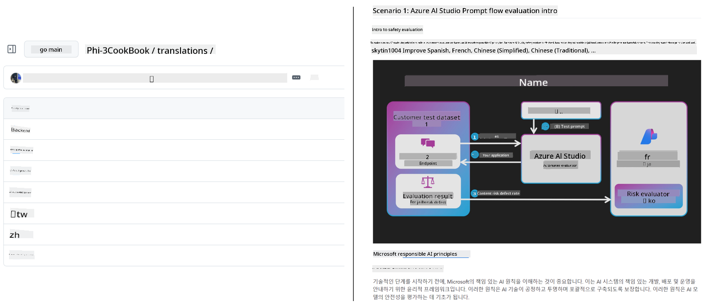
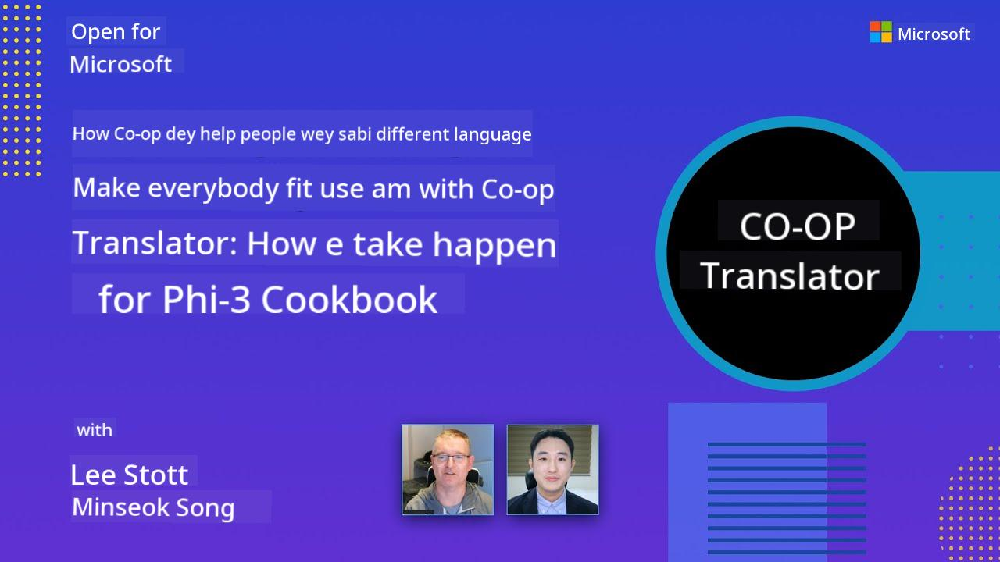

<!--
CO_OP_TRANSLATOR_METADATA:
{
  "original_hash": "b94f74bd151736dfef6318f822828bf9",
  "translation_date": "2025-10-22T11:15:11+00:00",
  "source_file": "README.md",
  "language_code": "pcm"
}
-->
# Co-op Translator

_Easy way wey you fit use automate translate your educational GitHub content go plenti languages so people for everywhere fit use am._

### 🌐 Multi-Language Support

#### Co-op Translator dey support these ones

<!-- CO-OP TRANSLATOR LANGUAGES TABLE START -->
[Arabic](../ar/README.md) | [Bengali](../bn/README.md) | [Bulgarian](../bg/README.md) | [Burmese (Myanmar)](../my/README.md) | [Chinese (Simplified)](../zh/README.md) | [Chinese (Traditional, Hong Kong)](../hk/README.md) | [Chinese (Traditional, Macau)](../mo/README.md) | [Chinese (Traditional, Taiwan)](../tw/README.md) | [Croatian](../hr/README.md) | [Czech](../cs/README.md) | [Danish](../da/README.md) | [Dutch](../nl/README.md) | [Estonian](../et/README.md) | [Finnish](../fi/README.md) | [French](../fr/README.md) | [German](../de/README.md) | [Greek](../el/README.md) | [Hebrew](../he/README.md) | [Hindi](../hi/README.md) | [Hungarian](../hu/README.md) | [Indonesian](../id/README.md) | [Italian](../it/README.md) | [Japanese](../ja/README.md) | [Korean](../ko/README.md) | [Lithuanian](../lt/README.md) | [Malay](../ms/README.md) | [Marathi](../mr/README.md) | [Nepali](../ne/README.md) | [Norwegian](../no/README.md) | [Persian (Farsi)](../fa/README.md) | [Polish](../pl/README.md) | [Portuguese (Brazil)](../br/README.md) | [Portuguese (Portugal)](../pt/README.md) | [Punjabi (Gurmukhi)](../pa/README.md) | [Romanian](../ro/README.md) | [Russian](../ru/README.md) | [Serbian (Cyrillic)](../sr/README.md) | [Slovak](../sk/README.md) | [Slovenian](../sl/README.md) | [Spanish](../es/README.md) | [Swahili](../sw/README.md) | [Swedish](../sv/README.md) | [Tagalog (Filipino)](../tl/README.md) | [Tamil](../ta/README.md) | [Thai](../th/README.md) | [Turkish](../tr/README.md) | [Ukrainian](../uk/README.md) | [Urdu](../ur/README.md) | [Vietnamese](../vi/README.md)
<!-- CO-OP TRANSLATOR LANGUAGES TABLE END -->

## Overview

**Co-op Translator** go help you quick translate your educational GitHub content go plenti languages, so people for everywhere fit use am without wahala. If you update your Markdown files, images, or Jupyter notebooks, e go help you sync the translations so your content go dey fresh and correct for people wey dey different country.

See as Co-op Translator dey arrange translated educational GitHub content:



## Quick start

```bash
# Create and activate a virtual environment (recommended)
python -m venv .venv
# Windows
.venv\Scripts\activate
# macOS/Linux
source .venv/bin/activate
# Install the package
pip install co-op-translator
# Translate
translate -l "ko ja fr" -md
```

Docker:

```bash
# Pull the public image from GHCR
docker pull ghcr.io/azure/co-op-translator:latest
# Run with current folder mounted and .env provided (Bash/Zsh)
docker run --rm -it --env-file .env -v "${PWD}:/work" ghcr.io/azure/co-op-translator:latest -l "ko ja fr" -md
```

## Minimal setup

- Make `.env` file with the template: [.env.template](../../.env.template)
- Set one LLM provider (Azure OpenAI or OpenAI)
- If you wan translate image (`-img`), set Azure AI Vision join
- E good make you clean any translation wey other tool don generate before, so wahala no go dey (like: `translations/`).
- E good make you add translations section for your README with [README languages template](./README_languages_template.md)
- See: [Set up Azure AI](./getting_started/set-up-azure-ai.md)

## Usage

Translate all the types wey e support:

```bash
translate -l "ko ja"
```

Only Markdown:

```bash
translate -l "de" -md
```

Markdown plus images:

```bash
translate -l "pt" -md -img
```

Only notebooks:

```bash
translate -l "zh" -nb
```

See more flags: [Command reference](./getting_started/command-reference.md)

## Features

- E dey translate Markdown, notebooks, and images automatically
- E dey make sure translations dey up-to-date with the main content
- You fit run am for your computer (CLI) or for CI (GitHub Actions)
- E dey use Azure OpenAI or OpenAI; if na image, you fit use Azure AI Vision join
- E dey keep Markdown formatting and structure as e be

## Docs

- [Command-line guide](./getting_started/command-line-guide/command-line-guide.md)
- [GitHub Actions guide (Public repositories & standard secrets)](./getting_started/github-actions-guide/github-actions-guide-public.md)
- [GitHub Actions guide (Microsoft organization repositories & org-level setups)](./getting_started/github-actions-guide/github-actions-guide-org.md)
- [Supported languages](./getting_started/supported-languages.md)
- [Troubleshooting](./getting_started/troubleshooting.md)

## Support Us and Foster Global Learning

Abeg join hand with us make we change how people dey share educational content for the world! Give [Co-op Translator](https://github.com/azure/co-op-translator) one ⭐ for GitHub and support our work to break language wahala for learning and technology. Your support and contribution dey important! If you sabi code or get idea, abeg bring am.

### Check Microsoft educational content for your language

- [AZD for Beginners](https://github.com/microsoft/AZD-for-beginners)
- [Edge AI for Beginners](https://github.com/microsoft/edgeai-for-beginners)
- [Model Context Protocol (MCP) For Beginners](https://github.com/microsoft/mcp-for-beginners)
- [AI Agents for Beginners](https://github.com/microsoft/ai-agents-for-beginners)
- [Generative AI for Beginners using .NET](https://github.com/microsoft/Generative-AI-for-beginners-dotnet)
- [Generative AI for Beginners](https://github.com/microsoft/generative-ai-for-beginners)
- [Generative AI for Beginners using Java](https://github.com/microsoft/generative-ai-for-beginners-java)
- [ML for Beginners](https://aka.ms/ml-beginners)
- [Data Science for Beginners](https://aka.ms/datascience-beginners)
- [AI for Beginners](https://aka.ms/ai-beginners)
- [Cybersecurity for Beginners](https://github.com/microsoft/Security-101)
- [Web Dev for Beginners](https://aka.ms/webdev-beginners)
- [IoT for Beginners](https://aka.ms/iot-beginners)
- [PhiCookBook](https://github.com/microsoft/PhiCookBook)

## Video Presentations

Learn more about Co-op Translator with our presentations _(Click the image below to watch for YouTube.)_:

- **Open at Microsoft**: Short 18-minute intro and quick guide on how to use Co-op Translator.

  [](https://www.youtube.com/watch?v=jX_swfH_KNU)

## Contributing

This project dey welcome anybody wey wan contribute or suggest. If you wan join Azure Co-op Translator, check our [CONTRIBUTING.md](./CONTRIBUTING.md) to see how you fit help make Co-op Translator easy for everybody.

## Contributors

[](https://github.com/Azure/co-op-translator/graphs/contributors)

## Code of Conduct

This project dey follow [Microsoft Open Source Code of Conduct](https://opensource.microsoft.com/codeofconduct/).
If you wan know more, check [Code of Conduct FAQ](https://opensource.microsoft.com/codeofconduct/faq/) or
email [opencode@microsoft.com](mailto:opencode@microsoft.com) if you get any question or talk.

## Responsible AI

Microsoft dey try make sure say people dey use our AI products well, dey share wetin we learn, and dey build trust with tools like Transparency Notes and Impact Assessments. You fit find many of these resources for [https://aka.ms/RAI](https://aka.ms/RAI).
Microsoft way for responsible AI na based on our AI principles: fairness, reliability and safety, privacy and security, inclusiveness, transparency, and accountability.

Big natural language, image, and speech models - like the ones wey dey this sample - fit sometimes do things wey no good, no reliable, or even offend person, and fit cause wahala. Abeg check [Azure OpenAI service Transparency note](https://learn.microsoft.com/legal/cognitive-services/openai/transparency-note?tabs=text) so you go sabi the risks and limits.

The best way to avoid these wahala na to add safety system for your setup wey fit detect and stop bad behaviour. [Azure AI Content Safety](https://learn.microsoft.com/azure/ai-services/content-safety/overview) dey give extra protection, fit detect bad content wey people or AI generate for your app or service. Azure AI Content Safety get text and image APIs wey fit help you see harmful things. We get Content Safety Studio wey you fit use test and try code for detecting bad content for different types. This [quickstart documentation](https://learn.microsoft.com/azure/ai-services/content-safety/quickstart-text?tabs=visual-studio%2Clinux&pivots=programming-language-rest) go show you how to use the service.
Another thing wey you suppose reason na how the whole app dey perform. For apps wey get plenty mode and model, when we talk say performance dey, e mean say the system dey do wetin you and your users dey expect, plus e no dey produce wahala output. E good make you check how your app dey perform with [generation quality and risk and safety metrics](https://learn.microsoft.com/azure/ai-studio/concepts/evaluation-metrics-built-in).

You fit test your AI app for where you dey build am with the [prompt flow SDK](https://microsoft.github.io/promptflow/index.html). If you get test dataset or target, your generative AI app go dey measure with the evaluators wey dey inside or the one wey you choose. To start with prompt flow sdk to check your system, just follow the [quickstart guide](https://learn.microsoft.com/azure/ai-studio/how-to/develop/flow-evaluate-sdk). After you run the evaluation, you fit [see the results for Azure AI Studio](https://learn.microsoft.com/azure/ai-studio/how-to/evaluate-flow-results).

## Trademarks

This project fit get trademarks or logos for projects, products, or services. If you wan use Microsoft
trademarks or logos, you gats follow
[Microsoft's Trademark & Brand Guidelines](https://www.microsoft.com/en-us/legal/intellectualproperty/trademarks/usage/general).
If you use Microsoft trademarks or logos for project wey you change, e no suppose make people confuse or make e look like na Microsoft dey support am.
Any use of third-party trademarks or logos na the third-party policy go guide am.

## Getting Help

If you jam wahala or get question about how to build AI apps, join:

< a href="https://aka.ms/foundry/discord"></a>

If you wan drop feedback or you see error as you dey build, go here:

< a href="https://aka.ms/foundry/forum"></a>

---

**Disclaimer**:
Na AI translation service wey dem dey call [Co-op Translator](https://github.com/Azure/co-op-translator) we use take translate this document. Even though we try make the translation correct, abeg make you sabi say AI fit make mistake or no translate am well. Na the original document for the main language be the correct one wey you suppose follow. If the information dey important, abeg use professional human translator. We no go fit hold any responsibility for wahala wey fit happen because of how this translation take be.