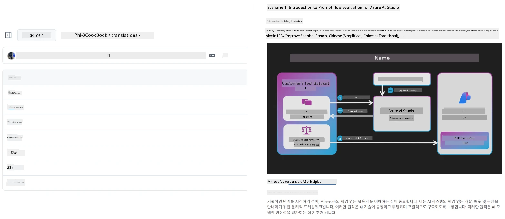

# Co-op Translator

_Ezili automate an maintain translations for your educational GitHub content across many languages as your project dey grow._


[](https://pypi.org/project/co-op-translator/)
[](https://github.com/azure/co-op-translator/blob/main/LICENSE)
[](https://pepy.tech/project/co-op-translator)
[](https://pepy.tech/project/co-op-translator)
[](https://github.com/azure/co-op-translator/pkgs/container/co-op-translator)
[](https://github.com/psf/black)

[](https://GitHub.com/azure/co-op-translator/graphs/contributors/)
[](https://GitHub.com/azure/co-op-translator/issues/)
[](https://GitHub.com/azure/co-op-translator/pulls/)
[](http://makeapullrequest.com)

### 🌐 Multi-Language Support

#### Supported by [Co-op Translator](https://github.com/Azure/Co-op-Translator)

<!-- CO-OP TRANSLATOR LANGUAGES TABLE START -->
[Arabic](../ar/README.md) | [Bengali](../bn/README.md) | [Bulgarian](../bg/README.md) | [Burmese (Myanmar)](../my/README.md) | [Chinese (Simplified)](../zh-CN/README.md) | [Chinese (Traditional, Hong Kong)](../zh-HK/README.md) | [Chinese (Traditional, Macau)](../zh-MO/README.md) | [Chinese (Traditional, Taiwan)](../zh-TW/README.md) | [Croatian](../hr/README.md) | [Czech](../cs/README.md) | [Danish](../da/README.md) | [Dutch](../nl/README.md) | [Estonian](../et/README.md) | [Finnish](../fi/README.md) | [French](../fr/README.md) | [German](../de/README.md) | [Greek](../el/README.md) | [Hebrew](../he/README.md) | [Hindi](../hi/README.md) | [Hungarian](../hu/README.md) | [Indonesian](../id/README.md) | [Italian](../it/README.md) | [Japanese](../ja/README.md) | [Kannada](../kn/README.md) | [Khmer](../km/README.md) | [Korean](../ko/README.md) | [Lithuanian](../lt/README.md) | [Malay](../ms/README.md) | [Malayalam](../ml/README.md) | [Marathi](../mr/README.md) | [Nepali](../ne/README.md) | [Nigerian Pidgin](./README.md) | [Norwegian](../no/README.md) | [Persian (Farsi)](../fa/README.md) | [Polish](../pl/README.md) | [Portuguese (Brazil)](../pt-BR/README.md) | [Portuguese (Portugal)](../pt-PT/README.md) | [Punjabi (Gurmukhi)](../pa/README.md) | [Romanian](../ro/README.md) | [Russian](../ru/README.md) | [Serbian (Cyrillic)](../sr/README.md) | [Slovak](../sk/README.md) | [Slovenian](../sl/README.md) | [Spanish](../es/README.md) | [Swahili](../sw/README.md) | [Swedish](../sv/README.md) | [Tagalog (Filipino)](../tl/README.md) | [Tamil](../ta/README.md) | [Telugu](../te/README.md) | [Thai](../th/README.md) | [Turkish](../tr/README.md) | [Ukrainian](../uk/README.md) | [Urdu](../ur/README.md) | [Vietnamese](../vi/README.md)

> **Prefer to Clone Locally?**
>
> Dis repository get 50+ language translations wey dey increase di download size well-well. To clone without translations, use sparse checkout:
>
> **Bash / macOS / Linux:**
> ```bash
> git clone --filter=blob:none --sparse https://github.com/Azure/co-op-translator.git
> cd co-op-translator
> git sparse-checkout set --no-cone '/*' '!translations' '!translated_images'
> ```
>
> **CMD (Windows):**
> ```cmd
> git clone --filter=blob:none --sparse https://github.com/Azure/co-op-translator.git
> cd co-op-translator
> git sparse-checkout set --no-cone "/*" "!translations" "!translated_images"
> ```
>
> Dis go give you everything you need to complete di course with way faster download.
<!-- CO-OP TRANSLATOR LANGUAGES TABLE END -->

[](https://GitHub.com/azure/co-op-translator/watchers/)
[](https://GitHub.com/azure/co-op-translator/network/)
[](https://GitHub.com/azure/co-op-translator/stargazers/)

[](https://discord.gg/nTYy5BXMWG)

[](https://codespaces.new/azure/co-op-translator)

## Overview

**Co-op Translator** dey help you localize your educational GitHub content to many languages without stress.
When you update your Markdown files, images, or notebooks, translations dey stay automatically synchronized, so your content go dey correct and fresh for learners for all obodo.

Example of how translated content dey organized:



## How translation state is managed

Co-op Translator dey manage translated content as **versioned software artifacts**,  
no be as static files.

The tool dey track di state of translated Markdown, images, and notebooks
using **language-scoped metadata**.

Dis design allow Co-op Translator to:

- Reliably detect outdated translations
- Treat Markdown, images, and notebooks consistently
- Scale safely across large, fast-moving, multi-language repositories

By modeling translations as managed artifacts,
translation workflows dey naturally align with modern
software dependency and artifact management practices.

→ [How translation state is managed](https://techcommunity.microsoft.com/blog/azuredevcommunityblog/rethinking-documentation-translation-treating-translations-as-versioned-software/4491755)


## Quick start

```bash
# Make and waka the virtual environment (na beta make you do am)
python -m venv .venv
# Windows
.venv\Scripts\activate
# macOS/Linux
source .venv/bin/activate
# Put the package inside
pip install co-op-translator
# Change am to oda language
translate -l "ko ja fr" -md
```

Docker:

```bash
# Drag the public image from GHCR
docker pull ghcr.io/azure/co-op-translator:latest
# Run wit current folder mount and .env provide (Bash/Zsh)
docker run --rm -it --env-file .env -v "${PWD}:/work" ghcr.io/azure/co-op-translator:latest -l "ko ja fr" -md
```

## Minimal setup

1. Make sure say you get supported Python version (right now na 3.10-3.12). For poetry (pyproject.toml) dis dey handled automatically.
2. Create `.env` file using di template: [.env.template](../../.env.template)
3. Configure one LLM provider (Azure OpenAI or OpenAI)
4. (Optional) For image translation (`-img`), configure Azure AI Vision
5. (Optional) You fit configure many credential sets by duplicating variables with suffixes like `_1`, `_2`, etc. All variables for one set must get the same suffix.
6. (Recommended) Clean up any previous translations to avoid wahala (e.g., `translations/`)
7. (Recommended) Add translation section to your README using [README languages template](./getting_started/README_languages_template.md)
8. See: [Set up Azure AI](./getting_started/set-up-azure-ai.md)

## Usage

Translate all supported types:

```bash
translate -l "ko ja"
```

Only Markdown:

```bash
translate -l "de" -md
```

Markdown + images:

```bash
translate -l "pt" -md -img
```

Only notebooks:

```bash
translate -l "zh" -nb
```

More flags: [Command reference](./getting_started/command-reference.md)

## Features

- Automated translation for Markdown, notebooks, and images
- Keeps translations in sync with source changes
- Works locally (CLI) or in CI (GitHub Actions)
- Uses Azure OpenAI or OpenAI; optional Azure AI Vision for images
- Preserves Markdown formatting and structure

## Docs

- [Command-line guide](./getting_started/command-line-guide/command-line-guide.md)
- [GitHub Actions guide (Public repositories & standard secrets)](./getting_started/github-actions-guide/github-actions-guide-public.md)
- [GitHub Actions guide (Microsoft organization repositories & org-level setups)](./getting_started/github-actions-guide/github-actions-guide-org.md)
- [README languages template](./getting_started/README_languages_template.md)
- [Supported languages](./getting_started/supported-languages.md)
- [Contributing](./CONTRIBUTING.md)
- [Troubleshooting](./getting_started/troubleshooting.md)

### Microsoft-specific guide
> [!NOTE]
> For maintainers of Microsoft “For Beginners” repositories only.

- [Updating the “other courses” list (for MS Beginners repositories only)](./getting_started/update-other-courses.md)

## Support us and foster global learning

Join us make we change how educational content dey shared globally! Give [Co-op Translator](https://github.com/azure/co-op-translator) a ⭐ for GitHub and support our mission make language barrier no dey for learning and technology. Your interest and contributions dey make big difference! Code contributions and feature suggestions dey always welcome.

### Explore Microsoft educational content in your language

- [LangChain4j-for-Beginners](https://github.com/microsoft/LangChain4j-for-Beginners)
- [AZD for Beginners](https://github.com/microsoft/AZD-for-beginners)
- [Edge AI for Beginners](https://github.com/microsoft/edgeai-for-beginners)
- [Model Context Protocol (MCP) For Beginners](https://github.com/microsoft/mcp-for-beginners)
- [AI Agents for Beginners](https://github.com/microsoft/ai-agents-for-beginners)
- [Generative AI for Beginners using .NET](https://github.com/microsoft/Generative-AI-for-beginners-dotnet)
- [Generative AI for Beginners](https://github.com/microsoft/generative-ai-for-beginners)
- [Generative AI for Beginners using Java](https://github.com/microsoft/generative-ai-for-beginners-java)
- [ML for Beginners](https://aka.ms/ml-beginners)
- [Data Science for Beginners](https://aka.ms/datascience-beginners)
- [AI for Beginners](https://aka.ms/ai-beginners)
- [Cybersecurity for Beginners](https://github.com/microsoft/Security-101)
- [Web Dev for Beginners](https://aka.ms/webdev-beginners)
- [IoT for Beginners](https://aka.ms/iot-beginners)
- [PhiCookBook](https://github.com/microsoft/PhiCookBook)

## Video presentations

👉 Click the image below make you watch for YouTube.

- **Open at Microsoft**: Small 18-minute introduction and quick guide on how to use Co-op Translator.

  [](https://www.youtube.com/watch?v=jX_swfH_KNU)

## Contributing

Dis project dey welcome contributions and suggestions. You want contribute to Azure Co-op Translator? Abeg see our [CONTRIBUTING.md](./CONTRIBUTING.md) for guidelines on how you fit help make Co-op Translator more accessible.

## Contributors
[](https://github.com/Azure/co-op-translator/graphs/contributors)

## Code of Conduct

Dis project don adopt di [Microsoft Open Source Code of Conduct](https://opensource.microsoft.com/codeofconduct/).
For more info see di [Code of Conduct FAQ](https://opensource.microsoft.com/codeofconduct/faq/) or
contact [opencode@microsoft.com](mailto:opencode@microsoft.com) if you get any additional questions or comments.

## Responsible AI

Microsoft dey committed to helping our customers use our AI products responsibly, dey share our learnings, and build trust-based partnerships through tools like Transparency Notes and Impact Assessments. Plenti of these resources fit dey for [https://aka.ms/RAI](https://aka.ms/RAI).
Microsoft approach to responsible AI base on our AI principles of fairness, reliability and safety, privacy and security, inclusiveness, transparency, and accountability.

Big-big natural language, image, and speech models - like di ones wey dem use for dis sample - fit sometimes behave in ways wey no fair, no reliable, or dey offensive, wey fit cause wahala. Abeg look di [Azure OpenAI service Transparency note](https://learn.microsoft.com/legal/cognitive-services/openai/transparency-note?tabs=text) to sabi more about di risks and limits.

Di betta way to reduce these risks na to put safety system for your architecture weh fit detect and stop bad behavior. [Azure AI Content Safety](https://learn.microsoft.com/azure/ai-services/content-safety/overview) dey provide independent layer of protection, wey fit detect bad user-generated and AI-generated content for applications and services. Azure AI Content Safety get text and image APIs weh go help you detect harmful material. We also get interactive Content Safety Studio weh let you view, explore and try sample code wey fit detect harmful content for different types. Dis [quickstart documentation](https://learn.microsoft.com/azure/ai-services/content-safety/quickstart-text?tabs=visual-studio%2Clinux&pivots=programming-language-rest) go guide you how to make requests to di service.

Another thing wey you must consider na how your full application go perform. For multi-modal and multi-models applications, performance mean say di system go work as you and your users dey expect, including say e no go generate harmful outputs. E dey important to check how your full application dey perform using [generation quality and risk and safety metrics](https://learn.microsoft.com/azure/ai-studio/concepts/evaluation-metrics-built-in).

You fit evaluate your AI app for your development environment using di [prompt flow SDK](https://microsoft.github.io/promptflow/index.html). Whether na test dataset or target, your generative AI app generations go dey measured well with built-in evaluators or your own custom evaluators. To start with di prompt flow sdk to evaluate your system, you fit follow the [quickstart guide](https://learn.microsoft.com/azure/ai-studio/how-to/develop/flow-evaluate-sdk). Once you run evaluation, you fit [visualize di results inside Azure AI Studio](https://learn.microsoft.com/azure/ai-studio/how-to/evaluate-flow-results).

## Trademarks

Dis project fit get trademarks or logos for projects, products, or services. Authorized use of Microsoft
trademarks or logos need to follow
[Microsoft's Trademark & Brand Guidelines](https://www.microsoft.com/en-us/legal/intellectualproperty/trademarks/usage/general).
If you use Microsoft trademarks or logos for modified versions of dis project, e no suppose cause confusion or make people think Microsoft sponsor am.
Any use of third-party trademarks or logos na for those third-party policies to follow.

## Getting Help

If you get stuck or you get questions about how to build AI apps, waka go:

[](https://discord.gg/nTYy5BXMWG)

If you get product feedback or errors while you dey build, waka visit:

[](https://aka.ms/foundry/forum)

---

<!-- CO-OP TRANSLATOR DISCLAIMER START -->
**Disclaimer**:  
Dis document don translate wit AI translation service [Co-op Translator](https://github.com/Azure/co-op-translator). Even tho we dey try make am correct, abeg sabi say automated translations fit get errors or incorrect tins. Di original document wey e dey for im original language na di correct one. For important information, e better make human professional translate am. We no go responsible for any wahala or wrong understanding wey fit happen because of this translation.
<!-- CO-OP TRANSLATOR DISCLAIMER END -->