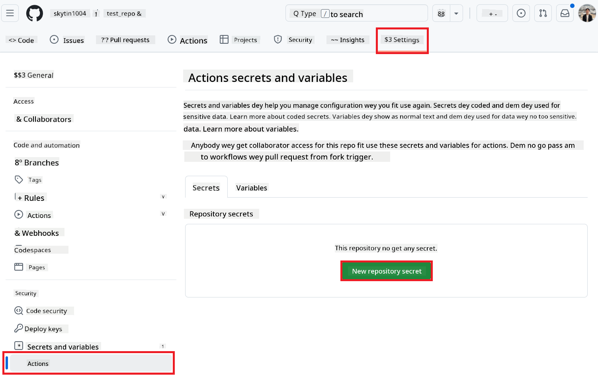

<!--
CO_OP_TRANSLATOR_METADATA:
{
  "original_hash": "9fac847815936ef6e6c8bfde6d191571",
  "translation_date": "2025-10-22T11:17:50+00:00",
  "source_file": "getting_started/github-actions-guide/github-actions-guide-org.md",
  "language_code": "pcm"
}
-->
# How to Use Co-op Translator GitHub Action (How Organization Fit Take Run Am)

**Who this guide dey for:** This guide na for **Microsoft people wey dey inside** or **teams wey get access to the correct credentials for the Co-op Translator GitHub App wey dem don already build** or fit create their own custom GitHub App.

You fit use Co-op Translator GitHub Action to make your repo dey translate your documentation by itself. This guide go show you how you fit set am up so e go dey create pull request with new translations any time your main Markdown files or images change.

> [!IMPORTANT]
> 
> **How to Know Which Guide You Go Use:**
>
> This guide dey show how to set up with **GitHub App ID and Private Key**. You go need this "Organization Guide" if: **`GITHUB_TOKEN` Permission dey Tight:** If your org or repo no gree the normal `GITHUB_TOKEN` get the correct `write` permission (like `contents: write` or `pull-requests: write`), the workflow wey dey the [Public Setup Guide](./github-actions-guide-public.md) no go work because e no go get enough permission. If you use GitHub App wey get the correct permission, you go fit run am without wahala.
>
> **If this one no concern you:**
>
> If your normal `GITHUB_TOKEN` get the correct permission for your repo (your org no block am), abeg use the **[Public Setup Guide wey dey use GITHUB_TOKEN](./github-actions-guide-public.md)**. That public guide no need App ID or Private Key, na just the normal `GITHUB_TOKEN` and repo permission e dey use.

## Wetin You Go Need Before You Start

Before you fit set up the GitHub Action, make sure say you get the correct AI service credentials.

**1. You Must Get: AI Language Model Credentials**
You need credentials for at least one Language Model wey we support:

- **Azure OpenAI**: You go need Endpoint, API Key, Model/Deployment Names, API Version.
- **OpenAI**: You go need API Key, (Optional: Org ID, Base URL, Model ID).
- Check [Supported Models and Services](../../../../README.md) for more info.
- Setup Guide: [How to Set up Azure OpenAI](../set-up-resources/set-up-azure-openai.md).

**2. If You Wan Translate Text Inside Image: Computer Vision Credentials**

- You only need this one if you wan make e dey translate text wey dey inside image.
- **Azure Computer Vision**: You go need Endpoint and Subscription Key.
- If you no put am, the action go just dey [Markdown-only mode](../markdown-only-mode.md).
- Setup Guide: [How to Set up Azure Computer Vision](../set-up-resources/set-up-azure-computer-vision.md).

## How to Set Up and Arrange Everything

Follow these steps to set up Co-op Translator GitHub Action for your repo:

### Step 1: Install and Arrange GitHub App Authentication

The workflow dey use GitHub App authentication to fit do things for your repo (like create pull request) on your behalf. Pick one option:

#### **Option A: Install the Co-op Translator GitHub App wey dem don already build (For Microsoft People Only)**

1. Go the [Co-op Translator GitHub App](https://github.com/apps/co-op-translator) page.

1. Click **Install** and pick the account or org wey get the repo wey you wan use.

    

1. Pick **Only select repositories** then choose your repo (like `PhiCookBook`). Click **Install**. Dem fit ask you to log in.

    

1. **Collect App Credentials (You go need do internal process):** To make the workflow fit log in as the app, you need two things wey Co-op Translator team go give you:
  - **App ID:** The special number for the Co-op Translator app. The App ID na: `1164076`.
  - **Private Key:** You must collect the **full content** of the `.pem` private key file from the person wey dey maintain am. **Hold this key like password, no let am leak.**

1. Move go Step 2.

#### **Option B: Use Your Own Custom GitHub App**

- If you like, you fit create your own GitHub App. Make sure say e get Read & write access to Contents and Pull requests. You go need the App ID and the Private Key wey you generate.

### Step 2: Put Your Secrets for Repo

You need to add the GitHub App credentials and your AI service credentials as secret for your repo settings.

1. Go your repo (like `PhiCookBook`).

1. Go **Settings** > **Secrets and variables** > **Actions**.

1. Under **Repository secrets**, click **New repository secret** for each secret wey dey below.

   

**Secrets wey you must put (for GitHub App Authentication):**

| Secret Name          | Wetin E Mean                                      | Where You Go Get Am                                     |
| :------------------- | :----------------------------------------------- | :----------------------------------------------- |
| `GH_APP_ID`          | The App ID of the GitHub App (from Step 1).      | GitHub App Settings                              |
| `GH_APP_PRIVATE_KEY` | The **full content** of the `.pem` file. | `.pem` file (from Step 1)                      |

**AI Service Secrets (Put ALL wey concern you from Wetin You Need Above):**

| Secret Name                         | Wetin E Mean                               | Where You Go Get Am                     |
| :---------------------------------- | :---------------------------------------- | :------------------------------- |
| `AZURE_AI_SERVICE_API_KEY`            | Key for Azure AI Service (Computer Vision)  | Azure AI Foundry                    |
| `AZURE_AI_SERVICE_ENDPOINT`         | Endpoint for Azure AI Service (Computer Vision) | Azure AI Foundry                     |
| `AZURE_OPENAI_API_KEY`              | Key for Azure OpenAI service              | Azure AI Foundry                     |
| `AZURE_OPENAI_ENDPOINT`             | Endpoint for Azure OpenAI service         | Azure AI Foundry                     |
| `AZURE_OPENAI_MODEL_NAME`           | Your Azure OpenAI Model Name              | Azure AI Foundry                     |
| `AZURE_OPENAI_CHAT_DEPLOYMENT_NAME` | Your Azure OpenAI Deployment Name         | Azure AI Foundry                     |
| `AZURE_OPENAI_API_VERSION`          | API Version for Azure OpenAI              | Azure AI Foundry                     |
| `OPENAI_API_KEY`                    | API Key for OpenAI                        | OpenAI Platform                  |
| `OPENAI_ORG_ID`                     | OpenAI Organization ID                    | OpenAI Platform                  |
| `OPENAI_CHAT_MODEL_ID`              | Specific OpenAI model ID                  | OpenAI Platform                    |
| `OPENAI_BASE_URL`                   | Custom OpenAI API Base URL                | OpenAI Platform                    |


### Step 3: Create the Workflow File

Last last, create the YAML file wey go define the workflow.

1. For the main folder of your repo, create `.github/workflows/` if e never dey.

1. Inside `.github/workflows/`, create file wey you go name `co-op-translator.yml`.

1. Copy and paste the code below inside co-op-translator.yml.

```
name: Co-op Translator

on:
  push:
    branches:
      - main

jobs:
  co-op-translator:
    runs-on: ubuntu-latest

    permissions:
      contents: write
      pull-requests: write

    steps:
      - name: Checkout repository
        uses: actions/checkout@v4
        with:
          fetch-depth: 0

      - name: Set up Python
        uses: actions/setup-python@v4
        with:
          python-version: '3.10'

      - name: Install Co-op Translator
        run: |
          python -m pip install --upgrade pip
          pip install co-op-translator

      - name: Run Co-op Translator
        env:
          PYTHONIOENCODING: utf-8
          # Azure AI Service Credentials
          AZURE_AI_SERVICE_API_KEY: ${{ secrets.AZURE_AI_SERVICE_API_KEY }}
          AZURE_AI_SERVICE_ENDPOINT: ${{ secrets.AZURE_AI_SERVICE_ENDPOINT }}

          # Azure OpenAI Credentials
          AZURE_OPENAI_API_KEY: ${{ secrets.AZURE_OPENAI_API_KEY }}
          AZURE_OPENAI_ENDPOINT: ${{ secrets.AZURE_OPENAI_ENDPOINT }}
          AZURE_OPENAI_MODEL_NAME: ${{ secrets.AZURE_OPENAI_MODEL_NAME }}
          AZURE_OPENAI_CHAT_DEPLOYMENT_NAME: ${{ secrets.AZURE_OPENAI_CHAT_DEPLOYMENT_NAME }}
          AZURE_OPENAI_API_VERSION: ${{ secrets.AZURE_OPENAI_API_VERSION }}

          # OpenAI Credentials
          OPENAI_API_KEY: ${{ secrets.OPENAI_API_KEY }}
          OPENAI_ORG_ID: ${{ secrets.OPENAI_ORG_ID }}
          OPENAI_CHAT_MODEL_ID: ${{ secrets.OPENAI_CHAT_MODEL_ID }}
          OPENAI_BASE_URL: ${{ secrets.OPENAI_BASE_URL }}
        run: |
          # =====================================================================
          # IMPORTANT: Set your target languages here (REQUIRED CONFIGURATION)
          # =====================================================================
          # Example: Translate to Spanish, French, German. Add -y to auto-confirm.
          translate -l "es fr de" -y  # <--- MODIFY THIS LINE with your desired languages

      - name: Authenticate GitHub App
        id: generate_token
        uses: tibdex/github-app-token@v1
        with:
          app_id: ${{ secrets.GH_APP_ID }}
          private_key: ${{ secrets.GH_APP_PRIVATE_KEY }}

      - name: Create Pull Request with translations
        uses: peter-evans/create-pull-request@v5
        with:
          token: ${{ steps.generate_token.outputs.token }}
          commit-message: "🌐 Update translations via Co-op Translator"
          title: "🌐 Update translations via Co-op Translator"
          body: |
            This PR updates translations for recent changes to the main branch.

            ### 📋 Changes included
            - Translated contents are available in the `translations/` directory
            - Translated images are available in the `translated_images/` directory

            ---
            🌐 Automatically generated by the [Co-op Translator](https://github.com/Azure/co-op-translator) GitHub Action.
          branch: update-translations
          base: main
          labels: translation, automated-pr
          delete-branch: true
          add-paths: |
            translations/
            translated_images/

```

4.  **Change the Workflow to Fit You:**
  - **[!IMPORTANT] Target Languages:** For the `Run Co-op Translator` step, you **MUST check and change the language codes** inside the `translate -l "..." -y` command to the ones wey your project need. The example list (`ar de es...`) na just sample, change am to your own.
  - **Trigger (`on:`):** The way e dey now, e go run any time you push to `main`. If your repo big, you fit add `paths:` filter (see the example wey dem comment for the YAML) so e go only run when the correct files (like your docs) change, to save your runner minutes.
  - **PR Details:** If you wan, fit change the `commit-message`, `title`, `body`, `branch` name, and `labels` for the `Create Pull Request` step.

## How to Manage and Renew Your Credentials

- **Security:** Always put your sensitive credentials (API keys, private keys) as GitHub Actions secrets. No ever put am for your workflow file or repo code.
- **[!IMPORTANT] Key Renewal (For Microsoft People):** Know say Azure OpenAI key wey you dey use for Microsoft fit get rule say you must renew am (like every 5 months). Make sure say you update the correct GitHub secrets (`AZURE_OPENAI_...` keys) **before e expire** so workflow no go fail.

## How the Workflow Dey Run

> [!WARNING]  
> **GitHub-hosted Runner Time Limit:**  
> GitHub-hosted runners like `ubuntu-latest` get **maximum time of 6 hours**.  
> If your documentation plenty, and translation pass 6 hours, workflow go stop by itself.  
> To avoid wahala:  
> - Use **self-hosted runner** (no time limit)  
> - Or reduce the number of languages wey you dey translate at once

Once you don merge the `co-op-translator.yml` file enter your main branch (or the branch wey you set for the `on:` trigger), the workflow go dey run by itself any time you push change to that branch (and e match the `paths` filter, if you set am).

If e generate or update translations, the action go create Pull Request with the changes, ready for you to check and merge.

---

**Disclaimer**:
Na AI translation service wey dem dey call [Co-op Translator](https://github.com/Azure/co-op-translator) we use take translate this document. Even though we try make the translation correct, abeg make you sabi say machine fit make mistake or no translate am well. Na the original document for the main language be the correct one wey you suppose follow. If the information dey important, abeg use professional human translator. We no go fit hold any responsibility for wahala wey fit happen because of how this translation take be.