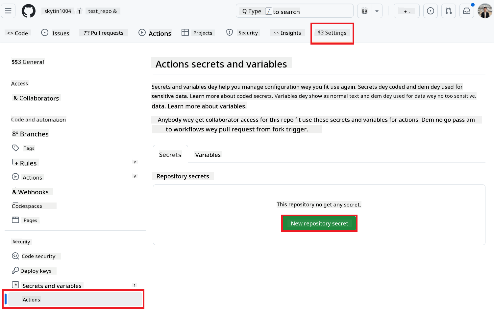
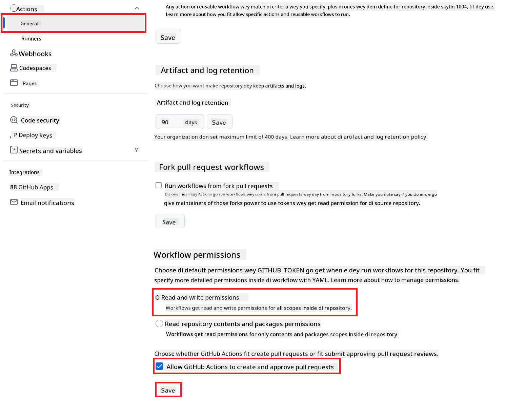

<!--
CO_OP_TRANSLATOR_METADATA:
{
  "original_hash": "527ca4d0a8d3f51087ec3317279e36ee",
  "translation_date": "2025-10-22T11:18:12+00:00",
  "source_file": "getting_started/github-actions-guide/github-actions-guide-public.md",
  "language_code": "pcm"
}
-->
# How to Use Co-op Translator GitHub Action (Public Setup)

**Who fit use am:** Dis guide na for people wey dey use public or private repo wey normal GitHub Actions permission dey okay. E dey use the built-in `GITHUB_TOKEN`.

You fit use Co-op Translator GitHub Action to translate your repo documentation without wahala. Dis guide go show you how you go set am so e go dey create pull request with new translation anytime your main Markdown files or images change.

> [!IMPORTANT]
>
> **How to Choose Correct Guide:**
>
> Dis guide na the easy way wey dey use the normal `GITHUB_TOKEN`. Na the best way for most people because e no need make you dey manage GitHub App Private Key.
>

## Wetin You Need Before You Start

Before you set up the GitHub Action, make sure say you get the AI service credentials wey you go need.

**1. Must Get: AI Language Model Credentials**
You need credentials for at least one Language Model wey dem support:

- **Azure OpenAI**: You go need Endpoint, API Key, Model/Deployment Names, API Version.
- **OpenAI**: You go need API Key, (Optional: Org ID, Base URL, Model ID).
- Check [Supported Models and Services](../../../../README.md) for more info.

**2. Optional: AI Vision Credentials (for Image Translation)**

- You need am only if you wan translate text wey dey inside image.
- **Azure AI Vision**: You go need Endpoint and Subscription Key.
- If you no put am, the action go just run [Markdown-only mode](../markdown-only-mode.md).

## How to Set Up Everything

Follow these steps to set Co-op Translator GitHub Action for your repo with the normal `GITHUB_TOKEN`.

### Step 1: Know How Authentication Work (Using `GITHUB_TOKEN`)

This workflow dey use the built-in `GITHUB_TOKEN` wey GitHub Actions dey provide. The token dey give the workflow permission to do things for your repo based on the settings wey you go set for **Step 3**.

### Step 2: Put Your Repository Secrets

You just need to add your **AI service credentials** as secret for your repo settings.

1.  Go your GitHub repo wey you wan use.
2.  Click **Settings** > **Secrets and variables** > **Actions**.
3.  For **Repository secrets**, click **New repository secret** for each AI service secret wey you need.

     *(Image Reference: Where you go add secrets)*

**AI Service Secrets wey you fit need (Add ALL wey concern you):**

| Secret Name                         | Wetin E Mean                               | Where You Go Get Am                     |
| :---------------------------------- | :---------------------------------------- | :------------------------------- |
| `AZURE_AI_SERVICE_API_KEY`            | Key for Azure AI Service (Computer Vision)  | Your Azure AI Foundry               |
| `AZURE_AI_SERVICE_ENDPOINT`         | Endpoint for Azure AI Service (Computer Vision) | Your Azure AI Foundry               |
| `AZURE_OPENAI_API_KEY`              | Key for Azure OpenAI service              | Your Azure AI Foundry               |
| `AZURE_OPENAI_ENDPOINT`             | Endpoint for Azure OpenAI service         | Your Azure AI Foundry               |
| `AZURE_OPENAI_MODEL_NAME`           | Your Azure OpenAI Model Name              | Your Azure AI Foundry               |
| `AZURE_OPENAI_CHAT_DEPLOYMENT_NAME` | Your Azure OpenAI Deployment Name         | Your Azure AI Foundry               |
| `AZURE_OPENAI_API_VERSION`          | API Version for Azure OpenAI              | Your Azure AI Foundry               |
| `OPENAI_API_KEY`                    | API Key for OpenAI                        | Your OpenAI Platform              |
| `OPENAI_ORG_ID`                     | OpenAI Organization ID (Optional)         | Your OpenAI Platform              |
| `OPENAI_CHAT_MODEL_ID`              | Specific OpenAI model ID (Optional)       | Your OpenAI Platform              |
| `OPENAI_BASE_URL`                   | Custom OpenAI API Base URL (Optional)     | Your OpenAI Platform              |

### Step 3: Set Workflow Permissions

The GitHub Action need permission through `GITHUB_TOKEN` to fit check out code and create pull request.

1.  For your repo, go **Settings** > **Actions** > **General**.
2.  Scroll reach **Workflow permissions**.
3.  Choose **Read and write permissions**. This one go give `GITHUB_TOKEN` the `contents: write` and `pull-requests: write` permission wey e need.
4.  Make sure say you tick the box for **Allow GitHub Actions to create and approve pull requests**.
5.  Click **Save**.



### Step 4: Create the Workflow File

Last last, create the YAML file wey go define the workflow wey go use `GITHUB_TOKEN`.

1.  For the root folder of your repo, create `.github/workflows/` if e never dey.
2.  Inside `.github/workflows/`, create file wey you go name `co-op-translator.yml`.
3.  Copy and paste the content below inside `co-op-translator.yml`.

```yaml
name: Co-op Translator

on:
  push:
    branches:
      - main

jobs:
  co-op-translator:
    runs-on: ubuntu-latest

    permissions:
      contents: write
      pull-requests: write

    steps:
      - name: Checkout repository
        uses: actions/checkout@v4
        with:
          fetch-depth: 0

      - name: Set up Python
        uses: actions/setup-python@v4
        with:
          python-version: '3.10'

      - name: Install Co-op Translator
        run: |
          python -m pip install --upgrade pip
          pip install co-op-translator

      - name: Run Co-op Translator
        env:
          PYTHONIOENCODING: utf-8
          # === AI Service Credentials ===
          AZURE_AI_SERVICE_API_KEY: ${{ secrets.AZURE_AI_SERVICE_API_KEY }}
          AZURE_AI_SERVICE_ENDPOINT: ${{ secrets.AZURE_AI_SERVICE_ENDPOINT }}
          AZURE_OPENAI_API_KEY: ${{ secrets.AZURE_OPENAI_API_KEY }}
          AZURE_OPENAI_ENDPOINT: ${{ secrets.AZURE_OPENAI_ENDPOINT }}
          AZURE_OPENAI_MODEL_NAME: ${{ secrets.AZURE_OPENAI_MODEL_NAME }}
          AZURE_OPENAI_CHAT_DEPLOYMENT_NAME: ${{ secrets.AZURE_OPENAI_CHAT_DEPLOYMENT_NAME }}
          AZURE_OPENAI_API_VERSION: ${{ secrets.AZURE_OPENAI_API_VERSION }}
          OPENAI_API_KEY: ${{ secrets.OPENAI_API_KEY }}
          OPENAI_ORG_ID: ${{ secrets.OPENAI_ORG_ID }}
          OPENAI_CHAT_MODEL_ID: ${{ secrets.OPENAI_CHAT_MODEL_ID }}
          OPENAI_BASE_URL: ${{ secrets.OPENAI_BASE_URL }}
        run: |
          # =====================================================================
          # IMPORTANT: Set your target languages here (REQUIRED CONFIGURATION)
          # =====================================================================
          # Example: Translate to Spanish, French, German. Add -y to auto-confirm.
          translate -l "es fr de" -y  # <--- MODIFY THIS LINE with your desired languages

      - name: Create Pull Request with translations
        uses: peter-evans/create-pull-request@v5
        with:
          token: ${{ secrets.GITHUB_TOKEN }}
          commit-message: "🌐 Update translations via Co-op Translator"
          title: "🌐 Update translations via Co-op Translator"
          body: |
            This PR updates translations for recent changes to the main branch.

            ### 📋 Changes included
            - Translated contents are available in the `translations/` directory
            - Translated images are available in the `translated_images/` directory

            ---
            🌐 Automatically generated by the [Co-op Translator](https://github.com/Azure/co-op-translator) GitHub Action.
          branch: update-translations
          base: main
          labels: translation, automated-pr
          delete-branch: true
          add-paths: |
            translations/
            translated_images/
```
4.  **Make the Workflow Your Own:**
  - **[!IMPORTANT] Target Languages:** For the `Run Co-op Translator` step, you **MUST check and change the language codes** inside the `translate -l "..." -y` command to the ones wey your project need. The example wey dey (`ar de es...`) na just sample, change am as you want.
  - **Trigger (`on:`):** The workflow dey run anytime you push to `main`. If your repo big, you fit add `paths:` filter (see the comment for the YAML) so e go run only when the files wey concern you change, to save runner minutes.
  - **PR Details:** You fit change the `commit-message`, `title`, `body`, `branch` name, and `labels` for the `Create Pull Request` step if you want.

## How the Workflow Dey Run

> [!WARNING]  
> **GitHub-hosted Runner Time Limit:**  
> GitHub-hosted runners like `ubuntu-latest` fit run for **maximum 6 hours**.  
> If your documentation plenty and translation pass 6 hours, the workflow go stop by itself.  
> To avoid wahala:  
> - Use **self-hosted runner** (no time limit)  
> - Reduce the number of target languages for each run

Once you merge the `co-op-translator.yml` file enter your main branch (or the branch wey you set for the `on:` trigger), the workflow go dey run by itself anytime you push change to that branch (and e match the `paths` filter if you set am).

---

**Disclaimer**:
Na AI translation service wey dem dey call [Co-op Translator](https://github.com/Azure/co-op-translator) we use take translate dis document. Even though we try make am correct, abeg make you sabi say AI fit make mistake or fit no too correct sometimes. Na the original document for the main language be the correct one wey you suppose follow. If the matter serious, abeg use professional human translator. We no go fit hold any wahala wey fit happen because of how you take use this translation.