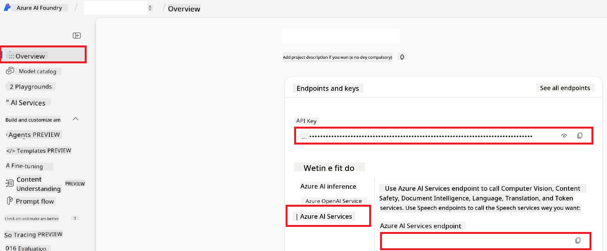

<!--
CO_OP_TRANSLATOR_METADATA:
{
  "original_hash": "b58d7c3cb4210697a073d20eb3064945",
  "translation_date": "2025-10-22T11:16:12+00:00",
  "source_file": "getting_started/set-up-azure-ai.md",
  "language_code": "pcm"
}
-->
# How You Go Take Set Up Azure AI for Co-op Translator (Azure OpneAI & Azure AI Vision)

Dis guide go show you how you go take set up Azure OpenAI for language translation and Azure Computer Vision for image content analysis (wey you fit use do image-based translation) inside Azure AI Foundry.

**Wetin you need before you start:**
- You need get Azure account wey get active subscription.
- You suppose get permission wey go allow you create resources and deployments for your Azure subscription.

## How You Go Take Create Azure AI Project

You go first create Azure AI Project, na here you go dey manage all your AI resources.

1. Go [https://ai.azure.com](https://ai.azure.com) and log in with your Azure account.

1. Click **+Create** to start new project.

1. Do these things:
   - Put **Project name** (like `CoopTranslator-Project`).
   - Choose **AI hub**  (like `CoopTranslator-Hub`) (If you never get, create new one).

1. Click "**Review and Create**" to finish your project setup. Dem go carry you go the project overview page.

## How You Go Take Set up Azure OpenAI for Language Translation

Inside your project, you go deploy Azure OpenAI model wey go work as backend for text translation.

### How You Go Take Enter Your Project

If you never dey there, open the project wey you just create (like `CoopTranslator-Project`) for Azure AI Foundry.

### How You Go Take Deploy OpenAI Model

1. For your project left-hand menu, under "My assets", click "**Models + endpoints**".

1. Click **+ Deploy model**.

1. Click **Deploy Base Model**.

1. Dem go show you list of models wey dey. Use filter or search find the GPT model wey you want. We dey recommend `gpt-4o`.

1. Choose the model wey you want, then click **Confirm**.

1. Click **Deploy**.

### Azure OpenAI configuration

After you don deploy am, you fit select the deployment from "**Models + endpoints**" page to see the **REST endpoint URL**, **Key**, **Deployment name**, **Model name** and **API version**. You go need all these to connect the translation model to your app.

> [!NOTE]
> You fit choose API versions from [API version deprecation](https://learn.microsoft.com/azure/ai-services/openai/api-version-deprecation) page based on wetin you need. Make you sabi say **API version** different from **Model version** wey you dey see for **Models + endpoints** page for Azure AI Foundry.

## How You Go Take Set up Azure Computer Vision for Image Translation

If you wan translate text wey dey inside image, you need find Azure AI Service API Key and Endpoint.

1. Go your Azure AI Project (like `CoopTranslator-Project`). Make sure say you dey for the project overview page.

### Azure AI Service configuration

Find the API Key and Endpoint from Azure AI Service.

1. Go your Azure AI Project (like `CoopTranslator-Project`). Make sure say you dey for the project overview page.

1. Find **API Key** and **Endpoint** for Azure AI Service tab.

    

Na this connection go make the Azure AI Services resource (including image analysis) dey available for your AI Foundry project. You fit use am for your notebook or app to extract text from image, then send am go Azure OpenAI model to translate.

## How You Go Take Gather All Your Credentials

By now, you suppose don get these ones:

**For Azure OpenAI (Text Translation):**
- Azure OpenAI Endpoint
- Azure OpenAI API Key
- Azure OpenAI Model Name (like `gpt-4o`)
- Azure OpenAI Deployment Name (like `cooptranslator-gpt4o`)
- Azure OpenAI API Version

**For Azure AI Services (Image Text Extraction via Vision):**
- Azure AI Service Endpoint
- Azure AI Service API Key

### Example: How You Fit Set Environment Variable (Preview)

When you wan build your app later, you go use all these credentials. For example, you fit set them as environment variables like this:

```bash
# Azure AI Service Credentials (Required for image translation)
AZURE_AI_SERVICE_API_KEY="your_azure_ai_service_api_key" # e.g., 21xasd...
AZURE_AI_SERVICE_ENDPOINT="https://your_azure_ai_service_endpoint.cognitiveservices.azure.com/"

# Azure OpenAI Credentials (Required for text translation)
AZURE_OPENAI_API_KEY="your_azure_openai_api_key" # e.g., 21xasd...
AZURE_OPENAI_ENDPOINT="https://your_azure_openai_endpoint.openai.azure.com/"
AZURE_OPENAI_MODEL_NAME="your_model_name" # e.g., gpt-4o
AZURE_OPENAI_CHAT_DEPLOYMENT_NAME="your_deployment_name" # e.g., cooptranslator-gpt4o
AZURE_OPENAI_API_VERSION="your_api_version" # e.g., 2024-12-01-preview
```

---

### Make You Read More

- [How you fit create project for Azure AI Foundry](https://learn.microsoft.com/azure/ai-foundry/how-to/create-projects?tabs=ai-studio)
- [How you fit create Azure AI resources](https://learn.microsoft.com/azure/ai-foundry/how-to/create-azure-ai-resource?tabs=portal)
- [How you fit deploy OpenAI models for Azure AI Foundry](https://learn.microsoft.com/en-us/azure/ai-foundry/how-to/deploy-models-openai)

---

**Disclaimer**:
Na AI translation service wey dem dey call [Co-op Translator](https://github.com/Azure/co-op-translator) we use take translate dis document. Even though we try make e correct, abeg make you sabi say AI fit make mistake or fit no too accurate. Na the original document for the main language be the correct one wey you suppose follow. If the info dey very important, abeg use professional human translation. We no go fit hold any responsibility for wahala wey fit happen because of how you take use this translation.