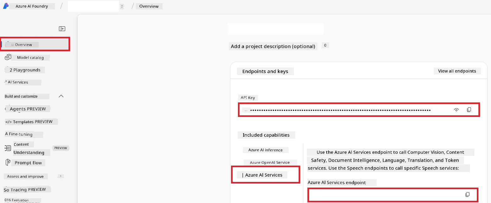

# Set Up Azure AI for Co-op Translator (Azure OpneAI & Azure AI Vision)

Dis guide go show you how to set up Azure OpenAI for language translation and Azure Computer Vision for image content analysis (wey fit den be used for image-based translation) inside Azure AI Foundry.

**Wetin you need before:**
- Azure account wey get active subscription.
- Correct permissions to fit create resources and deployments inside your Azure subscription.

## Create Azure AI Project

You go start by creating Azure AI Project, wey go be one central place for to manage your AI resources.

1. Go [https://ai.azure.com](https://ai.azure.com) and sign in with your Azure account.

1. Click **+Create** to create new project.

1. Do dis:
   - Put **Project name** (e.g., `CoopTranslator-Project`).
   - Choose the **AI hub** (e.g., `CoopTranslator-Hub`) (Create new if you no get).

1. Click "**Review and Create**" make you set your project. E go take you go your project overview page.

## Set up Azure OpenAI for Language Translation

Inside your project, you go deploy Azure OpenAI model dat go serve as backend for text translation.

### Enter Your Project

If you never dey inside, open your new project (e.g., `CoopTranslator-Project`) for Azure AI Foundry.

### Deploy OpenAI Model

1. For your project left menu, under "My assets", choose "**Models + endpoints**".

1. Click **+ Deploy model**.

1. Choose **Deploy Base Model**.

1. You go see list of available models. Filter or search correct GPT model. We recommend `gpt-4o`.

1. Choose your model then click **Confirm**.

1. Click **Deploy**.

### Azure OpenAI configuration

When you don deploy am, you fit select the deployment from "**Models + endpoints**" page for find **REST endpoint URL**, **Key**, **Deployment name**, **Model name** and **API version**. You go need dem to join the translation model into your app.

> [!NOTE]
> You fit choose API versions from [API version deprecation](https://learn.microsoft.com/azure/ai-services/openai/api-version-deprecation) page based on wetin you need. Know say **API version** different from **Model version** wey show for **Models + endpoints** page for Azure AI Foundry.

## Set up Azure Computer Vision for Image Translation

To fit translate text wey dey inside images, you need find Azure AI Service API Key and Endpoint.

1. Go your Azure AI Project (e.g., `CoopTranslator-Project`). Make sure say you dey project overview page.

### Azure AI Service configuration

Find API Key and Endpoint from Azure AI Service.

1. Go your Azure AI Project (e.g., `CoopTranslator-Project`). Make sure say you dey project overview page.

1. Find **API Key** and **Endpoint** for Azure AI Service tab.

    

Dis connection make linked Azure AI Services resource capabilities (including image analyse) available for your AI Foundry project. You fit use dis connection for your notebooks or apps to commot text from images, wey fit later go Azure OpenAI model for translation.

## Gather Your Credentials Together

By dis time, you suppose don get these:

**For Azure OpenAI (Text Translation):**
- Azure OpenAI Endpoint
- Azure OpenAI API Key
- Azure OpenAI Model Name (e.g., `gpt-4o`)
- Azure OpenAI Deployment Name (e.g., `cooptranslator-gpt4o`)
- Azure OpenAI API Version

**For Azure AI Services (Image Text Extraction via Vision):**
- Azure AI Service Endpoint
- Azure AI Service API Key

### Example: Environment Variable Configuration (Preview)

Later, when you dey build your app, you go likely configure using dis credentials. For example, you fit set am as environment variables like dis:

```bash
# Azure AI Service Credentials (We need am to translate picture dem)
AZURE_AI_SERVICE_API_KEY="your_azure_ai_service_api_key" # e.g., 21xasd...
AZURE_AI_SERVICE_ENDPOINT="https://your_azure_ai_service_endpoint.cognitiveservices.azure.com/"

# Optional fallback sets: repeat same variable with suffix _1/_2 (all variables for dat set get same number)
AZURE_AI_SERVICE_API_KEY_1="your_azure_ai_service_api_key_1"
AZURE_AI_SERVICE_ENDPOINT_1="https://your_azure_ai_service_endpoint_1.cognitiveservices.azure.com/"

# Azure OpenAI Credentials (We need am to translate text)
AZURE_OPENAI_API_KEY="your_azure_openai_api_key" # e.g., 21xasd...
AZURE_OPENAI_ENDPOINT="https://your_azure_openai_endpoint.openai.azure.com/"
AZURE_OPENAI_MODEL_NAME="your_model_name" # e.g., gpt-4o
AZURE_OPENAI_CHAT_DEPLOYMENT_NAME="your_deployment_name" # e.g., cooptranslator-gpt4o
AZURE_OPENAI_API_VERSION="your_api_version" # e.g., 2024-12-01-preview

# Optional fallback sets: repeat all AZURE_OPENAI_* variables with suffix _1/_2 (make sure all variables get the same number)
```

---

### More Reading

- [How to Create a project in Azure AI Foundry](https://learn.microsoft.com/azure/ai-foundry/how-to/create-projects?tabs=ai-studio)
- [How to Create Azure AI resources](https://learn.microsoft.com/azure/ai-foundry/how-to/create-azure-ai-resource?tabs=portal)
- [How to Deploy OpenAI models in Azure AI Foundry](https://learn.microsoft.com/en-us/azure/ai-foundry/how-to/deploy-models-openai)

---

<!-- CO-OP TRANSLATOR DISCLAIMER START -->
**Disclaimer**:  
Dis document don translate wit AI translation service [Co-op Translator](https://github.com/Azure/co-op-translator). Even as we dey try make e correct, abeg sabi say automated translation fit get errors or wahala. Di original document wey dey im normal language na di correct source. For important matter, make you use professional human translation. We no go responsible for any wahala or wrong understanding wey fit happen because of dis translation.
<!-- CO-OP TRANSLATOR DISCLAIMER END -->