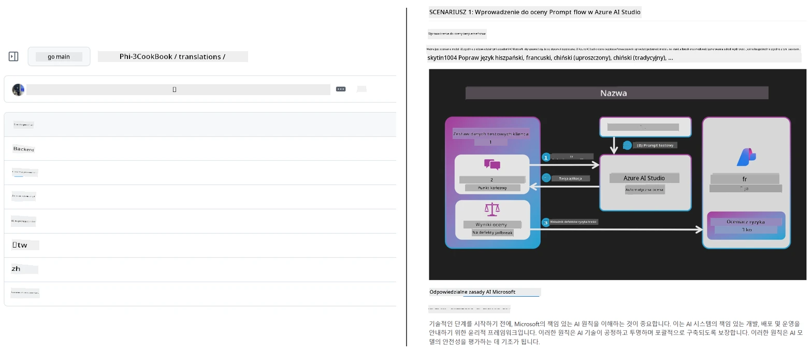

# Co-op Translator

_Łatwo automatyzuj i utrzymuj tłumaczenia swojego edukacyjnego contentu na GitHubie w wielu językach w miarę rozwoju projektu._


[](https://pypi.org/project/co-op-translator/)
[](https://github.com/azure/co-op-translator/blob/main/LICENSE)
[](https://pepy.tech/project/co-op-translator)
[](https://pepy.tech/project/co-op-translator)
[](https://github.com/azure/co-op-translator/pkgs/container/co-op-translator)
[](https://github.com/psf/black)

[](https://GitHub.com/azure/co-op-translator/graphs/contributors/)
[](https://GitHub.com/azure/co-op-translator/issues/)
[](https://GitHub.com/azure/co-op-translator/pulls/)
[](http://makeapullrequest.com)

### 🌐 Wsparcie wielojęzyczne

#### Wspierane przez [Co-op Translator](https://github.com/Azure/Co-op-Translator)

<!-- CO-OP TRANSLATOR LANGUAGES TABLE START -->
[Arabski](../ar/README.md) | [Bengalski](../bn/README.md) | [Bułgarski](../bg/README.md) | [Birmański (Myanmar)](../my/README.md) | [Chiński (uproszczony)](../zh-CN/README.md) | [Chiński (tradycyjny, Hongkong)](../zh-HK/README.md) | [Chiński (tradycyjny, Makau)](../zh-MO/README.md) | [Chiński (tradycyjny, Tajwan)](../zh-TW/README.md) | [Chorwacki](../hr/README.md) | [Czeski](../cs/README.md) | [Duński](../da/README.md) | [Niderlandzki](../nl/README.md) | [Estoński](../et/README.md) | [Fiński](../fi/README.md) | [Francuski](../fr/README.md) | [Niemiecki](../de/README.md) | [Grecki](../el/README.md) | [Hebrajski](../he/README.md) | [Hindi](../hi/README.md) | [Węgierski](../hu/README.md) | [Indonezyjski](../id/README.md) | [Włoski](../it/README.md) | [Japoński](../ja/README.md) | [Kannada](../kn/README.md) | [Khme</','r](../km/README.md) | [Koreański](../ko/README.md) | [Litewski](../lt/README.md) | [Malajski](../ms/README.md) | [Malajalam](../ml/README.md) | [Marathi](../mr/README.md) | [Nepalski](../ne/README.md) | [Nigeryjski Pidgin](../pcm/README.md) | [Norweski](../no/README.md) | [Perski (Farsi)](../fa/README.md) | [Polski](./README.md) | [Portugalski (Brazylia)](../pt-BR/README.md) | [Portugalski (Portugalia)](../pt-PT/README.md) | [Pendżabski (Gurmukhi)](../pa/README.md) | [Rumuński](../ro/README.md) | [Rosyjski](../ru/README.md) | [Serbski (cyrylica)](../sr/README.md) | [Słowacki](../sk/README.md) | [Słoweński](../sl/README.md) | [Hiszpański](../es/README.md) | [Suahili](../sw/README.md) | [Szwedzki](../sv/README.md) | [Tagalog (Filipiński)](../tl/README.md) | [Tamilski](../ta/README.md) | [Telugu](../te/README.md) | [Tajski](../th/README.md) | [Turecki](../tr/README.md) | [Ukraiński](../uk/README.md) | [Urdu](../ur/README.md) | [Wietnamski](../vi/README.md)

> **Wolisz klonować lokalnie?**
>
> To repozytorium zawiera tłumaczenia na ponad 50 języków, co znacznie zwiększa wielkość pobierania. Aby sklonować bez tłumaczeń, użyj sparse checkout:
>
> **Bash / macOS / Linux:**
> ```bash
> git clone --filter=blob:none --sparse https://github.com/skytin1004/co-op-translator.git
> cd co-op-translator
> git sparse-checkout set --no-cone '/*' '!translations' '!translated_images'
> ```
>
> **CMD (Windows):**
> ```cmd
> git clone --filter=blob:none --sparse https://github.com/skytin1004/co-op-translator.git
> cd co-op-translator
> git sparse-checkout set --no-cone "/*" "!translations" "!translated_images"
> ```
>
> To zapewnia wszystko, czego potrzebujesz, aby ukończyć kurs, przy znacznie szybszym pobieraniu.
<!-- CO-OP TRANSLATOR LANGUAGES TABLE END -->

[](https://GitHub.com/azure/co-op-translator/watchers/)
[](https://GitHub.com/azure/co-op-translator/network/)
[](https://GitHub.com/azure/co-op-translator/stargazers/)

[](https://discord.gg/nTYy5BXMWG)

[](https://codespaces.new/azure/co-op-translator)

## Przegląd

**Co-op Translator** pomaga Ci łatwo lokalizować edukacyjny content na GitHubie na wiele języków.  
Gdy aktualizujesz pliki Markdown, obrazy lub notatniki, tłumaczenia pozostają automatycznie zsynchronizowane, zapewniając, że Twój content pozostaje dokładny i aktualny dla uczących się na całym świecie.

Przykład organizacji przetłumaczonej zawartości:



## Jak zarządzany jest stan tłumaczenia

Co-op Translator zarządza przetłumaczonym contentem jako **werjonowanymi artefaktami oprogramowania**,  
a nie jako plikami statycznymi.

Narzędzie śledzi stan przetłumaczonego Markdown, obrazów i notatników  
używając **metadanych z zakresem językowym**.

To podejście pozwala Co-op Translator na:

- Niezawodne wykrywanie nieaktualnych tłumaczeń
- Spójne traktowanie Markdown, obrazów i notatników  
- Bezpieczne skalowanie w dużych, szybko zmieniających się, wielojęzycznych repozytoriach

Modelując tłumaczenia jako zarządzane artefakty,  
workflow tłumaczeniowe naturalnie dopasowują się do nowoczesnych  
praktyk zarządzania zależnościami i artefaktami oprogramowania.

→ [Jak zarządzany jest stan tłumaczenia](https://techcommunity.microsoft.com/blog/azuredevcommunityblog/rethinking-documentation-translation-treating-translations-as-versioned-software/4491755)


## Szybki start

```bash
# Utwórz i aktywuj środowisko wirtualne (zalecane)
python -m venv .venv
# Windows
.venv\Scripts\activate
# macOS/Linux
source .venv/bin/activate
# Zainstaluj pakiet
pip install co-op-translator
# Przetłumacz
translate -l "ko ja fr" -md
```

Docker:

```bash
# Pobierz publiczny obraz z GHCR
docker pull ghcr.io/azure/co-op-translator:latest
# Uruchom z zamontowanym bieżącym folderem i dostarczonym plikiem .env (Bash/Zsh)
docker run --rm -it --env-file .env -v "${PWD}:/work" ghcr.io/azure/co-op-translator:latest -l "ko ja fr" -md
```

## Minimalna konfiguracja

1. Upewnij się, że masz obsługiwaną wersję Pythona (aktualnie 3.10–3.12). W poetry (pyproject.toml) jest to obsługiwane automatycznie.  
2. Utwórz plik `.env` korzystając z szablonu: [.env.template](../../.env.template)  
3. Skonfiguruj jednego dostawcę LLM (Azure OpenAI lub OpenAI)  
4. (Opcjonalnie) Dla tłumaczenia obrazów (`-img`) skonfiguruj Azure AI Vision  
5. (Opcjonalnie) Możesz skonfigurować wiele zestawów poświadczeń, duplikując zmienne z przyrostkami takimi jak `_1`, `_2` itd. Wszystkie zmienne w zestawie muszą mieć ten sam przyrostek.  
6. (Zalecane) Wyczyść poprzednie tłumaczenia, aby uniknąć konfliktów (np. `translations/`)  
7. (Zalecane) Dodaj sekcję tłumaczenia do swojego README korzystając z [README languages template](./getting_started/README_languages_template.md)  
8. Zobacz: [Set up Azure AI](./getting_started/set-up-azure-ai.md)

## Użytkowanie

Tłumacz wszystkie obsługiwane typy:

```bash
translate -l "ko ja"
```

Tylko Markdown:

```bash
translate -l "de" -md
```

Markdown + obrazy:

```bash
translate -l "pt" -md -img
```

Tylko notatniki:

```bash
translate -l "zh" -nb
```

Więcej flag: [Command reference](./getting_started/command-reference.md)

## Funkcje

- Automatyczne tłumaczenie Markdown, notatników i obrazów  
- Utrzymuje tłumaczenia zsynchronizowane ze zmianami źródłowymi  
- Działa lokalnie (CLI) lub w CI (GitHub Actions)  
- Korzysta z Azure OpenAI lub OpenAI; opcjonalnie Azure AI Vision dla obrazów  
- Zachowuje formatowanie i strukturę Markdown  

## Dokumentacja

- [Przewodnik po interfejsie wiersza poleceń](./getting_started/command-line-guide/command-line-guide.md)
- [Przewodnik GitHub Actions (repozytoria publiczne i standardowe sekrety)](./getting_started/github-actions-guide/github-actions-guide-public.md)
- [Przewodnik GitHub Actions (repozytoria organizacji Microsoft i konfiguracje na poziomie organizacji)](./getting_started/github-actions-guide/github-actions-guide-org.md)
- [Szablon sekcji języków w README](./getting_started/README_languages_template.md)
- [Obsługiwane języki](./getting_started/supported-languages.md)
- [Wkład w projekt](./CONTRIBUTING.md)
- [Rozwiązywanie problemów](./getting_started/troubleshooting.md)

### Przewodnik specyficzny dla Microsoft  
> [!NOTE]
> Tylko dla opiekunów repozytoriów „For Beginners” Microsoft.

- [Aktualizacja listy „other courses” (tylko repozytoria MS Beginners)](./getting_started/update-other-courses.md)

## Wesprzyj nas i wspieraj globalną naukę

Dołącz do nas w rewolucjonizowaniu udostępniania edukacyjnych treści na całym świecie! Daj [Co-op Translator](https://github.com/azure/co-op-translator) ⭐ na GitHubie i wspieraj naszą misję przełamywania barier językowych w nauce i technologii. Twoje zainteresowanie i wkład mają ogromne znaczenie! Kod, zgłoszenia i propozycje nowych funkcji są zawsze mile widziane.

### Odkrywaj edukacyjne treści Microsoft w swoim języku

- [LangChain4j-for-Beginners](https://github.com/microsoft/LangChain4j-for-Beginners)
- [AZD for Beginners](https://github.com/microsoft/AZD-for-beginners)
- [Edge AI for Beginners](https://github.com/microsoft/edgeai-for-beginners)
- [Model Context Protocol (MCP) For Beginners](https://github.com/microsoft/mcp-for-beginners)
- [AI Agents for Beginners](https://github.com/microsoft/ai-agents-for-beginners)
- [Generative AI for Beginners using .NET](https://github.com/microsoft/Generative-AI-for-beginners-dotnet)
- [Generative AI for Beginners](https://github.com/microsoft/generative-ai-for-beginners)
- [Generative AI for Beginners using Java](https://github.com/microsoft/generative-ai-for-beginners-java)
- [ML for Beginners](https://aka.ms/ml-beginners)
- [Data Science for Beginners](https://aka.ms/datascience-beginners)
- [AI for Beginners](https://aka.ms/ai-beginners)
- [Cybersecurity for Beginners](https://github.com/microsoft/Security-101)
- [Web Dev for Beginners](https://aka.ms/webdev-beginners)
- [IoT for Beginners](https://aka.ms/iot-beginners)
- [PhiCookBook](https://github.com/microsoft/PhiCookBook)

## Prezentacje wideo

👉 Kliknij obraz poniżej, aby obejrzeć na YouTube.

- **Open at Microsoft**: Krótkie, 18-minutowe wprowadzenie i szybki przewodnik po Co-op Translator.

  [](https://www.youtube.com/watch?v=jX_swfH_KNU)

## Wkład w projekt

Projekt z radością przyjmuje wkład i sugestie. Zainteresowany współpracą przy Azure Co-op Translator? Zapoznaj się z naszym [CONTRIBUTING.md](./CONTRIBUTING.md), gdzie znajdziesz wytyczne, jak możesz pomóc uczynić Co-op Translator bardziej dostępnym.

## Współtwórcy
[](https://github.com/Azure/co-op-translator/graphs/contributors)

## Kodeks postępowania

Ten projekt przyjął [Microsoft Open Source Code of Conduct](https://opensource.microsoft.com/codeofconduct/).  
Więcej informacji znajdziesz w [Code of Conduct FAQ](https://opensource.microsoft.com/codeofconduct/faq/) lub  
skontaktuj się z [opencode@microsoft.com](mailto:opencode@microsoft.com) w przypadku dodatkowych pytań lub uwag.

## Odpowiedzialna sztuczna inteligencja

Microsoft angażuje się w pomoc naszym klientom w odpowiedzialnym korzystaniu z naszych produktów AI, dzielenie się naszymi doświadczeniami oraz budowanie relacji opartych na zaufaniu poprzez narzędzia takie jak Notatki Przejrzystości i Oceny Wpływu. Wiele z tych zasobów jest dostępnych pod adresem [https://aka.ms/RAI](https://aka.ms/RAI).  
Podejście Microsoft do odpowiedzialnej sztucznej inteligencji opiera się na naszych zasadach AI: sprawiedliwości, niezawodności i bezpieczeństwie, prywatności i zabezpieczeniach, inkluzywności, przejrzystości oraz odpowiedzialności.

Modele dużej skali, przetwarzające język naturalny, obrazy i mowę - takie jak te używane w tym przykładzie - mogą potencjalnie zachowywać się w sposób niesprawiedliwy, zawodny lub obraźliwy, co z kolei może powodować szkody. Prosimy o zapoznanie się z [Notatką przejrzystości usługi Azure OpenAI](https://learn.microsoft.com/legal/cognitive-services/openai/transparency-note?tabs=text), aby dowiedzieć się więcej o ryzyku i ograniczeniach.

Zalecanym podejściem do minimalizowania tych zagrożeń jest uwzględnienie w architekturze systemu zabezpieczeń potrafiącego wykrywać i zapobiegać szkodliwym zachowaniom. [Azure AI Content Safety](https://learn.microsoft.com/azure/ai-services/content-safety/overview) zapewnia niezależną warstwę ochrony, zdolną do wykrywania szkodliwych treści generowanych przez użytkowników i AI w aplikacjach i usługach. Azure AI Content Safety zawiera API dla tekstu i obrazów, które umożliwiają wykrywanie materiałów szkodliwych. Dysponujemy również interaktywnym Content Safety Studio, który pozwala na przeglądanie, eksplorowanie i testowanie przykładowego kodu wykrywania szkodliwych treści w różnych modalnościach. Następująca [dokumentacja szybkiego startu](https://learn.microsoft.com/azure/ai-services/content-safety/quickstart-text?tabs=visual-studio%2Clinux&pivots=programming-language-rest) przeprowadzi Cię przez proces wysyłania zapytań do usługi.

Kolejnym aspektem do uwzględnienia jest ogólna wydajność aplikacji. W aplikacjach multimodalnych i wielomodelowych przez wydajność rozumiemy, że system działa zgodnie z oczekiwaniami Twoimi i użytkowników, w tym nie generuje szkodliwych wyników. Ważne jest również ocenienie wydajności całej aplikacji za pomocą [metryk jakości generowania oraz ryzyka i bezpieczeństwa](https://learn.microsoft.com/azure/ai-studio/concepts/evaluation-metrics-built-in).

Możesz ocenić swoją aplikację AI w środowisku deweloperskim, korzystając z [prompt flow SDK](https://microsoft.github.io/promptflow/index.html). Na podstawie zestawu testowego lub celu testosterów generacje Twojej aplikacji generatywnej AI są ilościowo oceniane za pomocą wbudowanych lub niestandardowych ewaluatorów. Aby rozpocząć ocenę systemu z wykorzystaniem prompt flow sdk, możesz skorzystać z [przewodnika szybkiego startu](https://learn.microsoft.com/azure/ai-studio/how-to/develop/flow-evaluate-sdk). Po przeprowadzeniu oceny możesz [wizualizować wyniki w Azure AI Studio](https://learn.microsoft.com/azure/ai-studio/how-to/evaluate-flow-results).

## Znaki towarowe

Ten projekt może zawierać znaki towarowe lub logotypy projektów, produktów lub usług. Autoryzowane użycie znaków towarowych lub logotypów Microsoft podlega i musi być zgodne z [Microsoft's Trademark & Brand Guidelines](https://www.microsoft.com/en-us/legal/intellectualproperty/trademarks/usage/general).  
Użycie znaków towarowych lub logotypów Microsoft w zmodyfikowanych wersjach tego projektu nie może powodować nieporozumień ani sugerować sponsorowania przez Microsoft.  
Wszelkie użycie znaków towarowych lub logotypów stron trzecich podlega zasadom tych stron.

## Uzyskanie pomocy

Jeśli utkniesz lub masz pytania dotyczące tworzenia aplikacji AI, dołącz do:

[](https://discord.gg/nTYy5BXMWG)

Jeśli masz uwagi dotyczące produktu lub napotkasz błędy podczas tworzenia, odwiedź:

[](https://aka.ms/foundry/forum)

---

<!-- CO-OP TRANSLATOR DISCLAIMER START -->
**Zastrzeżenie**:  
Niniejszy dokument został przetłumaczony za pomocą usługi tłumaczenia AI [Co-op Translator](https://github.com/Azure/co-op-translator). Chociaż dążymy do dokładności, prosimy pamiętać, że automatyczne tłumaczenia mogą zawierać błędy lub niedokładności. Oryginalny dokument w języku źródłowym powinien być uważany za wiarygodne źródło. W przypadku informacji krytycznych zaleca się profesjonalne tłumaczenie wykonywane przez człowieka. Nie ponosimy odpowiedzialności za jakiekolwiek nieporozumienia lub błędne interpretacje wynikające z korzystania z tego tłumaczenia.
<!-- CO-OP TRANSLATOR DISCLAIMER END -->