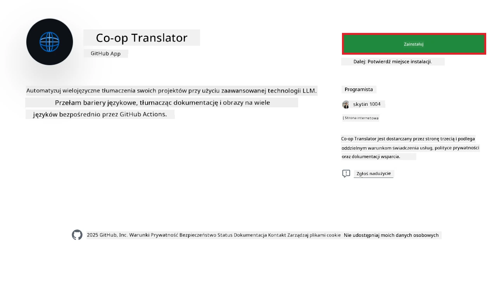
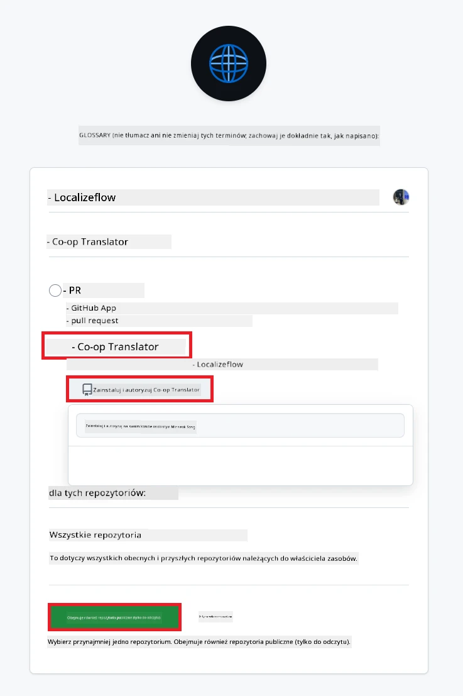
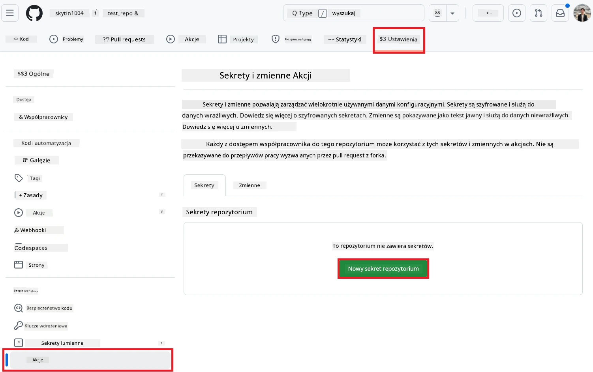
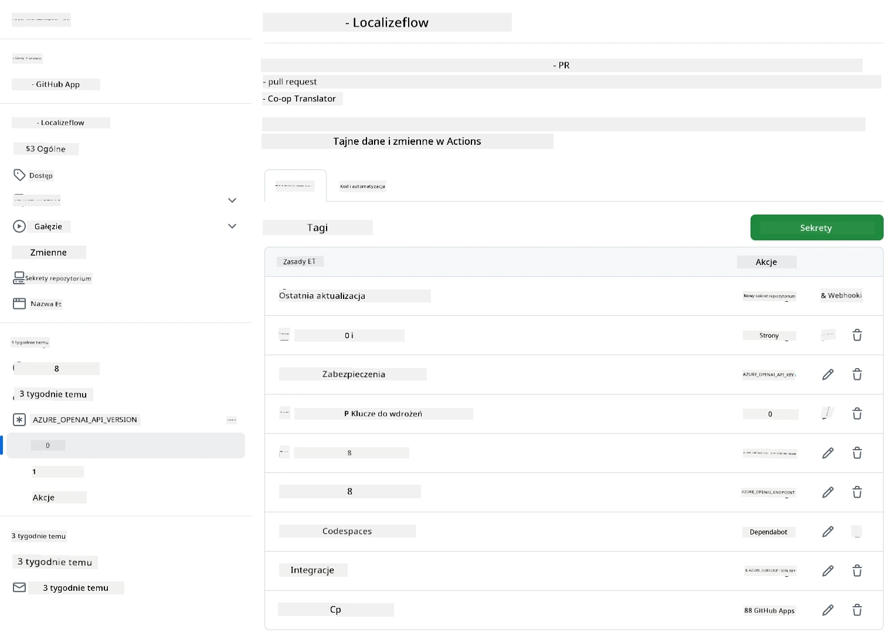

# Korzystanie z akcji Co-op Translator GitHub (Przewodnik dla organizacji)

**Grupa docelowa:** Ten przewodnik jest przeznaczony dla **użytkowników wewnętrznych Microsoft** lub **zespołów, które mają dostęp do niezbędnych danych uwierzytelniających dla gotowej aplikacji Co-op Translator GitHub App** albo mogą utworzyć własną, niestandardową aplikację GitHub.

Automatyzuj tłumaczenie dokumentacji w swoim repozytorium bez wysiłku dzięki akcji Co-op Translator GitHub. Ten przewodnik przeprowadzi Cię przez konfigurację akcji, która automatycznie utworzy pull requesty z zaktualizowanymi tłumaczeniami za każdym razem, gdy zmienią się Twoje źródłowe pliki Markdown lub obrazy.

> [!IMPORTANT]
> 
> **Wybór odpowiedniego przewodnika:**
>
> Ten przewodnik opisuje konfigurację z użyciem **GitHub App ID i klucza prywatnego**. Zazwyczaj potrzebujesz tej metody ("Przewodnik dla organizacji"), jeśli: **`GITHUB_TOKEN` ma ograniczone uprawnienia:** Ustawienia Twojej organizacji lub repozytorium ograniczają domyślne uprawnienia przyznawane standardowemu `GITHUB_TOKEN`. Jeśli `GITHUB_TOKEN` nie ma wymaganych uprawnień `write` (np. `contents: write` lub `pull-requests: write`), workflow z [Publicznego przewodnika](./github-actions-guide-public.md) nie powiedzie się z powodu braku uprawnień. Użycie dedykowanej aplikacji GitHub App z jawnie nadanymi uprawnieniami omija to ograniczenie.
>
> **Jeśli powyższe Cię nie dotyczy:**
>
> Jeśli standardowy `GITHUB_TOKEN` ma wystarczające uprawnienia w Twoim repozytorium (czyli nie jesteś ograniczony przez politykę organizacji), skorzystaj z **[Publicznego przewodnika z użyciem GITHUB_TOKEN](./github-actions-guide-public.md)**. Przewodnik publiczny nie wymaga uzyskiwania ani zarządzania App ID czy kluczami prywatnymi i opiera się wyłącznie na standardowym `GITHUB_TOKEN` oraz uprawnieniach repozytorium.

## Wymagania wstępne

Przed konfiguracją akcji GitHub upewnij się, że masz przygotowane odpowiednie dane uwierzytelniające do usługi AI.

**1. Wymagane: Dane uwierzytelniające modelu językowego AI**
Potrzebujesz danych uwierzytelniających do co najmniej jednego obsługiwanego modelu językowego:

- **Azure OpenAI**: Wymaga Endpoint, API Key, nazw modelu/deploymentu, wersji API.
- **OpenAI**: Wymaga API Key, (opcjonalnie: Org ID, Base URL, Model ID).
- Szczegóły znajdziesz w [Obsługiwane modele i usługi](../../../../README.md).
- Przewodnik konfiguracji: [Konfiguracja Azure OpenAI](../set-up-resources/set-up-azure-openai.md).

**2. Opcjonalnie: Dane uwierzytelniające Computer Vision (do tłumaczenia tekstu na obrazach)**

- Wymagane tylko, jeśli chcesz tłumaczyć tekst na obrazach.
- **Azure Computer Vision**: Wymaga Endpoint i Subscription Key.
- Jeśli nie podasz tych danych, akcja domyślnie przejdzie do [trybu tylko Markdown](../markdown-only-mode.md).
- Przewodnik konfiguracji: [Konfiguracja Azure Computer Vision](../set-up-resources/set-up-azure-computer-vision.md).

## Konfiguracja i ustawienia

Wykonaj poniższe kroki, aby skonfigurować akcję Co-op Translator w swoim repozytorium:

### Krok 1: Instalacja i konfiguracja uwierzytelniania GitHub App

Workflow używa uwierzytelniania przez GitHub App, aby bezpiecznie wykonywać operacje w Twoim repozytorium (np. tworzyć pull requesty) w Twoim imieniu. Wybierz jedną z opcji:

#### **Opcja A: Instalacja gotowej aplikacji Co-op Translator GitHub App (dla użytkowników wewnętrznych Microsoft)**

1. Przejdź na stronę [Co-op Translator GitHub App](https://github.com/apps/co-op-translator).

1. Wybierz **Install** i wskaż konto lub organizację, w której znajduje się docelowe repozytorium.

    

1. Wybierz **Only select repositories** i wskaż swoje repozytorium (np. `PhiCookBook`). Kliknij **Install**. Może być wymagane uwierzytelnienie.

    

1. **Uzyskaj dane uwierzytelniające aplikacji (wymagany proces wewnętrzny):** Aby workflow mógł uwierzytelniać się jako aplikacja, potrzebujesz dwóch informacji od zespołu Co-op Translator:
  - **App ID:** Unikalny identyfikator aplikacji Co-op Translator. App ID to: `1164076`.
  - **Klucz prywatny:** Musisz uzyskać **całą zawartość** pliku klucza prywatnego `.pem` od osoby kontaktowej. **Traktuj ten klucz jak hasło i przechowuj go bezpiecznie.**

1. Przejdź do kroku 2.

#### **Opcja B: Użyj własnej, niestandardowej aplikacji GitHub App**

- Jeśli wolisz, możesz utworzyć i skonfigurować własną aplikację GitHub App. Upewnij się, że ma dostęp do Contents i Pull requests w trybie odczytu i zapisu. Będziesz potrzebować jej App ID oraz wygenerowanego klucza prywatnego.

### Krok 2: Konfiguracja sekretów repozytorium

Musisz dodać dane uwierzytelniające aplikacji GitHub App oraz usługi AI jako zaszyfrowane sekrety w ustawieniach repozytorium.

1. Przejdź do docelowego repozytorium GitHub (np. `PhiCookBook`).

1. Wejdź w **Settings** > **Secrets and variables** > **Actions**.

1. W sekcji **Repository secrets** kliknij **New repository secret** dla każdego sekretu z poniższej listy.

   

**Wymagane sekrety (do uwierzytelniania przez GitHub App):**

| Nazwa sekretu        | Opis                                              | Źródło wartości                                   |
| :------------------- | :------------------------------------------------ | :------------------------------------------------ |
| `GH_APP_ID`          | App ID aplikacji GitHub (z kroku 1).              | Ustawienia GitHub App                             |
| `GH_APP_PRIVATE_KEY` | **Cała zawartość** pobranego pliku `.pem`.        | Plik `.pem` (z kroku 1)                           |

**Sekrety usług AI (dodaj WSZYSTKIE, które dotyczą Twojej konfiguracji):**

| Nazwa sekretu                        | Opis                                         | Źródło wartości                |
| :----------------------------------- | :-------------------------------------------- | :----------------------------- |
| `AZURE_AI_SERVICE_API_KEY`           | Klucz do Azure AI Service (Computer Vision)   | Azure AI Foundry               |
| `AZURE_AI_SERVICE_ENDPOINT`          | Endpoint do Azure AI Service (Computer Vision)| Azure AI Foundry               |
| `AZURE_OPENAI_API_KEY`               | Klucz do usługi Azure OpenAI                  | Azure AI Foundry               |
| `AZURE_OPENAI_ENDPOINT`              | Endpoint do usługi Azure OpenAI               | Azure AI Foundry               |
| `AZURE_OPENAI_MODEL_NAME`            | Nazwa Twojego modelu Azure OpenAI             | Azure AI Foundry               |
| `AZURE_OPENAI_CHAT_DEPLOYMENT_NAME`  | Nazwa deploymentu Azure OpenAI                | Azure AI Foundry               |
| `AZURE_OPENAI_API_VERSION`           | Wersja API dla Azure OpenAI                   | Azure AI Foundry               |
| `OPENAI_API_KEY`                     | Klucz API do OpenAI                           | OpenAI Platform                |
| `OPENAI_ORG_ID`                      | ID organizacji OpenAI                         | OpenAI Platform                |
| `OPENAI_CHAT_MODEL_ID`               | ID konkretnego modelu OpenAI                  | OpenAI Platform                |
| `OPENAI_BASE_URL`                    | Niestandardowy Base URL API OpenAI            | OpenAI Platform                |



### Krok 3: Utwórz plik workflow

Na koniec utwórz plik YAML definiujący zautomatyzowany workflow.

1. W katalogu głównym repozytorium utwórz folder `.github/workflows/`, jeśli jeszcze nie istnieje.

1. Wewnątrz `.github/workflows/` utwórz plik o nazwie `co-op-translator.yml`.

1. Wklej poniższą zawartość do pliku co-op-translator.yml.

```
name: Co-op Translator

on:
  push:
    branches:
      - main

jobs:
  co-op-translator:
    runs-on: ubuntu-latest

    permissions:
      contents: write
      pull-requests: write

    steps:
      - name: Checkout repository
        uses: actions/checkout@v4
        with:
          fetch-depth: 0

      - name: Set up Python
        uses: actions/setup-python@v4
        with:
          python-version: '3.10'

      - name: Install Co-op Translator
        run: |
          python -m pip install --upgrade pip
          pip install co-op-translator

      - name: Run Co-op Translator
        env:
          PYTHONIOENCODING: utf-8
          # Azure AI Service Credentials
          AZURE_AI_SERVICE_API_KEY: ${{ secrets.AZURE_AI_SERVICE_API_KEY }}
          AZURE_AI_SERVICE_ENDPOINT: ${{ secrets.AZURE_AI_SERVICE_ENDPOINT }}

          # Azure OpenAI Credentials
          AZURE_OPENAI_API_KEY: ${{ secrets.AZURE_OPENAI_API_KEY }}
          AZURE_OPENAI_ENDPOINT: ${{ secrets.AZURE_OPENAI_ENDPOINT }}
          AZURE_OPENAI_MODEL_NAME: ${{ secrets.AZURE_OPENAI_MODEL_NAME }}
          AZURE_OPENAI_CHAT_DEPLOYMENT_NAME: ${{ secrets.AZURE_OPENAI_CHAT_DEPLOYMENT_NAME }}
          AZURE_OPENAI_API_VERSION: ${{ secrets.AZURE_OPENAI_API_VERSION }}

          # OpenAI Credentials
          OPENAI_API_KEY: ${{ secrets.OPENAI_API_KEY }}
          OPENAI_ORG_ID: ${{ secrets.OPENAI_ORG_ID }}
          OPENAI_CHAT_MODEL_ID: ${{ secrets.OPENAI_CHAT_MODEL_ID }}
          OPENAI_BASE_URL: ${{ secrets.OPENAI_BASE_URL }}
        run: |
          # =====================================================================
          # IMPORTANT: Set your target languages here (REQUIRED CONFIGURATION)
          # =====================================================================
          # Example: Translate to Spanish, French, German. Add -y to auto-confirm.
          translate -l "es fr de" -y  # <--- MODIFY THIS LINE with your desired languages

      - name: Authenticate GitHub App
        id: generate_token
        uses: tibdex/github-app-token@v1
        with:
          app_id: ${{ secrets.GH_APP_ID }}
          private_key: ${{ secrets.GH_APP_PRIVATE_KEY }}

      - name: Create Pull Request with translations
        uses: peter-evans/create-pull-request@v5
        with:
          token: ${{ steps.generate_token.outputs.token }}
          commit-message: "🌐 Update translations via Co-op Translator"
          title: "🌐 Update translations via Co-op Translator"
          body: |
            This PR updates translations for recent changes to the main branch.

            ### 📋 Changes included
            - Translated contents are available in the `translations/` directory
            - Translated images are available in the `translated_images/` directory

            ---
            🌐 Automatically generated by the [Co-op Translator](https://github.com/Azure/co-op-translator) GitHub Action.
          branch: update-translations
          base: main
          labels: translation, automated-pr
          delete-branch: true
          add-paths: |
            translations/
            translated_images/

```

4.  **Dostosuj workflow:**
  - **[!IMPORTANT] Docelowe języki:** W kroku `Run Co-op Translator` **KONIECZNIE przejrzyj i zmodyfikuj listę kodów języków** w poleceniu `translate -l "..." -y`, aby odpowiadała wymaganiom Twojego projektu. Przykładowa lista (`ar de es...`) powinna zostać zastąpiona lub dostosowana.
  - **Wyzwalacz (`on:`):** Obecny wyzwalacz uruchamia workflow przy każdym pushu do `main`. W przypadku dużych repozytoriów rozważ dodanie filtra `paths:` (patrz zakomentowany przykład w YAML), aby workflow uruchamiał się tylko przy zmianach istotnych plików (np. dokumentacji źródłowej), co pozwoli zaoszczędzić minuty runnera.
  - **Szczegóły PR:** W razie potrzeby dostosuj `commit-message`, `title`, `body`, nazwę `branch` oraz `labels` w kroku `Create Pull Request`.

## Zarządzanie danymi uwierzytelniającymi i ich odnowienie

- **Bezpieczeństwo:** Zawsze przechowuj wrażliwe dane (klucze API, klucze prywatne) jako sekrety GitHub Actions. Nigdy nie umieszczaj ich w pliku workflow ani w kodzie repozytorium.
- **[!IMPORTANT] Odnowienie kluczy (użytkownicy wewnętrzni Microsoft):** Pamiętaj, że klucz Azure OpenAI używany w Microsoft może podlegać obowiązkowej polityce odnowienia (np. co 5 miesięcy). Upewnij się, że zaktualizujesz odpowiednie sekrety GitHub (`AZURE_OPENAI_...`) **przed ich wygaśnięciem**, aby uniknąć błędów workflow.

## Uruchamianie workflow

> [!WARNING]  
> **Limit czasu runnera hostowanego przez GitHub:**  
> Runnery hostowane przez GitHub, takie jak `ubuntu-latest`, mają **maksymalny limit czasu wykonania 6 godzin**.  
> W przypadku dużych repozytoriów dokumentacji, jeśli proces tłumaczenia przekroczy 6 godzin, workflow zostanie automatycznie przerwany.  
> Aby temu zapobiec, rozważ:  
> - Użycie **runnera hostowanego samodzielnie** (bez limitu czasu)  
> - Zmniejszenie liczby docelowych języków na jedno uruchomienie

Gdy plik `co-op-translator.yml` zostanie zmergowany do głównej gałęzi (lub tej wskazanej w wyzwalaczu `on:`), workflow uruchomi się automatycznie za każdym razem, gdy zmiany zostaną wypchnięte do tej gałęzi (i spełnią filtr `paths`, jeśli został skonfigurowany).

Jeśli zostaną wygenerowane lub zaktualizowane tłumaczenia, akcja automatycznie utworzy Pull Request z tymi zmianami, gotowy do Twojej recenzji i zmergowania.

---

**Zastrzeżenie**:  
Ten dokument został przetłumaczony za pomocą usługi tłumaczenia AI [Co-op Translator](https://github.com/Azure/co-op-translator). Chociaż dokładamy starań, aby tłumaczenie było precyzyjne, prosimy mieć na uwadze, że automatyczne tłumaczenia mogą zawierać błędy lub nieścisłości. Oryginalny dokument w jego języku ojczystym powinien być traktowany jako źródło nadrzędne. W przypadku informacji krytycznych zalecamy skorzystanie z profesjonalnych usług tłumaczenia przez człowieka. Nie ponosimy odpowiedzialności za wszelkie nieporozumienia lub błędne interpretacje wynikające z użycia tego tłumaczenia.