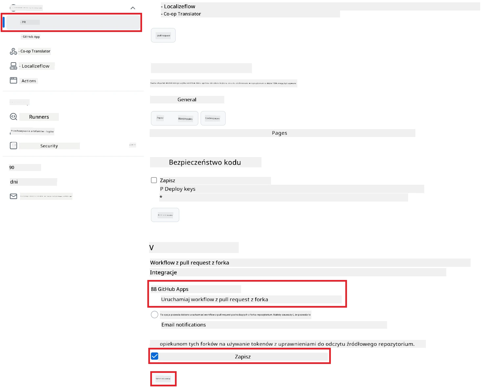

# Korzystanie z Co-op Translator GitHub Action (Konfiguracja Publiczna)

**Grupa docelowa:** Ten przewodnik jest przeznaczony dla użytkowników w większości publicznych lub prywatnych repozytoriów, gdzie standardowe uprawnienia GitHub Actions są wystarczające. Wykorzystuje wbudowany `GITHUB_TOKEN`.

Automatyzuj tłumaczenie dokumentacji swojego repozytorium bez wysiłku dzięki Co-op Translator GitHub Action. Ten przewodnik przeprowadzi Cię przez konfigurację akcji, która automatycznie utworzy pull requesty z zaktualizowanymi tłumaczeniami za każdym razem, gdy zmienią się Twoje źródłowe pliki Markdown lub obrazy.

> [!IMPORTANT]
>
> **Wybór odpowiedniego przewodnika:**
>
> Ten przewodnik opisuje **prostszą konfigurację z użyciem standardowego `GITHUB_TOKEN`**. Jest to zalecana metoda dla większości użytkowników, ponieważ nie wymaga zarządzania wrażliwymi kluczami prywatnymi aplikacji GitHub.
>

## Wymagania wstępne

Przed skonfigurowaniem GitHub Action upewnij się, że masz przygotowane odpowiednie dane uwierzytelniające do usługi AI.

**1. Wymagane: Dane uwierzytelniające modelu językowego AI**
Potrzebujesz danych uwierzytelniających do co najmniej jednego obsługiwanego modelu językowego:

- **Azure OpenAI**: Wymaga Endpoint, API Key, nazw modelu/deploymentu, wersji API.
- **OpenAI**: Wymaga API Key, (Opcjonalnie: Org ID, Base URL, Model ID).
- Zobacz [Obsługiwane modele i usługi](../../../../README.md) po szczegóły.

**2. Opcjonalnie: Dane uwierzytelniające AI Vision (do tłumaczenia obrazów)**

- Wymagane tylko, jeśli chcesz tłumaczyć tekst na obrazach.
- **Azure AI Vision**: Wymaga Endpoint i Subscription Key.
- Jeśli nie podasz tych danych, akcja domyślnie przejdzie do [trybu tylko Markdown](../markdown-only-mode.md).

## Konfiguracja i ustawienia

Wykonaj poniższe kroki, aby skonfigurować Co-op Translator GitHub Action w swoim repozytorium z użyciem standardowego `GITHUB_TOKEN`.

### Krok 1: Zrozum uwierzytelnianie (Użycie `GITHUB_TOKEN`)

Ten workflow korzysta z wbudowanego `GITHUB_TOKEN` dostarczanego przez GitHub Actions. Token ten automatycznie nadaje uprawnienia workflow do interakcji z Twoim repozytorium zgodnie z ustawieniami skonfigurowanymi w **Kroku 3**.

### Krok 2: Skonfiguruj sekrety repozytorium

Musisz dodać tylko **dane uwierzytelniające do usługi AI** jako zaszyfrowane sekrety w ustawieniach repozytorium.

1.  Przejdź do wybranego repozytorium na GitHub.
2.  Wejdź w **Settings** > **Secrets and variables** > **Actions**.
3.  W sekcji **Repository secrets** kliknij **New repository secret** dla każdego wymaganego sekretu usługi AI wymienionego poniżej.

     *(Odnośnik do obrazu: Pokazuje, gdzie dodać sekrety)*

**Wymagane sekrety usług AI (Dodaj WSZYSTKIE, które dotyczą Twoich wymagań):**

| Nazwa sekretu                         | Opis                                      | Źródło wartości                  |
| :------------------------------------- | :----------------------------------------- | :------------------------------- |
| `AZURE_AI_SERVICE_API_KEY`             | Klucz do Azure AI Service (Computer Vision) | Twoje Azure AI Foundry           |
| `AZURE_AI_SERVICE_ENDPOINT`            | Endpoint do Azure AI Service (Computer Vision) | Twoje Azure AI Foundry           |
| `AZURE_OPENAI_API_KEY`                 | Klucz do usługi Azure OpenAI               | Twoje Azure AI Foundry           |
| `AZURE_OPENAI_ENDPOINT`                | Endpoint do usługi Azure OpenAI            | Twoje Azure AI Foundry           |
| `AZURE_OPENAI_MODEL_NAME`              | Nazwa modelu Azure OpenAI                  | Twoje Azure AI Foundry           |
| `AZURE_OPENAI_CHAT_DEPLOYMENT_NAME`    | Nazwa deploymentu Azure OpenAI             | Twoje Azure AI Foundry           |
| `AZURE_OPENAI_API_VERSION`             | Wersja API dla Azure OpenAI                | Twoje Azure AI Foundry           |
| `OPENAI_API_KEY`                       | Klucz API do OpenAI                        | Twoja platforma OpenAI           |
| `OPENAI_ORG_ID`                        | ID organizacji OpenAI (opcjonalnie)        | Twoja platforma OpenAI           |
| `OPENAI_CHAT_MODEL_ID`                 | ID konkretnego modelu OpenAI (opcjonalnie) | Twoja platforma OpenAI           |
| `OPENAI_BASE_URL`                      | Niestandardowy Base URL API OpenAI (opcjonalnie) | Twoja platforma OpenAI     |

### Krok 3: Skonfiguruj uprawnienia workflow

GitHub Action potrzebuje uprawnień nadanych przez `GITHUB_TOKEN`, aby pobierać kod i tworzyć pull requesty.

1.  W repozytorium przejdź do **Settings** > **Actions** > **General**.
2.  Przewiń do sekcji **Workflow permissions**.
3.  Wybierz **Read and write permissions**. To nadaje `GITHUB_TOKEN` wymagane uprawnienia `contents: write` i `pull-requests: write` dla tego workflow.
4.  Upewnij się, że pole wyboru **Allow GitHub Actions to create and approve pull requests** jest **zaznaczone**.
5.  Kliknij **Save**.



### Krok 4: Utwórz plik workflow

Na koniec utwórz plik YAML definiujący zautomatyzowany workflow z użyciem `GITHUB_TOKEN`.

1.  W katalogu głównym repozytorium utwórz katalog `.github/workflows/`, jeśli jeszcze go nie ma.
2.  Wewnątrz `.github/workflows/` utwórz plik o nazwie `co-op-translator.yml`.
3.  Wklej poniższą zawartość do pliku `co-op-translator.yml`.

```yaml
name: Co-op Translator

on:
  push:
    branches:
      - main

jobs:
  co-op-translator:
    runs-on: ubuntu-latest

    permissions:
      contents: write
      pull-requests: write

    steps:
      - name: Checkout repository
        uses: actions/checkout@v4
        with:
          fetch-depth: 0

      - name: Set up Python
        uses: actions/setup-python@v4
        with:
          python-version: '3.10'

      - name: Install Co-op Translator
        run: |
          python -m pip install --upgrade pip
          pip install co-op-translator

      - name: Run Co-op Translator
        env:
          PYTHONIOENCODING: utf-8
          # === AI Service Credentials ===
          AZURE_AI_SERVICE_API_KEY: ${{ secrets.AZURE_AI_SERVICE_API_KEY }}
          AZURE_AI_SERVICE_ENDPOINT: ${{ secrets.AZURE_AI_SERVICE_ENDPOINT }}
          AZURE_OPENAI_API_KEY: ${{ secrets.AZURE_OPENAI_API_KEY }}
          AZURE_OPENAI_ENDPOINT: ${{ secrets.AZURE_OPENAI_ENDPOINT }}
          AZURE_OPENAI_MODEL_NAME: ${{ secrets.AZURE_OPENAI_MODEL_NAME }}
          AZURE_OPENAI_CHAT_DEPLOYMENT_NAME: ${{ secrets.AZURE_OPENAI_CHAT_DEPLOYMENT_NAME }}
          AZURE_OPENAI_API_VERSION: ${{ secrets.AZURE_OPENAI_API_VERSION }}
          OPENAI_API_KEY: ${{ secrets.OPENAI_API_KEY }}
          OPENAI_ORG_ID: ${{ secrets.OPENAI_ORG_ID }}
          OPENAI_CHAT_MODEL_ID: ${{ secrets.OPENAI_CHAT_MODEL_ID }}
          OPENAI_BASE_URL: ${{ secrets.OPENAI_BASE_URL }}
        run: |
          # =====================================================================
          # IMPORTANT: Set your target languages here (REQUIRED CONFIGURATION)
          # =====================================================================
          # Example: Translate to Spanish, French, German. Add -y to auto-confirm.
          translate -l "es fr de" -y  # <--- MODIFY THIS LINE with your desired languages

      - name: Create Pull Request with translations
        uses: peter-evans/create-pull-request@v5
        with:
          token: ${{ secrets.GITHUB_TOKEN }}
          commit-message: "🌐 Update translations via Co-op Translator"
          title: "🌐 Update translations via Co-op Translator"
          body: |
            This PR updates translations for recent changes to the main branch.

            ### 📋 Changes included
            - Translated contents are available in the `translations/` directory
            - Translated images are available in the `translated_images/` directory

            ---
            🌐 Automatically generated by the [Co-op Translator](https://github.com/Azure/co-op-translator) GitHub Action.
          branch: update-translations
          base: main
          labels: translation, automated-pr
          delete-branch: true
          add-paths: |
            translations/
            translated_images/
```
4.  **Dostosuj workflow:**
  - **[!IMPORTANT] Docelowe języki:** W kroku `Run Co-op Translator` **MUSISZ przejrzeć i zmodyfikować listę kodów języków** w poleceniu `translate -l "..." -y`, aby odpowiadała wymaganiom Twojego projektu. Przykładowa lista (`ar de es...`) powinna zostać zastąpiona lub dostosowana.
  - **Wyzwalacz (`on:`):** Obecny wyzwalacz uruchamia workflow przy każdym pushu do `main`. W przypadku dużych repozytoriów rozważ dodanie filtra `paths:` (zobacz zakomentowany przykład w YAML), aby workflow uruchamiał się tylko przy zmianach istotnych plików (np. dokumentacji źródłowej), co pozwoli zaoszczędzić minuty działania runnera.
  - **Szczegóły PR:** Dostosuj `commit-message`, `title`, `body`, nazwę `branch` oraz `labels` w kroku `Create Pull Request`, jeśli to konieczne.

## Uruchamianie workflow

> [!WARNING]  
> **Limit czasu runnera hostowanego przez GitHub:**  
> Runnery hostowane przez GitHub, takie jak `ubuntu-latest`, mają **maksymalny limit czasu wykonania 6 godzin**.  
> W przypadku dużych repozytoriów dokumentacji, jeśli proces tłumaczenia przekroczy 6 godzin, workflow zostanie automatycznie przerwany.  
> Aby temu zapobiec, rozważ:  
> - Użycie **runnera self-hosted** (bez limitu czasu)  
> - Zmniejszenie liczby docelowych języków na jedno uruchomienie

Gdy plik `co-op-translator.yml` zostanie połączony z Twoją główną gałęzią (lub gałęzią określoną w wyzwalaczu `on:`), workflow będzie automatycznie uruchamiany za każdym razem, gdy zmiany zostaną wypchnięte do tej gałęzi (i spełnią filtr `paths`, jeśli został skonfigurowany).

---

**Zastrzeżenie**:  
Ten dokument został przetłumaczony przy użyciu usługi tłumaczenia AI [Co-op Translator](https://github.com/Azure/co-op-translator). Dokładamy wszelkich starań, aby tłumaczenie było poprawne, jednak należy pamiętać, że automatyczne tłumaczenia mogą zawierać błędy lub nieścisłości. Za wiążące źródło należy uznać oryginalny dokument w jego języku ojczystym. W przypadku informacji krytycznych zalecane jest skorzystanie z profesjonalnych usług tłumaczenia przez człowieka. Nie ponosimy odpowiedzialności za wszelkie nieporozumienia lub błędne interpretacje wynikające z użycia tego tłumaczenia.