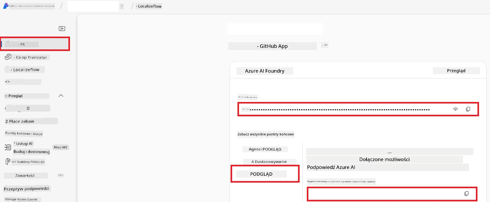

# Konfiguracja Azure AI dla Co-op Translator (Azure OpenAI i Azure AI Vision)

Ten przewodnik przeprowadzi Cię przez proces konfiguracji Azure OpenAI do tłumaczenia języków oraz Azure Computer Vision do analizy zawartości obrazów (które mogą być następnie używane do tłumaczeń opartych na obrazach) w Azure AI Foundry.

**Wymagania wstępne:**
- Konto Azure z aktywną subskrypcją.
- Wystarczające uprawnienia do tworzenia zasobów i wdrożeń w Twojej subskrypcji Azure.

## Utwórz projekt Azure AI

Zaczniesz od stworzenia projektu Azure AI, który działa jako centralne miejsce do zarządzania Twoimi zasobami AI.

1. Przejdź do [https://ai.azure.com](https://ai.azure.com) i zaloguj się na swoje konto Azure.

1. Wybierz **+Create**, aby utworzyć nowy projekt.

1. Wykonaj następujące czynności:
   - Wprowadź **Nazwa projektu** (np. `CoopTranslator-Project`).
   - Wybierz **AI hub** (np. `CoopTranslator-Hub`) (W razie potrzeby utwórz nowy).

1. Kliknij "**Review and Create**", aby utworzyć projekt. Zostaniesz przeniesiony do strony przeglądu swojego projektu.

## Konfiguracja Azure OpenAI do tłumaczenia języków

W obrębie swojego projektu wdrożysz model Azure OpenAI, który będzie służył jako backend do tłumaczenia tekstu.

### Przejdź do swojego projektu

Jeśli jeszcze tam nie jesteś, otwórz swój nowo utworzony projekt (np. `CoopTranslator-Project`) w Azure AI Foundry.

### Wdrożenie modelu OpenAI

1. Z lewego menu projektu, w sekcji "My assets", wybierz "**Models + endpoints**".

1. Wybierz **+ Deploy model**.

1. Wybierz **Deploy Base Model**.

1. Zostanie wyświetlona lista dostępnych modeli. Przefiltruj lub wyszukaj odpowiedni model GPT. Zalecamy `gpt-4o`.

1. Wybierz pożądany model i kliknij **Confirm**.

1. Wybierz **Deploy**.

### Konfiguracja Azure OpenAI

Po wdrożeniu możesz wybrać wdrożenie z strony "**Models + endpoints**", aby znaleźć jego **REST endpoint URL**, **Key**, **Deployment name**, **Model name** oraz **API version**. Będą one potrzebne do zintegrowania modelu tłumaczeniowego z Twoją aplikacją.

> [!NOTE]
> Możesz wybierać wersje API z [API version deprecation](https://learn.microsoft.com/azure/ai-services/openai/api-version-deprecation) według swoich potrzeb. Pamiętaj, że **wersja API** różni się od **wersji modelu** widocznej na stronie **Models + endpoints** w Azure AI Foundry.

## Konfiguracja Azure Computer Vision do tłumaczenia obrazów

Aby umożliwić tłumaczenie tekstu zawartego na obrazach, musisz znaleźć klucz API i endpoint usługi Azure AI.

1. Przejdź do swojego projektu Azure AI (np. `CoopTranslator-Project`). Upewnij się, że jesteś na stronie przeglądu projektu.

### Konfiguracja usługi Azure AI

Znajdź klucz API i endpoint usługi Azure AI.

1. Przejdź do swojego projektu Azure AI (np. `CoopTranslator-Project`). Upewnij się, że jesteś na stronie przeglądu projektu.

1. Znajdź **API Key** i **Endpoint** na karcie usługi Azure AI.

    

To połączenie udostępnia możliwości powiązanego zasobu Azure AI Services (w tym analizy obrazów) w Twoim projekcie AI Foundry. Następnie możesz skorzystać z tego połączenia w notatnikach lub aplikacjach do wyodrębniania tekstu z obrazów, który potem można przesłać do modelu Azure OpenAI w celu tłumaczenia.

## Konsolidacja Twoich danych uwierzytelniających

Do tego momentu powinieneś zebrać następujące informacje:

**Dla Azure OpenAI (Tłumaczenie tekstu):**
- Endpoint Azure OpenAI
- Klucz API Azure OpenAI
- Nazwa modelu Azure OpenAI (np. `gpt-4o`)
- Nazwa wdrożenia Azure OpenAI (np. `cooptranslator-gpt4o`)
- Wersja API Azure OpenAI

**Dla Azure AI Services (Wyodrębnianie tekstu z obrazów przez Vision):**
- Endpoint usługi Azure AI
- Klucz API usługi Azure AI

### Przykład: Konfiguracja zmiennych środowiskowych (Preview)

Później, budując swoją aplikację, prawdopodobnie skonfigurujesz ją, korzystając z tych zebranych poświadczeń. Na przykład, możesz ustawić je jako zmienne środowiskowe następująco:

```bash
# Dane uwierzytelniające usługi Azure AI (wymagane do tłumaczenia obrazów)
AZURE_AI_SERVICE_API_KEY="your_azure_ai_service_api_key" # np. 21xasd...
AZURE_AI_SERVICE_ENDPOINT="https://your_azure_ai_service_endpoint.cognitiveservices.azure.com/"

# Opcjonalne zestawy zapasowe: zduplikuj zmienne z przyrostkiem _1/_2 (ten sam indeks dla wszystkich zmiennych w zestawie)
AZURE_AI_SERVICE_API_KEY_1="your_azure_ai_service_api_key_1"
AZURE_AI_SERVICE_ENDPOINT_1="https://your_azure_ai_service_endpoint_1.cognitiveservices.azure.com/"

# Dane uwierzytelniające Azure OpenAI (wymagane do tłumaczenia tekstu)
AZURE_OPENAI_API_KEY="your_azure_openai_api_key" # np. 21xasd...
AZURE_OPENAI_ENDPOINT="https://your_azure_openai_endpoint.openai.azure.com/"
AZURE_OPENAI_MODEL_NAME="your_model_name" # np. gpt-4o
AZURE_OPENAI_CHAT_DEPLOYMENT_NAME="your_deployment_name" # np. cooptranslator-gpt4o
AZURE_OPENAI_API_VERSION="your_api_version" # np. 2024-12-01-preview

# Opcjonalne zestawy zapasowe: zduplikuj cały zestaw AZURE_OPENAI_* z przyrostkiem _1/_2 (ten sam indeks dla wszystkich zmiennych)
```

---

### Dalsze lektury

- [Jak utworzyć projekt w Azure AI Foundry](https://learn.microsoft.com/azure/ai-foundry/how-to/create-projects?tabs=ai-studio)
- [Jak tworzyć zasoby Azure AI](https://learn.microsoft.com/azure/ai-foundry/how-to/create-azure-ai-resource?tabs=portal)
- [Jak wdrażać modele OpenAI w Azure AI Foundry](https://learn.microsoft.com/en-us/azure/ai-foundry/how-to/deploy-models-openai)

---

<!-- CO-OP TRANSLATOR DISCLAIMER START -->
**Zastrzeżenie**:  
Ten dokument został przetłumaczony przy użyciu usługi tłumaczeń AI [Co-op Translator](https://github.com/Azure/co-op-translator). Chociaż dążymy do dokładności, prosimy pamiętać, że automatyczne tłumaczenia mogą zawierać błędy lub niedokładności. Oryginalny dokument w języku źródłowym powinien być uznawany za źródło autorytatywne. W przypadku informacji krytycznych zalecane jest skorzystanie z profesjonalnego tłumaczenia wykonanego przez człowieka. Nie ponosimy odpowiedzialności za jakiekolwiek nieporozumienia lub błędne interpretacje wynikające z korzystania z tego tłumaczenia.
<!-- CO-OP TRANSLATOR DISCLAIMER END -->