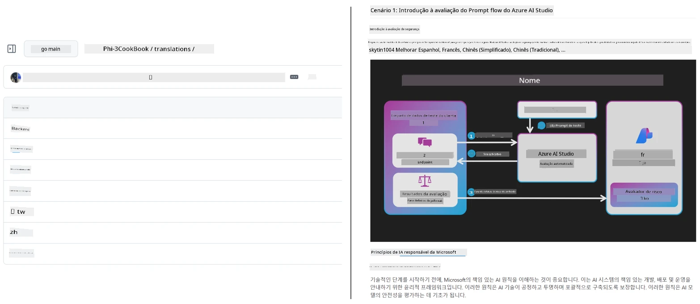
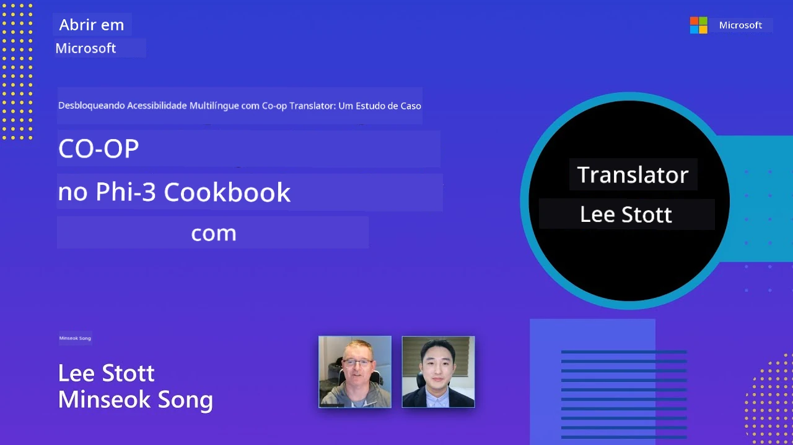

# Co-op Translator

_Automação fácil e manutenção de traduções para seu conteúdo educacional do GitHub em vários idiomas conforme seu projeto evolui._


[](https://pypi.org/project/co-op-translator/)
[](https://github.com/azure/co-op-translator/blob/main/LICENSE)
[](https://pepy.tech/project/co-op-translator)
[](https://pepy.tech/project/co-op-translator)
[](https://github.com/azure/co-op-translator/pkgs/container/co-op-translator)
[](https://github.com/psf/black)

[](https://GitHub.com/azure/co-op-translator/graphs/contributors/)
[](https://GitHub.com/azure/co-op-translator/issues/)
[](https://GitHub.com/azure/co-op-translator/pulls/)
[](http://makeapullrequest.com)

### 🌐 Suporte Multilíngue

#### Suportado por [Co-op Translator](https://github.com/Azure/Co-op-Translator)

<!-- CO-OP TRANSLATOR LANGUAGES TABLE START -->
[Arabic](../ar/README.md) | [Bengali](../bn/README.md) | [Bulgarian](../bg/README.md) | [Burmese (Myanmar)](../my/README.md) | [Chinese (Simplified)](../zh-CN/README.md) | [Chinese (Traditional, Hong Kong)](../zh-HK/README.md) | [Chinese (Traditional, Macau)](../zh-MO/README.md) | [Chinese (Traditional, Taiwan)](../zh-TW/README.md) | [Croatian](../hr/README.md) | [Czech](../cs/README.md) | [Danish](../da/README.md) | [Dutch](../nl/README.md) | [Estonian](../et/README.md) | [Finnish](../fi/README.md) | [French](../fr/README.md) | [German](../de/README.md) | [Greek](../el/README.md) | [Hebrew](../he/README.md) | [Hindi](../hi/README.md) | [Hungarian](../hu/README.md) | [Indonesian](../id/README.md) | [Italian](../it/README.md) | [Japanese](../ja/README.md) | [Kannada](../kn/README.md) | [Khmer](../km/README.md) | [Korean](../ko/README.md) | [Lithuanian](../lt/README.md) | [Malay](../ms/README.md) | [Malayalam](../ml/README.md) | [Marathi](../mr/README.md) | [Nepali](../ne/README.md) | [Nigerian Pidgin](../pcm/README.md) | [Norwegian](../no/README.md) | [Persian (Farsi)](../fa/README.md) | [Polish](../pl/README.md) | [Portuguese (Brazil)](./README.md) | [Portuguese (Portugal)](../pt-PT/README.md) | [Punjabi (Gurmukhi)](../pa/README.md) | [Romanian](../ro/README.md) | [Russian](../ru/README.md) | [Serbian (Cyrillic)](../sr/README.md) | [Slovak](../sk/README.md) | [Slovenian](../sl/README.md) | [Spanish](../es/README.md) | [Swahili](../sw/README.md) | [Swedish](../sv/README.md) | [Tagalog (Filipino)](../tl/README.md) | [Tamil](../ta/README.md) | [Telugu](../te/README.md) | [Thai](../th/README.md) | [Turkish](../tr/README.md) | [Ukrainian](../uk/README.md) | [Urdu](../ur/README.md) | [Vietnamese](../vi/README.md)

> **Prefere clonar localmente?**
>
> Este repositório inclui traduções em mais de 50 idiomas, o que aumenta significativamente o tamanho do download. Para clonar sem as traduções, use o sparse checkout:
>
> **Bash / macOS / Linux:**
> ```bash
> git clone --filter=blob:none --sparse https://github.com/Azure/co-op-translator.git
> cd co-op-translator
> git sparse-checkout set --no-cone '/*' '!translations' '!translated_images'
> ```
>
> **CMD (Windows):**
> ```cmd
> git clone --filter=blob:none --sparse https://github.com/Azure/co-op-translator.git
> cd co-op-translator
> git sparse-checkout set --no-cone "/*" "!translations" "!translated_images"
> ```
>
> Isso fornece tudo o que você precisa para completar o curso com um download muito mais rápido.
<!-- CO-OP TRANSLATOR LANGUAGES TABLE END -->

[](https://GitHub.com/azure/co-op-translator/watchers/)
[](https://GitHub.com/azure/co-op-translator/network/)
[](https://GitHub.com/azure/co-op-translator/stargazers/)

[](https://discord.gg/nTYy5BXMWG)

[](https://codespaces.new/azure/co-op-translator)

## Visão geral

**Co-op Translator** ajuda você a localizar seu conteúdo educacional do GitHub em vários idiomas sem esforço.  
Quando você atualiza seus arquivos Markdown, imagens ou notebooks, as traduções permanecem automaticamente sincronizadas, garantindo que seu conteúdo continue preciso e atualizado para alunos em todo o mundo.

Exemplo de como o conteúdo traduzido é organizado:



## Como o estado da tradução é gerenciado

Co-op Translator gerencia conteúdo traduzido como **artefatos de software versionados**,  
não como arquivos estáticos.

A ferramenta rastreia o estado do Markdown, imagens e notebooks traduzidos  
usando **metadados delimitados por idioma**.

Esse design permite que o Co-op Translator:

- Detecte traduções obsoletas de forma confiável
- Trate Markdown, imagens e notebooks com consistência
- Escale com segurança em repositórios grandes, ágeis e multilíngues

Ao modelar traduções como artefatos gerenciados,  
os fluxos de trabalho de tradução se alinham naturalmente com as práticas modernas  
de gerenciamento de dependências e artefatos de software.

→ [Como o estado da tradução é gerenciado](https://techcommunity.microsoft.com/blog/azuredevcommunityblog/rethinking-documentation-translation-treating-translations-as-versioned-software/4491755)


## Começando rápido

```bash
# Criar e ativar um ambiente virtual (recomendado)
python -m venv .venv
# Windows
.venv\Scripts\activate
# macOS/Linux
source .venv/bin/activate
# Instalar o pacote
pip install co-op-translator
# Traduzir
translate -l "ko ja fr" -md
```

Docker:

```bash
# Baixar a imagem pública do GHCR
docker pull ghcr.io/azure/co-op-translator:latest
# Executar com a pasta atual montada e .env fornecido (Bash/Zsh)
docker run --rm -it --env-file .env -v "${PWD}:/work" ghcr.io/azure/co-op-translator:latest -l "ko ja fr" -md
```

## Configuração mínima

1. Assegure que você tenha uma versão de Python suportada (atualmente 3.10-3.12). No poetry (pyproject.toml) isso é tratado automaticamente.  
2. Crie um arquivo `.env` usando o modelo: [.env.template](../../.env.template)  
3. Configure um provedor LLM (Azure OpenAI ou OpenAI)  
4. (Opcional) Para tradução de imagens (`-img`), configure Azure AI Vision  
5. (Opcional) Você pode configurar múltiplos conjuntos de credenciais duplicando variáveis com sufixos como `_1`, `_2`, etc. Todas as variáveis em um conjunto devem compartilhar o mesmo sufixo.  
6. (Recomendado) Limpe traduções anteriores para evitar conflitos (ex.: `translations/`)  
7. (Recomendado) Adicione uma seção de tradução ao seu README usando o [modelo de idiomas para README](./getting_started/README_languages_template.md)  
8. Veja: [Configurar Azure AI](./getting_started/set-up-azure-ai.md)

## Uso

Traduza todos os tipos suportados:

```bash
translate -l "ko ja"
```

Apenas Markdown:

```bash
translate -l "de" -md
```

Markdown + imagens:

```bash
translate -l "pt" -md -img
```

Apenas notebooks:

```bash
translate -l "zh" -nb
```

Mais flags: [Referência de comandos](./getting_started/command-reference.md)

## Recursos

- Tradução automatizada para Markdown, notebooks e imagens  
- Mantém as traduções sincronizadas com as mudanças de origem  
- Funciona localmente (CLI) ou em CI (GitHub Actions)  
- Usa Azure OpenAI ou OpenAI; opcional Azure AI Vision para imagens  
- Preserva formatação e estrutura do Markdown

## Documentação

- [Guia de linha de comando](./getting_started/command-line-guide/command-line-guide.md)  
- [Guia GitHub Actions (Repositórios públicos & segredos padrão)](./getting_started/github-actions-guide/github-actions-guide-public.md)  
- [Guia GitHub Actions (Repositórios Microsoft e configurações em nível organizacional)](./getting_started/github-actions-guide/github-actions-guide-org.md)  
- [Modelo de idiomas para README](./getting_started/README_languages_template.md)  
- [Idiomas suportados](./getting_started/supported-languages.md)  
- [Contribuindo](./CONTRIBUTING.md)  
- [Solução de problemas](./getting_started/troubleshooting.md)

### Guia específico Microsoft
> [!NOTE]
> Apenas para mantenedores dos repositórios “For Beginners” da Microsoft.

- [Atualizando a lista “outros cursos” (apenas para repositórios MS Beginners)](./getting_started/update-other-courses.md)

## Apoie-nos e promova o aprendizado global

Junte-se a nós na revolução de como o conteúdo educacional é compartilhado globalmente! Dê uma ⭐ ao [Co-op Translator](https://github.com/azure/co-op-translator) no GitHub e apoie nossa missão de derrubar barreiras linguísticas no aprendizado e na tecnologia. Seu interesse e contribuições fazem uma grande diferença! Contribuições de código e sugestões de recursos são sempre bem-vindas.

### Explore o conteúdo educacional Microsoft no seu idioma

- [LangChain4j-for-Beginners](https://github.com/microsoft/LangChain4j-for-Beginners)  
- [AZD for Beginners](https://github.com/microsoft/AZD-for-beginners)  
- [Edge AI for Beginners](https://github.com/microsoft/edgeai-for-beginners)  
- [Model Context Protocol (MCP) For Beginners](https://github.com/microsoft/mcp-for-beginners)  
- [AI Agents for Beginners](https://github.com/microsoft/ai-agents-for-beginners)  
- [Generative AI for Beginners using .NET](https://github.com/microsoft/Generative-AI-for-beginners-dotnet)  
- [Generative AI for Beginners](https://github.com/microsoft/generative-ai-for-beginners)  
- [Generative AI for Beginners using Java](https://github.com/microsoft/generative-ai-for-beginners-java)  
- [ML for Beginners](https://aka.ms/ml-beginners)  
- [Data Science for Beginners](https://aka.ms/datascience-beginners)  
- [AI for Beginners](https://aka.ms/ai-beginners)  
- [Cybersecurity for Beginners](https://github.com/microsoft/Security-101)  
- [Web Dev for Beginners](https://aka.ms/webdev-beginners)  
- [IoT for Beginners](https://aka.ms/iot-beginners)  
- [PhiCookBook](https://github.com/microsoft/PhiCookBook)

## Apresentações em vídeo

👉 Clique na imagem abaixo para assistir no YouTube.

- **Open at Microsoft**: Uma breve introdução de 18 minutos e guia rápido sobre como usar o Co-op Translator.

  [](https://www.youtube.com/watch?v=jX_swfH_KNU)

## Contribuindo

Este projeto recebe contribuições e sugestões com prazer. Interessado em contribuir para o Azure Co-op Translator? Veja nosso [CONTRIBUTING.md](./CONTRIBUTING.md) para diretrizes sobre como você pode ajudar a tornar o Co-op Translator mais acessível.

## Contribuidores
[](https://github.com/Azure/co-op-translator/graphs/contributors)

## Código de Conduta

Este projeto adotou o [Código de Conduta Open Source da Microsoft](https://opensource.microsoft.com/codeofconduct/).
Para mais informações, consulte o [FAQ do Código de Conduta](https://opensource.microsoft.com/codeofconduct/faq/) ou
entre em contato pelo email [opencode@microsoft.com](mailto:opencode@microsoft.com) para quaisquer perguntas ou comentários adicionais.

## IA Responsável

A Microsoft está comprometida em ajudar nossos clientes a usar nossos produtos de IA de forma responsável, compartilhando nossas aprendizagens e construindo parcerias baseadas na confiança por meio de ferramentas como Notas de Transparência e Avaliações de Impacto. Muitos desses recursos podem ser encontrados em [https://aka.ms/RAI](https://aka.ms/RAI).
A abordagem da Microsoft para IA responsável é fundamentada em nossos princípios de IA de justiça, confiabilidade e segurança, privacidade e segurança, inclusão, transparência e responsabilidade.

Modelos de larga escala de linguagem natural, imagem e fala — como os usados neste exemplo — podem potencialmente se comportar de maneiras injustas, não confiáveis ou ofensivas, causando danos. Por favor, consulte a [nota de transparência do serviço Azure OpenAI](https://learn.microsoft.com/legal/cognitive-services/openai/transparency-note?tabs=text) para se informar sobre riscos e limitações.

A abordagem recomendada para mitigar esses riscos é incluir um sistema de segurança em sua arquitetura que possa detectar e prevenir comportamentos prejudiciais. O [Azure AI Content Safety](https://learn.microsoft.com/azure/ai-services/content-safety/overview) fornece uma camada independente de proteção, capaz de detectar conteúdo gerado por usuários e por IA que seja prejudicial em aplicações e serviços. O Azure AI Content Safety inclui APIs de texto e imagem que permitem detectar material prejudicial. Também contamos com um Content Safety Studio interativo que permite visualizar, explorar e testar códigos de exemplo para detectar conteúdos prejudiciais em diferentes modalidades. A seguinte [documentação de início rápido](https://learn.microsoft.com/azure/ai-services/content-safety/quickstart-text?tabs=visual-studio%2Clinux&pivots=programming-language-rest) orienta você a fazer solicitações ao serviço.

Outro aspecto a considerar é o desempenho geral da aplicação. Em aplicações multimodais e com múltiplos modelos, consideramos desempenho como o sistema funcionando conforme o esperado por você e seus usuários, incluindo não gerar saídas prejudiciais. É importante avaliar o desempenho da sua aplicação geral usando [métricas de qualidade de geração, risco e segurança](https://learn.microsoft.com/azure/ai-studio/concepts/evaluation-metrics-built-in).

Você pode avaliar sua aplicação de IA em seu ambiente de desenvolvimento usando o [prompt flow SDK](https://microsoft.github.io/promptflow/index.html). Dado um conjunto de dados de teste ou um objetivo, as gerações da sua aplicação de IA generativa são medidas quantitativamente com avaliadores embutidos ou avaliadores personalizados de sua escolha. Para começar com o prompt flow sdk para avaliar seu sistema, você pode seguir o [guia de início rápido](https://learn.microsoft.com/azure/ai-studio/how-to/develop/flow-evaluate-sdk). Depois de executar uma avaliação, você pode [visualizar os resultados no Azure AI Studio](https://learn.microsoft.com/azure/ai-studio/how-to/evaluate-flow-results).

## Marcas Registradas

Este projeto pode conter marcas registradas ou logotipos de projetos, produtos ou serviços. O uso autorizado das marcas registradas ou logotipos da Microsoft está sujeito e deve seguir as
[Diretrizes de Marcas Registradas e Marca da Microsoft](https://www.microsoft.com/en-us/legal/intellectualproperty/trademarks/usage/general).
O uso de marcas registradas ou logotipos da Microsoft em versões modificadas deste projeto não deve causar confusão nem implicar patrocínio da Microsoft.
Qualquer uso de marcas registradas ou logotipos de terceiros está sujeito às políticas desses terceiros.

## Obtendo Ajuda

Se você ficar preso ou tiver quaisquer dúvidas sobre como construir aplicativos de IA, participe:

[](https://discord.gg/nTYy5BXMWG)

Se você tiver feedback sobre o produto ou erros ao construir visite:

[](https://aka.ms/foundry/forum)

---

<!-- CO-OP TRANSLATOR DISCLAIMER START -->
**Aviso**:  
Este documento foi traduzido utilizando o serviço de tradução por IA [Co-op Translator](https://github.com/Azure/co-op-translator). Embora nos esforcemos para garantir a precisão, esteja ciente de que traduções automáticas podem conter erros ou imprecisões. O documento original em seu idioma nativo deve ser considerado a fonte autorizada. Para informações críticas, recomenda-se tradução profissional realizada por humanos. Não nos responsabilizamos por quaisquer mal-entendidos ou interpretações incorretas decorrentes do uso desta tradução.
<!-- CO-OP TRANSLATOR DISCLAIMER END -->