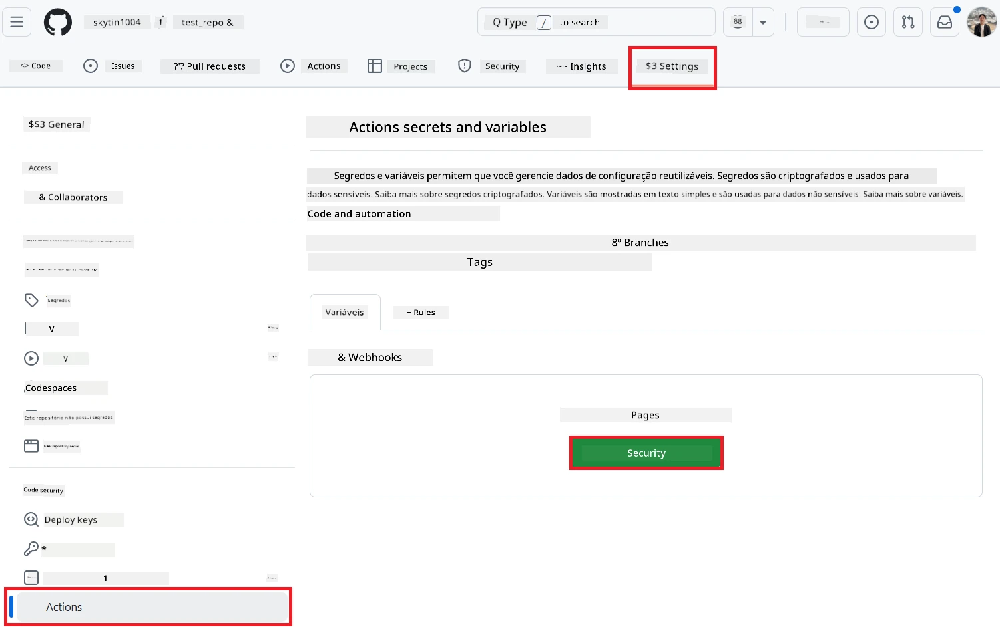
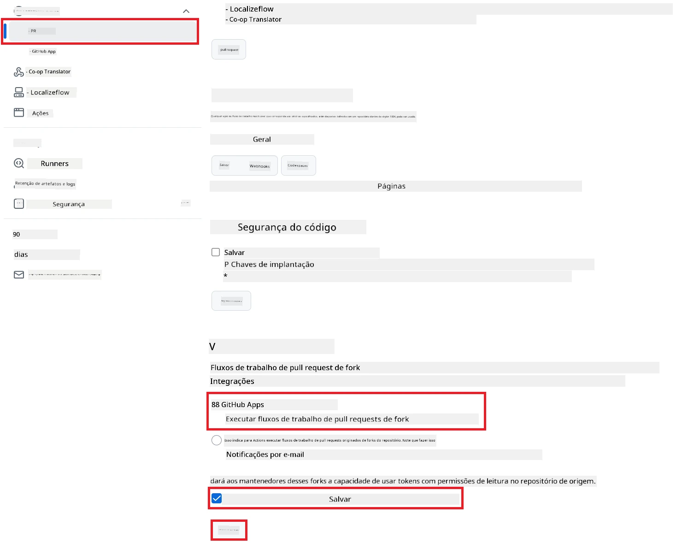

# Usando a GitHub Action Co-op Translator (Configuração Pública)

**Público-alvo:** Este guia é destinado a usuários na maioria dos repositórios públicos ou privados onde as permissões padrão do GitHub Actions são suficientes. Ele utiliza o `GITHUB_TOKEN` integrado.

Automatize a tradução da documentação do seu repositório facilmente usando a GitHub Action Co-op Translator. Este guia mostra como configurar a action para criar pull requests automaticamente com traduções atualizadas sempre que seus arquivos Markdown de origem ou imagens forem alterados.

> [!IMPORTANT]
>
> **Escolhendo o Guia Certo:**
>
> Este guia detalha a **configuração mais simples usando o `GITHUB_TOKEN` padrão**. Este é o método recomendado para a maioria dos usuários, pois não exige o gerenciamento de chaves privadas sensíveis de GitHub App.
>

## Pré-requisitos

Antes de configurar a GitHub Action, certifique-se de ter as credenciais do serviço de IA necessárias em mãos.

**1. Obrigatório: Credenciais do Modelo de Linguagem de IA**
Você precisa das credenciais de pelo menos um Modelo de Linguagem suportado:

- **Azure OpenAI**: Requer Endpoint, Chave de API, Nomes de Modelo/Implantação, Versão da API.
- **OpenAI**: Requer Chave de API, (Opcional: Org ID, Base URL, Model ID).
- Veja [Modelos e Serviços Suportados](../../../../README.md) para detalhes.

**2. Opcional: Credenciais de IA para Visão (para Tradução de Imagens)**

- Só é necessário se você precisar traduzir texto dentro de imagens.
- **Azure AI Vision**: Requer Endpoint e Subscription Key.
- Se não for fornecido, a action funcionará no [modo apenas Markdown](../markdown-only-mode.md).

## Configuração e Ajustes

Siga estes passos para configurar a GitHub Action Co-op Translator no seu repositório usando o `GITHUB_TOKEN` padrão.

### Passo 1: Entenda a Autenticação (Usando `GITHUB_TOKEN`)

Este workflow utiliza o `GITHUB_TOKEN` integrado fornecido pelo GitHub Actions. Esse token concede automaticamente permissões ao workflow para interagir com seu repositório, conforme as configurações feitas no **Passo 3**.

### Passo 2: Configure os Segredos do Repositório

Você só precisa adicionar as **credenciais do serviço de IA** como segredos criptografados nas configurações do seu repositório.

1.  Acesse o repositório desejado no GitHub.
2.  Vá em **Settings** > **Secrets and variables** > **Actions**.
3.  Em **Repository secrets**, clique em **New repository secret** para cada segredo de serviço de IA necessário listado abaixo.

     *(Referência de Imagem: Mostra onde adicionar segredos)*

**Segredos Obrigatórios dos Serviços de IA (Adicione TODOS que se aplicam conforme seus Pré-requisitos):**

| Nome do Segredo                         | Descrição                                   | Fonte do Valor                  |
| :-------------------------------------- | :------------------------------------------ | :------------------------------ |
| `AZURE_AI_SERVICE_API_KEY`              | Chave para Azure AI Service (Computer Vision)  | Seu Azure AI Foundry            |
| `AZURE_AI_SERVICE_ENDPOINT`             | Endpoint para Azure AI Service (Computer Vision) | Seu Azure AI Foundry            |
| `AZURE_OPENAI_API_KEY`                  | Chave para Azure OpenAI service             | Seu Azure AI Foundry            |
| `AZURE_OPENAI_ENDPOINT`                 | Endpoint para Azure OpenAI service          | Seu Azure AI Foundry            |
| `AZURE_OPENAI_MODEL_NAME`               | Nome do seu Modelo Azure OpenAI             | Seu Azure AI Foundry            |
| `AZURE_OPENAI_CHAT_DEPLOYMENT_NAME`     | Nome da Implantação do Azure OpenAI         | Seu Azure AI Foundry            |
| `AZURE_OPENAI_API_VERSION`              | Versão da API do Azure OpenAI               | Seu Azure AI Foundry            |
| `OPENAI_API_KEY`                        | Chave de API do OpenAI                      | Sua Plataforma OpenAI           |
| `OPENAI_ORG_ID`                         | ID da Organização OpenAI (Opcional)         | Sua Plataforma OpenAI           |
| `OPENAI_CHAT_MODEL_ID`                  | ID específico do modelo OpenAI (Opcional)   | Sua Plataforma OpenAI           |
| `OPENAI_BASE_URL`                       | Base URL personalizada da API OpenAI (Opcional) | Sua Plataforma OpenAI       |

### Passo 3: Configure as Permissões do Workflow

A GitHub Action precisa de permissões concedidas via `GITHUB_TOKEN` para fazer checkout do código e criar pull requests.

1.  No seu repositório, vá em **Settings** > **Actions** > **General**.
2.  Role até a seção **Workflow permissions**.
3.  Selecione **Read and write permissions**. Isso concede ao `GITHUB_TOKEN` as permissões necessárias de `contents: write` e `pull-requests: write` para este workflow.
4.  Certifique-se de que a caixa **Allow GitHub Actions to create and approve pull requests** está **marcada**.
5.  Clique em **Save**.



### Passo 4: Crie o Arquivo de Workflow

Por fim, crie o arquivo YAML que define o workflow automatizado usando o `GITHUB_TOKEN`.

1.  No diretório raiz do seu repositório, crie o diretório `.github/workflows/` se ele ainda não existir.
2.  Dentro de `.github/workflows/`, crie um arquivo chamado `co-op-translator.yml`.
3.  Cole o seguinte conteúdo em `co-op-translator.yml`.

```yaml
name: Co-op Translator

on:
  push:
    branches:
      - main

jobs:
  co-op-translator:
    runs-on: ubuntu-latest

    permissions:
      contents: write
      pull-requests: write

    steps:
      - name: Checkout repository
        uses: actions/checkout@v4
        with:
          fetch-depth: 0

      - name: Set up Python
        uses: actions/setup-python@v4
        with:
          python-version: '3.10'

      - name: Install Co-op Translator
        run: |
          python -m pip install --upgrade pip
          pip install co-op-translator

      - name: Run Co-op Translator
        env:
          PYTHONIOENCODING: utf-8
          # === AI Service Credentials ===
          AZURE_AI_SERVICE_API_KEY: ${{ secrets.AZURE_AI_SERVICE_API_KEY }}
          AZURE_AI_SERVICE_ENDPOINT: ${{ secrets.AZURE_AI_SERVICE_ENDPOINT }}
          AZURE_OPENAI_API_KEY: ${{ secrets.AZURE_OPENAI_API_KEY }}
          AZURE_OPENAI_ENDPOINT: ${{ secrets.AZURE_OPENAI_ENDPOINT }}
          AZURE_OPENAI_MODEL_NAME: ${{ secrets.AZURE_OPENAI_MODEL_NAME }}
          AZURE_OPENAI_CHAT_DEPLOYMENT_NAME: ${{ secrets.AZURE_OPENAI_CHAT_DEPLOYMENT_NAME }}
          AZURE_OPENAI_API_VERSION: ${{ secrets.AZURE_OPENAI_API_VERSION }}
          OPENAI_API_KEY: ${{ secrets.OPENAI_API_KEY }}
          OPENAI_ORG_ID: ${{ secrets.OPENAI_ORG_ID }}
          OPENAI_CHAT_MODEL_ID: ${{ secrets.OPENAI_CHAT_MODEL_ID }}
          OPENAI_BASE_URL: ${{ secrets.OPENAI_BASE_URL }}
        run: |
          # =====================================================================
          # IMPORTANT: Set your target languages here (REQUIRED CONFIGURATION)
          # =====================================================================
          # Example: Translate to Spanish, French, German. Add -y to auto-confirm.
          translate -l "es fr de" -y  # <--- MODIFY THIS LINE with your desired languages

      - name: Create Pull Request with translations
        uses: peter-evans/create-pull-request@v5
        with:
          token: ${{ secrets.GITHUB_TOKEN }}
          commit-message: "🌐 Update translations via Co-op Translator"
          title: "🌐 Update translations via Co-op Translator"
          body: |
            This PR updates translations for recent changes to the main branch.

            ### 📋 Changes included
            - Translated contents are available in the `translations/` directory
            - Translated images are available in the `translated_images/` directory

            ---
            🌐 Automatically generated by the [Co-op Translator](https://github.com/Azure/co-op-translator) GitHub Action.
          branch: update-translations
          base: main
          labels: translation, automated-pr
          delete-branch: true
          add-paths: |
            translations/
            translated_images/
```

4.  **Personalize o Workflow:**
  - **[!IMPORTANT] Idiomas de Destino:** No passo `Run Co-op Translator`, você **DEVE revisar e modificar a lista de códigos de idiomas** dentro do comando `translate -l "..." -y` para corresponder às necessidades do seu projeto. A lista de exemplo (`ar de es...`) precisa ser substituída ou ajustada.
  - **Gatilho (`on:`):** O gatilho atual executa em todo push para `main`. Para repositórios grandes, considere adicionar um filtro `paths:` (veja o exemplo comentado no YAML) para rodar o workflow apenas quando arquivos relevantes (ex: documentação fonte) forem alterados, economizando minutos do runner.
  - **Detalhes do PR:** Personalize o `commit-message`, `title`, `body`, nome do `branch` e `labels` no passo `Create Pull Request` se necessário.

## Executando o Workflow

> [!WARNING]  
> **Limite de Tempo do Runner Hospedado pelo GitHub:**  
> Runners hospedados pelo GitHub como `ubuntu-latest` têm um **tempo máximo de execução de 6 horas**.  
> Para repositórios de documentação grandes, se o processo de tradução exceder 6 horas, o workflow será encerrado automaticamente.  
> Para evitar isso, considere:  
> - Usar um **runner auto-hospedado** (sem limite de tempo)  
> - Reduzir o número de idiomas de destino por execução

Assim que o arquivo `co-op-translator.yml` for mesclado ao seu branch principal (ou ao branch especificado no gatilho `on:`), o workflow será executado automaticamente sempre que alterações forem enviadas para esse branch (e corresponderem ao filtro `paths`, se configurado).

---

**Aviso Legal**:
Este documento foi traduzido utilizando o serviço de tradução por IA [Co-op Translator](https://github.com/Azure/co-op-translator). Embora busquemos precisão, esteja ciente de que traduções automáticas podem conter erros ou imprecisões. O documento original em seu idioma nativo deve ser considerado a fonte autorizada. Para informações críticas, recomenda-se a tradução profissional humana. Não nos responsabilizamos por quaisquer mal-entendidos ou interpretações incorretas decorrentes do uso desta tradução.