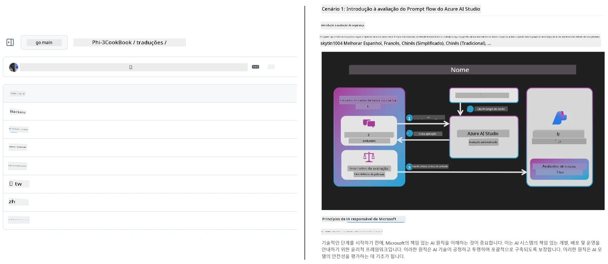
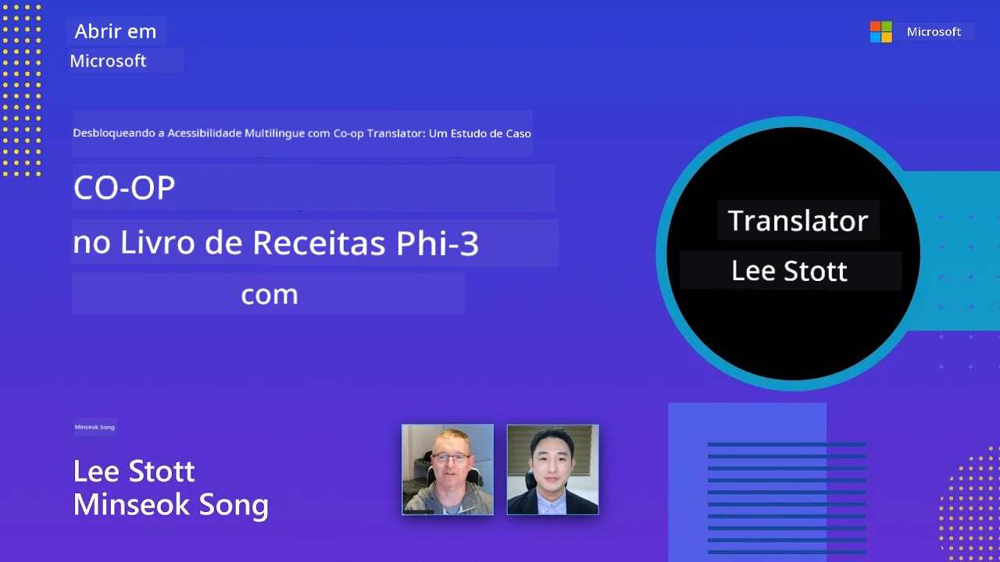

# Co-op Translator

_Automatize e mantenha facilmente traduções para o seu conteúdo educativo no GitHub em vários idiomas à medida que o seu projeto evolui._


[](https://pypi.org/project/co-op-translator/)
[](https://github.com/azure/co-op-translator/blob/main/LICENSE)
[](https://pepy.tech/project/co-op-translator)
[](https://pepy.tech/project/co-op-translator)
[](https://github.com/azure/co-op-translator/pkgs/container/co-op-translator)
[](https://github.com/psf/black)

[](https://GitHub.com/azure/co-op-translator/graphs/contributors/)
[](https://GitHub.com/azure/co-op-translator/issues/)
[](https://GitHub.com/azure/co-op-translator/pulls/)
[](http://makeapullrequest.com)

### 🌐 Suporte Multilíngue

#### Suportado por [Co-op Translator](https://github.com/Azure/Co-op-Translator)

<!-- CO-OP TRANSLATOR LANGUAGES TABLE START -->
[Árabe](../ar/README.md) | [Bengali](../bn/README.md) | [Búlgaro](../bg/README.md) | [Birmanês (Myanmar)](../my/README.md) | [Chinês (Simplificado)](../zh-CN/README.md) | [Chinês (Tradicional, Hong Kong)](../zh-HK/README.md) | [Chinês (Tradicional, Macau)](../zh-MO/README.md) | [Chinês (Tradicional, Taiwan)](../zh-TW/README.md) | [Croata](../hr/README.md) | [Checo](../cs/README.md) | [Dinamarquês](../da/README.md) | [Holandês](../nl/README.md) | [Estónio](../et/README.md) | [Finlandês](../fi/README.md) | [Francês](../fr/README.md) | [Alemão](../de/README.md) | [Grego](../el/README.md) | [Hebraico](../he/README.md) | [Hindi](../hi/README.md) | [Húngaro](../hu/README.md) | [Indonésio](../id/README.md) | [Italiano](../it/README.md) | [Japonês](../ja/README.md) | [Kannada](../kn/README.md) | [Cambojano (Khmer)](../km/README.md) | [Coreano](../ko/README.md) | [Lituano](../lt/README.md) | [Malaio](../ms/README.md) | [Malaiala](../ml/README.md) | [Marathi](../mr/README.md) | [Nepali](../ne/README.md) | [Pidgin Nigeriano](../pcm/README.md) | [Norueguês](../no/README.md) | [Persa (Farsi)](../fa/README.md) | [Polaco](../pl/README.md) | [Português (Brasil)](../pt-BR/README.md) | [Português (Portugal)](./README.md) | [ Punjabi (Gurmukhi)](../pa/README.md) | [Romeno](../ro/README.md) | [Russo](../ru/README.md) | [Sérvio (Cirílico)](../sr/README.md) | [Eslovaco](../sk/README.md) | [Esloveno](../sl/README.md) | [Espanhol](../es/README.md) | [Suaíli](../sw/README.md) | [Sueco](../sv/README.md) | [Tagalog (Filipino)](../tl/README.md) | [Tamil](../ta/README.md) | [Telugu](../te/README.md) | [Tailandês](../th/README.md) | [Turco](../tr/README.md) | [Ucraniano](../uk/README.md) | [Urdu](../ur/README.md) | [Vietnamita](../vi/README.md)

> **Prefere Clonar Localmente?**
>
> Este repositório inclui mais de 50 traduções que aumentam significativamente o tamanho do download. Para clonar sem traduções, use o sparse checkout:
>
> **Bash / macOS / Linux:**
> ```bash
> git clone --filter=blob:none --sparse https://github.com/skytin1004/co-op-translator.git
> cd co-op-translator
> git sparse-checkout set --no-cone '/*' '!translations' '!translated_images'
> ```
>
> **CMD (Windows):**
> ```cmd
> git clone --filter=blob:none --sparse https://github.com/skytin1004/co-op-translator.git
> cd co-op-translator
> git sparse-checkout set --no-cone "/*" "!translations" "!translated_images"
> ```
>
> Isto fornece tudo o que necessita para completar o curso com um download muito mais rápido.
<!-- CO-OP TRANSLATOR LANGUAGES TABLE END -->

[](https://GitHub.com/azure/co-op-translator/watchers/)
[](https://GitHub.com/azure/co-op-translator/network/)
[](https://GitHub.com/azure/co-op-translator/stargazers/)

[](https://discord.gg/nTYy5BXMWG)

[](https://codespaces.new/azure/co-op-translator)

## Visão Geral

**Co-op Translator** ajuda-o a localizar o seu conteúdo educativo do GitHub em múltiplos idiomas sem esforço.  
Quando atualiza os seus ficheiros Markdown, imagens, ou notebooks, as traduções mantêm-se automaticamente sincronizadas, garantindo que o seu conteúdo permanece preciso e atualizado para aprendizes em todo o mundo.

Exemplo de como o conteúdo traduzido é organizado:



## Como o estado da tradução é gerido

Co-op Translator gere o conteúdo traduzido como **artefactos de software versionados**,  
não como ficheiros estáticos.

A ferramenta rastreia o estado do Markdown, imagens e notebooks traduzidos
usando **metadata específica por idioma**.

Esta arquitetura permite ao Co-op Translator:

- Detetar de forma fiável traduções desatualizadas  
- Tratar Markdown, imagens e notebooks de forma consistente  
- Escalar com segurança em repositórios grandes, multi-idioma e em rápida evolução  

Ao modelar traduções como artefactos geridos,  
os fluxos de trabalho de tradução alinham-se naturalmente com as práticas modernas  
de gestão de dependências e artefactos de software.

→ [Como o estado da tradução é gerido](https://techcommunity.microsoft.com/blog/azuredevcommunityblog/rethinking-documentation-translation-treating-translations-as-versioned-software/4491755)


## Início rápido

```bash
# Criar e ativar um ambiente virtual (recomendado)
python -m venv .venv
# Windows
.venv\Scripts\activate
# macOS/Linux
source .venv/bin/activate
# Instalar o pacote
pip install co-op-translator
# Traduzir
translate -l "ko ja fr" -md
```

Docker:

```bash
# Puxe a imagem pública do GHCR
docker pull ghcr.io/azure/co-op-translator:latest
# Execute com a pasta atual montada e o .env fornecido (Bash/Zsh)
docker run --rm -it --env-file .env -v "${PWD}:/work" ghcr.io/azure/co-op-translator:latest -l "ko ja fr" -md
```

## Configuração mínima

1. Assegure que tem uma versão do Python suportada (atualmente 3.10-3.12). No poetry (pyproject.toml) isto é tratado automaticamente.
2. Crie um ficheiro `.env` usando o modelo: [.env.template](../../.env.template)
3. Configure um provider LLM (Azure OpenAI ou OpenAI)
4. (Opcional) Para tradução de imagem (`-img`), configure o Azure AI Vision
5. (Opcional) Pode configurar múltiplos conjuntos de credenciais duplicando variáveis com sufixos como `_1`, `_2`, etc. Todas as variáveis num conjunto devem ter o mesmo sufixo.
6. (Recomendado) Limpe traduções anteriores para evitar conflitos (ex.: `translations/`)
7. (Recomendado) Adicione uma secção de tradução no seu README usando o [modelo de línguas para README](./getting_started/README_languages_template.md)
8. Veja: [Configurar Azure AI](./getting_started/set-up-azure-ai.md)

## Utilização

Traduza todos os tipos suportados:

```bash
translate -l "ko ja"
```

Só Markdown:

```bash
translate -l "de" -md
```

Markdown + imagens:

```bash
translate -l "pt" -md -img
```

Só notebooks:

```bash
translate -l "zh" -nb
```

Mais flags: [Referência de comandos](./getting_started/command-reference.md)

## Funcionalidades

- Tradução automática para Markdown, notebooks e imagens  
- Mantém traduções sincronizadas com alterações na fonte  
- Funciona localmente (CLI) ou em CI (GitHub Actions)  
- Utiliza Azure OpenAI ou OpenAI; Azure AI Vision opcional para imagens  
- Preserva a formatação e estrutura do Markdown  

## Documentação

- [Guia de linha de comandos](./getting_started/command-line-guide/command-line-guide.md)
- [Guia GitHub Actions (repositórios públicos e segredos padrão)](./getting_started/github-actions-guide/github-actions-guide-public.md)
- [Guia GitHub Actions (repositórios da organização Microsoft & configurações a nível de org)](./getting_started/github-actions-guide/github-actions-guide-org.md)
- [Modelo de línguas para README](./getting_started/README_languages_template.md)
- [Línguas suportadas](./getting_started/supported-languages.md)
- [Contribuir](./CONTRIBUTING.md)
- [Resolução de problemas](./getting_started/troubleshooting.md)

### Guia específico da Microsoft
> [!NOTE]
> Apenas para mantenedores dos repositórios Microsoft “Para Iniciantes”.

- [Atualizar a lista de “outros cursos” (apenas para repositórios MS Beginners)](./getting_started/update-other-courses.md)

## Apoie-nos e promova a aprendizagem global

Junte-se a nós para revolucionar a forma como o conteúdo educativo é partilhado globalmente! Dê uma ⭐ a [Co-op Translator](https://github.com/azure/co-op-translator) no GitHub e apoie a nossa missão de derrubar barreiras linguísticas na aprendizagem e tecnologia. O seu interesse e contributos têm um impacto significativo! Contribuições de código e sugestões de funcionalidades são sempre bem-vindas.

### Explore conteúdos educativos da Microsoft no seu idioma

- [LangChain4j-for-Beginners](https://github.com/microsoft/LangChain4j-for-Beginners)
- [AZD for Beginners](https://github.com/microsoft/AZD-for-beginners)
- [Edge AI for Beginners](https://github.com/microsoft/edgeai-for-beginners)
- [Model Context Protocol (MCP) For Beginners](https://github.com/microsoft/mcp-for-beginners)
- [AI Agents for Beginners](https://github.com/microsoft/ai-agents-for-beginners)
- [Generative AI for Beginners using .NET](https://github.com/microsoft/Generative-AI-for-beginners-dotnet)
- [Generative AI for Beginners](https://github.com/microsoft/generative-ai-for-beginners)
- [Generative AI for Beginners using Java](https://github.com/microsoft/generative-ai-for-beginners-java)
- [ML for Beginners](https://aka.ms/ml-beginners)
- [Data Science for Beginners](https://aka.ms/datascience-beginners)
- [AI for Beginners](https://aka.ms/ai-beginners)
- [Cybersecurity for Beginners](https://github.com/microsoft/Security-101)
- [Web Dev for Beginners](https://aka.ms/webdev-beginners)
- [IoT for Beginners](https://aka.ms/iot-beginners)
- [PhiCookBook](https://github.com/microsoft/PhiCookBook)

## Apresentações em vídeo

👉 Clique na imagem abaixo para assistir no YouTube.

- **Open at Microsoft**: Uma introdução breve de 18 minutos e um guia rápido sobre como usar o Co-op Translator.

  [](https://www.youtube.com/watch?v=jX_swfH_KNU)

## Contribuir

Este projeto aceita contributos e sugestões. Interessado em contribuir para o Azure Co-op Translator? Consulte o nosso [CONTRIBUTING.md](./CONTRIBUTING.md) para saber como pode ajudar a tornar o Co-op Translator mais acessível.

## Contribuidores
[](https://github.com/Azure/co-op-translator/graphs/contributors)

## Código de Conduta

Este projeto adotou o [Código de Conduta de Código Aberto da Microsoft](https://opensource.microsoft.com/codeofconduct/).
Para mais informações, veja as [FAQ do Código de Conduta](https://opensource.microsoft.com/codeofconduct/faq/) ou
contacte [opencode@microsoft.com](mailto:opencode@microsoft.com) com quaisquer questões ou comentários adicionais.

## IA Responsável

A Microsoft está comprometida em ajudar os nossos clientes a usar os nossos produtos de IA de forma responsável, partilhando as nossas aprendizagens e construindo parcerias baseadas na confiança através de ferramentas como Notas de Transparência e Avaliações de Impacto. Muitos destes recursos podem ser encontrados em [https://aka.ms/RAI](https://aka.ms/RAI).
A abordagem da Microsoft à IA responsável está fundamentada nos nossos princípios de IA de justiça, fiabilidade e segurança, privacidade e segurança, inclusividade, transparência e responsabilidade.

Modelos de larga escala de linguagem natural, imagem e voz – como os usados neste exemplo – podem potencialmente comportar-se de formas injustas, pouco fiáveis ou ofensivas, causando danos. Por favor, consulte a [nota de transparência do serviço Azure OpenAI](https://learn.microsoft.com/legal/cognitive-services/openai/transparency-note?tabs=text) para se informar sobre riscos e limitações.

A abordagem recomendada para mitigar estes riscos é incluir um sistema de segurança na sua arquitetura que possa detetar e impedir comportamentos prejudiciais. O [Azure AI Content Safety](https://learn.microsoft.com/azure/ai-services/content-safety/overview) fornece uma camada independente de proteção, capaz de identificar conteúdos prejudiciais gerados pelo utilizador e pela IA em aplicações e serviços. O Azure AI Content Safety inclui APIs de texto e imagem que lhe permitem detetar material prejudicial. Temos também um Content Safety Studio interativo que lhe permite visualizar, explorar e experimentar códigos de exemplo para detetar conteúdos prejudiciais em diferentes modalidades. A seguinte [documentação de início rápido](https://learn.microsoft.com/azure/ai-services/content-safety/quickstart-text?tabs=visual-studio%2Clinux&pivots=programming-language-rest) orienta-o na realização de pedidos ao serviço.

Outro aspeto a ter em conta é o desempenho global da aplicação. Com aplicações multimodais e multimodelos, consideramos desempenho na medida em que o sistema funcione como você e os seus utilizadores esperam, incluindo não gerar outputs prejudiciais. É importante avaliar o desempenho da sua aplicação global usando [métricas de qualidade de geração e de risco e segurança](https://learn.microsoft.com/azure/ai-studio/concepts/evaluation-metrics-built-in).

Pode avaliar a sua aplicação de IA no seu ambiente de desenvolvimento usando o [prompt flow SDK](https://microsoft.github.io/promptflow/index.html). Dado um conjunto de dados de teste ou um objetivo, as gerações da sua aplicação de IA generativa são medidas quantitativamente com avaliadores integrados ou avaliadores personalizados à sua escolha. Para começar a utilizar o prompt flow sdk para avaliar o seu sistema, pode seguir o [guia de início rápido](https://learn.microsoft.com/azure/ai-studio/how-to/develop/flow-evaluate-sdk). Depois de executar uma avaliação, pode [visualizar os resultados no Azure AI Studio](https://learn.microsoft.com/azure/ai-studio/how-to/evaluate-flow-results).

## Marcas Registadas

Este projeto pode conter marcas registadas ou logótipos de projetos, produtos ou serviços. O uso autorizado das marcas ou logótipos da Microsoft está sujeito e deve seguir as
[Diretrizes de Marcas e Identidade da Microsoft](https://www.microsoft.com/en-us/legal/intellectualproperty/trademarks/usage/general).
O uso das marcas ou logótipos Microsoft em versões modificadas deste projeto não deve causar confusão nem implicar patrocínio Microsoft.
Qualquer uso de marcas ou logótipos de terceiros está sujeito às políticas desses terceiros.

## Obter Ajuda

Se ficar bloqueado ou tiver dúvidas sobre como construir aplicações de IA, junte-se a:

[](https://discord.gg/nTYy5BXMWG)

Se tiver feedback sobre produtos ou erros durante a construção, consulte:

[](https://aka.ms/foundry/forum)

---

<!-- CO-OP TRANSLATOR DISCLAIMER START -->
**Aviso Legal**:
Este documento foi traduzido utilizando o serviço de tradução por IA [Co-op Translator](https://github.com/Azure/co-op-translator). Embora nos esforcemos pela precisão, por favor, esteja ciente de que traduções automáticas podem conter erros ou imprecisões. O documento original na sua língua nativa deve ser considerado a fonte autorizada. Para informações críticas, é recomendada a tradução humana profissional. Não nos responsabilizamos por quaisquer mal-entendidos ou interpretações incorretas decorrentes da utilização desta tradução.
<!-- CO-OP TRANSLATOR DISCLAIMER END -->