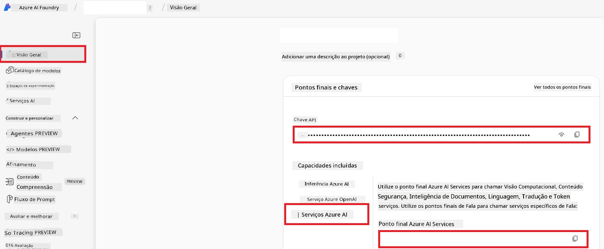

# Configurar o Azure AI para Co-op Translator (Azure OpenAI & Azure AI Vision)

Este guia explica como configurar o Azure OpenAI para tradução de idiomas e o Azure Computer Vision para análise de conteúdo de imagens (que pode depois ser usado para tradução baseada em imagens) dentro do Azure AI Foundry.

**Pré-requisitos:**
- Uma conta Azure com uma subscrição ativa.
- Permissões suficientes para criar recursos e implementações na sua subscrição Azure.

## Criar um Projeto Azure AI

Vai começar por criar um Projeto Azure AI, que atua como um local central para gerir os seus recursos de IA.

1. Navegue para [https://ai.azure.com](https://ai.azure.com) e inicie sessão com a sua conta Azure.

1. Selecione **+Create** para criar um novo projeto.

1. Execute as seguintes tarefas:
   - Introduza um **Nome do projeto** (por exemplo, `CoopTranslator-Project`).
   - Selecione o **AI hub** (por exemplo, `CoopTranslator-Hub`) (Crie um novo, se necessário).

1. Clique em "**Review and Create**" para configurar o seu projeto. Será levado à página de visão geral do seu projeto.

## Configurar Azure OpenAI para Tradução de Idiomas

Dentro do seu projeto, irá implementar um modelo Azure OpenAI para servir como backend para tradução de texto.

### Navegar para o seu Projeto

Se ainda não estiver, abra o seu projeto recém-criado (por exemplo, `CoopTranslator-Project`) no Azure AI Foundry.

### Implementar um Modelo OpenAI

1. No menu esquerdo do seu projeto, em "My assets", selecione "**Models + endpoints**".

1. Selecione **+ Deploy model**.

1. Selecione **Deploy Base Model**.

1. Será apresentada uma lista de modelos disponíveis. Filtre ou procure um modelo GPT adequado. Recomendamos `gpt-4o`.

1. Selecione o modelo pretendido e clique em **Confirm**.

1. Selecione **Deploy**.

### Configuração do Azure OpenAI

Depois de implementado, pode selecionar a implementação na página "**Models + endpoints**" para encontrar o seu **REST endpoint URL**, **Key**, **Deployment name**, **Model name** e **API version**. Estes serão necessários para integrar o modelo de tradução na sua aplicação.

> [!NOTE]
> Pode selecionar versões da API na página [API version deprecation](https://learn.microsoft.com/azure/ai-services/openai/api-version-deprecation) com base nas suas necessidades. Note que a **versão da API** é diferente da **versão do Modelo** mostrada na página **Models + endpoints** no Azure AI Foundry.

## Configurar Azure Computer Vision para Tradução de Imagem

Para permitir a tradução de texto dentro de imagens, é necessário obter a Chave API e o Endpoint do Serviço Azure AI.

1. Navegue para o seu Projeto Azure AI (por exemplo, `CoopTranslator-Project`). Certifique-se de que está na página de visão geral do projeto.

### Configuração do Serviço Azure AI

Encontre a Chave API e o Endpoint no Serviço Azure AI.

1. Navegue para o seu Projeto Azure AI (por exemplo, `CoopTranslator-Project`). Certifique-se de que está na página de visão geral do projeto.

1. Encontre a **Chave API** e o **Endpoint** na aba do Serviço Azure AI.

    

Esta ligação torna as capacidades do recurso de Serviços Azure AI associado (incluindo análise de imagens) disponíveis para o seu projeto AI Foundry. Pode então usar esta ligação nos seus notebooks ou aplicações para extrair texto de imagens, que pode subsequentemente ser enviado para o modelo Azure OpenAI para tradução.

## Consolidar as suas Credenciais

A esta altura, deverá ter recolhido o seguinte:

**Para Azure OpenAI (Tradução de Texto):**
- Endpoint Azure OpenAI
- Chave API Azure OpenAI
- Nome do Modelo Azure OpenAI (por exemplo, `gpt-4o`)
- Nome da Implementação Azure OpenAI (por exemplo, `cooptranslator-gpt4o`)
- Versão da API Azure OpenAI

**Para Serviços Azure AI (Extração de Texto de Imagem via Vision):**
- Endpoint do Serviço Azure AI
- Chave API do Serviço Azure AI

### Exemplo: Configuração de Variáveis de Ambiente (Pré-visualização)

Mais tarde, ao construir a sua aplicação, provavelmente irá configurá-la usando estas credenciais recolhidas. Por exemplo, pode defini-las como variáveis de ambiente assim:

```bash
# Credenciais do Serviço Azure AI (Obrigatórias para tradução de imagens)
AZURE_AI_SERVICE_API_KEY="your_azure_ai_service_api_key" # por exemplo, 21xasd...
AZURE_AI_SERVICE_ENDPOINT="https://your_azure_ai_service_endpoint.cognitiveservices.azure.com/"

# Conjuntos de reserva opcionais: variáveis duplicadas com o sufixo _1/_2 (mesmo índice para todas as variáveis do conjunto)
AZURE_AI_SERVICE_API_KEY_1="your_azure_ai_service_api_key_1"
AZURE_AI_SERVICE_ENDPOINT_1="https://your_azure_ai_service_endpoint_1.cognitiveservices.azure.com/"

# Credenciais Azure OpenAI (Obrigatórias para tradução de texto)
AZURE_OPENAI_API_KEY="your_azure_openai_api_key" # por exemplo, 21xasd...
AZURE_OPENAI_ENDPOINT="https://your_azure_openai_endpoint.openai.azure.com/"
AZURE_OPENAI_MODEL_NAME="your_model_name" # por exemplo, gpt-4o
AZURE_OPENAI_CHAT_DEPLOYMENT_NAME="your_deployment_name" # por exemplo, cooptranslator-gpt4o
AZURE_OPENAI_API_VERSION="your_api_version" # por exemplo, 2024-12-01-preview

# Conjuntos de reserva opcionais: duplicar o conjunto completo AZURE_OPENAI_* com sufixo _1/_2 (mesmo índice para todas as variáveis)
```

---

### Leituras Adicionais

- [Como Criar um projeto no Azure AI Foundry](https://learn.microsoft.com/azure/ai-foundry/how-to/create-projects?tabs=ai-studio)
- [Como Criar recursos Azure AI](https://learn.microsoft.com/azure/ai-foundry/how-to/create-azure-ai-resource?tabs=portal)
- [Como Implementar modelos OpenAI no Azure AI Foundry](https://learn.microsoft.com/en-us/azure/ai-foundry/how-to/deploy-models-openai)

---

<!-- CO-OP TRANSLATOR DISCLAIMER START -->
**Aviso Legal**:  
Este documento foi traduzido utilizando o serviço de tradução automática [Co-op Translator](https://github.com/Azure/co-op-translator). Embora nos esforcemos pela precisão, por favor tenha em conta que traduções automáticas podem conter erros ou imprecisões. O documento original na sua língua nativa deve ser considerado a fonte autoritativa. Para informação crítica, recomenda-se a tradução profissional efetuada por humanos. Não nos responsabilizamos por quaisquer falhas de compreensão ou interpretações erradas decorrentes da utilização desta tradução.
<!-- CO-OP TRANSLATOR DISCLAIMER END -->