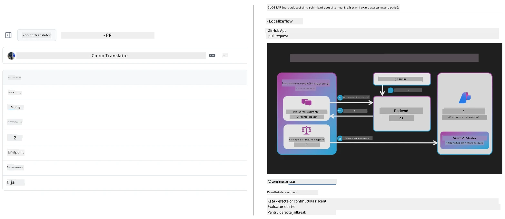
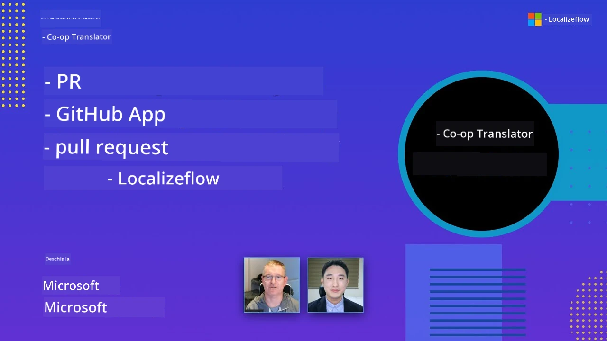

# Co-op Translator

_Automatizează și menține cu ușurință traducerile pentru conținutul tău educațional GitHub în mai multe limbi, pe măsură ce proiectul tău evoluează._


[](https://pypi.org/project/co-op-translator/)
[](https://github.com/azure/co-op-translator/blob/main/LICENSE)
[](https://pepy.tech/project/co-op-translator)
[](https://pepy.tech/project/co-op-translator)
[](https://github.com/azure/co-op-translator/pkgs/container/co-op-translator)
[](https://github.com/psf/black)

[](https://GitHub.com/azure/co-op-translator/graphs/contributors/)
[](https://GitHub.com/azure/co-op-translator/issues/)
[](https://GitHub.com/azure/co-op-translator/pulls/)
[](http://makeapullrequest.com)

### 🌐 Suport Multilingv

#### Suportat de [Co-op Translator](https://github.com/Azure/Co-op-Translator)

<!-- CO-OP TRANSLATOR LANGUAGES TABLE START -->
[Arabic](../ar/README.md) | [Bengali](../bn/README.md) | [Bulgarian](../bg/README.md) | [Burmese (Myanmar)](../my/README.md) | [Chinese (Simplified)](../zh-CN/README.md) | [Chinese (Traditional, Hong Kong)](../zh-HK/README.md) | [Chinese (Traditional, Macau)](../zh-MO/README.md) | [Chinese (Traditional, Taiwan)](../zh-TW/README.md) | [Croatian](../hr/README.md) | [Czech](../cs/README.md) | [Danish](../da/README.md) | [Dutch](../nl/README.md) | [Estonian](../et/README.md) | [Finnish](../fi/README.md) | [French](../fr/README.md) | [German](../de/README.md) | [Greek](../el/README.md) | [Hebrew](../he/README.md) | [Hindi](../hi/README.md) | [Hungarian](../hu/README.md) | [Indonesian](../id/README.md) | [Italian](../it/README.md) | [Japanese](../ja/README.md) | [Kannada](../kn/README.md) | [Khmer](../km/README.md) | [Korean](../ko/README.md) | [Lithuanian](../lt/README.md) | [Malay](../ms/README.md) | [Malayalam](../ml/README.md) | [Marathi](../mr/README.md) | [Nepali](../ne/README.md) | [Nigerian Pidgin](../pcm/README.md) | [Norwegian](../no/README.md) | [Persian (Farsi)](../fa/README.md) | [Polish](../pl/README.md) | [Portuguese (Brazil)](../pt-BR/README.md) | [Portuguese (Portugal)](../pt-PT/README.md) | [Punjabi (Gurmukhi)](../pa/README.md) | [Romanian](./README.md) | [Russian](../ru/README.md) | [Serbian (Cyrillic)](../sr/README.md) | [Slovak](../sk/README.md) | [Slovenian](../sl/README.md) | [Spanish](../es/README.md) | [Swahili](../sw/README.md) | [Swedish](../sv/README.md) | [Tagalog (Filipino)](../tl/README.md) | [Tamil](../ta/README.md) | [Telugu](../te/README.md) | [Thai](../th/README.md) | [Turkish](../tr/README.md) | [Ukrainian](../uk/README.md) | [Urdu](../ur/README.md) | [Vietnamese](../vi/README.md)

> **Preferi să clonezi local?**
>
> Acest depozit include traduceri în peste 50 de limbi ceea ce crește semnificativ dimensiunea descărcării. Pentru a clona fără traduceri, folosește sparse checkout:
>
> **Bash / macOS / Linux:**
> ```bash
> git clone --filter=blob:none --sparse https://github.com/skytin1004/co-op-translator.git
> cd co-op-translator
> git sparse-checkout set --no-cone '/*' '!translations' '!translated_images'
> ```
>
> **CMD (Windows):**
> ```cmd
> git clone --filter=blob:none --sparse https://github.com/skytin1004/co-op-translator.git
> cd co-op-translator
> git sparse-checkout set --no-cone "/*" "!translations" "!translated_images"
> ```
>
> Astfel obții tot ce ai nevoie pentru a finaliza cursul, cu o descărcare mult mai rapidă.
<!-- CO-OP TRANSLATOR LANGUAGES TABLE END -->

[](https://GitHub.com/azure/co-op-translator/watchers/)
[](https://GitHub.com/azure/co-op-translator/network/)
[](https://GitHub.com/azure/co-op-translator/stargazers/)

[](https://discord.gg/nTYy5BXMWG)

[](https://codespaces.new/azure/co-op-translator)

## Prezentare generală

**Co-op Translator** te ajută să îți localizezi conținutul educațional GitHub în mai multe limbi fără efort.  
Când actualizezi fișierele Markdown, imaginile sau caietele (notebooks), traducerile rămân sincronizate automat, asigurându-se că materialul tău rămâne precis și actualizat pentru cursanți din întreaga lume.

Exemplu de organizare a conținutului tradus:



## Cum este gestionată starea traducerii

Co-op Translator gestionează conținutul tradus ca **artefacte software versiunate**,  
nu ca fișiere statice.

Unealta urmărește starea fișierelor Markdown traduse, imaginilor și caietelor  
folosind **metadata pe limbaj**.

Această concepție permite Co-op Translator să:

- Detecteze fiabil traducerile învechite  
- Trateze consecvent fișierele Markdown, imaginile și caietele  
- Scaleze în siguranță în depozite mari, dinamice, multi-limă

Prin modelarea traducerilor ca artefacte gestionate,  
fluxurile de lucru pentru traduceri se aliniază natural cu practicile moderne  
de gestionare a dependențelor software și artefactelor.

→ [Cum este gestionată starea traducerii](https://techcommunity.microsoft.com/blog/azuredevcommunityblog/rethinking-documentation-translation-treating-translations-as-versioned-software/4491755)


## Început rapid

```bash
# Creează și activează un mediu virtual (recomandat)
python -m venv .venv
# Windows
.venv\Scripts\activate
# macOS/Linux
source .venv/bin/activate
# Instalează pachetul
pip install co-op-translator
# Traduce
translate -l "ko ja fr" -md
```

Docker:

```bash
# Trage imaginea publică de pe GHCR
docker pull ghcr.io/azure/co-op-translator:latest
# Rulează cu folderul curent montat și .env furnizat (Bash/Zsh)
docker run --rm -it --env-file .env -v "${PWD}:/work" ghcr.io/azure/co-op-translator:latest -l "ko ja fr" -md
```

## Configurare minimală

1. Asigură-te că ai o versiune Python suportată (în prezent 3.10-3.12). În poetry (pyproject.toml) acest lucru este gestionat automat.  
2. Creează un fișier `.env` folosind șablonul: [.env.template](../../.env.template)  
3. Configurează un furnizor LLM (Azure OpenAI sau OpenAI)  
4. (Opțional) Pentru traducerea imaginilor (`-img`), configurează Azure AI Vision  
5. (Opțional) Poți configura seturi multiple de acreditări duplicând variabilele cu sufixe precum `_1`, `_2` etc. Toate variabilele dintr-un set trebuie să aibă același sufix.  
6. (Recomandat) Curăță traducerile anterioare pentru a evita conflictele (ex. `translations/`)  
7. (Recomandat) Adaugă o secțiune pentru traduceri în README folosind [șablonul README limbi](./getting_started/README_languages_template.md)  
8. Vezi: [Configurare Azure AI](./getting_started/set-up-azure-ai.md)

## Utilizare

Tradu toate tipurile suportate:

```bash
translate -l "ko ja"
```

Doar Markdown:

```bash
translate -l "de" -md
```

Markdown + imagini:

```bash
translate -l "pt" -md -img
```

Doar caiete (notebooks):

```bash
translate -l "zh" -nb
```

Mai multe opțiuni: [Referință comenzi](./getting_started/command-reference.md)

## Funcționalități

- Traducere automată pentru Markdown, caiete și imagini  
- Menține traducerile sincronizate cu modificările sursă  
- Funcționează local (CLI) sau în CI (GitHub Actions)  
- Folosește Azure OpenAI sau OpenAI; Azure AI Vision opțional pentru imagini  
- Păstrează formatul și structura Markdown

## Documentație

- [Ghid de utilizare în linia de comandă](./getting_started/command-line-guide/command-line-guide.md)  
- [Ghid GitHub Actions (depozite publice și secrete standard)](./getting_started/github-actions-guide/github-actions-guide-public.md)  
- [Ghid GitHub Actions (depozite organizației Microsoft și configurări la nivel de organizație)](./getting_started/github-actions-guide/github-actions-guide-org.md)  
- [Șablon README limbi](./getting_started/README_languages_template.md)  
- [Limbi suportate](./getting_started/supported-languages.md)  
- [Contribuții](./CONTRIBUTING.md)  
- [Depanare](./getting_started/troubleshooting.md)

### Ghid specific Microsoft  
> [!NOTE]  
> Doar pentru întreținătorii depozitelor „Pentru Începători” Microsoft.

- [Actualizarea listei „alte cursuri” (doar pentru depozitele MS Beginners)](./getting_started/update-other-courses.md)

## Susține-ne și sprijină învățarea globală

Alătură-te revoluționării modului în care conținutul educațional este distribuit la nivel global! Oferă [Co-op Translator](https://github.com/azure/co-op-translator) un ⭐ pe GitHub și susține misiunea noastră de a elimina barierele de limbă în învățare și tehnologie. Interesul și contribuțiile tale au un impact semnificativ! Contribuțiile de cod și sugestiile de funcționalități sunt întotdeauna binevenite.

### Explorează conținut educațional Microsoft în limba ta

- [LangChain4j-for-Beginners](https://github.com/microsoft/LangChain4j-for-Beginners)  
- [AZD for Beginners](https://github.com/microsoft/AZD-for-beginners)  
- [Edge AI for Beginners](https://github.com/microsoft/edgeai-for-beginners)  
- [Model Context Protocol (MCP) For Beginners](https://github.com/microsoft/mcp-for-beginners)  
- [AI Agents for Beginners](https://github.com/microsoft/ai-agents-for-beginners)  
- [Generative AI for Beginners using .NET](https://github.com/microsoft/Generative-AI-for-beginners-dotnet)  
- [Generative AI for Beginners](https://github.com/microsoft/generative-ai-for-beginners)  
- [Generative AI for Beginners using Java](https://github.com/microsoft/generative-ai-for-beginners-java)  
- [ML for Beginners](https://aka.ms/ml-beginners)  
- [Data Science for Beginners](https://aka.ms/datascience-beginners)  
- [AI for Beginners](https://aka.ms/ai-beginners)  
- [Cybersecurity for Beginners](https://github.com/microsoft/Security-101)  
- [Web Dev for Beginners](https://aka.ms/webdev-beginners)  
- [IoT for Beginners](https://aka.ms/iot-beginners)  
- [PhiCookBook](https://github.com/microsoft/PhiCookBook)

## Prezentări video

👉 Apasă pe imaginea de mai jos pentru a urmări pe YouTube.

- **Open at Microsoft**: O scurtă introducere de 18 minute și un ghid rapid despre cum să folosești Co-op Translator.

  [](https://www.youtube.com/watch?v=jX_swfH_KNU)

## Contribuții

Acest proiect primește cu plăcere contribuții și sugestii. Ești interesat de a contribui la Azure Co-op Translator? Te rugăm să consulți [CONTRIBUTING.md](./CONTRIBUTING.md) pentru reguli despre cum poți ajuta la accesibilitatea Co-op Translator.

## Contribuitori
[](https://github.com/Azure/co-op-translator/graphs/contributors)

## Cod de conduită

Acest proiect a adoptat [Codul de conduită Open Source Microsoft](https://opensource.microsoft.com/codeofconduct/).
Pentru mai multe informații, consultați [Întrebările frecvente despre Codul de conduită](https://opensource.microsoft.com/codeofconduct/faq/) sau
contactați [opencode@microsoft.com](mailto:opencode@microsoft.com) pentru orice întrebări sau comentarii suplimentare.

## AI responsabil

Microsoft se angajează să ajute clienții să utilizeze produsele noastre AI în mod responsabil, să împărtășească experiențele noastre și să construiască parteneriate bazate pe încredere prin instrumente precum Notele de transparență și Evaluările impactului. Multe dintre aceste resurse pot fi găsite la [https://aka.ms/RAI](https://aka.ms/RAI).
Abordarea Microsoft pentru AI responsabilă se bazează pe principiile noastre AI de echitate, fiabilitate și siguranță, confidențialitate și securitate, incluziune, transparență și responsabilitate.

Modelele la scară largă pentru limbaj natural, imagine și vorbire - precum cele utilizate în acest exemplu - se pot comporta potențial în moduri inechitabile, nesigure sau ofensatoare, cauzând astfel daune. Vă rugăm să consultați [nota de transparență a serviciului Azure OpenAI](https://learn.microsoft.com/legal/cognitive-services/openai/transparency-note?tabs=text) pentru a fi informat despre riscuri și limitări.

Abordarea recomandată pentru atenuarea acestor riscuri este să includeți un sistem de siguranță în arhitectura dumneavoastră care să poată detecta și preveni comportamentul dăunător. [Azure AI Content Safety](https://learn.microsoft.com/azure/ai-services/content-safety/overview) oferă un strat independent de protecție, capabil să detecteze conținut dăunător generat de utilizatori și AI în aplicații și servicii. Azure AI Content Safety include API-uri pentru text și imagine care vă permit să detectați materiale dăunătoare. De asemenea, avem un Content Safety Studio interactiv care vă permite să vizualizați, să explorați și să testați cod de exemplu pentru detectarea conținutului dăunător în diferite modalități. Următoarea [documentație de început rapid](https://learn.microsoft.com/azure/ai-services/content-safety/quickstart-text?tabs=visual-studio%2Clinux&pivots=programming-language-rest) vă ghidează în efectuarea cererilor către serviciu.

Un alt aspect de luat în considerare este performanța generală a aplicației. În aplicațiile multi-modal și multi-model, considerăm performanța ca fiind faptul că sistemul funcționează așa cum vă așteptați dumneavoastră și utilizatorii dumneavoastră, inclusiv să nu genereze rezultate dăunătoare. Este important să evaluați performanța aplicației dumneavoastră utilizând [metrici de calitate a generării și de risc și siguranță](https://learn.microsoft.com/azure/ai-studio/concepts/evaluation-metrics-built-in).

Puteți evalua aplicația dvs. AI în mediul de dezvoltare folosind [prompt flow SDK](https://microsoft.github.io/promptflow/index.html). Dată fiind o bază de date de test sau un scop, generațiile aplicației dvs. AI generative sunt măsurate cantitativ cu evaluatori încorporați sau evaluatori personalizați la alegerea dvs. Pentru a începe să utilizați prompt flow sdk pentru a evalua sistemul, puteți urma [ghidul de început rapid](https://learn.microsoft.com/azure/ai-studio/how-to/develop/flow-evaluate-sdk). După ce efectuați o rulare de evaluare, puteți [vizualiza rezultatele în Azure AI Studio](https://learn.microsoft.com/azure/ai-studio/how-to/evaluate-flow-results).

## Mărci comerciale

Acest proiect poate conține mărci comerciale sau logo-uri pentru proiecte, produse sau servicii. Utilizarea autorizată a
mărcilor comerciale sau logo-urilor Microsoft este supusă și trebuie să respecte
[Regulile de utilizare a mărcilor comerciale și brandului Microsoft](https://www.microsoft.com/en-us/legal/intellectualproperty/trademarks/usage/general).
Utilizarea mărcilor comerciale sau logo-urilor Microsoft în versiuni modificate ale acestui proiect nu trebuie să provoace confuzie sau să implice sponsorizarea Microsoft.
Orice utilizare a mărcilor comerciale sau logo-urilor unor terți este supusă politicilor acelor terțe părți.

## Obținerea ajutorului

Dacă aveți probleme sau întrebări despre construirea aplicațiilor AI, alăturați-vă:

[](https://discord.gg/nTYy5BXMWG)

Dacă aveți feedback despre produs sau erori în timpul construirii, vizitați:

[](https://aka.ms/foundry/forum)

---

<!-- CO-OP TRANSLATOR DISCLAIMER START -->
**Declinare de responsabilitate**:  
Acest document a fost tradus folosind serviciul de traducere AI [Co-op Translator](https://github.com/Azure/co-op-translator). Deși ne străduim pentru acuratețe, vă rugăm să rețineți că traducerile automate pot conține erori sau inexactități. Documentul original în limba sa nativă trebuie considerat sursa autorizată. Pentru informații critice, se recomandă traducerea profesională realizată de un specialist uman. Nu ne asumăm responsabilitatea pentru eventualele neînțelegeri sau interpretări greșite rezultate din utilizarea acestei traduceri.
<!-- CO-OP TRANSLATOR DISCLAIMER END -->