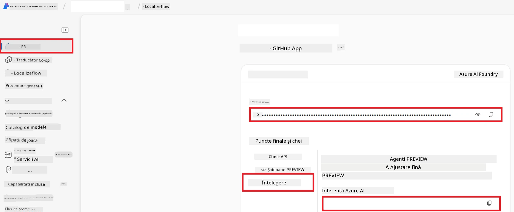

# Configurați Azure AI pentru Co-op Translator (Azure OpneAI & Azure AI Vision)

Acest ghid vă ghidează prin configurarea Azure OpenAI pentru traducerea limbajului și Azure Computer Vision pentru analiza conținutului imaginii (care poate fi apoi folosită pentru traducerea bazată pe imagini) în Azure AI Foundry.

**Precondiții:**
- Un cont Azure cu un abonament activ.
- Permisiuni suficiente pentru a crea resurse și implementări în abonamentul dvs. Azure.

## Creați un Proiect Azure AI

Veți începe prin a crea un Proiect Azure AI, care acționează ca un loc central pentru gestionarea resurselor AI.

1. Accesați [https://ai.azure.com](https://ai.azure.com) și conectați-vă cu contul dvs. Azure.

1. Selectați **+Create** pentru a crea un proiect nou.

1. Efectuați următoarele activități:
   - Introduceți un **Nume de proiect** (de exemplu, `CoopTranslator-Project`).
   - Selectați **AI hub** (de exemplu, `CoopTranslator-Hub`) (Creați unul nou dacă este necesar).

1. Faceți clic pe "**Review and Create**" pentru a configura proiectul. Veți fi direcționat către pagina de prezentare generală a proiectului.

## Configurați Azure OpenAI pentru traducerea limbajului

În cadrul proiectului dvs., veți implementa un model Azure OpenAI care să servească drept backend pentru traducerea textului.

### Navigați la Proiectul Dvs.

Dacă nu sunteți deja acolo, deschideți proiectul dvs. nou creat (de exemplu, `CoopTranslator-Project`) în Azure AI Foundry.

### Implementați un Model OpenAI

1. Din meniul din stânga al proiectului, sub „My assets”, selectați "**Models + endpoints**".

1. Selectați **+ Deploy model**.

1. Selectați **Deploy Base Model**.

1. Vi se va afișa o listă cu modelele disponibile. Filtrați sau căutați un model GPT potrivit. Recomandăm `gpt-4o`.

1. Selectați modelul dorit și faceți clic pe **Confirm**.

1. Selectați **Deploy**.

### Configurarea Azure OpenAI

După implementare, puteți selecta implementarea din pagina "**Models + endpoints**" pentru a găsi **URL-ul endpoint-ului REST**, **Cheia**, **Numele implementării**, **Numele modelului** și **Versiunea API**. Acestea vor fi necesare pentru a integra modelul de traducere în aplicația dvs.

> [!NOTE]
> Puteți selecta versiunile API de pe pagina [API version deprecation](https://learn.microsoft.com/azure/ai-services/openai/api-version-deprecation) în funcție de cerințele dvs. Rețineți că **versiunea API** este diferită de **versiunea modelului** afișată pe pagina **Models + endpoints** în Azure AI Foundry.

## Configurați Azure Computer Vision pentru traducerea imaginilor

Pentru a activa traducerea textului din imagini, trebuie să găsiți cheia API și endpoint-ul serviciului Azure AI.

1. Accesați Proiectul dvs. Azure AI (de exemplu, `CoopTranslator-Project`). Asigurați-vă că vă aflați în pagina de prezentare generală a proiectului.

### Configurarea serviciului Azure AI

Găsiți cheia API și endpoint-ul din serviciul Azure AI.

1. Accesați Proiectul dvs. Azure AI (de exemplu, `CoopTranslator-Project`). Asigurați-vă că vă aflați în pagina de prezentare generală a proiectului.

1. Găsiți **Cheia API** și **Endpoint** din fila serviciului Azure AI.

    

Această conexiune face ca funcționalitățile resursei Azure AI Services conectate (inclusiv analiza imaginii) să fie disponibile în proiectul dvs. AI Foundry. Puteți apoi folosi această conexiune în caietele dvs. ori aplicații pentru a extrage text din imagini, care poate fi trimis ulterior către modelul Azure OpenAI pentru traducere.

## Consolidarea acreditărilor dvs.

Până acum, ar trebui să fi colectat următoarele:

**Pentru Azure OpenAI (Traducere de text):**
- Endpoint Azure OpenAI
- Cheia API Azure OpenAI
- Numele modelului Azure OpenAI (de exemplu, `gpt-4o`)
- Numele implementării Azure OpenAI (de exemplu, `cooptranslator-gpt4o`)
- Versiunea API Azure OpenAI

**Pentru serviciile Azure AI (Extracția textului din imagini prin Vision):**
- Endpoint serviciu Azure AI
- Cheia API serviciu Azure AI

### Exemplu: Configurarea variabilelor de mediu (Previzualizare)

Ulterior, când veți construi aplicația dvs., cel mai probabil veți configura folosind aceste acreditări colectate. De exemplu, le puteți seta ca variabile de mediu astfel:

```bash
# Credentiale serviciu Azure AI (Necesare pentru traducerea imaginilor)
AZURE_AI_SERVICE_API_KEY="your_azure_ai_service_api_key" # de exemplu, 21xasd...
AZURE_AI_SERVICE_ENDPOINT="https://your_azure_ai_service_endpoint.cognitiveservices.azure.com/"

# Seturi de rezervă opționale: variabile duplicate cu sufixul _1/_2 (același index pentru toate variabilele din set)
AZURE_AI_SERVICE_API_KEY_1="your_azure_ai_service_api_key_1"
AZURE_AI_SERVICE_ENDPOINT_1="https://your_azure_ai_service_endpoint_1.cognitiveservices.azure.com/"

# Credentiale Azure OpenAI (Necesare pentru traducerea textului)
AZURE_OPENAI_API_KEY="your_azure_openai_api_key" # de exemplu, 21xasd...
AZURE_OPENAI_ENDPOINT="https://your_azure_openai_endpoint.openai.azure.com/"
AZURE_OPENAI_MODEL_NAME="your_model_name" # de exemplu, gpt-4o
AZURE_OPENAI_CHAT_DEPLOYMENT_NAME="your_deployment_name" # de exemplu, cooptranslator-gpt4o
AZURE_OPENAI_API_VERSION="your_api_version" # de exemplu, 2024-12-01-preview

# Seturi de rezervă opționale: dublați întregul set AZURE_OPENAI_* cu sufixul _1/_2 (același index pentru toate variabilele)
```

---

### Lecturi suplimentare

- [Cum să creați un proiect în Azure AI Foundry](https://learn.microsoft.com/azure/ai-foundry/how-to/create-projects?tabs=ai-studio)
- [Cum să creați resurse Azure AI](https://learn.microsoft.com/azure/ai-foundry/how-to/create-azure-ai-resource?tabs=portal)
- [Cum să implementați modele OpenAI în Azure AI Foundry](https://learn.microsoft.com/en-us/azure/ai-foundry/how-to/deploy-models-openai)

---

<!-- CO-OP TRANSLATOR DISCLAIMER START -->
**Declinare a responsabilității**:
Acest document a fost tradus folosind serviciul de traducere AI [Co-op Translator](https://github.com/Azure/co-op-translator). Deși ne străduim pentru acuratețe, vă rugăm să fiți conștienți că traducerile automate pot conține erori sau inexactități. Documentul original în limba sa nativă trebuie considerat sursa autorizată. Pentru informații critice, se recomandă traducerea profesională realizată de un specialist uman. Nu ne asumăm răspunderea pentru eventualele neînțelegeri sau interpretări greșite rezultate din utilizarea acestei traduceri.
<!-- CO-OP TRANSLATOR DISCLAIMER END -->