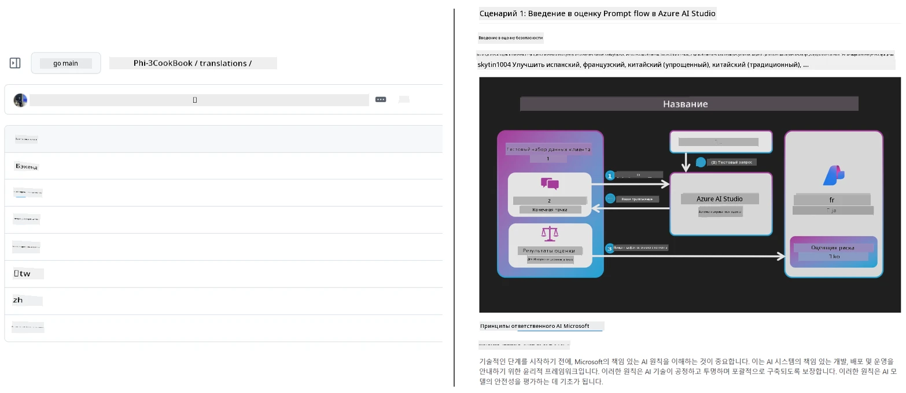
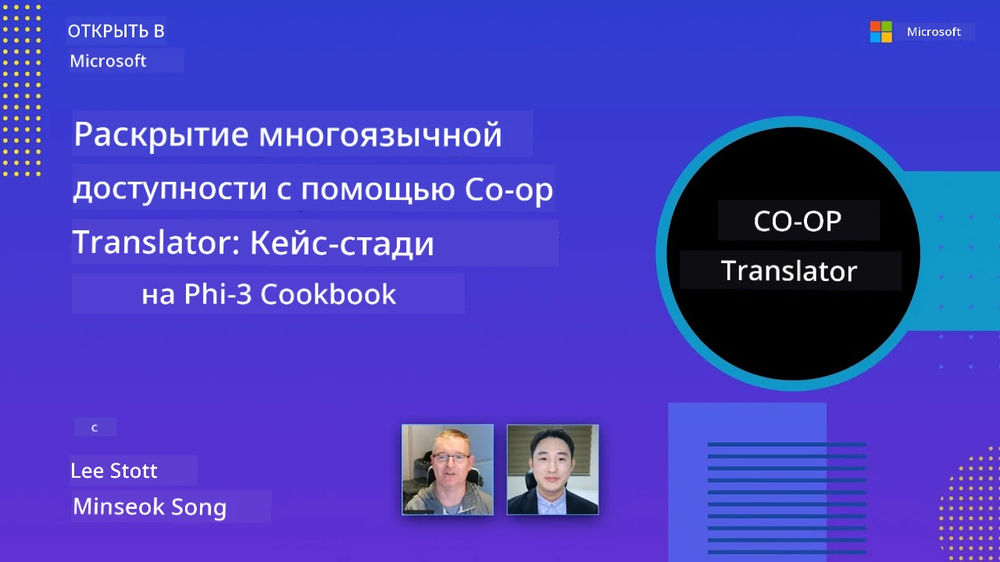

# Co-op Translator

_Легко автоматизируйте и поддерживайте переводы вашего образовательного контента на GitHub на нескольких языках по мере развития вашего проекта._


[](https://pypi.org/project/co-op-translator/)
[](https://github.com/azure/co-op-translator/blob/main/LICENSE)
[](https://pepy.tech/project/co-op-translator)
[](https://pepy.tech/project/co-op-translator)
[](https://github.com/azure/co-op-translator/pkgs/container/co-op-translator)
[](https://github.com/psf/black)

[](https://GitHub.com/azure/co-op-translator/graphs/contributors/)
[](https://GitHub.com/azure/co-op-translator/issues/)
[](https://GitHub.com/azure/co-op-translator/pulls/)
[](http://makeapullrequest.com)

### 🌐 Поддержка нескольких языков

#### Поддерживается [Co-op Translator](https://github.com/Azure/Co-op-Translator)

<!-- CO-OP TRANSLATOR LANGUAGES TABLE START -->
[Arabic](../ar/README.md) | [Bengali](../bn/README.md) | [Bulgarian](../bg/README.md) | [Burmese (Myanmar)](../my/README.md) | [Chinese (Simplified)](../zh-CN/README.md) | [Chinese (Traditional, Hong Kong)](../zh-HK/README.md) | [Chinese (Traditional, Macau)](../zh-MO/README.md) | [Chinese (Traditional, Taiwan)](../zh-TW/README.md) | [Croatian](../hr/README.md) | [Czech](../cs/README.md) | [Danish](../da/README.md) | [Dutch](../nl/README.md) | [Estonian](../et/README.md) | [Finnish](../fi/README.md) | [French](../fr/README.md) | [German](../de/README.md) | [Greek](../el/README.md) | [Hebrew](../he/README.md) | [Hindi](../hi/README.md) | [Hungarian](../hu/README.md) | [Indonesian](../id/README.md) | [Italian](../it/README.md) | [Japanese](../ja/README.md) | [Kannada](../kn/README.md) | [Khmer](../km/README.md) | [Korean](../ko/README.md) | [Lithuanian](../lt/README.md) | [Malay](../ms/README.md) | [Malayalam](../ml/README.md) | [Marathi](../mr/README.md) | [Nepali](../ne/README.md) | [Nigerian Pidgin](../pcm/README.md) | [Norwegian](../no/README.md) | [Persian (Farsi)](../fa/README.md) | [Polish](../pl/README.md) | [Portuguese (Brazil)](../pt-BR/README.md) | [Portuguese (Portugal)](../pt-PT/README.md) | [Punjabi (Gurmukhi)](../pa/README.md) | [Romanian](../ro/README.md) | [Russian](./README.md) | [Serbian (Cyrillic)](../sr/README.md) | [Slovak](../sk/README.md) | [Slovenian](../sl/README.md) | [Spanish](../es/README.md) | [Swahili](../sw/README.md) | [Swedish](../sv/README.md) | [Tagalog (Filipino)](../tl/README.md) | [Tamil](../ta/README.md) | [Telugu](../te/README.md) | [Thai](../th/README.md) | [Turkish](../tr/README.md) | [Ukrainian](../uk/README.md) | [Urdu](../ur/README.md) | [Vietnamese](../vi/README.md)

> **Предпочитаете клонировать локально?**
>
> В этом репозитории содержится более 50 языковых переводов, что значительно увеличивает размер загрузки. Чтобы клонировать без переводов, используйте sparse checkout:
>
> **Bash / macOS / Linux:**
> ```bash
> git clone --filter=blob:none --sparse https://github.com/Azure/co-op-translator.git
> cd co-op-translator
> git sparse-checkout set --no-cone '/*' '!translations' '!translated_images'
> ```
>
> **CMD (Windows):**
> ```cmd
> git clone --filter=blob:none --sparse https://github.com/Azure/co-op-translator.git
> cd co-op-translator
> git sparse-checkout set --no-cone "/*" "!translations" "!translated_images"
> ```
>
> Это даст вам все необходимое для прохождения курса с гораздо более быстрой загрузкой.
<!-- CO-OP TRANSLATOR LANGUAGES TABLE END -->

[](https://GitHub.com/azure/co-op-translator/watchers/)
[](https://GitHub.com/azure/co-op-translator/network/)
[](https://GitHub.com/azure/co-op-translator/stargazers/)

[](https://discord.gg/nTYy5BXMWG)

[](https://codespaces.new/azure/co-op-translator)

## Обзор

**Co-op Translator** помогает локализовать ваш образовательный контент на GitHub на несколько языков без усилий.  
Когда вы обновляете ваши Markdown-файлы, изображения или ноутбуки, переводы автоматически синхронизируются, гарантируя, что ваш контент остается точным и актуальным для учащихся по всему миру.

Пример организации переведенного контента:



## Как управляется состояние перевода

Co-op Translator управляет переведенным контентом как **версионированными программными артефактами**,  
а не как статическими файлами.

Инструмент отслеживает состояние переведенных Markdown, изображений и ноутбуков  
с использованием **метаданных с привязкой к языку**.

Такая конструкция позволяет Co-op Translator:

- Надежно обнаруживать устаревшие переводы
- Последовательно обрабатывать Markdown, изображения и ноутбуки
- Безопасно масштабироваться в больших, быстро развивающихся, многоязычных репозиториях

Моделируя переводы как управляемые артефакты,  
рабочие процессы перевода естественно соответствуют современным  
практикам управления зависимостями и артефактами в программном обеспечении.

→ [Как управляется состояние перевода](https://techcommunity.microsoft.com/blog/azuredevcommunityblog/rethinking-documentation-translation-treating-translations-as-versioned-software/4491755)


## Быстрый старт

```bash
# Создайте и активируйте виртуальное окружение (рекомендуется)
python -m venv .venv
# Windows
.venv\Scripts\activate
# macOS/Linux
source .venv/bin/activate
# Установите пакет
pip install co-op-translator
# Перевести
translate -l "ko ja fr" -md
```

Docker:

```bash
# Получить публичный образ с GHCR
docker pull ghcr.io/azure/co-op-translator:latest
# Запустить с текущей папкой, смонтированной и предоставленным .env (Bash/Zsh)
docker run --rm -it --env-file .env -v "${PWD}:/work" ghcr.io/azure/co-op-translator:latest -l "ko ja fr" -md
```

## Минимальная настройка

1. Убедитесь, что у вас установлена поддерживаемая версия Python (в настоящее время 3.10-3.12). В poetry (pyproject.toml) это обрабатывается автоматически.
2. Создайте файл `.env` используя шаблон: [.env.template](../../.env.template)
3. Настройте одного поставщика LLM (Azure OpenAI или OpenAI)
4. (Опционально) Для перевода изображений (`-img`) настройте Azure AI Vision
5. (Опционально) Вы можете настроить несколько наборов учетных данных, дублируя переменные с суффиксами, такими как `_1`, `_2` и т.д. Все переменные в наборе должны иметь одинаковый суффикс.
6. (Рекомендуется) Очистите предыдущие переводы, чтобы избежать конфликтов (например, `translations/`)
7. (Рекомендуется) Добавьте раздел перевода в ваш README используя шаблон [README languages template](./getting_started/README_languages_template.md)
8. См. также: [Настройка Azure AI](./getting_started/set-up-azure-ai.md)

## Использование

Перевести все поддерживаемые типы:

```bash
translate -l "ko ja"
```

Только Markdown:

```bash
translate -l "de" -md
```

Markdown + изображения:

```bash
translate -l "pt" -md -img
```

Только ноутбуки:

```bash
translate -l "zh" -nb
```

Больше флагов: [Командная справка](./getting_started/command-reference.md)

## Особенности

- Автоматизированный перевод Markdown, ноутбуков и изображений
- Поддерживает синхронизацию переводов с изменениями источника
- Работает локально (CLI) или в CI (GitHub Actions)
- Использует Azure OpenAI или OpenAI; опционально Azure AI Vision для изображений
- Сохраняет форматирование и структуру Markdown

## Документация

- [Руководство по командной строке](./getting_started/command-line-guide/command-line-guide.md)
- [Руководство по GitHub Actions (публичные репозитории и стандартные секреты)](./getting_started/github-actions-guide/github-actions-guide-public.md)
- [Руководство по GitHub Actions (репозитории организации Microsoft и настройки на уровне организации)](./getting_started/github-actions-guide/github-actions-guide-org.md)
- [Шаблон языков для README](./getting_started/README_languages_template.md)
- [Поддерживаемые языки](./getting_started/supported-languages.md)
- [Участие (contributing)](./CONTRIBUTING.md)
- [Устранение неполадок](./getting_started/troubleshooting.md)

### Руководство для Microsoft
> [!NOTE]
> Только для кураторов репозиториев Microsoft “Для начинающих”.

- [Обновление списка “других курсов” (только для репозиториев MS Beginners)](./getting_started/update-other-courses.md)

## Поддержите нас и способствуйте глобальному обучению

Присоединяйтесь к нам в революции того, как образовательный контент распространяется по всему миру! Поставьте ⭐ [Co-op Translator](https://github.com/azure/co-op-translator) на GitHub и поддержите нашу миссию преодолеть языковые барьеры в обучении и технологиях. Ваш интерес и вклад имеют значительное значение! Мы всегда рады вашим кодовым улучшениям и предложениям по функциям.

### Изучайте образовательный контент Microsoft на вашем языке

- [LangChain4j-for-Beginners](https://github.com/microsoft/LangChain4j-for-Beginners)
- [AZD for Beginners](https://github.com/microsoft/AZD-for-beginners)
- [Edge AI for Beginners](https://github.com/microsoft/edgeai-for-beginners)
- [Model Context Protocol (MCP) For Beginners](https://github.com/microsoft/mcp-for-beginners)
- [AI Agents for Beginners](https://github.com/microsoft/ai-agents-for-beginners)
- [Generative AI for Beginners using .NET](https://github.com/microsoft/Generative-AI-for-beginners-dotnet)
- [Generative AI for Beginners](https://github.com/microsoft/generative-ai-for-beginners)
- [Generative AI for Beginners using Java](https://github.com/microsoft/generative-ai-for-beginners-java)
- [ML for Beginners](https://aka.ms/ml-beginners)
- [Data Science for Beginners](https://aka.ms/datascience-beginners)
- [AI for Beginners](https://aka.ms/ai-beginners)
- [Cybersecurity for Beginners](https://github.com/microsoft/Security-101)
- [Web Dev for Beginners](https://aka.ms/webdev-beginners)
- [IoT for Beginners](https://aka.ms/iot-beginners)
- [PhiCookBook](https://github.com/microsoft/PhiCookBook)

## Видео презентации

👉 Нажмите на изображение ниже, чтобы посмотреть на YouTube.

- **Open at Microsoft**: Краткое 18-минутное введение и быстрое руководство по использованию Co-op Translator.

  [](https://www.youtube.com/watch?v=jX_swfH_KNU)

## Участие

Этот проект приветствует ваши идеи и предложения. Хотите внести вклад в Azure Co-op Translator? Пожалуйста, ознакомьтесь с нашим [CONTRIBUTING.md](./CONTRIBUTING.md) с рекомендациями, как вы можете помочь сделать Co-op Translator более доступным.

## Участники проекта
[](https://github.com/Azure/co-op-translator/graphs/contributors)

## Кодекс поведения

В этом проекте принят [Кодекс поведения для проектов с открытым исходным кодом Microsoft](https://opensource.microsoft.com/codeofconduct/).
Дополнительную информацию смотрите в [ЧАВО по Кодексу поведения](https://opensource.microsoft.com/codeofconduct/faq/) или
свяжитесь по адресу [opencode@microsoft.com](mailto:opencode@microsoft.com) для любых дополнительных вопросов или комментариев.

## Ответственный ИИ

Microsoft стремится помогать нашим клиентам ответственно использовать наши ИИ-продукты, делиться нашими знаниями и строить партнерские отношения, основанные на доверии, с помощью таких инструментов, как Transparency Notes и Impact Assessments. Многие из этих ресурсов доступны по адресу [https://aka.ms/RAI](https://aka.ms/RAI).
Подход Microsoft к ответственному ИИ основан на наших принципах ИИ: справедливость, надежность и безопасность, конфиденциальность и безопасность, инклюзивность, прозрачность и подотчетность.

Крупномасштабные модели на основе естественного языка, изображений и речи — подобные тем, что используются в этом примере — могут потенциально вести себя несправедливо, ненадежно или оскорбительно, что может причинить вред. Пожалуйста, ознакомьтесь с [Замечанием о прозрачности сервиса Azure OpenAI](https://learn.microsoft.com/legal/cognitive-services/openai/transparency-note?tabs=text), чтобы быть информированным о рисках и ограничениях.

Рекомендуемый подход к снижению этих рисков — включить в вашу архитектуру систему безопасности, которая может обнаруживать и предотвращать вредоносное поведение. [Azure AI Content Safety](https://learn.microsoft.com/azure/ai-services/content-safety/overview) предоставляет независимый уровень защиты, способный обнаруживать вредоносный пользовательский и сгенерированный ИИ контент в приложениях и службах. Azure AI Content Safety включает API для текста и изображений, которые позволяют выявлять вредоносные материалы. У нас также есть интерактивная лаборатория Content Safety Studio, которая позволяет просматривать, исследовать и пробовать пример кода для обнаружения вредоносного контента в разных модальностях. Следующая [документация по быстрому старту](https://learn.microsoft.com/azure/ai-services/content-safety/quickstart-text?tabs=visual-studio%2Clinux&pivots=programming-language-rest) проведет вас через процесс отправки запросов к сервису.

Еще одним аспектом, который следует учитывать, является общая производительность приложения. В многомодальных и мультимодельных приложениях под производительностью понимается, что система работает так, как вы и ваши пользователи ожидаете, включая отсутствие генерации вредоносных результатов. Важно оценивать производительность вашего общего приложения с использованием [метрик качества генерации и рисков и безопасности](https://learn.microsoft.com/azure/ai-studio/concepts/evaluation-metrics-built-in).

Вы можете оценить ваше ИИ-приложение в среде разработки с помощью [prompt flow SDK](https://microsoft.github.io/promptflow/index.html). Имея набор тестовых данных или цель, генерируемый вашим ИИ результат количественно измеряется встроенными или пользовательскими оценщиками. Чтобы начать работу с prompt flow sdk для оценки вашей системы, следуйте [руководству по быстрому старту](https://learn.microsoft.com/azure/ai-studio/how-to/develop/flow-evaluate-sdk). После выполнения оценки вы можете [визуализировать результаты в Azure AI Studio](https://learn.microsoft.com/azure/ai-studio/how-to/evaluate-flow-results).

## Торговые марки

В этом проекте могут использоваться торговые марки или логотипы проектов, продуктов или сервисов. Авторизованное использование торговых марок или логотипов Microsoft регулируется и должно соответствовать
[Правилам использования торговых марок и брендов Microsoft](https://www.microsoft.com/en-us/legal/intellectualproperty/trademarks/usage/general).
Использование торговых марок или логотипов Microsoft в изменённых версиях этого проекта не должно вызывать путаницы или подразумевать спонсорство Microsoft.
Любое использование торговых марок или логотипов третьих сторон подчиняется политикам этих сторон.

## Получение помощи

Если у вас возникли трудности или вопросы по созданию ИИ-приложений, присоединяйтесь:

[](https://discord.gg/nTYy5BXMWG)

Если у вас есть отзывы по продукту или ошибки при разработке, посетите:

[](https://aka.ms/foundry/forum)

---

<!-- CO-OP TRANSLATOR DISCLAIMER START -->
**Отказ от ответственности**:  
Этот документ был переведен с помощью службы автоматического перевода [Co-op Translator](https://github.com/Azure/co-op-translator). Несмотря на наши усилия обеспечить точность, имейте в виду, что автоматический перевод может содержать ошибки или неточности. Оригинальный документ на его родном языке следует считать авторитетным источником. Для получения критически важной информации рекомендуется воспользоваться профессиональным переводом человеком. Мы не несем ответственности за любые недоразумения или неправильные толкования, возникающие в результате использования этого перевода.
<!-- CO-OP TRANSLATOR DISCLAIMER END -->