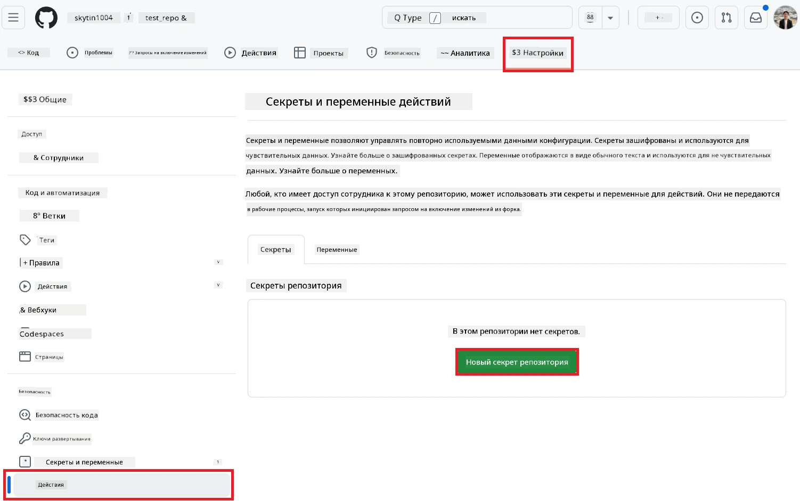
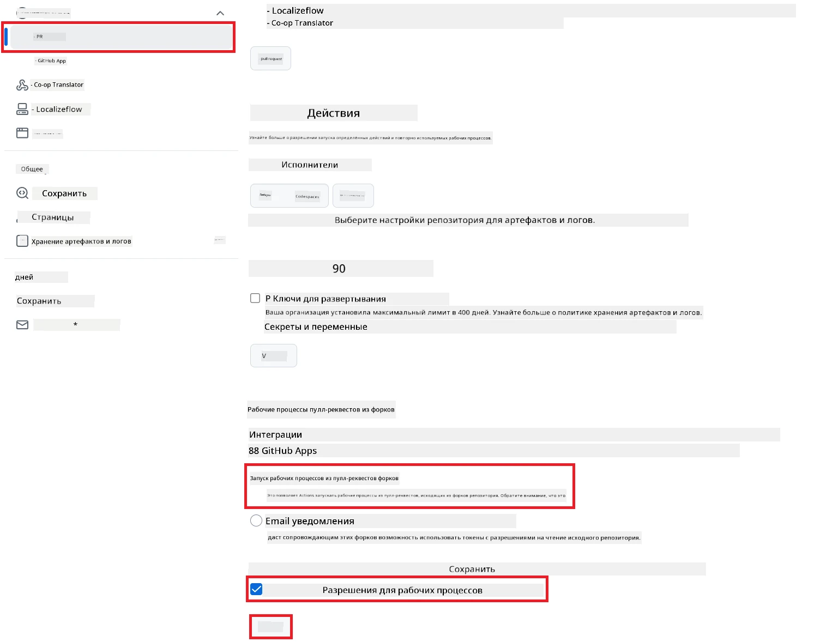

# Использование Co-op Translator GitHub Action (Публичная настройка)

**Целевая аудитория:** Это руководство предназначено для пользователей большинства публичных или приватных репозиториев, где достаточно стандартных разрешений GitHub Actions. Используется встроенный `GITHUB_TOKEN`.

Автоматизируйте перевод документации вашего репозитория с помощью Co-op Translator GitHub Action. В этом руководстве показано, как настроить действие для автоматического создания pull request'ов с обновлёнными переводами при изменении исходных Markdown-файлов или изображений.

> [!IMPORTANT]
>
> **Выбор подходящего руководства:**
>
> В этом руководстве описана **более простая настройка с использованием стандартного `GITHUB_TOKEN`**. Этот способ рекомендуется большинству пользователей, так как не требует управления приватными ключами GitHub App.
>

## Предварительные требования

Перед настройкой GitHub Action убедитесь, что у вас есть необходимые учётные данные для AI-сервиса.

**1. Обязательно: Учётные данные языковой модели AI**
Вам нужны учётные данные хотя бы для одной поддерживаемой языковой модели:

- **Azure OpenAI**: Требуется Endpoint, API Key, имена модели/деплоймента, версия API.
- **OpenAI**: Требуется API Key, (опционально: Org ID, Base URL, Model ID).
- Подробнее смотрите [Поддерживаемые модели и сервисы](../../../../README.md).

**2. Опционально: Учётные данные AI Vision (для перевода изображений)**

- Требуется только если нужно переводить текст на изображениях.
- **Azure AI Vision**: Требуется Endpoint и Subscription Key.
- Если не указано, действие работает в [режиме только Markdown](../markdown-only-mode.md).

## Настройка и конфигурация

Следуйте этим шагам для настройки Co-op Translator GitHub Action в вашем репозитории с использованием стандартного `GITHUB_TOKEN`.

### Шаг 1: Понимание аутентификации (использование `GITHUB_TOKEN`)

Этот workflow использует встроенный `GITHUB_TOKEN`, предоставляемый GitHub Actions. Этот токен автоматически даёт необходимые разрешения для работы с репозиторием согласно настройкам, указанным в **Шаге 3**.

### Шаг 2: Настройка секретов репозитория

Вам нужно добавить только **учётные данные AI-сервиса** как зашифрованные секреты в настройках репозитория.

1.  Перейдите в нужный репозиторий на GitHub.
2.  Откройте **Settings** > **Secrets and variables** > **Actions**.
3.  В разделе **Repository secrets** нажмите **New repository secret** для каждого необходимого секрета AI-сервиса из списка ниже.

     *(Ссылка на изображение: показывает, где добавить секреты)*

**Необходимые секреты AI-сервиса (добавьте ВСЕ, которые подходят по вашим требованиям):**

| Имя секрета                         | Описание                                   | Источник значения                  |
| :---------------------------------- | :---------------------------------------- | :------------------------------- |
| `AZURE_AI_SERVICE_API_KEY`            | Ключ для Azure AI Service (Computer Vision)  | Ваш Azure AI Foundry               |
| `AZURE_AI_SERVICE_ENDPOINT`         | Endpoint для Azure AI Service (Computer Vision) | Ваш Azure AI Foundry               |
| `AZURE_OPENAI_API_KEY`              | Ключ для Azure OpenAI service              | Ваш Azure AI Foundry               |
| `AZURE_OPENAI_ENDPOINT`             | Endpoint для Azure OpenAI service          | Ваш Azure AI Foundry               |
| `AZURE_OPENAI_MODEL_NAME`           | Имя вашей модели Azure OpenAI              | Ваш Azure AI Foundry               |
| `AZURE_OPENAI_CHAT_DEPLOYMENT_NAME` | Имя деплоймента Azure OpenAI               | Ваш Azure AI Foundry               |
| `AZURE_OPENAI_API_VERSION`          | Версия API для Azure OpenAI                | Ваш Azure AI Foundry               |
| `OPENAI_API_KEY`                    | API Key для OpenAI                         | Ваша платформа OpenAI              |
| `OPENAI_ORG_ID`                     | ID организации OpenAI (опционально)        | Ваша платформа OpenAI              |
| `OPENAI_CHAT_MODEL_ID`              | ID конкретной модели OpenAI (опционально)  | Ваша платформа OpenAI              |
| `OPENAI_BASE_URL`                   | Кастомный Base URL API OpenAI (опционально)| Ваша платформа OpenAI              |

### Шаг 3: Настройка разрешений workflow

Для работы GitHub Action нужны разрешения через `GITHUB_TOKEN` для доступа к коду и создания pull request'ов.

1.  В репозитории откройте **Settings** > **Actions** > **General**.
2.  Пролистайте до раздела **Workflow permissions**.
3.  Выберите **Read and write permissions**. Это даст `GITHUB_TOKEN` необходимые права `contents: write` и `pull-requests: write` для этого workflow.
4.  Убедитесь, что галочка **Allow GitHub Actions to create and approve pull requests** установлена.
5.  Нажмите **Save**.



### Шаг 4: Создание файла workflow

Теперь создайте YAML-файл, который определяет автоматизированный workflow с использованием `GITHUB_TOKEN`.

1.  В корне репозитория создайте папку `.github/workflows/`, если её нет.
2.  Внутри `.github/workflows/` создайте файл с именем `co-op-translator.yml`.
3.  Вставьте следующий код в `co-op-translator.yml`.

```yaml
name: Co-op Translator

on:
  push:
    branches:
      - main

jobs:
  co-op-translator:
    runs-on: ubuntu-latest

    permissions:
      contents: write
      pull-requests: write

    steps:
      - name: Checkout repository
        uses: actions/checkout@v4
        with:
          fetch-depth: 0

      - name: Set up Python
        uses: actions/setup-python@v4
        with:
          python-version: '3.10'

      - name: Install Co-op Translator
        run: |
          python -m pip install --upgrade pip
          pip install co-op-translator

      - name: Run Co-op Translator
        env:
          PYTHONIOENCODING: utf-8
          # === AI Service Credentials ===
          AZURE_AI_SERVICE_API_KEY: ${{ secrets.AZURE_AI_SERVICE_API_KEY }}
          AZURE_AI_SERVICE_ENDPOINT: ${{ secrets.AZURE_AI_SERVICE_ENDPOINT }}
          AZURE_OPENAI_API_KEY: ${{ secrets.AZURE_OPENAI_API_KEY }}
          AZURE_OPENAI_ENDPOINT: ${{ secrets.AZURE_OPENAI_ENDPOINT }}
          AZURE_OPENAI_MODEL_NAME: ${{ secrets.AZURE_OPENAI_MODEL_NAME }}
          AZURE_OPENAI_CHAT_DEPLOYMENT_NAME: ${{ secrets.AZURE_OPENAI_CHAT_DEPLOYMENT_NAME }}
          AZURE_OPENAI_API_VERSION: ${{ secrets.AZURE_OPENAI_API_VERSION }}
          OPENAI_API_KEY: ${{ secrets.OPENAI_API_KEY }}
          OPENAI_ORG_ID: ${{ secrets.OPENAI_ORG_ID }}
          OPENAI_CHAT_MODEL_ID: ${{ secrets.OPENAI_CHAT_MODEL_ID }}
          OPENAI_BASE_URL: ${{ secrets.OPENAI_BASE_URL }}
        run: |
          # =====================================================================
          # IMPORTANT: Set your target languages here (REQUIRED CONFIGURATION)
          # =====================================================================
          # Example: Translate to Spanish, French, German. Add -y to auto-confirm.
          translate -l "es fr de" -y  # <--- MODIFY THIS LINE with your desired languages

      - name: Create Pull Request with translations
        uses: peter-evans/create-pull-request@v5
        with:
          token: ${{ secrets.GITHUB_TOKEN }}
          commit-message: "🌐 Update translations via Co-op Translator"
          title: "🌐 Update translations via Co-op Translator"
          body: |
            This PR updates translations for recent changes to the main branch.

            ### 📋 Changes included
            - Translated contents are available in the `translations/` directory
            - Translated images are available in the `translated_images/` directory

            ---
            🌐 Automatically generated by the [Co-op Translator](https://github.com/Azure/co-op-translator) GitHub Action.
          branch: update-translations
          base: main
          labels: translation, automated-pr
          delete-branch: true
          add-paths: |
            translations/
            translated_images/
```
4.  **Настройте workflow:**
  - **[!IMPORTANT] Целевые языки:** В шаге `Run Co-op Translator` **ОБЯЗАТЕЛЬНО проверьте и измените список языковых кодов** в команде `translate -l "..." -y` согласно требованиям вашего проекта. Пример списка (`ar de es...`) нужно заменить или скорректировать.
  - **Триггер (`on:`):** Сейчас workflow запускается при каждом push в `main`. Для больших репозиториев рекомендуется добавить фильтр `paths:` (см. пример в комментарии в YAML), чтобы workflow запускался только при изменении нужных файлов (например, исходной документации), экономя минуты runner'а.
  - **Детали PR:** При необходимости измените `commit-message`, `title`, `body`, имя ветки и `labels` в шаге `Create Pull Request`.

## Запуск workflow

> [!WARNING]  
> **Ограничение времени на GitHub-hosted runner:**  
> GitHub-hosted runner'ы, такие как `ubuntu-latest`, имеют **максимальное время выполнения 6 часов**.  
> Для больших репозиториев с документацией, если процесс перевода займёт больше 6 часов, workflow будет автоматически остановлен.  
> Чтобы избежать этого, рассмотрите:  
> - Использование **self-hosted runner** (без ограничения времени)  
> - Сокращение количества целевых языков за один запуск

После того как файл `co-op-translator.yml` будет добавлен в вашу основную ветку (или ветку, указанную в триггере `on:`), workflow будет автоматически запускаться при каждом пуше в эту ветку (и при совпадении с фильтром `paths`, если он настроен).

---

**Отказ от ответственности**:
Этот документ был переведен с помощью сервиса автоматического перевода [Co-op Translator](https://github.com/Azure/co-op-translator). Несмотря на стремление к точности, автоматические переводы могут содержать ошибки или неточности. Оригинальный документ на исходном языке следует считать авторитетным источником. Для получения критически важной информации рекомендуется профессиональный перевод человеком. Мы не несём ответственности за любые недоразумения или неправильные толкования, возникшие в результате использования данного перевода.