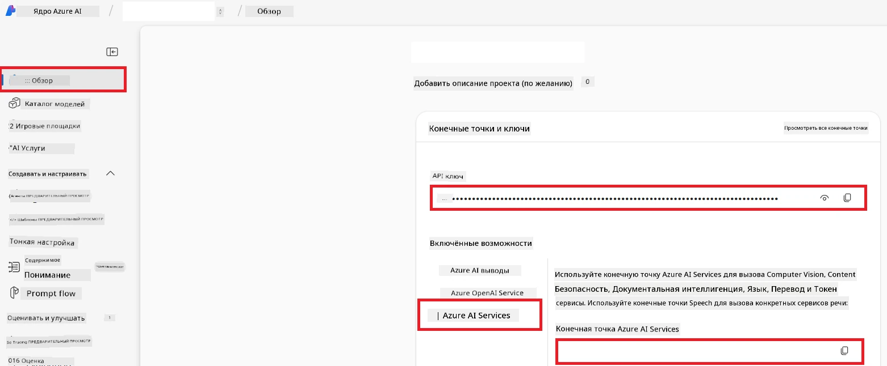

# Настройка Azure AI для Co-op Translator (Azure OpneAI и Azure AI Vision)

В этом руководстве описывается процесс настройки Azure OpenAI для перевода текста и Azure Computer Vision для анализа содержимого изображений (который затем можно использовать для перевода на основе изображений) в Azure AI Foundry.

**Требования:**
- Аккаунт Azure с активной подпиской.
- Достаточные права для создания ресурсов и развертываний в вашей подписке Azure.

## Создайте проект Azure AI

Начните с создания проекта Azure AI, который будет служить центральным местом для управления вашими AI-ресурсами.

1. Перейдите на [https://ai.azure.com](https://ai.azure.com) и войдите в систему с помощью своего аккаунта Azure.

1. Выберите **+Create** для создания нового проекта.

1. Выполните следующие действия:
   - Введите **Project name** (например, `CoopTranslator-Project`).
   - Выберите **AI hub** (например, `CoopTranslator-Hub`) (создайте новый, если нужно).

1. Нажмите "**Review and Create**", чтобы создать проект. Вы перейдёте на страницу обзора вашего проекта.

## Настройка Azure OpenAI для перевода текста

В вашем проекте разверните модель Azure OpenAI, которая будет использоваться в качестве backend для перевода текста.

### Откройте ваш проект

Если вы еще не на странице проекта, откройте недавно созданный проект (например, `CoopTranslator-Project`) в Azure AI Foundry.

### Развертывание модели OpenAI

1. В левом меню вашего проекта в разделе "My assets" выберите "**Models + endpoints**".

1. Выберите **+ Deploy model**.

1. Выберите **Deploy Base Model**.

1. Появится список доступных моделей. Отфильтруйте или найдите подходящую модель GPT. Рекомендуется `gpt-4o`.

1. Выберите нужную модель и нажмите **Confirm**.

1. Нажмите **Deploy**.

### Конфигурация Azure OpenAI

После развертывания вы можете на странице "**Models + endpoints**" выбрать развертывание и найти там **REST endpoint URL**, **Key**, **Deployment name**, **Model name** и **API version**. Эти данные понадобятся для интеграции модели перевода в ваше приложение.

> [!NOTE]
> Вы можете выбрать версии API на странице [API version deprecation](https://learn.microsoft.com/azure/ai-services/openai/api-version-deprecation) в зависимости от ваших требований. Учтите, что **API версия** отличается от **версии модели**, отображаемой на странице **Models + endpoints** в Azure AI Foundry.

## Настройка Azure Computer Vision для перевода текста на изображениях

Чтобы включить перевод текста на изображениях, необходимо получить API ключ и endpoint сервиса Azure AI.

1. Перейдите в ваш проект Azure AI (например, `CoopTranslator-Project`). Убедитесь, что вы находитесь на странице обзора проекта.

### Конфигурация Azure AI Service

Найдите API ключ и endpoint в Azure AI Service.

1. Перейдите в ваш проект Azure AI (например, `CoopTranslator-Project`). Убедитесь, что вы находитесь на странице обзора проекта.

1. Найдите **API Key** и **Endpoint** на вкладке Azure AI Service.

    

Это подключение делает возможности связанного ресурса Azure AI Services (включая анализ изображений) доступными для вашего проекта AI Foundry. Вы сможете использовать это подключение в своих ноутбуках или приложениях для извлечения текста из изображений, который затем можно отправлять в модель Azure OpenAI для перевода.

## Сводка ваших учетных данных

К настоящему моменту вы должны иметь следующие данные:

**Для Azure OpenAI (перевод текста):**
- Endpoint Azure OpenAI
- API Key Azure OpenAI
- Название модели Azure OpenAI (например, `gpt-4o`)
- Имя развертывания Azure OpenAI (например, `cooptranslator-gpt4o`)
- Версия API Azure OpenAI

**Для Azure AI Services (извлечение текста из изображений через Vision):**
- Endpoint Azure AI Service
- API Key Azure AI Service

### Пример: конфигурация переменных окружения (предварительный просмотр)

Позже, при создании вашего приложения, скорее всего, вы будете настраивать его с использованием этих учетных данных. Например, вы можете задать их как переменные окружения следующим образом:

```bash
# Учетные данные Azure AI Service (требуются для перевода изображений)
AZURE_AI_SERVICE_API_KEY="your_azure_ai_service_api_key" # например, 21xasd...
AZURE_AI_SERVICE_ENDPOINT="https://your_azure_ai_service_endpoint.cognitiveservices.azure.com/"

# Необязательные резервные наборы: дублируйте переменные с суффиксом _1/_2 (один и тот же индекс для всех переменных в наборе)
AZURE_AI_SERVICE_API_KEY_1="your_azure_ai_service_api_key_1"
AZURE_AI_SERVICE_ENDPOINT_1="https://your_azure_ai_service_endpoint_1.cognitiveservices.azure.com/"

# Учетные данные Azure OpenAI (требуются для перевода текста)
AZURE_OPENAI_API_KEY="your_azure_openai_api_key" # например, 21xasd...
AZURE_OPENAI_ENDPOINT="https://your_azure_openai_endpoint.openai.azure.com/"
AZURE_OPENAI_MODEL_NAME="your_model_name" # например, gpt-4o
AZURE_OPENAI_CHAT_DEPLOYMENT_NAME="your_deployment_name" # например, cooptranslator-gpt4o
AZURE_OPENAI_API_VERSION="your_api_version" # например, 2024-12-01-preview

# Необязательные резервные наборы: дублируйте полный набор AZURE_OPENAI_* с суффиксом _1/_2 (один и тот же индекс для всех переменных)
```

---

### Дополнительная литература

- [Как создать проект в Azure AI Foundry](https://learn.microsoft.com/azure/ai-foundry/how-to/create-projects?tabs=ai-studio)
- [Как создать ресурсы Azure AI](https://learn.microsoft.com/azure/ai-foundry/how-to/create-azure-ai-resource?tabs=portal)
- [Как развернуть модели OpenAI в Azure AI Foundry](https://learn.microsoft.com/en-us/azure/ai-foundry/how-to/deploy-models-openai)

---

<!-- CO-OP TRANSLATOR DISCLAIMER START -->
**Отказ от ответственности**:  
Этот документ был переведен с использованием сервиса автоматического перевода [Co-op Translator](https://github.com/Azure/co-op-translator). Несмотря на наши усилия обеспечить точность, имейте в виду, что автоматические переводы могут содержать ошибки или неточности. Оригинальный документ на его родном языке следует считать авторитетным источником. Для критически важной информации рекомендуется использовать профессиональный человеческий перевод. Мы не несем ответственности за любые недоразумения или искажения, возникшие в результате использования данного перевода.
<!-- CO-OP TRANSLATOR DISCLAIMER END -->