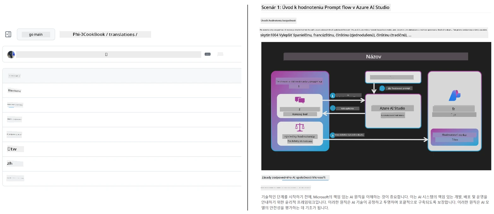
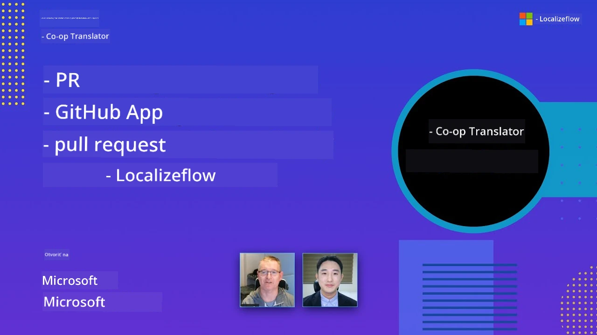

# Co-op Translator

_Ľahko automatizujte a udržiavajte preklady vášho vzdelávacieho obsahu na GitHube v niekoľkých jazykoch počas vývoja vášho projektu._


[](https://pypi.org/project/co-op-translator/)
[](https://github.com/azure/co-op-translator/blob/main/LICENSE)
[](https://pepy.tech/project/co-op-translator)
[](https://pepy.tech/project/co-op-translator)
[](https://github.com/azure/co-op-translator/pkgs/container/co-op-translator)
[](https://github.com/psf/black)

[](https://GitHub.com/azure/co-op-translator/graphs/contributors/)
[](https://GitHub.com/azure/co-op-translator/issues/)
[](https://GitHub.com/azure/co-op-translator/pulls/)
[](http://makeapullrequest.com)

### 🌐 Podpora viacerých jazykov

#### Podporované [Co-op Translator](https://github.com/Azure/Co-op-Translator)

<!-- CO-OP TRANSLATOR LANGUAGES TABLE START -->
[Arabic](../ar/README.md) | [Bengali](../bn/README.md) | [Bulgarian](../bg/README.md) | [Burmese (Myanmar)](../my/README.md) | [Chinese (Simplified)](../zh-CN/README.md) | [Chinese (Traditional, Hong Kong)](../zh-HK/README.md) | [Chinese (Traditional, Macau)](../zh-MO/README.md) | [Chinese (Traditional, Taiwan)](../zh-TW/README.md) | [Croatian](../hr/README.md) | [Czech](../cs/README.md) | [Danish](../da/README.md) | [Dutch](../nl/README.md) | [Estonian](../et/README.md) | [Finnish](../fi/README.md) | [French](../fr/README.md) | [German](../de/README.md) | [Greek](../el/README.md) | [Hebrew](../he/README.md) | [Hindi](../hi/README.md) | [Hungarian](../hu/README.md) | [Indonesian](../id/README.md) | [Italian](../it/README.md) | [Japanese](../ja/README.md) | [Kannada](../kn/README.md) | [Khmer](../km/README.md) | [Korean](../ko/README.md) | [Lithuanian](../lt/README.md) | [Malay](../ms/README.md) | [Malayalam](../ml/README.md) | [Marathi](../mr/README.md) | [Nepali](../ne/README.md) | [Nigerian Pidgin](../pcm/README.md) | [Norwegian](../no/README.md) | [Persian (Farsi)](../fa/README.md) | [Polish](../pl/README.md) | [Portuguese (Brazil)](../pt-BR/README.md) | [Portuguese (Portugal)](../pt-PT/README.md) | [Punjabi (Gurmukhi)](../pa/README.md) | [Romanian](../ro/README.md) | [Russian](../ru/README.md) | [Serbian (Cyrillic)](../sr/README.md) | [Slovak](./README.md) | [Slovenian](../sl/README.md) | [Spanish](../es/README.md) | [Swahili](../sw/README.md) | [Swedish](../sv/README.md) | [Tagalog (Filipino)](../tl/README.md) | [Tamil](../ta/README.md) | [Telugu](../te/README.md) | [Thai](../th/README.md) | [Turkish](../tr/README.md) | [Ukrainian](../uk/README.md) | [Urdu](../ur/README.md) | [Vietnamese](../vi/README.md)

> **Uprednostňujete lokálne klonovanie?**
>
> Tento repozitár obsahuje viac ako 50 jazykových prekladov, čo výrazne zväčšuje veľkosť sťahovania. Ak chcete klonovať bez prekladov, použite sparse checkout:
>
> **Bash / macOS / Linux:**
> ```bash
> git clone --filter=blob:none --sparse https://github.com/skytin1004/co-op-translator.git
> cd co-op-translator
> git sparse-checkout set --no-cone '/*' '!translations' '!translated_images'
> ```
>
> **CMD (Windows):**
> ```cmd
> git clone --filter=blob:none --sparse https://github.com/skytin1004/co-op-translator.git
> cd co-op-translator
> git sparse-checkout set --no-cone "/*" "!translations" "!translated_images"
> ```
>
> Tento spôsob vám poskytne všetko potrebné na dokončenie kurzu s oveľa rýchlejším sťahovaním.
<!-- CO-OP TRANSLATOR LANGUAGES TABLE END -->

[](https://GitHub.com/azure/co-op-translator/watchers/)
[](https://GitHub.com/azure/co-op-translator/network/)
[](https://GitHub.com/azure/co-op-translator/stargazers/)

[](https://discord.gg/nTYy5BXMWG)

[](https://codespaces.new/azure/co-op-translator)

## Prehľad

**Co-op Translator** vám pomáha lokalizovať váš vzdelávací obsah na GitHube do viacerých jazykov bez námahy.  
Keď aktualizujete svoje Markdown súbory, obrázky alebo notebooky, preklady sa automaticky synchronizujú, čím zabezpečujú, že váš obsah zostáva presný a aktuálny pre študentov po celom svete.

Príklad organizácie preloženého obsahu:



## Ako sa spravuje stav prekladu

Co-op Translator spravuje preložený obsah ako **verzionované softvérové artefakty**,  
nie ako statické súbory.

Nástroj sleduje stav preložených Markdownov, obrázkov a notebookov  
pomocou **metadát s rozsahom podľa jazyka**.

Takýto dizajn umožňuje Co-op Translator:

- Spoľahlivo detekovať zastarané preklady  
- Jednotne spravovať Markdown, obrázky a notebooky  
- Bezpečne škálovať v rozsiahlych, rýchlo sa meniacich, viacjazyčných repozitároch  

Modelovaním prekladov ako spravovaných artefaktov  
sa pracovné postupy prekladu prirodzene prispôsobujú moderným  
praktikám správy závislostí a artefaktov v softvéri.

→ [Ako sa spravuje stav prekladu](https://techcommunity.microsoft.com/blog/azuredevcommunityblog/rethinking-documentation-translation-treating-translations-as-versioned-software/4491755)


## Rýchly štart

```bash
# Vytvorte a aktivujte virtuálne prostredie (odporúčané)
python -m venv .venv
# Windows
.venv\Scripts\activate
# macOS/Linux
source .venv/bin/activate
# Nainštalujte balík
pip install co-op-translator
# Preložiť
translate -l "ko ja fr" -md
```

Docker:

```bash
# Stiahnuť verejný obraz z GHCR
docker pull ghcr.io/azure/co-op-translator:latest
# Spustiť s pripojeným aktuálnym priečinkom a poskytnutým súborom .env (Bash/Zsh)
docker run --rm -it --env-file .env -v "${PWD}:/work" ghcr.io/azure/co-op-translator:latest -l "ko ja fr" -md
```

## Minimálne nastavenie

1. Overte, že máte podporovanú verziu Pythonu (momentálne 3.10-3.12). V poetry (pyproject.toml) sa to rieši automaticky.  
2. Vytvorte súbor `.env` podľa šablóny: [.env.template](../../.env.template)  
3. Nakonfigurujte jedného poskytovateľa LLM (Azure OpenAI alebo OpenAI)  
4. (Voliteľné) Pre preklad obrázkov (`-img`) nakonfigurujte Azure AI Vision  
5. (Voliteľné) Môžete nakonfigurovať viacero sád prihlasovacích údajov zdvojovaním premenných s príponami ako `_1`, `_2` atď. Všetky premenné v sade musia mať rovnakú príponu.  
6. (Odporúčané) Vyčistite všetky predchádzajúce preklady, aby ste sa vyhli konfliktom (napr. `translations/`)  
7. (Odporúčané) Pridajte sekciu prekladov do vášho README pomocou [README languages template](./getting_started/README_languages_template.md)  
8. Pozrite: [Nastavenie Azure AI](./getting_started/set-up-azure-ai.md)  

## Použitie

Preložte všetky podporované typy:

```bash
translate -l "ko ja"
```

Len Markdown:

```bash
translate -l "de" -md
```

Markdown + obrázky:

```bash
translate -l "pt" -md -img
```

Len notebooky:

```bash
translate -l "zh" -nb
```

Viac prepínačov: [Referenčný príkaz](./getting_started/command-reference.md)

## Funkcie

- Automatizovaný preklad Markdown, notebookov a obrázkov  
- Udržiava preklady synchronizované so zmenami zdroja  
- Funguje lokálne (CLI) alebo v CI (GitHub Actions)  
- Používa Azure OpenAI alebo OpenAI; voliteľne Azure AI Vision pre obrázky  
- Zachováva formátovanie a štruktúru Markdownu  

## Dokumentácia

- [Príručka príkazového riadku](./getting_started/command-line-guide/command-line-guide.md)  
- [Príručka GitHub Actions (verejné repozitáre & štandardné tajomstvá)](./getting_started/github-actions-guide/github-actions-guide-public.md)  
- [Príručka GitHub Actions (Microsoft organizácie & nastavenia na úrovni organizácie)](./getting_started/github-actions-guide/github-actions-guide-org.md)  
- [README languages template](./getting_started/README_languages_template.md)  
- [Podporované jazyky](./getting_started/supported-languages.md)  
- [Príspevky](./CONTRIBUTING.md)  
- [Riešenie problémov](./getting_started/troubleshooting.md)  

### Microsoft špecifická príručka
> [!NOTE]
> Len pre udržiavateľov repozitárov Microsoft „For Beginners“.

- [Aktualizácia zoznamu „other courses“ (len pre MS Beginners repozitáre)](./getting_started/update-other-courses.md)

## Podporte nás a podporujte globálne vzdelávanie

Pridajte sa k nám v revolúcii, ako sa vzdelávací obsah globálne zdieľa! Dajte [Co-op Translator](https://github.com/azure/co-op-translator) na GitHube ⭐ a podporte našu misiu prekonávať jazykové bariéry vo vzdelávaní a technológiách. Váš záujem a príspevky majú významný dopad! Kódové príspevky a návrhy funkcií sú vždy vítané.

### Preskúmajte vzdelávací obsah Microsoftu vo svojom jazyku

- [LangChain4j-for-Beginners](https://github.com/microsoft/LangChain4j-for-Beginners)  
- [AZD for Beginners](https://github.com/microsoft/AZD-for-beginners)  
- [Edge AI for Beginners](https://github.com/microsoft/edgeai-for-beginners)  
- [Model Context Protocol (MCP) For Beginners](https://github.com/microsoft/mcp-for-beginners)  
- [AI Agents for Beginners](https://github.com/microsoft/ai-agents-for-beginners)  
- [Generative AI for Beginners using .NET](https://github.com/microsoft/Generative-AI-for-beginners-dotnet)  
- [Generative AI for Beginners](https://github.com/microsoft/generative-ai-for-beginners)  
- [Generative AI for Beginners using Java](https://github.com/microsoft/generative-ai-for-beginners-java)  
- [ML for Beginners](https://aka.ms/ml-beginners)  
- [Data Science for Beginners](https://aka.ms/datascience-beginners)  
- [AI for Beginners](https://aka.ms/ai-beginners)  
- [Cybersecurity for Beginners](https://github.com/microsoft/Security-101)  
- [Web Dev for Beginners](https://aka.ms/webdev-beginners)  
- [IoT for Beginners](https://aka.ms/iot-beginners)  
- [PhiCookBook](https://github.com/microsoft/PhiCookBook)  

## Videoprezentácie

👉 Kliknite na obrázok nižšie pre sledovanie na YouTube.

- **Open at Microsoft**: Krátke 18-minútové predstavenie a rýchly návod, ako používať Co-op Translator.

  [](https://www.youtube.com/watch?v=jX_swfH_KNU)

## Prispievanie

Tento projekt víta príspevky a návrhy. Máte záujem prispieť do Azure Co-op Translator? Prosím, pozrite si náš [CONTRIBUTING.md](./CONTRIBUTING.md) pre pokyny, ako môžete pomôcť sprístupniť Co-op Translator širšiemu publiku.

## Prispievatelia
[](https://github.com/Azure/co-op-translator/graphs/contributors)

## Kódex správania

Tento projekt prijal [Microsoft Open Source Code of Conduct](https://opensource.microsoft.com/codeofconduct/).
Pre viac informácií si pozrite [Často kladené otázky ku Kódexu správania](https://opensource.microsoft.com/codeofconduct/faq/) alebo
kontaktujte [opencode@microsoft.com](mailto:opencode@microsoft.com) s ďalšími otázkami či komentármi.

## Zodpovedná AI

Microsoft sa zaväzuje pomáhať našim zákazníkom používať naše AI produkty zodpovedne, zdieľať naše poznatky a budovať dôverné partnerstvá prostredníctvom nástrojov ako Transparency Notes a Impact Assessments. Mnohé z týchto zdrojov nájdete na [https://aka.ms/RAI](https://aka.ms/RAI).
Prístup Microsoftu k zodpovednej AI je založený na našich princípoch AI: spravodlivosť, spoľahlivosť a bezpečnosť, súkromie a bezpečnosť, inkluzívnosť, transparentnosť a zodpovednosť.

Veľkorozsiahle modely prirodzeného jazyka, obrazu a reči - ako tie použité v tomto príklade - môžu potenciálne vykazovať správanie, ktoré je nespravodlivé, nespoľahlivé alebo urážlivé, čo môže spôsobovať škody. Prosím, konzultujte [Azure OpenAI service Transparency note](https://learn.microsoft.com/legal/cognitive-services/openai/transparency-note?tabs=text) pre informácie o rizikách a obmedzeniach.

Odporúčaným prístupom na zmiernenie týchto rizík je zahrnúť do vašej architektúry bezpečnostný systém, ktorý dokáže detekovať a zabrániť škodlivému správaniu. [Azure AI Content Safety](https://learn.microsoft.com/azure/ai-services/content-safety/overview) poskytuje nezávislú vrstvu ochrany, schopnú detegovať škodlivý obsah vytváraný používateľmi aj AI v aplikáciách a službách. Azure AI Content Safety obsahuje API pre text a obrázky, ktoré vám umožňujú detegovať škodlivý materiál. Máme tiež interaktívne Content Safety Studio, ktoré vám umožní prezerať, skúmať a vyskúšať ukážkový kód na detekciu škodlivého obsahu v rôznych modalitách. Nasledujúca [dokumentácia quickstart](https://learn.microsoft.com/azure/ai-services/content-safety/quickstart-text?tabs=visual-studio%2Clinux&pivots=programming-language-rest) vás prevedie procesom posielania požiadaviek na službu.

Ďalším aspektom, ktorý treba zvážiť, je celkový výkon aplikácie. Pri multimodálnych a multi-modelových aplikáciách považujeme výkon za to, že systém funguje tak, ako vy a vaši používatelia očakávate, vrátane toho, že nevytvára škodlivé výstupy. Je dôležité posúdiť výkon vašej celkovej aplikácie pomocou [metrík kvality generovania a rizika a bezpečnosti](https://learn.microsoft.com/azure/ai-studio/concepts/evaluation-metrics-built-in).

Svoju AI aplikáciu môžete vyhodnotiť vo vývojovom prostredí pomocou [prompt flow SDK](https://microsoft.github.io/promptflow/index.html). Ak máte testovaciu dátovú množinu alebo cieľ, vaše generatívne AI výstupy sú kvantitatívne merané pomocou vstavaných alebo vlastných hodnotiacich nástrojov podľa vášho výberu. Ak chcete začať s prompt flow SDK na vyhodnotenie vášho systému, môžete sledovať [rýchly návod](https://learn.microsoft.com/azure/ai-studio/how-to/develop/flow-evaluate-sdk). Po vykonaní hodnotiaceho behu môžete [vizualizovať výsledky v Azure AI Studio](https://learn.microsoft.com/azure/ai-studio/how-to/evaluate-flow-results).

## Ochranné známky

Tento projekt môže obsahovať ochranné známky alebo logá projektov, produktov alebo služieb. Autorizované používanie ochranných známok alebo log Microsoftu podlieha a musí dodržiavať
[smery Microsoft pre ochranné známky a značky](https://www.microsoft.com/en-us/legal/intellectualproperty/trademarks/usage/general).
Používanie ochranných známok alebo log Microsoftu v upravených verziách tohto projektu nesmie spôsobovať zmätok ani naznačovať sponzorstvo Microsoftom.
Akékoľvek používanie ochranných známok alebo log tretích strán podlieha pravidlám daných tretích strán.

## Ako získať pomoc

Ak máte problém alebo otázky ohľadom tvorby AI aplikácií, pripojte sa:

[](https://discord.gg/nTYy5BXMWG)

Ak máte spätnú väzbu k produktu alebo chyby počas tvorby navštívte:

[](https://aka.ms/foundry/forum)

---

<!-- CO-OP TRANSLATOR DISCLAIMER START -->
**Vylúčenie zodpovednosti**:  
Tento dokument bol preložený pomocou AI prekladateľskej služby [Co-op Translator](https://github.com/Azure/co-op-translator). Hoci sa snažíme o presnosť, vezmite prosím na vedomie, že automatizované preklady môžu obsahovať chyby alebo nepresnosti. Pôvodný dokument v jeho pôvodnom jazyku by mal byť považovaný za autoritatívny zdroj. Pre kritické informácie sa odporúča profesionálny ľudský preklad. Nie sme zodpovední za akékoľvek nedorozumenia alebo nesprávne výklady vyplývajúce z použitia tohto prekladu.
<!-- CO-OP TRANSLATOR DISCLAIMER END -->