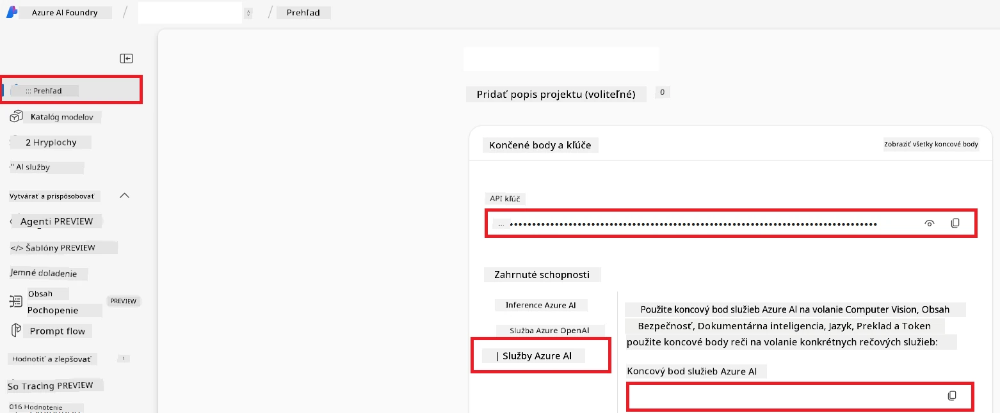

# Nastavenie Azure AI pre Co-op Translator (Azure OpneAI & Azure AI Vision)

Tento sprievodca vás prevedie nastavením Azure OpenAI pre preklad jazykov a Azure Computer Vision pre analýzu obsahu obrázkov (ktorá sa potom môže použiť na preklad na základe obrázkov) v rámci Azure AI Foundry.

**Predpoklady:**
- Účet Azure s aktívnym predplatným.
- Dostatočné oprávnenia na vytváranie zdrojov a nasadení vo vašom predplatnom Azure.

## Vytvorenie Azure AI projektu

Začnete vytvorením Azure AI projektu, ktorý slúži ako centrálne miesto na správu vašich AI zdrojov.

1. Prejdite na [https://ai.azure.com](https://ai.azure.com) a prihláste sa so svojim účtom Azure.

1. Vyberte **+Create** pre vytvorenie nového projektu.

1. Vykonajte nasledovné úlohy:
   - Zadajte **Názov projektu** (napr. `CoopTranslator-Project`).
   - Vyberte **AI hub** (napr. `CoopTranslator-Hub`) (v prípade potreby vytvorte nový).

1. Kliknite na "**Review and Create**" pre nastavenie vášho projektu. Budete presmerovaní na prehľadovú stránku vášho projektu.

## Nastavenie Azure OpenAI pre preklad jazykov

V rámci vášho projektu nasadíte model Azure OpenAI, ktorý bude slúžiť ako backend pre preklad textu.

### Prejdite do svojho projektu

Ak ešte nie ste vnútri, otvorte svoj novo vytvorený projekt (napr. `CoopTranslator-Project`) v Azure AI Foundry.

### Nasadenie modelu OpenAI

1. V ľavom menu vášho projektu, v sekcii "My assets", vyberte "**Models + endpoints**".

1. Vyberte **+ Deploy model**.

1. Zvoľte **Deploy Base Model**.

1. Zobrazí sa vám zoznam dostupných modelov. Filtrovať alebo vyhľadať vhodný GPT model. Odporúčame `gpt-4o`.

1. Vyberte požadovaný model a kliknite na **Confirm**.

1. Kliknite na **Deploy**.

### Konfigurácia Azure OpenAI

Po nasadení si môžete vybrať nasadenie z stránky "**Models + endpoints**" a nájsť jeho **REST endpoint URL**, **Kľúč**, **Názov nasadenia**, **Názov modelu** a **verziu API**. Tieto údaje budete potrebovať na integráciu prekladacieho modelu do vašej aplikácie.

> [!NOTE]
> Môžete si vybrať verzie API na stránke [API version deprecation](https://learn.microsoft.com/azure/ai-services/openai/api-version-deprecation) podľa vašich požiadaviek. Majte na pamäti, že **verzia API** sa líši od **verzie modelu**, ktorá je zobrazovaná na stránke **Models + endpoints** v Azure AI Foundry.

## Nastavenie Azure Computer Vision pre preklad z obrázkov

Pre umožnenie prekladu textu v obrázkoch potrebujete získať API Key a Endpoint služby Azure AI.

1. Prejdite do vášho Azure AI projektu (napr. `CoopTranslator-Project`). Uistite sa, že ste na prehľadovej stránke projektu.

### Konfigurácia Azure AI služby

Nájdite API Key a Endpoint služby Azure AI.

1. Prejdite do vášho Azure AI projektu (napr. `CoopTranslator-Project`). Uistite sa, že ste na prehľadovej stránke projektu.

1. Nájdite **API Key** a **Endpoint** na záložke Azure AI Service.

    

Toto prepojenie sprístupní možnosti prepojenej služby Azure AI (vrátane analýzy obrázkov) vášmu projektu v AI Foundry. Následne môžete toto prepojenie využiť vo svojich notebookoch alebo aplikáciách na extrakciu textu z obrázkov, ktorý potom môže byť odoslaný do modelu Azure OpenAI na preklad.

## Konsolidácia vašich prihlasovacích údajov

Mali by ste už mať zozbierané nasledovné údaje:

**Pre Azure OpenAI (textový preklad):**
- Endpoint Azure OpenAI
- API Key Azure OpenAI
- Názov modelu Azure OpenAI (napr. `gpt-4o`)
- Názov nasadenia Azure OpenAI (napr. `cooptranslator-gpt4o`)
- Verzia API Azure OpenAI

**Pre Azure AI služby (extrakcia textu z obrázkov cez Vision):**
- Endpoint Azure AI Service
- API Key Azure AI Service

### Príklad: Konfigurácia prostredia (Preview)

Neskôr, pri tvorbe aplikácie, ich pravdepodobne nakonfigurujete ako premenné prostredia nasledovne:

```bash
# Povolenia služby Azure AI (vyžadované pre preklad obrázkov)
AZURE_AI_SERVICE_API_KEY="your_azure_ai_service_api_key" # napr., 21xasd...
AZURE_AI_SERVICE_ENDPOINT="https://your_azure_ai_service_endpoint.cognitiveservices.azure.com/"

# Nepovinné záložné súpravy: duplikujte premenné s príponou _1/_2 (rovnaký index pre všetky premenné v súprave)
AZURE_AI_SERVICE_API_KEY_1="your_azure_ai_service_api_key_1"
AZURE_AI_SERVICE_ENDPOINT_1="https://your_azure_ai_service_endpoint_1.cognitiveservices.azure.com/"

# Povolenia Azure OpenAI (vyžadované pre preklad textu)
AZURE_OPENAI_API_KEY="your_azure_openai_api_key" # napr., 21xasd...
AZURE_OPENAI_ENDPOINT="https://your_azure_openai_endpoint.openai.azure.com/"
AZURE_OPENAI_MODEL_NAME="your_model_name" # napr., gpt-4o
AZURE_OPENAI_CHAT_DEPLOYMENT_NAME="your_deployment_name" # napr., cooptranslator-gpt4o
AZURE_OPENAI_API_VERSION="your_api_version" # napr., 2024-12-01-preview

# Nepovinné záložné súpravy: duplikujte celú súpravu AZURE_OPENAI_* s príponou _1/_2 (rovnaký index pre všetky premenné)
```

---

### Ďalšie čítanie

- [Ako vytvoriť projekt v Azure AI Foundry](https://learn.microsoft.com/azure/ai-foundry/how-to/create-projects?tabs=ai-studio)
- [Ako vytvoriť Azure AI zdroje](https://learn.microsoft.com/azure/ai-foundry/how-to/create-azure-ai-resource?tabs=portal)
- [Ako nasadiť OpenAI modely v Azure AI Foundry](https://learn.microsoft.com/en-us/azure/ai-foundry/how-to/deploy-models-openai)

---

<!-- CO-OP TRANSLATOR DISCLAIMER START -->
**Zrieknutie sa zodpovednosti**:  
Tento dokument bol preložený pomocou AI prekladateľskej služby [Co-op Translator](https://github.com/Azure/co-op-translator). Hoci sa snažíme o presnosť, berte, prosím, na vedomie, že automatické preklady môžu obsahovať chyby alebo nepresnosti. Pôvodný dokument v jeho rodnom jazyku by mal byť považovaný za autoritatívny zdroj. Pre kritické informácie sa odporúča profesionálny ľudský preklad. Nie sme zodpovední za žiadne nedorozumenia alebo nesprávne interpretácie vyplývajúce z použitia tohto prekladu.
<!-- CO-OP TRANSLATOR DISCLAIMER END -->